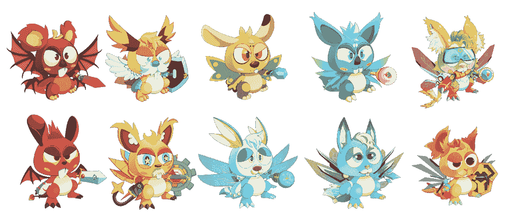
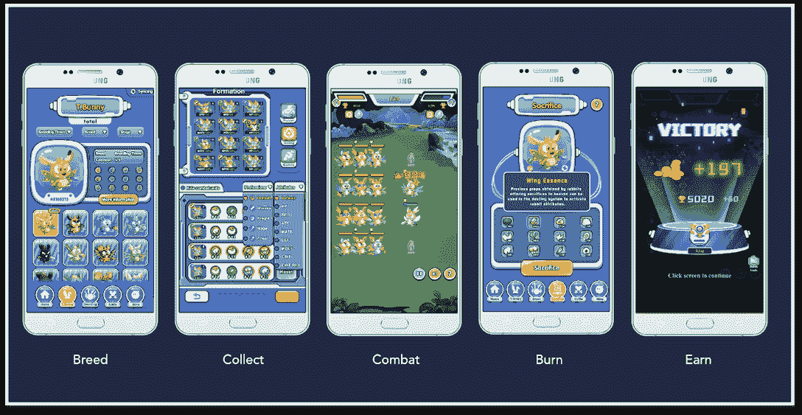

# 兔子星球作为 APENFT Marketplace Launchpad 的第一个项目起航

> 原文：<https://web.archive.org/web/https://dappradar.com/blog/bunny-planet-sets-sail-as-the-1st-project-from-apenft-marketplace-launchpad>

## APENFT 的目标是在顶尖艺术家和区块链之间架起一座桥梁

APENFT Marketplace 宣布正式发布其 Launchpad。兔子星球 [**APENFT 和 TRON GameFi Hackathon**](https://web.archive.org/web/20220813150826/https://dorahacks.io/hackathon/14/) **的冠军，将成为第一个在平台上运行初始游戏发售(IGO)的项目。**

**概要:**

*   APENFT 集市是位于 [TRON 区块链](https://web.archive.org/web/20220813150826/https://dappradar.com/rankings/protocol/tron)的 NFT 集市。
*   该市场将很快在其生态系统中集成一个 Launchpad 功能。
*   《兔子星球》是一款从游戏到收入的 NFT 游戏，它将通过市场的发射台来组织它的 IGO。
*   兔子星球允许用户通过游戏收集、繁殖、战斗和赚取 BYT 代币。
*   TRON101 提供 200 万美元资助 APENFT 项目。

## 什么是 APENFT 市场？

APENFT 于 2021 年 3 月 29 日在新加坡正式注册，是创区块链上的一个 NFT 市场。marketplace 采用世界上最大的分布式存储系统 BitTorrent 文件系统(BTFS)，以保证其 NFT 存储的分散化。

[https://web.archive.org/web/20220813150826if_/https://www.youtube.com/embed/Yevr4nnCazk?start=24&feature=oembed](https://web.archive.org/web/20220813150826if_/https://www.youtube.com/embed/Yevr4nnCazk?start=24&feature=oembed)

APENFT 坚信，NFT 不应该成为少数人的奢侈品。相反，NFT 应该赋予创造者经济和数字所有权以权力。为了实现这一目标，APENFT 团队启动了几项强有力的计划，以使 NFT 社区尽可能无障碍和包容。到目前为止，该团队已经实现了许多里程碑。

在 APENFT 上创建 NFT 的最大优势是市场在初始阶段实行零交易费。因此，创作者可以在每次交易中赚取额外的版税。此外，APENFT 将在 TRON 生态系统中提供 NFT 空投，以激励社区对他们的支持。

此外，APENFT 引入了新的 Launchpad 功能，以促进有前途的 NFT 动力项目。最终，为了进一步促进大规模加密的采用。

## 什么是 APENFT Marketplace Launchpad？

APENFT Marketplace Launchpad 在 APENFT 的生态系统中发挥着至关重要的作用，因为它为该平台孵化了 NFT 支持的优质项目，从而刺激了加密的采用和发展。

Launchpad 为投资者提供了早期投资高质量项目的机会。除此之外，该平台还是有潜力脱颖而出的项目的孵化器。这包括资助内容创作者，协助项目制定其营销策略，等等。

Launchpad 的引入增加了 APENFT 市场生态系统的多样性。最终，APENFT 将发展成为一个包罗万象的平台，让投资者、项目所有者、创作者和收藏者受益。

一旦 Launchpad 上线，APENFT GameFi 黑客马拉松冠军 Bunny Planet 将成为第一个进行 IGO 的项目。本月，该游戏将发布其第一个公开测试阶段，其创世纪兔子 NFT 销售仅在 APENFT 市场上进行。

## 收集，繁殖，战斗和赚取兔子星球

受 CryptoKitties 和 Axie Infinity 的启发,《兔子星球》是 TRON 网络上一款基于区块链的游戏。NFT 收藏的人物被称为 T.Bunnies，具有各种用途和稀有程度。

### 如何使用兔宝宝

玩家可以在玩家对环境(PVE)和玩家对玩家(PVP)战斗中使用 T.Bunny。组建一支强大的兔女郎队伍是赢得比赛的关键。但这取决于用户的技能，以制定最佳阵容策略来与其他玩家竞争。

访问[兔子星球的网站](https://web.archive.org/web/20220813150826/https://bunnynft.io/#/)了解更多关于游戏的信息。值得一提的是，组建兔宝宝军团是有具体规则的。例如，每个玩家需要至少三只但不超过 12 只兔子

### 如何得到兔宝宝

用户将通过参与公开销售获得含有兔宝宝的神秘盒子。在这之后，用户有两种方式来获得这些 NFT。一种是从 APENFT 市场购买，另一种是通过繁殖。

获得 T.Bunny NFTs 只是一个开始。要掌握游戏，用户必须深入了解自己的基因，基因决定了一只 T.Bunny 的战斗力，具体来说，每只兔子有 12 个基因，其中 4 个基因为兔子产生特殊技能。剩下的八个基因影响其他属性。

值得注意的是，一个基因有四种不同的稀有程度。它们是 C、R、SR 和 SSR，按照稀有程度递增的顺序排列。[本中帖](https://web.archive.org/web/20220813150826/https://medium.com/@bunnyplanet/bunny-planet-open-beta-guide-e0128956fca9)将为用户提供全面的 T.Bunny 讲解，以及如何在公测版中更好的使用。

### “玩到赚”模型解释道

兔子星球的“玩赚”(P2E)模式为用户提供了多种方式来赚取 BYT 代币和其他游戏内资源的奖励。

例如，玩家可以参与战斗并在胜利时获得奖励。此外，在季节性 PVP 锦标赛中获得更高的排名将为玩家提供分享奖金池的机会。饲养稀有兔子并在 APENFT 市场上出售是另一种获得奖励的方式。

用户可以利用这些资源培养和提高自己的兔宝宝团队。他们需要在兔子星球上建立自己的领地。该游戏处于早期阶段，将开放测试。此外，它还将举办一场奖金丰厚的公开赛。

跟随兔子星球上 [Twitte](https://web.archive.org/web/20220813150826/https://twitter.com/TronBunnyPlanet) r、 [Discord](https://web.archive.org/web/20220813150826/https://discord.com/invite/RNwNk9Gpcn) 、 [Telegram](https://web.archive.org/web/20220813150826/https://t.me/+W41EcbI3KTw4MGJl) ，敬请关注。

## 与 APENFT 一起繁荣

APENFT 致力于在传统艺术界和新兴数字艺术界的利益相关者之间建立对话。它促进包容性和多样性，旨在为各类受众带来引人入胜的多媒体体验。

为了鼓励创新和培育创造者经济，开发商 Sprint 和 TRON101 项目提供了 200 万美元和 9000 万美元的奖金，以推动更多项目进入 APENFT 市场。

**了解更多关于自由市场的信息**

[APENFT 市场](https://web.archive.org/web/20220813150826/https://apenft.io/) | [推特](https://web.archive.org/web/20220813150826/https://twitter.com/apenftorg) | [电报](https://web.archive.org/web/20220813150826/https://t.me/apenftEN) | [不和](https://web.archive.org/web/20220813150826/https://discord.com/invite/PX6WfxdUEt)

媒体联系人

迈尔斯·王

[【邮件保护】](/web/20220813150826/https://dappradar.com/cdn-cgi/l/email-protection#bfdcd0d1cbdedccbffdecfdad1d9cb91d6d0)

**免责声明** —这是一篇赞助文章。DappRadar 不认可本页面上的任何内容或产品。DappRadar 旨在提供准确的信息，但读者应该在采取行动之前总是自己做研究。DappRadar 的文章不能被认为是投资建议。