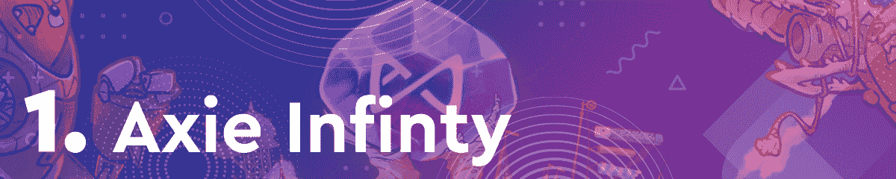
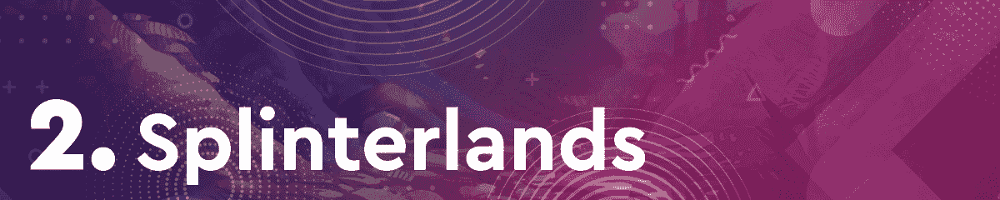
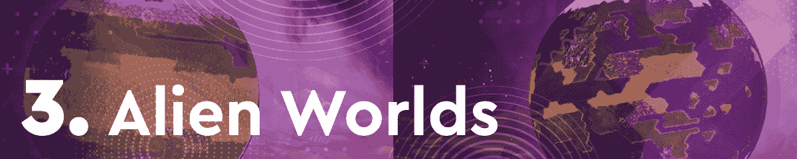
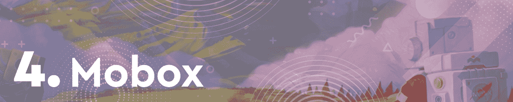
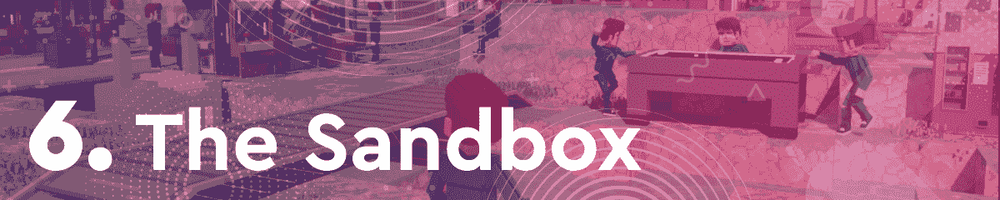
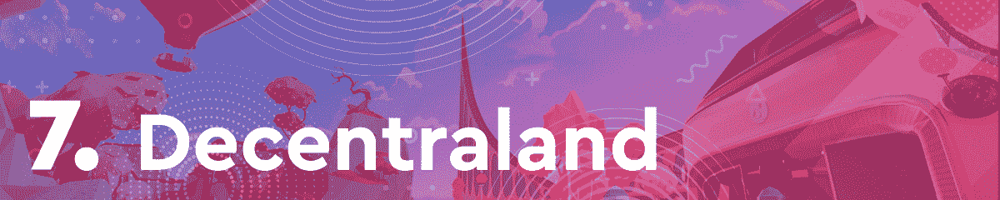
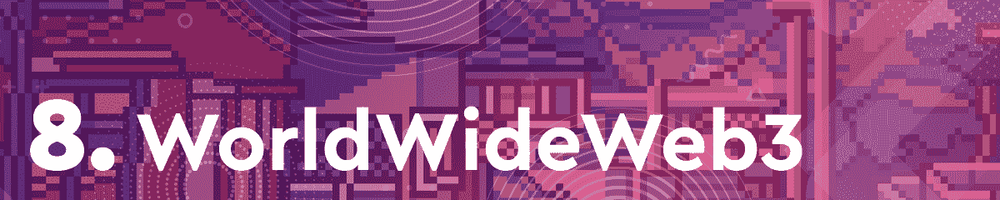
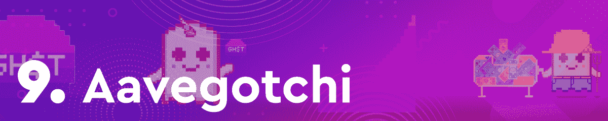
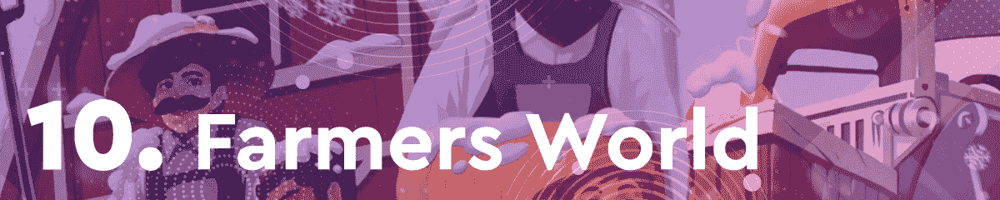

# 燃烧 Axie Infinity NFTs 将游戏提升至榜首

> 原文：<https://web.archive.org/web/https://dappradar.com/blog/burning-axie-infinity-nfts-boosts-game-to-top-spot>

## 《分裂的土地》和《外星世界》紧随本周最独特的活动钱包之后

得益于慷慨的社区建设努力，Axie Infinity 在本周的区块链十大游戏中拔得头筹。《分裂的土地》和《外星世界》凭借令人印象深刻的用户留存率和本周最高数量的独特活动钱包完成了前三名。

在过去的几个月里，区块链游戏一直处于加密活动的前沿。在这篇每周一期的文章中，DappRadar 将会关注最热门的游戏 dapps。为了编制这个排名，我们考虑了连锁活动、NFT 交易量、代币估值以及围绕每个 dapp 的新闻和事件。

浏览本周十大区块链游戏的完整列表，并点击相应的图片，了解每个平台的更多信息。或者，看看下面的视频，它总结了快速浏览的排名。

[https://web.archive.org/web/20221208170803if_/https://www.youtube.com/embed/a590WWMc7rQ?feature=oembed](https://web.archive.org/web/20221208170803if_/https://www.youtube.com/embed/a590WWMc7rQ?feature=oembed)

## 本周区块链十大游戏

Axie Infinity 是本周不可否认的冠军。这一成就得益于两项重大产品发布，以及在 NFT 销售方面的出色表现。Axie Infinity 背后的团队 Sky Mavis 宣布了一个新的以社区为中心的构建程序。它将允许开发者利用 Axie 角色创建工具和衍生游戏。此外，游戏引入了一个新的机制，允许玩家将他们的轴释放到野外。作为回报，玩家获得土地物品和其他奖励。

基于蜂巢的纸牌交易游戏[splitterlands](https://web.archive.org/web/20221208170803/https://dappradar.com/hive/games/splinterlands)本周再次吸引了最独特的活跃钱包。该平台在七天内记录了 534.060 个连接的地址。这款游戏的混乱军团战役持续吸引着玩家的注意力，因为本周发布了两张新卡。依靠这种持续的宣传，Splinterlands 已经卖出了 600 多万张混沌军团卡包。

与主要竞争对手 Splinterlands 的激烈竞争,[Alien world](https://web.archive.org/web/20221208170803/https://dappradar.com/wax/games/alien-worlds-1)是本周访问量第二大的游戏 dapp。在过去的七天里，《异形世界》以略高于 50 万的独特活跃钱包在本周的排名中占据第三位。在过去的七天里，该平台没有任何重大公告。然而,《外星世界》已经成功创建了一个强大的游戏玩家社区。

本周，Mobox 在排行榜上节节攀升。由于推出了新一季的代币大师迷你游戏，它排名第四。此外，Mobox 本周吸引了 167.350 个独特的活动钱包，并产生了超过 900 万美元的 NFT 交易量。

[REVV Racing](https://web.archive.org/web/20221208170803/https://dappradar.com/polygon/games/revv-racing) 由于与 NFAST 合作举办了 NFT 车展，这一周非常成功。受 80 年代标志性 GTs 的启发，这款独一无二的超级跑车有六款 1/1 NFT，每款对应一种可见光谱颜色。新推出的一组汽车将属于 REVV 赛车中的传奇类别。

由于令人印象深刻的 NFT 交易量和[大规模空投](https://web.archive.org/web/20221208170803/https://dappradar.com/blog/major-sand-airdrop-by-the-sandbox/)，沙盘本周排名第六。虚拟世界产生了近 1200 万美元的土地 NFT 交易量，成为在 [DappRadar 排名](https://web.archive.org/web/20221208170803/https://dappradar.com/nft)中 NFT 销售额最高的虚拟世界。

紧随沙盒之后的[分散的土地](https://web.archive.org/web/20221208170803/https://dappradar.com/ethereum/marketplaces/decentraland)在本周区块链十大游戏排行榜中排名第七。虚拟世界产生了 620 万美元的 NFT 交易量，尽管本地令牌 MANA 的估值大幅下降，但分散化土地仍在坚守阵地。此外，该平台在其 Twitter 账户上宣布了一项视频竞赛，要求粉丝指出他们喜欢分散式土地的哪些方面。

在这个排名中，我们的虚拟世界排名第八。过去七天，该平台在 NFT 产生了近 200 万美元的交易量。此外，WWW3 继续推动各种 NFT 系列的整合，这提高了参与度和销售额。

为了提高游戏赚取的排名，Aavegotchi 本周获得了第九名。虽然上周这款游戏由于一个主要的可穿戴掉落和抽奖而排名第五，但本周 Aavegotchi 几乎没有入选。不过，这款游戏在 NFT 产生了近 100 万美元的交易量，与主要竞争对手不同的是，其 GHST 令牌在过去一周的价格保持相对稳定。

最后但同样重要的是，在本周的排名中，我们有[农民世界](https://web.archive.org/web/20221208170803/https://dappradar.com/wax/games/farmers-world)。由于拥有庞大的玩家和粉丝群体，这款基于蜡像的农业游戏一直位列区块链游戏排行榜前十名。在过去的七天里，Farmers World 吸引了近 10 万个不同的活动钱包，并在 NFT 产生了 370 万美元的交易量。

## Axie Infinity 社区银行

由于广泛的建设者计划，Axie Infinity 已成功攀升至本周排名的首位。这只能说明以社区为中心的活动和功能在区块链空间有多重要。Sky Mavis 已经设法围绕 Axie 创建了可以说是最大和最活跃的游戏社区。

此外，倾听来自社区本身的想法和建议似乎对这个平台有好处。引入 Axies 的烧录机制已经是一段时间以来的社区需求。随着新的释放选项，玩家现在有机会烧他们的 Axie NFTs 并获得奖励作为回报。随着越来越多的玩家转向区块链的游戏，DappRadar 将继续关注游戏领域。Axie Infinity、Splinterlands、Aavegotchi 和 Mobox 等 Dapps 都为桌面带来了不同的功能，使空间变得丰富多彩，让不同类型的游戏玩家感到兴奋。要了解区块链博彩领域的最新消息，请在 [Twitter](https://web.archive.org/web/20221208170803/https://twitter.com/dappradar) 上关注 DappRadar，或加入 [DappRadar PRO](https://web.archive.org/web/20221208170803/https://dappradar.com/token/pro) 以获得独家 [Discord](https://web.archive.org/web/20221208170803/https://discord.gg/4ybbssrHkm) 频道和讨论。

 NewsletterUnsubscribe at any time. [T&Cs](https://web.archive.org/web/20221208170803/https://dappradar.com/terms) and [Privacy Policy](https://web.archive.org/web/20221208170803/https://dappradar.com/privacy-policy)