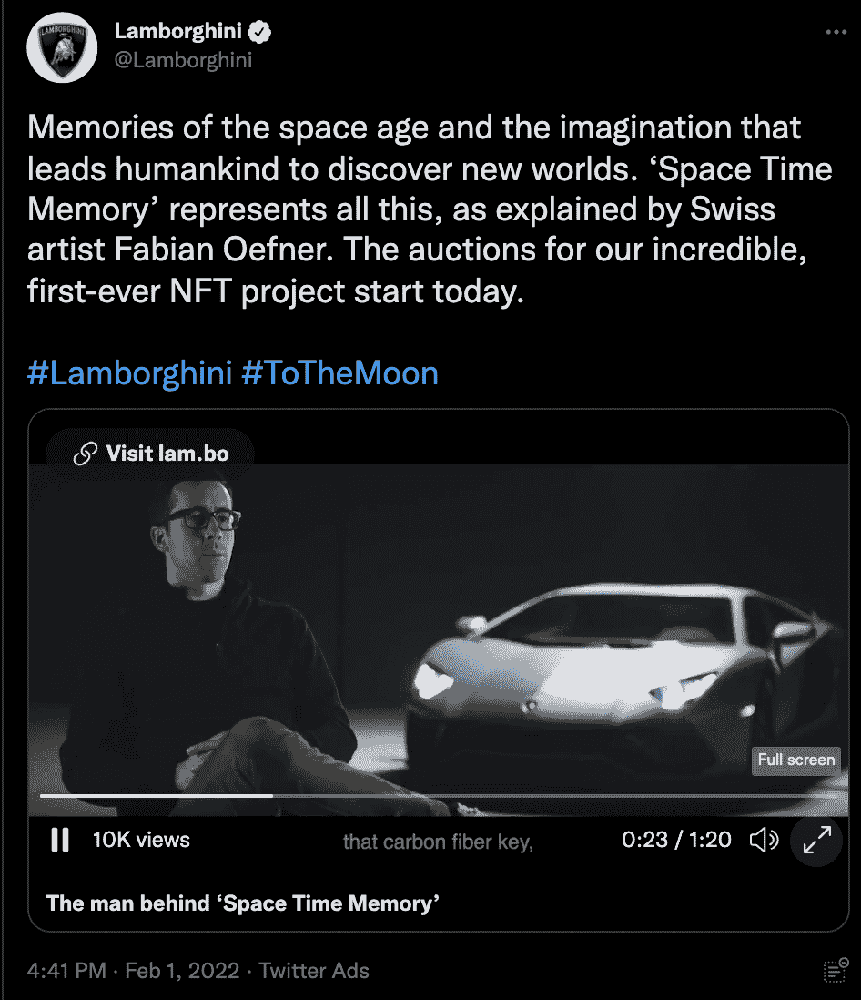

# 汽车制造商投身于 NFT

> 原文：<https://web.archive.org/web/https://dappradar.com/blog/car-manufacturers-dive-into-nfts>

## 兰博基尼发布 DMCA 停工令，而法拉利则探索元宇宙和 NFT

像兰博基尼和法拉利这样的大型汽车制造商正在进军 NFT 市场。然而，两者的方式截然不同。法拉利正在探索元宇宙和 NFT 的可能性。另一方面，兰博基尼向以该公司模型为特色的 NFTs 和 NFT 系列发布了 DMCA 停产通知。

在最近的[收益电话](https://web.archive.org/web/20221002001202/https://news.alphastreet.com/ferrari-nv-race-q4-2021-earnings-call-transcript/)中，法拉利高管讨论说，公司正在积极探索进入 web3、元宇宙和 NFTs 的风险投资。虽然官方没有提及此类活动，但在如此重要的会议上公开表明他们的兴趣是一个很好的迹象。无论是作为元宇宙的一个庄园，还是作为 NFT 的一个收藏，在数字空间中看到法拉利品牌的产品都将是一件令人兴奋的事情。

不幸的是，竞争对手兰博基尼采取了非常不同的方法。在过去的几天里，NFT 的艺术家和创作者们在 Twitter 上抱怨不断。根据推特上的[消息，兰博基尼的代表们正在接近《数字千年版权法案》关闭的创作者。有趣的是，在发行的同时，DMCA 的兰博基尼也发行了他们与瑞士艺术家 Fabian Oefner 合作的首个 NFT 项目《时空记忆》。](https://web.archive.org/web/20221002001202/https://twitter.com/search?q=lamborghini%20nft&src=typeahead_click)

几个月来，NFT 空间一直吸引着主流世界的大品牌。从古驰和杜嘉班纳这样的时尚品牌，到育碧和 Square Enix 这样的游戏公司。现在，汽车制造商也在跃跃欲试。

## 汽车制造商对 NFT 感兴趣，但是谁有正确的方法呢？

尽管这两家大型汽车制造商和品牌都在探索 NFT 市场，但它们的方式截然不同。法拉利只是试探性地提到了他们对这个领域的兴趣，目前还没有采取严肃的行动。尽管如此，NFT 领域的许多人可能会认为这是开始探索的更好方式。

另一方面，兰博基尼正采取直接措施，以要求版权，并只有他们的品牌产品在 NFT 市场。虽然这可能是现实世界的工作方式，但加密社区肯定不高兴。

的确，一些被打上 DMCA 烙印的设计与兰博基尼模式有相似之处。然而，加密社区对兰博基尼的决定并不满意。毕竟，他们是汽车制造商自己的 NFT 项目最有可能的观众。战斗口号“温兰博？”已经成为密码社区野心的代名词，但是也许他们现在将停止提及。

随着越来越多的大牌明星加入炒作行列，达普拉达将继续关注 NFT 空间。看看法拉利是否会像暗示的那样实现飞跃将会很有趣。我们也将密切关注兰博基尼关于太空的进一步决定。要想首先了解最新的 NFT 新闻，请加入 DappRadar PRO。它让你获得最新的 NFT 销售数据，以及独家的[不和谐](https://web.archive.org/web/20221002001202/https://discord.gg/4ybbssrHkm)讨论渠道。

 NewsletterUnsubscribe at any time. [T&Cs](https://web.archive.org/web/20221002001202/https://dappradar.com/terms) and [Privacy Policy](https://web.archive.org/web/20221002001202/https://dappradar.com/privacy-policy)