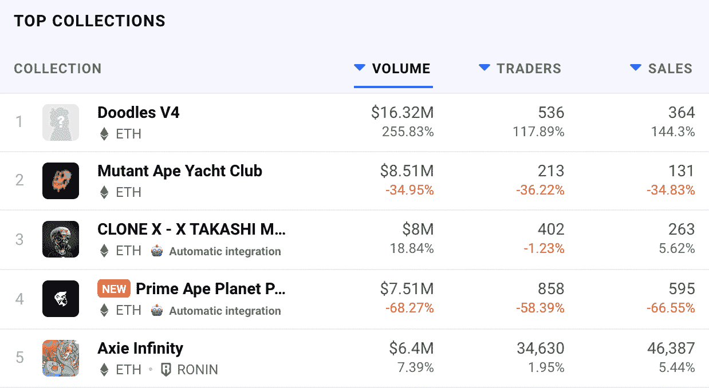

# 名人模仿涂鸦，地板通过 9 ETH

> 原文：<https://web.archive.org/web/https://dappradar.com/blog/celebrities-ape-into-doodles-floor-passes-9-eth>

## Gary Vee 和 Loopify 在过去 24 小时内购买了涂鸦，将该系列推上了顶峰

由 Burnt Toast 推出的以太坊系列 Doodles 在 24 小时内取得了令人印象深刻的成绩，荣登 DappRadar 顶级系列排行榜榜首。活跃程度的提高主要是由于大量名人涌入这个项目。企业家 Gary Vee 购买了 Doodle #7020，而 Treeverse creator Loopify 购买了 Doodle #7141。

在这些购买之后，Doodles 度过了迄今为止最成功的 24 小时。该系列在一天内产生了超过 1600 万美元的交易量，在 24 小时内增长了 255%。更不用说，与 Doodles 智能合约互动的交易者增加了 117%。

由于活动的增加，在过去 24 小时的交易量方面，Doodles 现在已经超过了业内的大公司。Axie Infinity 传统上占据榜首，现在排名第五，尽管它的统计数据全面上升。继上周卖出数百万美元的几个[巨型突变血清后，变种人猿游艇俱乐部在过去几天里有了惊人的表现。尽管如此，Doodles 在过去 24 小时内的交易量超过了 BAYC 后续系列的两倍以上。](https://web.archive.org/web/20220929090042/https://dappradar.com/blog/2022-started-with-3-nft-sales-of-over-5-million-each-top-10-nft-sales)

## 名人推动涂鸦前进

秘密名人在 NFT 空间有很大的影响力，因为他们的行为通常被普通观众视为买入或卖出信号。就 Doodles 在过去 24 小时内的表现而言，这一点一如既往地有效。

昨天，几个名人在推特上发布了他们新买的涂鸦。其中，我们看到像加里·维(Gary Vee)这样的名字，他在撰写本文时以 23.33 ETH，即 88.465 美元的价格购买了 [Doodle #7020](https://web.archive.org/web/20220929090042/https://dappradar.com/hub/assets/eth/0x8a90cab2b38dba80c64b7734e58ee1db38b8992e/7020) 。另一个令人印象深刻的购买来自 Pranksy，他今年的最后一个 NFT 是 35 ETH 的 [Doodle #3179](https://web.archive.org/web/20220929090042/https://dappradar.com/hub/wallet/eth/0xd387a6e4e84a6c86bd90c158c6028a58cc8ac459/nfts) ，或 132.641 美元。最后，Treeverse 创始人 Loopify 也加入了这股浪潮，以 13 ETH 的价格收购了 [Doodle #7141](https://web.archive.org/web/20220929090042/https://dappradar.com/hub/assets/eth/0x8a90cab2b38dba80c64b7734e58ee1db38b8992e/7141) ，约合 5 万美元。

这份名人购买清单将藏品置于聚光灯下，有效地吸引了整个 NFT 社区的注意力。结果，这次收藏活动出现了高峰，NFT 涂鸦作品的底价超过了 9 ETH。

随着新的 2022 年的开始，涂鸦正在经历新收藏家的激增和交易量的增加。随着旅程的继续，DappRadar 将继续监测涂鸦系列。要了解更多关于名人购买的信息，请点击下面的链接。您还可以查看 DappRadar PRO 来监控最近 15 分钟的交易数据。

[<picture></picture>](https://web.archive.org/web/20220929090042/https://dappradar.com/hub/assets/eth/0x8a90cab2b38dba80c64b7734e58ee1db38b8992e/7020)[<picture></picture>](https://web.archive.org/web/20220929090042/https://dappradar.com/hub/wallet/eth/0xd387a6e4e84a6c86bd90c158c6028a58cc8ac459/nfts)[<picture></picture>](https://web.archive.org/web/20220929090042/https://dappradar.com/hub/assets/eth/0x8a90cab2b38dba80c64b7734e58ee1db38b8992e/7141) NewsletterUnsubscribe at any time. [T&Cs](https://web.archive.org/web/20220929090042/https://dappradar.com/terms) and [Privacy Policy](https://web.archive.org/web/20220929090042/https://dappradar.com/privacy-policy)