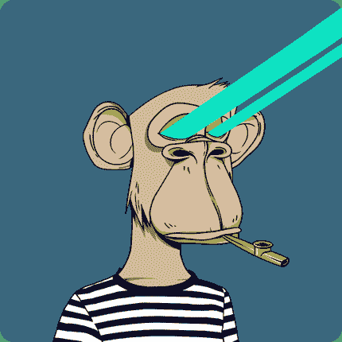
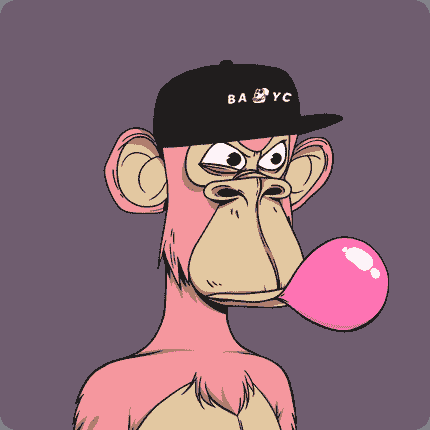
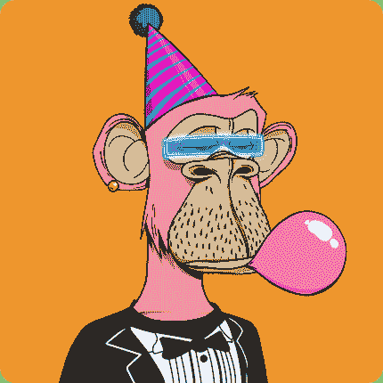
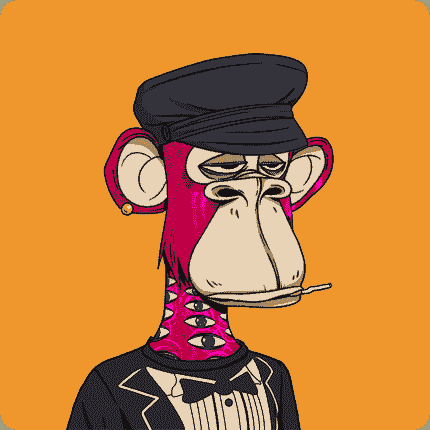
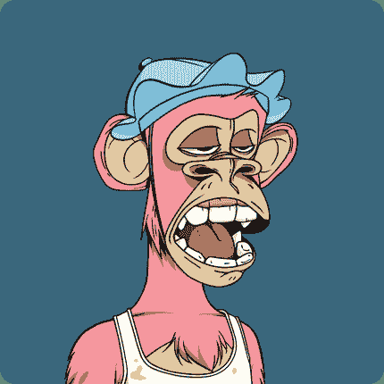
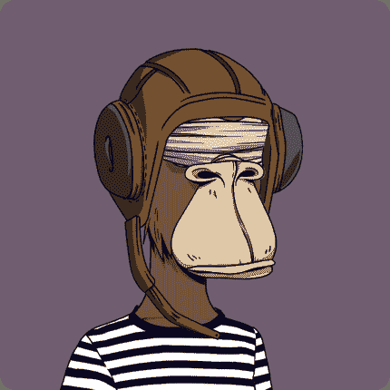
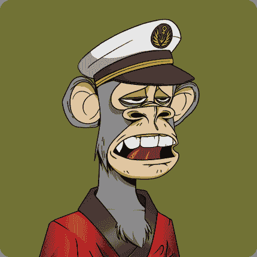
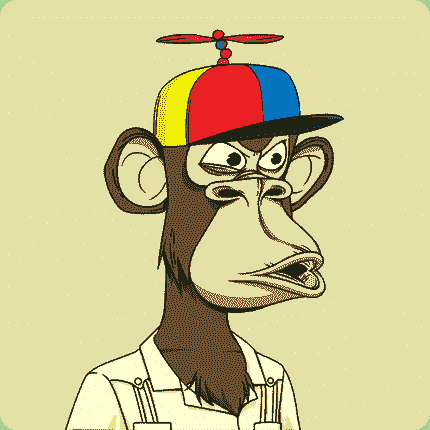
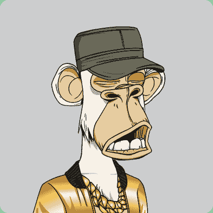

# 名人加密和 NFT 钱包富豪榜

> 原文：<https://web.archive.org/web/https://dappradar.com/blog/celebrity-wallets-a-dive-into-crypto-hollywood>

## 发现活跃在区块链的名人。他们收集什么？他们交易什么？

哪个好莱坞名人、体育巨星或其他富人和名人拥有最大的加密钱包，里面装满了代币和 NFT？在这里你可以找到答案，因为达普雷达列出了名人加密& NFT 富豪榜，每个钱包都通过达普雷达的投资组合服务进行验证和跟踪。

你可以关注名人钱包，只需创建一个账户，然后进入投资组合工具。你不仅可以跟踪你最喜欢的名人的持有量，还可以跟踪你自己钱包的价值。点击下面的名人姓名，看看他们的作品集。这个名人加密和 NFT 钱包富豪榜将定期更新，以反映最新的价格更新和名人加入空间。

你知道一个名人钱包没有在这个列表中提到吗？联系[【电子邮件保护】](/web/20221201195133/https://dappradar.com/cdn-cgi/l/email-protection)

*最后更新:2022 年 10 月 28 日*

### 1\. [史蒂夫·青木](https://web.archive.org/web/20221201195133/https://dappradar.com/hub/wallet/eth/0xe4bbcbff51e61d0d95fcc5016609ac8354b177c4)

DJ 和唱片制作人

### $5,100,000

### 2.[史努比狗狗](https://web.archive.org/web/20221201195133/https://dappradar.com/hub/wallet/eth/0xce90a7949bb78892f159f428d0dc23a8e3584d75)

说唱歌手和唱片制作人

### $4,500,000

合计:[钱包 1](https://web.archive.org/web/20221201195133/https://dappradar.com/hub/wallet/eth/0xce90a7949bb78892f159f428d0dc23a8e3584d75) & [钱包 2](https://web.archive.org/web/20221201195133/https://dappradar.com/hub/wallet/eth/0xE0036fb4B5A3B232aCfC01fEc3bD1D787a93da75) (DeathrowNFT)

### 3.[加里·维纳查克](https://web.archive.org/web/20221201195133/https://dappradar.com/hub/wallet/eth/0xd6a984153acb6c9e2d788f08c2465a1358bb89a7)

投资者和企业家

### $3,600,000

### 4.扎克·海曼

冰球运动员兼作家

### $1,460,000

### 5.亚历克西斯·奥哈尼安

企业家

### $1,400,000

### 6.[罗根·保罗](https://web.archive.org/web/20221201195133/https://dappradar.com/hub/wallet/eth/0xff0bd4aa3496739d5667adc10e2b843dfab5712b)

油管（国外视频网站）

### $936,000

### 7.[比利·穆雷](https://web.archive.org/web/20221201195133/https://dappradar.com/hub/wallet/eth/0x892f6e015B1083EB97Eb8574Baddf22090EC8d03)

演员&捉鬼敢死队

### $604,000

### 8.人民

艺术家

### $572,000

### 9.小内马尔

巴西足球运动员

### $450,000

### 10.[巴黎希尔顿](https://web.archive.org/web/20221201195133/https://dappradar.com/hub/wallet/eth/0xb6aa5a1aa37a4195725cdf1576dc741d359b56bd)

媒体人物，OG

### $430,000

### 11.塞雷娜·威廉姆斯

传奇网球运动员

### $425,000

合计:[钱包 1](https://web.archive.org/web/20221201195133/https://dappradar.com/hub/wallet/eth/0x0864224f3cc570ab909ebf619f7583ef4a50b826) + [钱包 2](https://web.archive.org/web/20221201195133/https://dappradar.com/hub/wallet/eth/0x701895F6C6777BEC3DA9C2c052b7BF5D766791e2)

### 12.[烟鬼们](https://web.archive.org/web/20221201195133/https://dappradar.com/hub/wallet/eth/0xee81a1bc1034b0906b132c98bed477b896b731da)

音乐艺术家

### $381,000

### 13.[贾斯汀比伯](https://web.archive.org/web/20221201195133/https://dappradar.com/hub/wallet/eth/0xE21DC18513e3e68a52F9fcDaCfD56948d43a11c6)

歌手

### $376,000

### 14.[DJ marshmell](https://web.archive.org/web/20221201195133/https://dappradar.com/hub/wallet/eth/0xa0eaf6b0df87132c9a28e450a43c1d906defb60b)

DJ 和音乐制作人

### $359,000

### 15\. [马克·库班](https://web.archive.org/web/20221201195133/https://dappradar.com/hub/wallet/eth/0xa679c6154b8d4619af9f83f0bf9a13a680e01ecf)

企业家

### $358,000

### 16\. [职务马龙](https://web.archive.org/web/20221201195133/https://dappradar.com/hub/wallet/eth/0xbea020c3bd417f30de4d6bd05b0ed310ac586cc0)

说唱歌手

### $354,000

### 17.[拉梅洛·鲍尔](https://web.archive.org/web/20221201195133/https://dappradar.com/hub/wallet/eth/0xc1064e3662b0718357e9050694a3bfeaabede8ab)

篮球运动员

### $323,000

### 18.狄龙·弗朗西斯

DJ 和唱片制作人

### $298,000

### 19.[小宝贝](https://web.archive.org/web/20221201195133/https://dappradar.com/hub/wallet/eth/0xc86B12d850FdBBF3260a7BAAE862F85857aAdBBa)

说唱歌手

### $279,000

### 20.[斯蒂芬·库里](https://web.archive.org/web/20221201195133/https://dappradar.com/hub/wallet/eth/0x3becf83939f34311b6bee143197872d877501b11)

篮球运动员

### $202,000

### 21.[格温妮丝·帕特洛](https://web.archive.org/web/20221201195133/https://dappradar.com/hub/wallet/eth/0x31185f782a7c11044566d70dfcf1c8175486f451)

女演员

### $185,000

### 22.[凯文·哈特](https://web.archive.org/web/20221201195133/https://dappradar.com/hub/wallet/eth/0xbbdac7ba85af15420afd1f4aa3313c3535b15cde)

演员和喜剧演员

### $176,000

### 23.[戴夫·查普尔](https://web.archive.org/web/20221201195133/https://dappradar.com/hub/wallet/eth/0x33560bB4E2c132346980890A04193616359A04Dc)

喜剧演员

### $170,000

### 24\. [吉米·法伦](https://web.archive.org/web/20221201195133/https://dappradar.com/hub/wallet/eth/0x0394451c1238cec1e825229e692aa9e428c107d8)

电视节目主持人

### $160,000

### 25.[未来](https://web.archive.org/web/20221201195133/https://dappradar.com/hub/wallet/eth/0x1616b4C7cdb4093BeFBCca62F3198993327a8e9e)

说唱歌手

### $164,000

### 26.[周杰伦 Z](https://web.archive.org/web/20221201195133/https://dappradar.com/hub/wallet/eth/0x3b417faee9d2ff636701100891dc2755b5321cc3)

说唱歌手，音乐制作人

### $157,000

### 30.[阿姆](https://web.archive.org/web/20221201195133/https://dappradar.com/hub/wallet/eth/0x79f261f483b7cef4f995c1f8a0f46f88450423e3)

说唱上帝

### $155,191

### 30.[麦当娜](https://web.archive.org/web/20221201195133/https://dappradar.com/hub/wallet/eth/0x8ea95Bdc5cDddC0b7EbAd841F0c1f2cA6168b6a9)

创作型歌手

### $149,000

### 31.[困扰银行](https://web.archive.org/web/20221201195133/https://dappradar.com/hub/wallet/eth/0x7d4823262bd2c6e4fa78872f2587dda2a65828ed)

优酷&电竞个性

### $146,000

### 32.[海蒂·克鲁姆](https://web.archive.org/web/20221201195133/https://dappradar.com/hub/wallet/eth/0x46316e182d560d6b8454946168e69484e2186e14)

模特和电视名人

### $128,000

### 31.[马丁·盖瑞斯](https://web.archive.org/web/20221201195133/https://dappradar.com/hub/wallet/eth/0x3a8db289e94465181e54353571fa7880857c0d87)

荷兰 DJ

### $120,000

### 32.[和](https://web.archive.org/web/20221201195133/https://dappradar.com/hub/wallet/eth/0x8d3bc45d7b30013c37c141f6ce7c981b2613efaa)规则

说唱歌手，几乎是活动组织者

### $87,000

### 33.[麦克·信田](https://web.archive.org/web/20221201195133/https://dappradar.com/hub/wallet/eth/0xb55eb9bd32d6ab75d7555192e7a3a7ca0bcd5738)

音乐艺术家，摇滚明星

### $81,000

### 34.3LAU

音乐制作人

### $65,000

### 35.杰克·保罗

社交媒体人物

### $56,000

### 36.[沙奎尔·奥尼尔](https://web.archive.org/web/20221201195133/https://dappradar.com/hub/wallet/eth/0x3c6aeff92b4b35c2e1b196b57d0f8ffb56884a17)

前篮球运动员

### $49,000

### 37.迈克·泰森

前拳击手

### $33,000

### 38.泰瑞斯·哈利伯顿

篮球运动员

### $32,000

### 39.[成油深度](https://web.archive.org/web/20221201195133/https://dappradar.com/hub/wallet/eth/0x87BAdfCC6b5eb79aCbD108d1208d82dc6A6D48AB)

油管（国外视频网站）

### $27,000

### 40.马里奥·格策

德国足球运动员

### $24,000

### 41.[伊娃·朗格利亚](https://web.archive.org/web/20221201195133/https://dappradar.com/hub/wallet/eth/0xaa1b056286a66a9e6752c26776ac034c662a51d5)

女演员

### $23,000

### 42.[林赛·罗韩](https://web.archive.org/web/20221201195133/https://dappradar.com/hub/wallet/eth/0x3781d92e5449b5b689fee308ded44882085b6312)

歌手，媒体人

### $23,000

### 43.瑞茜·威瑟斯彭

女演员

### $22,000

### 44.Kwebbelkop

油管（国外视频网站）

### $16,000

### 45.[伊利亚·伍德](https://web.archive.org/web/20221201195133/https://dappradar.com/hub/wallet/eth/0xf6de94be96f80602d90bf29bd9e88a0e843b2eb9)

演员，戒指携带者

### $14,000

### 46.[塞斯·库里](https://web.archive.org/web/20221201195133/https://dappradar.com/hub/wallet/eth/0x9114b66e4bd387eb832d1477e86ede0cf7f76115)

篮球运动员

### $8,300

### 47.[乔丹贝尔福特](https://web.archive.org/web/20221201195133/https://dappradar.com/hub/wallet/eth/0xdbf2445e5049c04cda797dae60ac885e7d79df9d)

投资者和企业家

### $6,200

### 48.[安东尼·霍普金斯](https://web.archive.org/web/20221201195133/https://dappradar.com/hub/wallet/eth/0x5B4b7F43140E79a4452408CE10dd64FD17D8a2E5)

行动者

### $2,900

### 49.[乔尔·马登](https://web.archive.org/web/20221201195133/https://dappradar.com/hub/wallet/eth/0x35cded880959f93c415723902f91f964367a4dcd)

音乐家，摇滚明星

### $2,200

### 50.[提姆巴兰](https://web.archive.org/web/20221201195133/https://dappradar.com/hub/wallet/eth/0x4b1bdae6b46c2ed904581d7e4bf2b71e5f3f7072)

音乐制作人，说唱歌手

### $577

DappRadar 跟踪各种名人的钱包，从好莱坞明星到音乐家和体育冠军。这一页作为一个概述，让你深入了解富人和名人的秘密财富。

你也可以自己使用 DappRadar 投资组合来跟踪名人或你的朋友，或者只是跟踪你自己的投资。