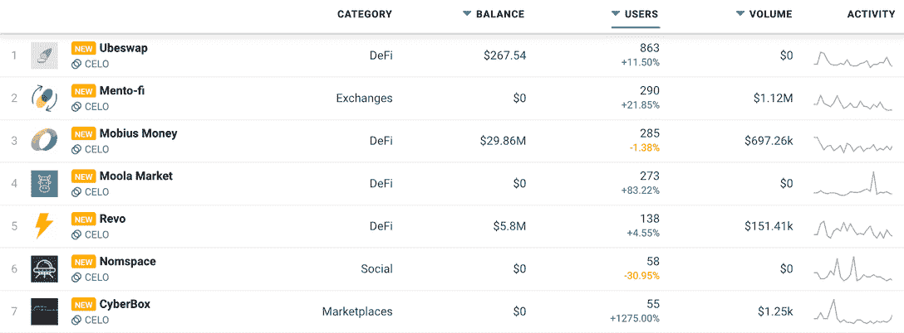
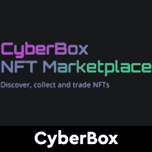

# Celo Dapps 现在在 DappRadar 上

> 原文：<https://web.archive.org/web/https://dappradar.com/blog/celo-dapps-now-on-dappradar>

## 支持 DeFi 工具的移动优先区块链

DappRadar 很高兴地宣布将 Celo 区块链 dapps 纳入排行榜。DappRadar 每月 100 万的网站访问者现在可以通过 [Celo 区块链 dapp 排名](https://web.archive.org/web/20221206162538/https://dappradar.com/rankings/protocol/celo)分析哪些 dapp 吸引了最多的交易量、独特的用户钱包或处理了最多的交易。这样，每个人都可以了解哪些 dapps 和令牌在 Celo 上建立了稳固的社区和价值。

Celo 是一个以移动为先的区块链，致力于开发工具，让任何拥有手机的人都能使用 DeFi。迄今为止，该协议中所有农场和池锁定的总价值超过 4 . 18 亿美元。Celo 采用移动优先的方法来支持全球金融生态系统，最终用户只需一个手机号码就可以参与其中。

Celo 使用[利益证明(PoS)](https://web.archive.org/web/20221206162538/https://docs.celo.org/celo-codebase/protocol/proof-of-stake) 共识算法。与比特币和以太坊等工作证明(PoW)系统相比，Celo 的设计消除了负面的环境影响，意味着用户可以进行更便宜、更快速的交易。

重要的是， [Celo 包含了一个兼容以太坊虚拟机(EVM)的可编程智能合约平台](https://web.archive.org/web/20221206162538/https://docs.celo.org/learn/celo-highlights)，该平台已经被广泛采用，为开发者所熟悉，并且具有强大的工具支持。这种兼容性使 dapp 构建者能够快速将现有的以太坊 dapp 移植到 Celo，并在第三方应用和扩展的广泛生态系统的支持下提供丰富的用户功能。

## 塞洛区块链达普拉达排名

在发射时， [DappRadar 将跟踪 Celo 区块链](https://web.archive.org/web/20221206162538/https://dappradar.com/rankings/protocol/celo)上的 19 个 dapps。12 家位于 DeFi 和 Exchange 类别，这清楚地概述了 Celo 在此阶段对金融应用的关注。

Ubeswap 是目前 Celo 上领先的令牌交换 dapp，是 Uniswap 的区块链等价物，除了关注移动用户。 [Cyberbox](https://web.archive.org/web/20221206162538/https://dappradar.com/celo/marketplaces/cyberbox) 是 Celo 在 NFT 的主要市场，该网络甚至有自己的 CryptoPunk NFT 副本——[Celo punk](https://web.archive.org/web/20221206162538/https://dappradar.com/celo/collectibles/celopunks)。

[<picture></picture>](https://web.archive.org/web/20221206162538/https://dappradar.com/rankings/protocol/celo)

[Explore Celo Dapps](https://web.archive.org/web/20221206162538/https://dappradar.com/rankings/protocol/celo)

## 面向 dapp 开发者的 Celo

dappRadar 邀请 Dapp 开发者[向 DappRadar](https://web.archive.org/web/20221206162538/https://dappradar.com/submit-dapp) 提交他们的 Dapp，在世界 Dapp 商店上创造更多的可见性。有兴趣了解更多关于 Celo 及其可能性的开发者可以从 [Celo docs 网站](https://web.archive.org/web/20221206162538/https://docs.celo.org/)开始。

[<picture></picture>](https://web.archive.org/web/20221206162538/https://dappradar.com/celo/defi/ubeswap)[<picture></picture>](https://web.archive.org/web/20221206162538/https://dappradar.com/celo/marketplaces/cyberbox)[<picture></picture>](https://web.archive.org/web/20221206162538/https://dappradar.com/celo/collectibles/celopunks) NewsletterUnsubscribe at any time. [T&Cs](https://web.archive.org/web/20221206162538/https://dappradar.com/terms) and [Privacy Policy](https://web.archive.org/web/20221206162538/https://dappradar.com/privacy-policy)