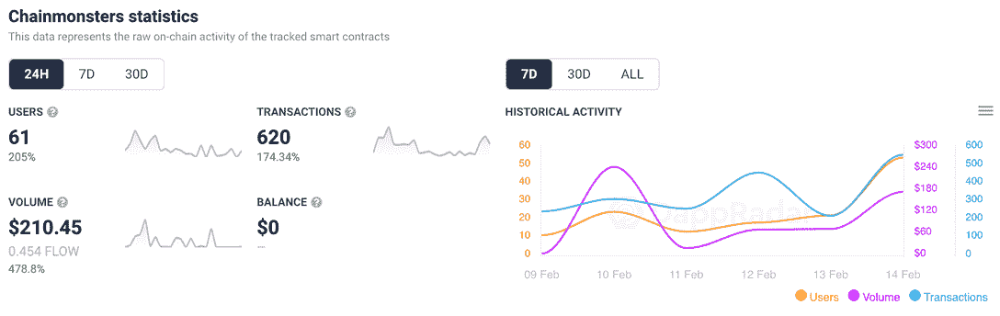

# Chainmonsters 在 iOS 和 Android 上推出封闭测试版

> 原文：<https://web.archive.org/web/https://dappradar.com/blog/chainmonsters-closed-beta-launched-on-ios-android>

## 游戏的封闭测试版终于可以移动了

**B 端游戏终于在 iOS 和 Android 上推出了 Chainmonsters 的测试版。在延迟和微调报告之后，封闭测试版的移动版代表着游戏面向广大观众的漫长旅程中的又一个里程碑。**

iOS 和 Android 上的 [Chainmonsters](https://web.archive.org/web/20230124074317/https://dappradar.com/flow/games/chainmonsters) 测试版沿袭了去年年底发布的早期 PC 版。对于那些不熟悉这个广阔的 MMORPG 的人来说，想象一下 90 年代末一款广受欢迎的 Gameboy 游戏的区块链版本。你指挥你的化身穿越不同的领域。与此同时，你会发现并抓住一系列的 Chainmons(社区称之为 Chainmons)。此外，你还会与一长串对手交战。

建立在[流量区块链](https://web.archive.org/web/20230124074317/https://dappradar.com/rankings/protocol/flow)的基础上，Chainmonsters 的玩家驱动经济允许人们寻找、赚取和购买各种 NFT。玩家可以出售这些或者用它们来提升他们的技能和力量。虽然 [NFT 交易](https://web.archive.org/web/20230124074317/https://www.dappradar.com/nft)不是参与游戏的先决条件，但用户需要一个联网的 Blocto 钱包才能玩游戏。

iOS 和 Android 上的 Chainmonsters 移动测试版的消息还没有出现，没有一些相应的连锁行动。在过去的 24 小时内，交易量激增了 174%。此外，用户增加了 205%。虽然我们无法将这些上涨与 B-Side 的声明联系起来，但我们会在新闻冲击市场时关注这些数据。

## 区块链 MMORPGs:开辟新天地

如上所述，《Chainmonsters》是众多游戏中的一款，其灵感来自任天堂传奇的神奇宝贝系列。这并不奇怪，因为最初的神奇宝贝的第一批玩家创造了今天的新游戏；但是看看现在的开发者如何走出 Ash 和皮卡丘的阴影，创造他们自己的故事和范例，将会很有趣。试图打造这条新路径的一些标题是 [Illuvium](https://web.archive.org/web/20230124074317/https://dappradar.com/ethereum/games/illuvium) 、 [Ethermon](https://web.archive.org/web/20230124074317/https://dappradar.com/ethereum/games/ethermon) 当然还有 Axie Infinity。

[Axie Infinity](https://web.archive.org/web/20230124074317/https://dappradar.com/ronin/games/axie-infinity) 占据了一个类似于游戏世界中 Chainmonsters 的空间，在确定一个原创和可持续的模式在未来可能会是什么样子方面稍有进展。通过观察他们的路线图，我们或许可以一瞥 [Web3 游戏](https://web.archive.org/web/20230124074317/https://dappradar.com/rankings/category/games)将如何朝着一个划时代的方向发展。

自 2018 年首次亮相以来，Axie Infinity 一直被与神奇宝贝相提并论。Sky Mavis 的产品肯定有其祖先的可爱图形和一系列可爱的小战斗动物可供收集。但由于游戏玩家目前正在玩这个游戏，游戏种类很少，进入门槛可能非常昂贵。

但是最近关于《Axie Infinity: Origin》的新闻表明，该公司希望让这款游戏更容易上手。Axie Infinity 的建造者计划在[一月份的重大宣布之后，Axie 的联合创始人 Jihoz Zirlin 发了一条推特。他说，已经有 1500 名开发者申请开始基于最初的 Axie Infinity 概念开发游戏。这个社区已经在开发](https://web.archive.org/web/20230124074317/https://dappradar.com/blog/axie-infinity-welcomes-members-in-new-builders-program/) [Axie WarKart](https://web.archive.org/web/20230124074317/https://dappradar.com/blog/axie-community-starts-building-spin-off-games) ，看起来要把 Axie 宇宙带到一个新的高度。

因此，也许创造新未来的一种方式是把工具放在大众手中。如果互联网真的变得去中心化了，那么有谁比一百万狂热的游戏玩家的网络思维更适合创造明天的世界呢？有了正确的平台和适当的激励，这一代的神奇宝贝可能指日可待。