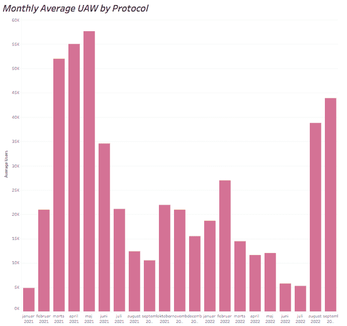
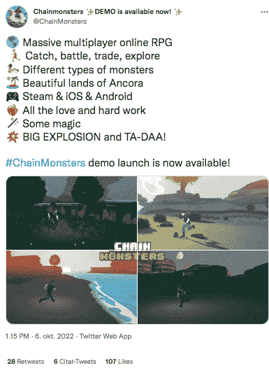

# Chainmonsters 演示发布 7 天内用户数量翻倍

> 原文：<https://web.archive.org/web/https://dappradar.com/blog/chainmonsters-demo-launch-doubles-user-numbers-in-7-days>

## Chainmonsters 可能成为下一个玩家，并在 Flow 上赢得 darling

期待已久的 **免费注册玩游戏** **的神奇宝贝终于在 Steam、iOS 和 Android 上发布了。** **玩家在 3D 开放世界中捕捉、训练、繁殖、战斗、买卖怪物。**

**内容**

*   [什么是 Chainmonsters？](https://web.archive.org/web/20221202125353/https://dappradar.com/blog/chainmonsters-demo-launch-doubles-user-numbers-in-7-days/#What-is-Chainmonsters?)
*   [为什么 Chainmonsters 用户数在 7 天内翻了一番？](https://web.archive.org/web/20221202125353/https://dappradar.com/blog/chainmonsters-demo-launch-doubles-user-numbers-in-7-days/#Why-have-Chainmonsters-user-numbers-doubled-in-7-days?-)
*   [如何用 DappRadar 玩 Chainmonsters？](https://web.archive.org/web/20221202125353/https://dappradar.com/blog/chainmonsters-demo-launch-doubles-user-numbers-in-7-days/#How-to-play-Chainmonsters-using-DappRadar?)
*   [结束语](https://web.archive.org/web/20221202125353/https://dappradar.com/blog/chainmonsters-demo-launch-doubles-user-numbers-in-7-days/#Closing-thoughts-)

## 什么是 Chainmonsters？

Chainmonsters 是一款有趣的大型多人在线游戏，生活在流量区块链，是专为 NFTs 和游戏设计的。类似于 Axie Infinity，战斗游戏的灵感来源于神奇宝贝。

[Play Chainmonsters](https://web.archive.org/web/20221202125353/https://dappradar.com/flow/games/chainmonsters)

你可以和你的朋友一起冒险深入安科拉，这是一个拥有八个不同岛屿的魔法世界，岛上居住着凯蒙斯人和人类。由于这是一个大型多人在线角色扮演游戏(MMORPG)，你会遇到其他玩家，你可以挑战战斗。

Flow 为游戏增加了额外的一层，带来了跨平台游戏的机会。它可以让你的物品、进度、库存和菜单在区块链上随时可用。

这个流行的 L2 是为了解决以太坊的可伸缩性问题而创建的，它支持快速、低成本的交易并支持开放世界。它是由 Dapper Labs 建造的，该团队是热门游戏 CryptoKitties、Joyride 和 NBA Top Shot 的幕后团队。

下图显示了与 Flow 生态系统交互的唯一活跃钱包的数量。与 2021 年 9 月的 10，584 名用户相比，过去 9 月份的用户总数为 43，895 名，增幅高达 75.88%，证明流量具有巨大的潜力。

Source: Flow UAWs 2021 – 2022 DappRadar

## 为什么 Chainmonsters 用户数在 7 天内翻了一番？

Chainmonsters 背后的团队最近向 Steam、iOS (Testflight)和 Android 发布了最新的演示。开发人员在整个 Alpha 阶段对游戏进行了显著的改进。

在 Chainmonsters 社区，宣传已经建立了很长一段时间，这款游戏很有可能成为战斗神奇宝贝风格游戏类型中的下一个 Axie Infinity。与其他 NFT 游戏相比，一个很大的优势是它可以在不同的平台上运行。

这款游戏可以免费玩，而且已经比该领域的其他游戏有更少的入门摩擦，能够吸引传统玩家和非本地加密用户。除了 Steam、iOS 和 Android，它还将在 Xbox One、PlayStation 4 和任天堂 Switch 上推出。

## 如何用 DappRadar 玩 Chainmonsters？

1.  你可以在安装了 Testflight 的移动设备或电脑上玩它
2.  你不需要一个加密钱包玩只是为了好玩！
3.  下载 DappRadar 的移动应用程序并访问 dapp。

注册后，你将使用你的角色漫游安科拉岛，完成挑战，遇到 Chainmons 和遇到其他玩家，你可以挑战战斗。

游戏中有一个基于故事的战役，你作为 N- corp 特工的新兵开始你的旅程。你在那里发现影响整个大陆的神秘变化的原因。

其中一个岛屿成为你的家，你开始只有一个建筑，随着时间的推移升级解锁蓝图，家具，化妆品，你可以在你的岛屿和主建筑内使用。

你在游戏中发现、赚取和购买的每一项资产都是 Flow 上的数字收藏品，包括:锁链、配件、物品、装备、嘲讽等等。

你可以捕捉超过 135 个独特的具有不同特征、类型和能力的链兽，并在各种场合将它们组合成多个小队。

此外，流程集成允许您控制您的库存。每一个锁链、物品和化妆品都可以在游戏内外交易。

最后，《连锁怪兽》中的地下城和突袭的目标是挑战那些渴望深入世界并击败特殊突袭 bosses 的人。

## 结束语

Chainmonsters 有很大的潜力成为下一个玩家，成为这个领域的宠儿。开发者已经做了一些令人惊讶的事情，改进了图形，翻新了 Chainmon 设计，UI 调整，移动优化等等。

我们看好这款游戏，它具备成为心流生态系统下一颗明星的所有要素。

## 随身携带您的 Web3 之旅

使用 DappRadar 移动应用程序，再也不会错过 Web3。查看最受欢迎的 dapps 的性能，并关注您投资组合中的 NFT。您在 DappRadar 上的帐户会与我们的移动应用程序同步，这样您很快就可以选择实时接收提醒。

[Download the DappRadar app now](https://web.archive.org/web/20221202125353/https://dappradar.app.link/blog)[<picture></picture>](https://web.archive.org/web/20221202125353/https://play.google.com/store/apps/details?id=com.portfolio.dappradar)