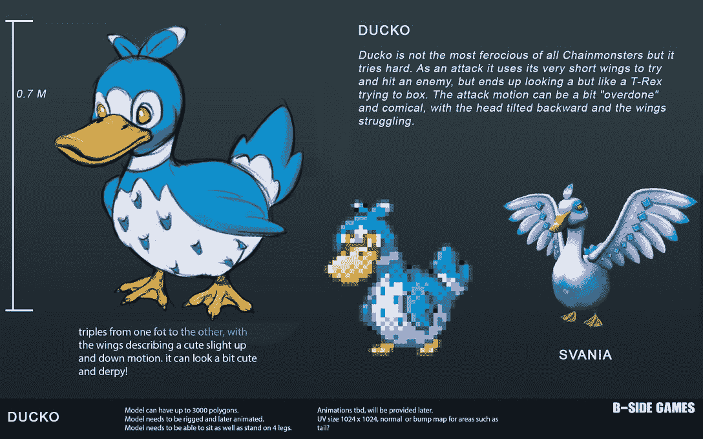

# Chainmonsters 向所有玩家开放 Beta 阶段 2

> 原文：<https://web.archive.org/web/https://dappradar.com/blog/chainmonsters-opens-beta-phase-2-to-all-players>

## 封闭测试版持有者将提前进入第二阶段一周

区块链流量上最受期待的游戏项目之一 Chainmonsters 宣布将向所有人开放第二阶段的测试。Chainmonsters alpha 和 beta 版本只对拥有早期通行证的玩家开放。

这是链怪运作方式的重大改变，也是游戏最终发布的下一个重大步骤。根据官方第二阶段[公告](https://web.archive.org/web/20221127152853/https://bsidegames.com/chainmonsters/2022/03/chainmonsters-dev-update-4-march-2022/)，向所有玩家开放第二阶段的主要原因之一是对游戏的构建进行压力测试。

测试的第一阶段将于 4 月 15 日结束。不久之后，每个对玩 Chainmonsters 感兴趣的人都可以创建一个免费帐户，并开始探索测试游戏的第二阶段。令人印象深刻的是，该平台将适用于所有流行设备，包括 iOS 和 Android。官方路线图详细说明了游戏手机版的工作已经开始。

Chainmonsters 测试版的第二阶段将包括各种活动，重点测试平台和游戏的不同方面。从这个意义上说，beta 测试者将有机会体验游戏的方方面面，强调某些元素，如战斗系统、角色创建工具和社会参与功能。

除了更广泛的平台访问，测试的第二阶段也将为游戏玩家带来参与奖励。虽然关于奖励系统的细节尚未透露，但 Chainmonsters 团队承诺，越多的玩家加入测试工作，奖励就越多。要补充的一个重要注意事项是，游戏的封闭 alpha 和 beta 版本的参与者将获得比其他人早一周探索完整游戏的第一个正式发布的好处。

## Chainmonsters 赌质量

Chainmonsters 是区块链游戏领域测试最广泛的项目之一。官方关闭了 2021 年 3 月推出的 alpha，从那以后，人们对这款游戏的兴趣一直在稳步增长。

一年多的封闭测试的一个主要原因是为了确保玩家能够获得最优质的最终产品。游戏现在已经经历了多次迭代，感谢封闭测试人员的反馈。引入 3D 图形是该平台近几个月来的主要改进之一。

现在游戏向更多玩家开放，测试期的最后阶段即将到来。根据最近的[开发更新](https://web.archive.org/web/20221127152853/https://bsidegames.com/chainmonsters/2022/03/chainmonsters-dev-update-4-march-2022/)，该团队预计在 2022 年底推出第一个正式版的 Chainmonsters。

## 另类连锁店吸引高端游戏项目

Chainmonsters 并不是唯一一个选择类似 [Flow](https://web.archive.org/web/20221127152853/https://dappradar.com/rankings/protocol/flow) 的替代区块链的高端游戏项目。建立一个小连锁店的好处是多方面的，尤其是考虑到惊人的油费和拥挤的以太坊经历。

使用 Flow 的主要好处之一包括它的互操作性和 Flow Wallet 的易用性。其他连锁店如 [Polygon](https://web.archive.org/web/20221127152853/https://dappradar.com/rankings/protocol/polygon/category/games) 在区块链博彩业也越来越受欢迎。像 [Pegaxy](https://web.archive.org/web/20221127152853/https://dappradar.com/polygon/games/pegaxy) 这样的新项目已经在 Polygon 上找到了自己的家，受益于快速的处理速度和几乎免费的交易。

另一个吸引游戏迷眼球的令人印象深刻的项目是[索拉纳·区块链](https://web.archive.org/web/20221127152853/https://dappradar.com/rankings/protocol/solana/category/games)号上的[星图](https://web.archive.org/web/20221127152853/https://dappradar.com/solana/games/star-atlas)。Star Atlas 为玩家创建了一个复杂的功能、选择和最重要的高端图形网络，所有这些都由 Solana 提供支持。 [NFT](https://web.archive.org/web/20221127152853/https://dappradar.com/nft/protocol/solana) 人物和库存物品都可以交易并储存在索拉纳区块链上。

根据最新的 [DappRadar 和 BGA Games 报告](https://web.archive.org/web/20221127152853/https://dappradar.com/blog/dappradar-x-bga-games-report-february-2022)，区块链游戏正稳步成为该技术最重要的用例之一。2022 年 2 月，超过 110 万个独特的活动钱包连接到区块链游戏。随着越来越多的高端项目，如 Chainmosnters 和 Star Atlas 加入这个领域，这一群体只会越来越多。

随着新项目和新区块链脱颖而出，DappRadar 将继续关注区块链游戏市场。如果你想跟踪你最喜欢的游戏或发现新项目，请查看 [DappRadar 顶级区块链游戏排名](https://web.archive.org/web/20221127152853/https://dappradar.com/rankings/category/games)。此外，你可以在[推特](https://web.archive.org/web/20221127152853/https://twitter.com/dappradar)上关注 DappRadar，抢先获得最新的区块链博彩新闻。

 NewsletterUnsubscribe at any time. [T&Cs](https://web.archive.org/web/20221127152853/https://dappradar.com/terms) and [Privacy Policy](https://web.archive.org/web/20221127152853/https://dappradar.com/privacy-policy)