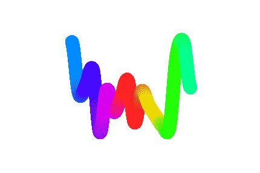
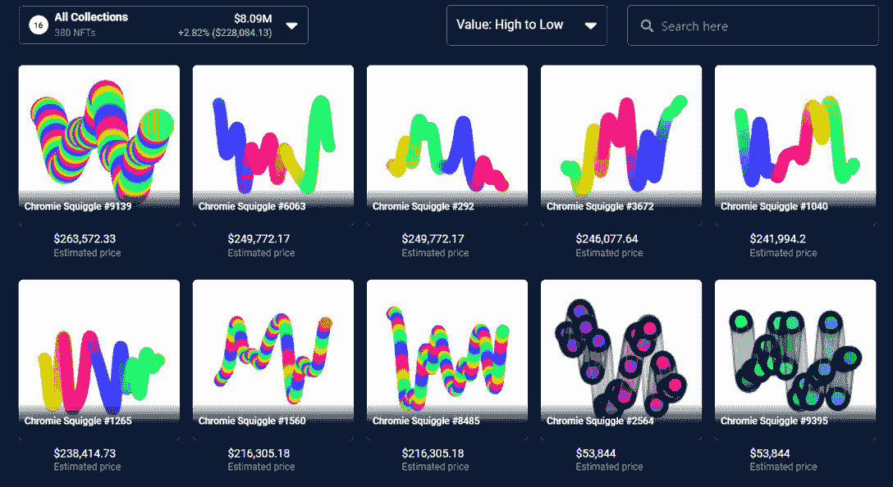

# 铬曲线创下有史以来最高的 eth 底价

> 原文：<https://web.archive.org/web/https://dappradar.com/blog/chromie-squiggles-highest-eth-floor-price-ever>

## 生成艺术阻碍了蓝筹股地位的慢慢获得和证明

Chromie Squiggles 的 NFT 艺术收藏创下了两年来的最高底价，最便宜的也要 16.96 瑞士法郎。过去一周，楼面价涨幅超过 25%。

**亮点**

*   最便宜的 NFT 铬黄现在要 16.96 瑞士法郎，瑞士法郎的底价从来没有这么高过。
*   2022 年 6 月，一条曲线的价格是 6 ETH，当时不到 7000 美元。
*   前 10 名收藏家拥有总供应量的 37%。收集者中有 SquiggleDAO，它现在已经收集了 300 条 Squiggles。

在撰写本文时，市场上有 9685 种铬黄曲线，其中包括添加到曲线道中的 10 种新造曲线。在全部藏品中，目前只有 192 件在 OpenSea 市场上出售。

据 SquiggleDAO 报道，早在六月份，6 ETH 只花了 6 英镑就买下了一辆 chrome Squiggle NFT。从那时起，这些收藏品的价值已经大幅上升。

按照目前 16.96 瑞士法郎的底价，收藏者必须支付至少 2.7 万美元才能买到其中一幅画。回到 2022 年 6 月，以底价购买一条曲线需要 6000 至 7000 美元。ETH 和 USD 的价格上涨表明铬黄变得非常抢手。

好奇最便宜的花体字？这就是了。

[See more details about Chromie Squiggle #2245](https://web.archive.org/web/20221130144805/https://dappradar.com/hub/assets/eth/0x059edd72cd353df5106d2b9cc5ab83a52287ac3a/2245)

## 什么是铬合金曲线

Chromie Squiggles 是 Art Blocks 平台上的第一个[生成艺术](https://web.archive.org/web/20221130144805/https://dappradar.com/blog/what-is-generative-art-and-why-should-you-care)系列，也是 Art Blocks 策展系列的一部分。自 2020 年以来，Art Blocks 已成为生成艺术的领先平台，托管各种类型的收藏。

由 Erick“Snowfro”Calderon 创作的铬黄曲线已经成为艺术街区平台的标志。该系列于 2022 年 11 月 27 日推出，铸造现已停止。卡尔德龙将把剩余的 315 条曲线分发给收藏家、社区成员和其他爱好者，时间会更长。

该项目最初以 0.035 瑞士法郎的价格推出，但现在已经升值，成为领先的生殖艺术收藏之一。

铬黄曲线通常有 6 种不同的类型，每种都有不同的底价:

*   正常–16.96 ETH
*   苗条–17.50 磅
*   模糊–19.99 ETH
*   带肋–18.50 以太网
*   粗体–28.95 瑞士法郎
*   管道–99.99 以太网

*Full spectrum normal* [*Squiggle #6063*](https://web.archive.org/web/20221130144805/https://dappradar.com/hub/assets/eth/0x059edd72cd353df5106d2b9cc5ab83a52287ac3a/6063) *has an estimated value of 157 ETH, or $249,772*

其他属性也决定了该值。例如，一条具有完美色谱的曲线在当前市场上至少要花费 699 ETH。而超级彩虹光谱的价格至少为 169.69 瑞士法郎。

[Explore Chromie Squiggles](https://web.archive.org/web/20221130144805/https://dappradar.com/hub/nft-explorer/collection/art-blocks-curated)

## 什么是 SquiggleDAO？

SquiggleDAO 是一个 Web3 分散的集体，它聚集在一起收购和庆祝 chrome Squiggles NFT 项目。这是市场上铬黄曲线的最大持有者之一。目前，前 10 名收藏家拥有总供应量的 37%，其中包括 SquiggleDAO。

道代表[去中心化的自治组织](https://web.archive.org/web/20221130144805/https://dappradar.com/blog/what-is-a-dao-how-does-it-work/)。与传统的公司实体相比，Dao 给予其成员更多的投票权，并确保没有一个人拥有完全的控制权。Web3 社区中的许多人认为它们是区块链平台未来治理方式的组成部分。

SquiggleDAO 从一开始的目标就是“创建一个由社区管理、公众可访问的 Squiggles 宝库”。该组织已经积累了大量有活力和受欢迎的非功能性测试。现在他们正在增加更多的收藏。

SquiggleDAO 目前拥有 300 家 Chromie Squiggle NFTs，总价值超过 800 万美元。他们的刀库在 USDC 也有 288 万美元，在瑞士联邦理工学院也有 86.7 万美元。这似乎是相当多的资金，以扩大他们的立场到铬曲线收集。

Portfolio shot of SquiggleDAO from November 4, 2022.

有兴趣关注 SquiggleDAO 系列吗？

在 DappRadar 上做个账户。然后转到“投资组合”，打开“钱包管理”，将 SquiggleDAO 钱包添加到您的观察列表中。

[Discover SquiggleDAO Portfolio](https://web.archive.org/web/20221130144805/https://dappradar.com/hub/wallet/eth/0x56fcb471A9DdE74045830439AD6612C9aad53C19)

## 随身携带您的 Web3 之旅

使用 DappRadar 移动应用程序，再也不会错过 Web3。查看最受欢迎的 dapps 的性能，并关注您投资组合中的 NFT。您在 DappRadar 上的帐户会与我们的移动应用程序同步，这样您很快就可以选择实时接收提醒。

[Download the DappRadar app now](https://web.archive.org/web/20221130144805/https://dappradar.app.link/blog)[<picture></picture>](https://web.archive.org/web/20221130144805/https://play.google.com/store/apps/details?id=com.portfolio.dappradar)