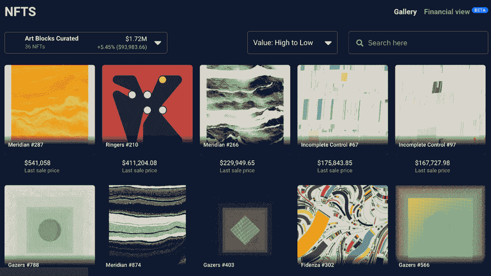
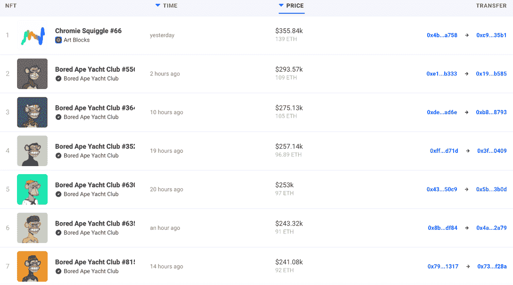
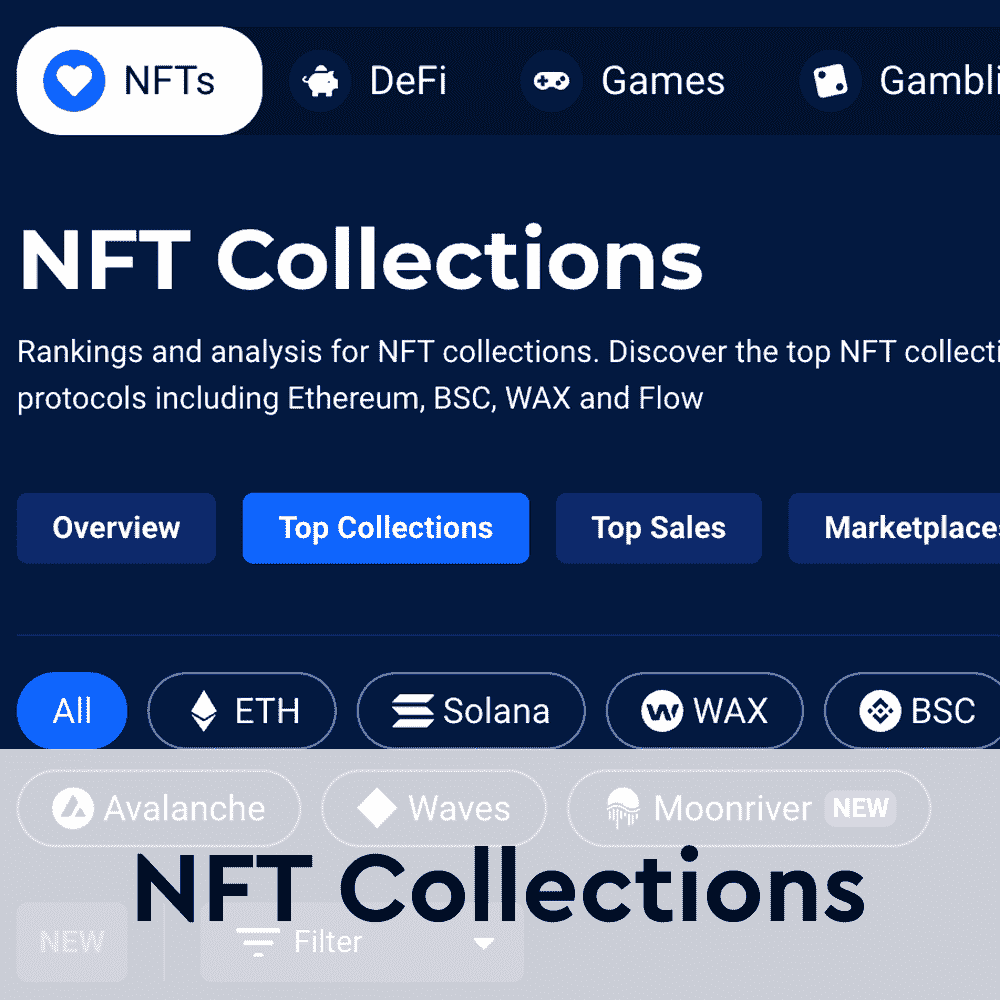
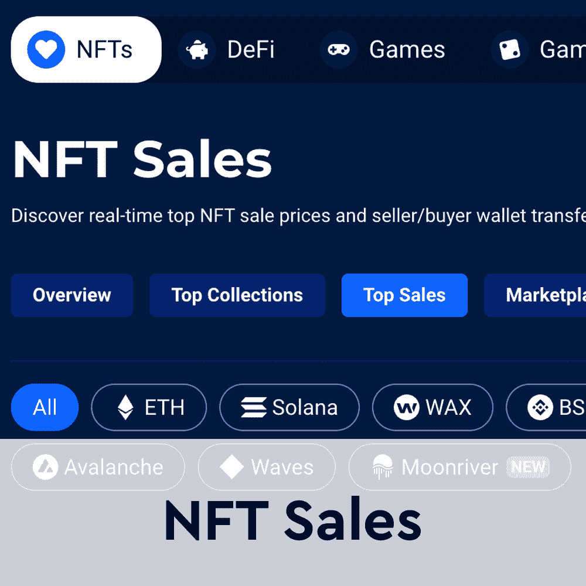
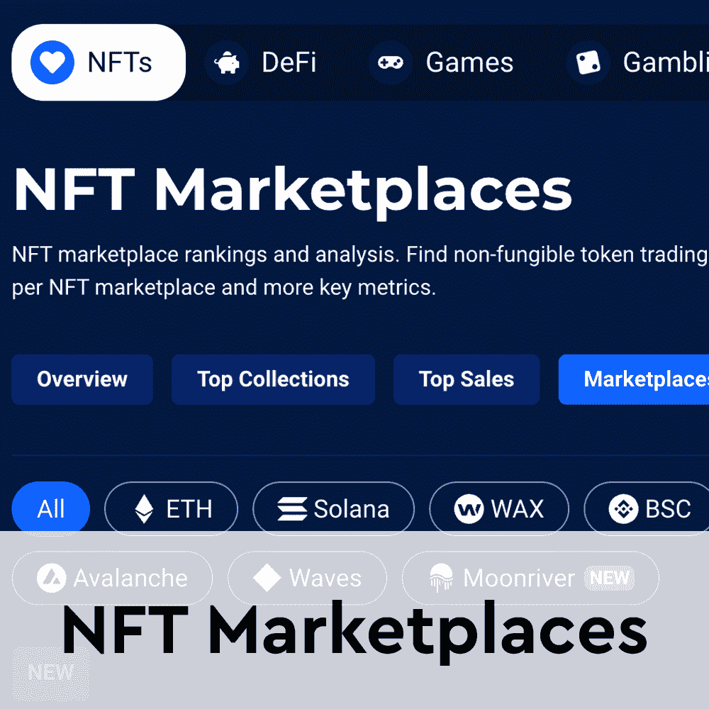

# 铬黄弯弯曲曲地进入聚光灯下

> 原文：<https://web.archive.org/web/https://dappradar.com/blog/chromie-squiggles-squiggle-into-the-spotlight>

## 过去 24 小时内卖出了 3 幅铬黄画，每幅都超过了 26 万美元

在过去的 24 小时里，艺术街区项目的创世纪系列“三色曲线”登上了 DappRadar 网站 NFT 销售页面的首位。这三种非功能性食物的售价都超过了 89 ETH，即 26 万美元以上。

令人印象深刻的是，在购买后，两条铬黄曲线被转移到同一个钱包。[chrome Squiggle # 66](https://web.archive.org/web/20220924164427/https://dappradar.com/hub/assets/eth/0x059edd72cd353df5106d2b9cc5ab83a52287ac3a/66)和[chrome Squiggle # 96](https://web.archive.org/web/20220924164427/https://dappradar.com/hub/assets/eth/0x059edd72cd353df5106d2b9cc5ab83a52287ac3a/96)前往[开元宇宙系列](https://web.archive.org/web/20220924164427/https://dappradar.com/hub/wallet/eth/0x8ba68cfe71550efc8988d81d040473709b7f9218/nfts)由 [punk6529](https://web.archive.org/web/20220924164427/https://twitter.com/punk6529) 创作。本周早些时候，punk6529 购买了 Ringers #210 ，这是艺术街区策划系列的另一件作品。这两幅铬黄画的总价为 639，758 美元。

开放的元宇宙收藏馆现在收藏了 222 件价值超过 1000 万美元的 NFT。用[DappRadar Portfolio Tracker](https://web.archive.org/web/20220924164427/https://dappradar.com/hub/wallet/)工具查看收藏的钱包地址，我们看到它包含了 [36 个艺术块 NFTs](https://web.archive.org/web/20220924164427/https://dappradar.com/hub/wallet/eth/0x8ba68cfe71550efc8988d81d040473709b7f9218/nfts/1/art-blocks-curated) 的各个子收藏部分。该投资组合中艺术板块的总价值达到 172 万美元，接近 NFT 钱包总价值的 20%。

Chromie Squiggle #255 是过去 24 小时内该系列的第三次大拍卖。NFT 以 237，980 美元的价格易手了 89 ETH。NFT 的新主人似乎刚刚开始这个特别的投资组合，到目前为止只有 5 件收藏品。即便如此，看起来铬黄曲线是这位收藏家的一个焦点，因为他们也拥有 [#5620](https://web.archive.org/web/20220924164427/https://dappradar.com/hub/assets/eth/0x059edd72cd353df5106d2b9cc5ab83a52287ac3a/5620) 。

## 铬曲线打破了 bayc 墙

DappRadar 顶级 NFT 排名页面是监控 NFT 太空日报的好方法。更重要的是，它不仅能让你深入了解最卖座的商品，还能让你看到哪些系列的销量达到了顶峰。

例如，在撰写本文的时候，看起来 Bored Ape 游艇俱乐部已经完全占据了[NFT 销量排行榜](https://web.archive.org/web/20220924164427/https://dappradar.com/nft/sales)的榜首。在过去的 24 小时内，销售额最高的七件商品中有六件是 BAYC NFTs，这是其中最便宜的 [BAYC #8153](https://web.archive.org/web/20220924164427/https://dappradar.com/hub/assets/eth/0xbc4ca0eda7647a8ab7c2061c2e118a18a936f13d/8153) ，售价为 92 ETH，约合 241080 美元。

令人印象深刻的是，chrome Squiggle # 66 设法挤到了排行榜的首位。很快超过了 BAYC 的销售额，并以 355，840 美元的交易额成为第一名。

这种偏离大趋势的弯路，本身就可以被解读为信号。当然，铬黄曲线是最令人垂涎的艺术块收藏之一，所以这些艺术块的售价达到六位数也就不足为奇了。

尽管加密市场相对悲观，但随着更多高收入销售的到来，DappRadar 将继续关注 NFT 空间。如果你想获得最新的 NFT 销售数据，请点击 [DappRadar PRO](https://web.archive.org/web/20220924164427/https://dappradar.com/token/pro) 。它能让你获得最近 15 分钟的销售信息。此外，您可以查看下面的链接，了解更多关于 DappRadar 在 NFTs 上的数据。

[<picture></picture>](https://web.archive.org/web/20220924164427/https://dappradar.com/nft/collections)[<picture></picture>](https://web.archive.org/web/20220924164427/https://dappradar.com/nft/sales)[<picture></picture>](https://web.archive.org/web/20220924164427/https://dappradar.com/nft/marketplaces) NewsletterUnsubscribe at any time. [T&Cs](https://web.archive.org/web/20220924164427/https://dappradar.com/terms) and [Privacy Policy](https://web.archive.org/web/20220924164427/https://dappradar.com/privacy-policy)