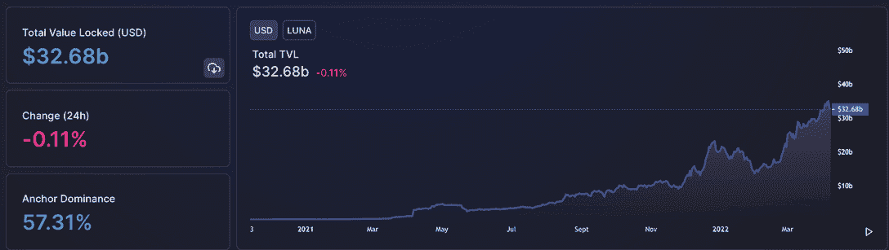
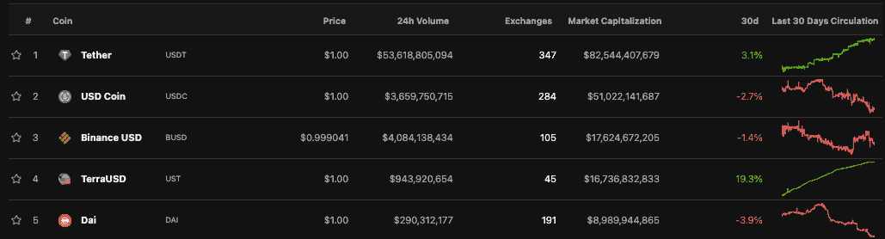

# Terra 与 Avalanche 联手接管 Stablecoin 市场

> 原文：<https://web.archive.org/web/https://dappradar.com/blog/climbing-the-tvl-ranks>

## 随着曲线战争的升温，Terra 正全力以赴

Terra 承诺购买 100 亿美元的比特币，为其本土的 UST 稳定币建立储备，从而牢牢抓住了加密货币和 DeFi world 的注意力，现在它正在分散这一策略。在 4 月 7 日的一份声明中，卢娜基金会警卫队表示，他们将从雪崩基金会获得价值 1 亿美元的雪崩代币，以增加稳定币储备。

## 摘要

*   Luna Foundation Guard 是一家总部位于新加坡的非营利组织，旨在支持 Terra，该组织将从雪崩基金会获得价值 1 亿美元的雪崩代币。
*   TVL 在 Terra 的投资已经超过 320 亿美元，Terra 排名第二
*   [雪崩用户](https://web.archive.org/web/20221127162935/https://dappradar.com/rankings/protocol/avalanche)现在可以直接在雪崩区块链上用 UST 兑换雪崩代币
*   在撰写本文时，AVAX 和 LUNA 的价格都没有明显变化

雪崩区块链的原生代币在发行时总市值为 221 亿美元。此次收购将使 AVAX 成为继比特币之后，Terra UST 稳定币储备中的第二项资产。与此同时，原生 Terra LUNA 令牌的价格在过去两个月里翻了一倍多。写作费从 46 美元涨到 100 美元左右。

## 攀登 TVL 的行列

更令人印象深刻的是，不知从哪里开始，Terra 已经成为总价值锁定的第二大网络。以太坊，其统治地位是[有据可查的](https://web.archive.org/web/20221127162935/https://defillama.com/)，仍然持有价值的最大份额，但 Terra 现在持有 DeFi 智能合同锁定的 2520 亿美元中的 320 亿美元。[超越 BNB 连锁店](https://web.archive.org/web/20221127162935/https://dappradar.com/rankings/protocol/binance-smart-chain)，从一月初的 200 亿美元增长到超过 320 亿美元。

Terra 的 UST 稳定币已经得到了比特币储备的支持，随着 BTC 价格的持续攀升，比特币储备可能达到 100 亿美元。自 2022 年 1 月底投入超过 10 亿美元后，该团队在 3 月 6 日周三又增加了价值 2.3 亿美元的比特币。此外，Terra 一直在增加其比特币购买量，以帮助提高 UST 继续盯住美元的能力。

尽管没有美元或欧元等任何公认的法定货币的支持，但算法稳定币通过发行和销毁 Terra 的本地加密货币 LUNA tokens，成功保持了其盯住地位。

与 Luna Foundation Guard 的战略合作伙伴关系将允许雪崩用户直接在雪崩区块链上用 UST 换取雪崩代币。更值得注意的是，雪崩储备，不同于在特拉区块链的比特币储备，将在雪崩。根据公告，展望未来，Terra 区块链上的几个应用程序将推出雪崩版本。

Avalanche 和 Terra 都是第一层区块链，类似于以太坊，用户可以部署智能合同并构建不同的 dapps，从不可替代的令牌到分散的金融应用。Terra 显然有能力扩展它们的稳定圈，这是吸引 Avalanche 到它的平台的原因之一，而 Terra 将 Avalanche 视为空间中增长最快的 dapp 生态系统之一。

## Terra 开火

USDT 稳定币的稳定性和全面采用是 2022 年 Terra 崛起的根本原因。主要是，本地稳定币让投资者进出头寸，在这个网络上储存价值，而不是转移到其他地方。比如去 USDT 或者 USDC。

[进一步的行动将会看到 Terra](https://web.archive.org/web/20221127162935/https://dappradar.com/blog/is-terra-trying-to-kill-maker-daos-dai-stablecoin) 努力通过在曲线融资上阻碍戴的流动性来[杀死制造者道](https://web.archive.org/web/20221127162935/https://dappradar.com/blog/is-terra-trying-to-kill-maker-daos-dai-stablecoin)和它的戴稳定器。他们通过在 Curve 上推出一个新的资金池来做到这一点，这是利用率最高的稳定币流动性来源，它省略了戴稳定币。如果没有流动性，戴可能会失去其与美元的联系汇率，甚至跌至零，这将在此过程中摧毁制造商道的标志。

戴在历史上比重要得多，但在 2021 年 12 月，推翻了戴。UST 是泰拉的稳定货币，与美元挂钩，美元在 2021 年越来越受欢迎，市值达到 160 亿美元。戴是道公司与美元挂钩的稳定货币，市值 90 亿美元。

 NewsletterUnsubscribe at any time. [T&Cs](https://web.archive.org/web/20221127162935/https://dappradar.com/terms) and [Privacy Policy](https://web.archive.org/web/20221127162935/https://dappradar.com/privacy-policy)

***以上不构成投资建议。此处给出的信息仅供参考。请行使尽职调查，做你的研究。作者持有多种加密货币的头寸，包括 BTC、瑞士法郎和雷达。***