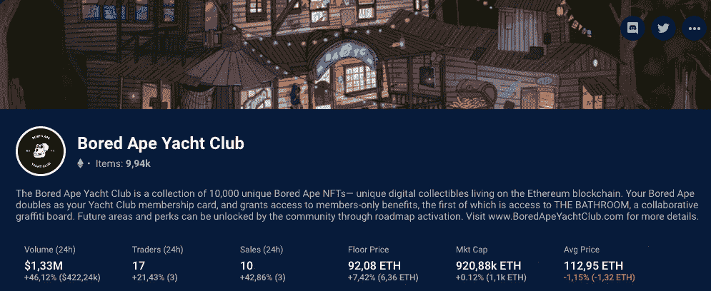
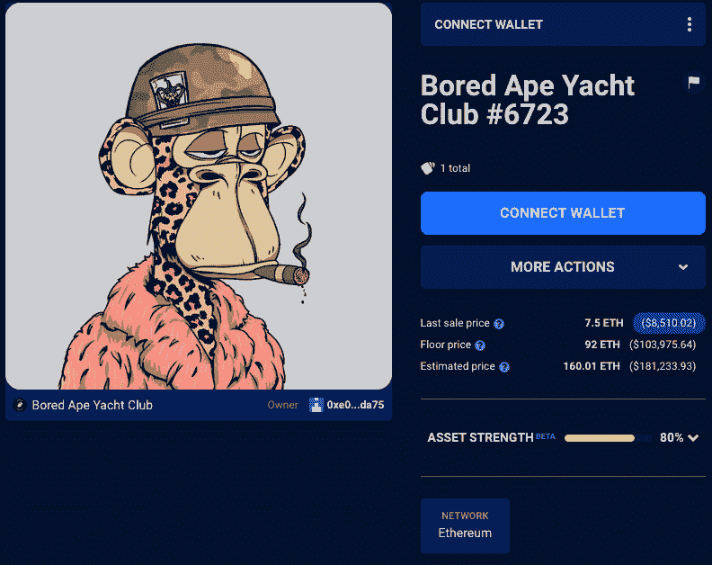

# CloneX NFTs 通过 3D 文件和商业权利释放创造力

> 原文：<https://web.archive.org/web/https://dappradar.com/blog/clonex-nfts-unleash-creativity-with-3d-files-and-commercial-rights>

## 进入虚拟经济的大门

从 7 月 4 日起，所有者可以访问 3D 文件和商业权利。CloneX 是一个受欢迎的以社区为重点的 NFT 系列，由耐克的 RTFKT 和艺术家村上隆在区块链以太坊推出。这些视觉上吸引人的 3D 人物被设计成在元宇宙中进行交互，并且可以被定制成最好地代表其用户的身份。

RTFKT (发音为“artifact”)作为一家改变游戏规则的设计工作室出现在 NFT 品牌收藏品领域，销售元宇宙就绪运动鞋。耐克在 2021 年 12 月买下了创意工作室。它的工作横跨时尚、NFT 和游戏，最终将它们融合在一起，创造出高端品质的产品。

RTFKT 的核心是社区驱动和以身份为中心。创作团队相信包容性和代表性的价值，并寻求在元宇宙实现这一价值。消费者通过定制自己的头像来匹配自己的身份，从而成为品牌不可或缺的一部分。

正是考虑到这些原则，RTFKT 宣布解锁 3D 文件和完整的商业权利。创意、身份和自我表达是这场运动的核心。

## 为什么 CloneX 这么有意思？

撰写本文时，CloneX 的当前底价为 11.52 ETH。这个由日本艺术家村上隆设计的 20，000 个角色的独特 NFT 收藏从其他收藏中脱颖而出。部分原因是其独特的视觉效果和跨元宇宙多个平台的实用性。

[你可以使用 DappRadar 的 NFT 浏览器在这里查看收藏](https://web.archive.org/web/20221103101656/https://dappradar.com/hub/nft-explorer/collection/clonex)

用户可以在[网站](https://web.archive.org/web/20221103101656/https://rtfkt.com/)上通过游戏购买现实世界和虚拟的收藏品。有了 CloneX，元宇宙超越了游戏，也成为一个生活空间，人们可以在这个虚拟世界中社交和收集数字物品。

## 有商业权利的非关税壁垒

RTFKT 还宣布了一个新的 3D 文件不和谐频道。需要注意的一件重要事情是，只有 3D 文件可以转换为具有商业权利的 NFT。村上滴克隆是美术作品，所以持有者没有完全的商业权利。

Source: [RTFKT](https://web.archive.org/web/20221103101656/https://twitter.com/RTFKT) Twitter

CloneX 并不是第一个将商业权利的效用加入其生态系统的公司。宇迦实验室，NFT 空间最精英的品牌，也是这一趋势的开拓者。

[<picture></picture>](https://web.archive.org/web/20221103101656/https://dappradar.com/hub/nft-explorer/collection/bored-ape-yacht-club)

YugaLabs 将商业权利给予其 BAYC 和 MAYC 持有人，以及那些从幼虫实验室获得这些项目后持有[crypto punk](https://web.archive.org/web/20221103101656/https://dappradar.com/hub/nft-explorer/collection/cryptopunks)和 [Meebits](https://web.archive.org/web/20221103101656/https://dappradar.com/hub/nft-explorer/collection/meebits) 的人。

对于像 Bored Ape Yacht club (BAYC)这样的独家收藏品所有者来说，拥有商业权利的 NFT 是一个非常强大的品牌工具。

一个很好的例子是像阿姆和史努比·道格这样的名人在他们的音乐视频中使用 NFT 所有权。

迷人的名单还包括麦当娜和吉米·法伦作为 NFT 俱乐部的老板。在 DappRadar 上，我们收集了活跃在 crypto、DeFi 或 NFTs 领域的名人名单。

[<picture></picture>](https://web.archive.org/web/20221103101656/https://dappradar.com/hub/assets/eth/0xbc4ca0eda7647a8ab7c2061c2e118a18a936f13d/6723)

Source: [Snoop Dogg´s BAYC NFT #6723](https://web.archive.org/web/20221103101656/https://dappradar.com/hub/assets/eth/0xbc4ca0eda7647a8ab7c2061c2e118a18a936f13d/6723)

另一个很好的例子是创意企业家安迪·阮今年早些时候在加州创办的[Bored&Hungry](https://web.archive.org/web/20221103101656/https://justboredandhungry.com/)Bored Ape NFT 主题汉堡餐厅。

该合资企业最初打算持续 90 天，但现在是永久性的，因为尽管熊市，它的广受欢迎的花哨 NFT 超级明星。

## CloneX 的下一步是什么？

随着这一宣布，CloneX 背后的团队期待看到新一代创造者的出现。根据他们在 Medium 上的最新帖子，他们设想收藏家委托创作者建立他们的克隆知识产权和品牌。

此外，克隆虚拟模特和一个全新的影响者概念:克隆时装模特，他们将成为未来的品牌大使。此外，他们希望通过吸引 3D 创作巨星、视频游戏演示和 fanart NFTs，将数字艺术带入生活，同时成为创造新品牌和可穿戴设备的背后力量。

## 解锁您的 3D 文件

CloneX 希望点燃全球艺术家的 3D 事业，但首先，如果你是一个克隆所有者，你必须知道如何解锁你的文件。3D 文件仍在为初学者进行调整，是令牌门控的，因此是排他性的。

您可以[在这里](https://web.archive.org/web/20221103101656/https://clonex.rtfkt.com/login)访问您的 3D 文件。CloneX 有两种不同类型的用户:Maya 和 Blender。第一类给予了更多的创作灵活性，而后者则稍有限制。

请确保在 [Twitter](https://web.archive.org/web/20221103101656/https://twitter.com/RTFKT) 上关注 RTFKT，获取定期更新。DappRadar 将继续监测 CloneX 和 RTFKT 的最新发展。在 [Twitter](https://web.archive.org/web/20221103101656/https://twitter.com/dappradar) 、 [Discord](https://web.archive.org/web/20221103101656/https://discord.gg/4ybbssrHkm) 和 [Youtube](https://web.archive.org/web/20221103101656/https://www.youtube.com/c/DappRadar) 上关注我们，跟上区块链世界的动态。

 NewsletterUnsubscribe at any time. [T&Cs](https://web.archive.org/web/20221103101656/https://dappradar.com/terms) and [Privacy Policy](https://web.archive.org/web/20221103101656/https://dappradar.com/privacy-policy)