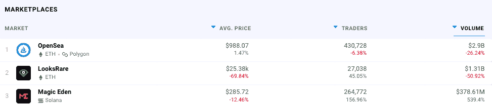
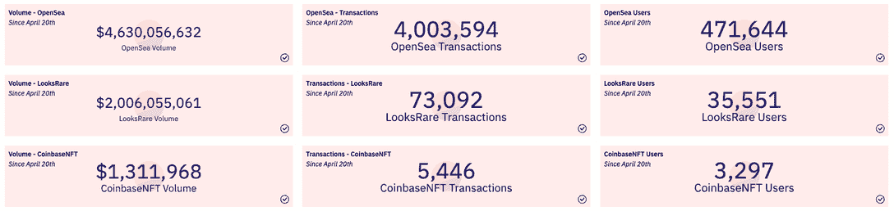
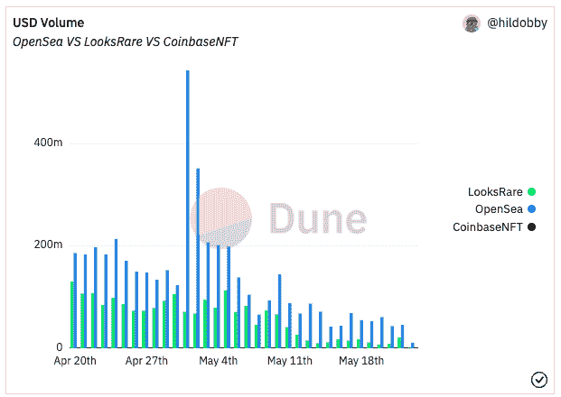
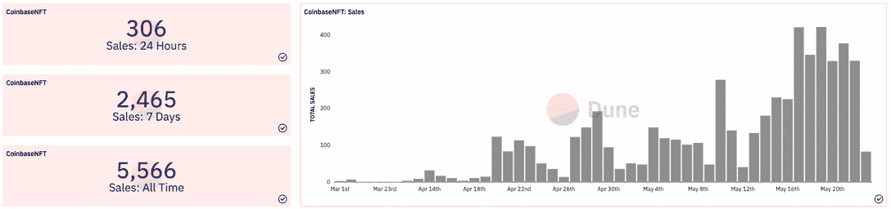
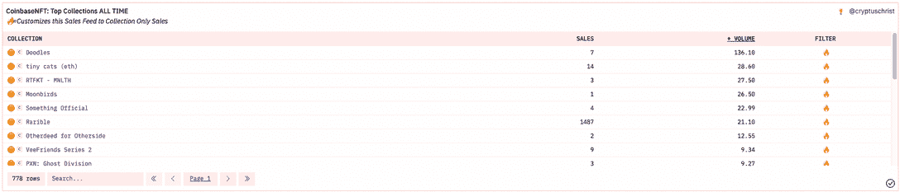
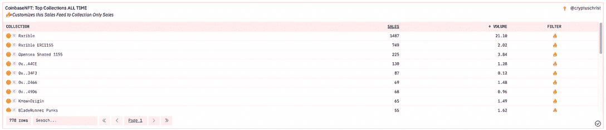
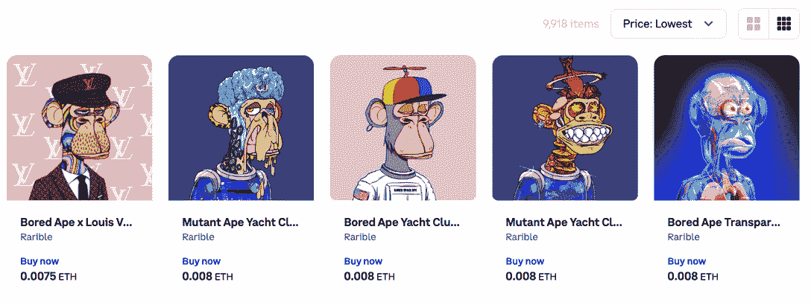
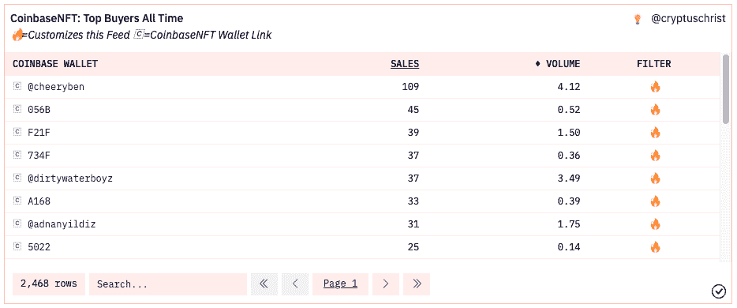
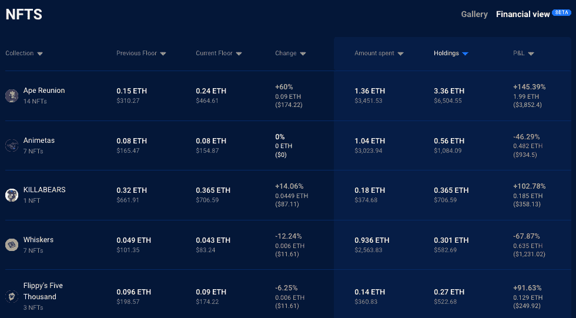
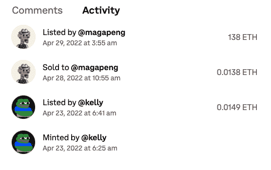

# 比特币基地 NFT 市场反高潮

> 原文：<https://web.archive.org/web/https://dappradar.com/blog/coinbase-nft-marketplace-anti-climax>

## 最受追捧的市场发现很难获得动力

备受期待的比特币基地 NFT 市场第一个月交易惨淡，部分原因是在经济低迷时期推出，发现很难获得关注。自 4 月 20 日以来，比特币基地 NFT 市场仅处理了 5446 笔交易，销售额略高于 100 万美元。在同一时期，领先的 NFT 市场 OpenSea 的交易量超过 400 万笔，销售额超过 46 亿美元。

由比特币基地领先的中央交易所推出 NFT 市场，有望使 NFTs 更接近 9800 万已验证账户中的一些，并进一步推动其采用。尤其是有 200 多万人登记了等候名单。然而，由于一些人指出经济衰退和崩溃的加密价格解释了反高潮，有必要看看其他 NFT 市场如何表现。

## 不要怪比特币

[数据表明 NFT 的交易和销售仍然非常活跃，只是比特币基地 NFT 市场没有看到太多的动作。](/web/20230227004354/https://dappradar.com/blog/dapp-industry-report-april-2022/) [OpenSea 一直在 NFT 二级市场占据主导地位](https://web.archive.org/web/20230227004354/https://dappradar.com/nft/marketplaces)，尽管 LooksRare 和其他追求者试图摆脱它的控制，但它一直没有放松。

自 4 月 20 日以来，OpenSea 在 NFT 的销售额已经超过 46 亿美元，交易量超过 400 万笔，用户接近 50 万。[尽管 LooksRare 的象征性奖励有所变化，但它仍然保持着竞争力，通过更少的交易处理了超过 20 亿美元的销售额。值得注意的是，LooksRare 上的许多活动都涉及到](/web/20230227004354/https://dappradar.com/blog/1-5-billion-in-nfts-traded-this-week-across-looksrare-and-opensea/)[坏演员向他们自己出售 NFTs】来获得 LOOKS tokens。因此交易数量减少，但仍然产生了 20 亿美元，相当于同期 OpenSea 销售额的一半。](/web/20230227004354/https://dappradar.com/blog/marketing-genius-or-foul-play-two-wallets-generate-1-1-billion-on-looksrare/)

4 月底，NFT 另一边的 Bored Ape 游艇俱乐部的土地拍卖活动提振了 OpenSea。随着 NFT 的土地开始在[NFT 外海市场](https://web.archive.org/web/20230227004354/https://dappradar.com/ethereum/marketplaces/opensea)交易，5 月份左右可以看到显著的上涨。

## 没必要惊慌

尽管起步较慢，但比特币基地 NFT 市场的交易和销售开始加速，5 月是最活跃的一个月。在过去的七天里，该市场已经处理了其总共 5566 笔 NFT 交易中的 2465 笔，显示出对来自比特币基地的非关税壁垒的需求增加，因为在 5 月 5 日，ETH 中表示的价格开始与象征性价值一致。

看看比特币基地 NFT 市场上有哪些非功能性信托基金出售，就会发现这些非功能性信托基金大多来自现在被认为是蓝筹股的藏品。这再次支持了这样一种观点，即由于 ETH 价格的下跌和获得折扣的能力，更多受过教育的买家正在购买顶级 NFT。涂鸦已经产生了超过 136 个 ETH，或者大约 275，000 美元。《T2》和《T4》的销量也位居榜首，而《彼岸世界》和《朋友系列 2》的销量则相对较少。

## 未受教育的观众

有趣的是，比特币基地市场拥有 [OpenSea](https://web.archive.org/web/20230227004354/https://dappradar.com/ethereum/marketplaces/opensea) 、 [Rarible](https://web.archive.org/web/20230227004354/https://dappradar.com/multichain/marketplaces/rarible) 和 [Known Origin](https://web.archive.org/web/20230227004354/https://dappradar.com/ethereum/marketplaces/knownorigin) 的店面页面。这些网站就像一个门户，让客户无需离开比特币基地市场就可以从这些替代平台购买非功能性食物。这些稀有页面总共容纳了近 200，000 个 NFT，而 OpenSea 页面超过了 150 万个。比特币基地 NFT 市场正在向其竞争对手输送大量的流量和销量。

另一个有趣的观察是，在上面列表顶部显示的稀有页面上的[,由于已经累积了 1487 笔销售并产生了超过 21 个 ETH，我们看到一些可疑的 NFT 项目。对于受过训练的人来说，这些物品是原始非功能性测试的复制品或赝品。他们描绘了蓝筹股集合，如](https://web.archive.org/web/20230227004354/https://nft.coinbase.com/collection/ethereum/0xb66a603f4cfe17e3d27b87a8bfcad319856518b8)[、BAYC](https://web.archive.org/web/20230227004354/https://dappradar.com/ethereum/collectibles/bored-ape-yacht-club) 或 MAYC。然而，主要的赠品是价格。[根据这个页面](https://web.archive.org/web/20230227004354/https://nft.coinbase.com/collection/ethereum/0xb66a603f4cfe17e3d27b87a8bfcad319856518b8)，我可以花 15 美元得到一个[无聊猿 x 路易威登](/web/20230227004354/https://dappradar.com/blog/10-major-brands-in-the-metaverse/) NFT。可以说，这些销售是通过稀有合同看到的如此膨胀的数字背后的原因，并可能受到使用比特币基地市场的手弱的未受过教育的买家的刺激。

## 比特币基地鲸

比特币基地 NFT 市场还处于早期，但一些多产的钱包地址已经脱颖而出。随着 109 的销售，我们看到 [CheeryBen 在最上面](https://web.archive.org/web/20230227004354/https://nft.coinbase.com/@magapeng)。

使用 [DappRadar 投资组合跟踪器](https://web.archive.org/web/20230227004354/https://dappradar.com/hub/wallet/eth/0x83d4f05472a9b6337e423045c740b51a09777862/nfts/1)对钱包进行的进一步调查显示，钱包中包含 267 笔价值约 11，000 美元的 NFT。然而，[的钱包里塞满了看起来像是精心策划的、单个价值较低的山寨货和仿制品。](https://web.archive.org/web/20230227004354/https://dappradar.com/hub/wallet/eth/0x83d4f05472a9b6337e423045c740b51a09777862/nfts-financial)

[Wallet dive](https://web.archive.org/web/20230227004354/https://dappradar.com/hub/wallet/eth/0x83d4f05472a9b6337e423045c740b51a09777862/nfts-financial)

乍一看，你可能会想，这个人从前面提到的稀有收藏品中买了很多假的 NFT。虽然这确实是可能的，但事实是，他们正试图以 100 倍于其页面上的价值翻转它们，这敲响了警钟。查看 Nounbird#3106 的[交易历史，似乎此人正试图欺骗其他不知情的人购买一件标价为 138 ETH，约合 27.5 万美元的假货。](https://web.archive.org/web/20230227004354/https://nft.coinbase.com/nft/ethereum/0x3a5edff0a7e4dd1f75725fbfb40b64c2a38263dc/3106)

这可能发生在像比特币基地这样的市场上，那里的用户可能远不如那些使用 OpenSea 这样的分散平台的用户了解得多。更令人担忧的是，有人可能会花 138 ETH 购买一个山寨 NFT，这无疑会给比特币基地市场和整个 NFTs 带来许多负面影响。

## NFTs 死了？别傻了

虽然有些人会将比特币基地过去一个月的表现平平归咎于市场，但我们在 DappRadar 看到了熊市情景下非功能性金融服务的不同景象。在四月底，[我们观察到 NFT 市场在经过六周的冷却期后开始复苏，月交易量达到 63 亿美元；](/web/20230227004354/https://dappradar.com/blog/dapp-industry-report-april-2022/)[月鸟是一个巨大的驱动力](/web/20230227004354/https://dappradar.com/blog/new-dapps-report-moonbirds-to-the-moon-and-beyond/)，交易立即产生了 5 亿美元。有趣的是，我们看到索拉纳上的 [NFT 交易量较 3 月份增长了](/web/20230227004354/https://dappradar.com/blog/magic-eden-solana-help-get-nfts-back-on-track/) 90%，达到 2.95 亿美元，主要受 [Okay Bears](/web/20230227004354/https://dappradar.com/blog/new-dapps-report-okay-bears-bulls-in-a-bear-market/) 和 [DeGods](/web/20230227004354/https://dappradar.com/blog/magic-eden-marketplace-becomes-new-nft-hotspot-on-solana/) 的推动。除此之外，宇迦实验室的另一项交易搅动了加密市场，从造币厂获得了 3.4 亿美元的 APE 和 4.2 亿美元的二级交易。

比特币基地仍然是美国最大的加密货币交易所，可以说它看到了从价值数十亿美元的 NFT 市场中分一杯羹的机会。在相当突然地进入 NFT 市场后，比特币基地·NFT 市场现在有一些严肃的工作来吸引观众，教育他们 NFT 所有权及其风险。

 NewsletterUnsubscribe at any time. [T&Cs](https://web.archive.org/web/20230227004354/https://dappradar.com/terms) and [Privacy Policy](https://web.archive.org/web/20230227004354/https://dappradar.com/privacy-policy)

***以上不构成投资建议。此处给出的信息仅供参考。请行使尽职调查，做你的研究。作者持有多种加密货币的头寸，包括 BTC、瑞士法郎和雷达。***