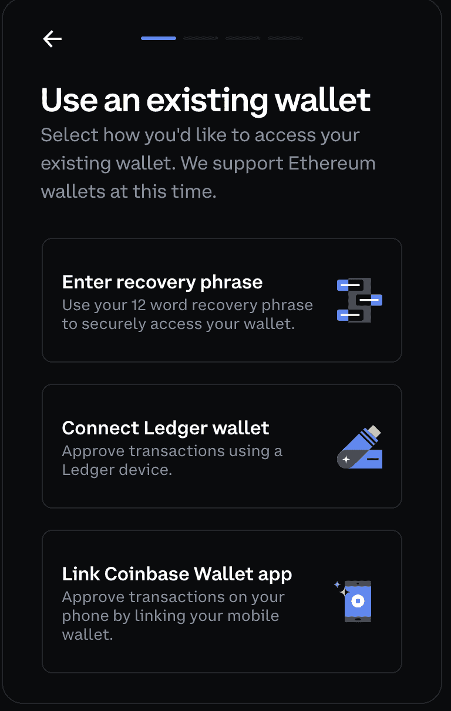

# 比特币基地钱包应用程序现在支持分类账

> 原文：<https://web.archive.org/web/https://dappradar.com/blog/coinbase-wallet-app-now-supports-ledger>

## 这种集成将允许交易者将他们的分类账钱包直接连接到浏览器扩展应用程序

**比特币基地与硬件钱包创建者莱杰合作，为客户提供在比特币基地钱包应用程序中使用冷钱包的机会。比特币基地是最受欢迎的集中式加密货币交易所之一，这一整合将向更广泛的受众开放内部钱包服务。**

重要的是，Ledger 是加密领域中使用最多的硬件钱包之一。钱包发出一个密码和一个 24 字的恢复短语来保护存储中的所有资产。此外，Ledger Live 应用程序允许用户管理他们的加密货币和 NFT。硬件钱包支持数以千计的硬币，并给予用户对所有这些资产的完全所有权。

根据比特币基地高级产品经理 Adam Zadikoff 的说法，这种整合的目标是让更多的人加入到不断增长的去中心化应用和 web3 平台的生态系统中。您知道吗，您的比特币基地钱包也可以在 DappRadar 上使用？

## 什么是比特币基地钱包，如何使用它？

作为加密货币交易所，比特币基地促进了加密货币代币和 NFT 的交易。为了给用户提供更完整的体验，该交易所推出了内部钱包。

钱包允许用户存储私钥、发送、接收和消费数字资产，以及访问 dapps。该应用可在移动设备或网络浏览器上使用，支持超过 4，000 种不同的资产和众多分散的应用程序。

要开始使用比特币基地钱包，只需访问[官方网站](https://web.archive.org/web/20220929042828/https://www.coinbase.com/wallet?__cf_chl_f_tk=lownExxIKy7wvAw4sh0QpivOQFBxRxkv1b.KMtadzbI-1645692024-0-gaNycGzNClE)并下载应用程序或网络浏览器扩展。该应用程序让用户可以选择创建一个全新的钱包，或者导入一个已经存在的钱包。现在，钱包也允许用户将他们的分类账钱包直接连接到分机。

重要的是，这款钱包还位列 2022 年最佳加密货币钱包[。

考虑到这一点，DappRadar 最近在其整个服务生态系统中集成了对钱包的支持。现在，用户可以登录他们的 DappRadar 帐户，使用](https://web.archive.org/web/20220929042828/https://dappradar.com/blog/best-cryptocurrency-wallets-for-2022/) [DappRadar 令牌交换](https://web.archive.org/web/20220929042828/https://dappradar.com/hub/swap/eth)，并且[通过将他们的比特币基地钱包连接到 DappRadar 来监控他们的加密组合](https://web.archive.org/web/20220929042828/https://dappradar.com/hub/wallet/)。

如果你是比特币基地钱包的用户，去 DappRadar 试试这个新功能。此外，你可以在 Twitter 上关注 DappRadar，并加入我们的 T2 不和谐社区，首先了解最新的加密新闻。

 NewsletterUnsubscribe at any time. [T&Cs](https://web.archive.org/web/20220929042828/https://dappradar.com/terms) and [Privacy Policy](https://web.archive.org/web/20220929042828/https://dappradar.com/privacy-policy)