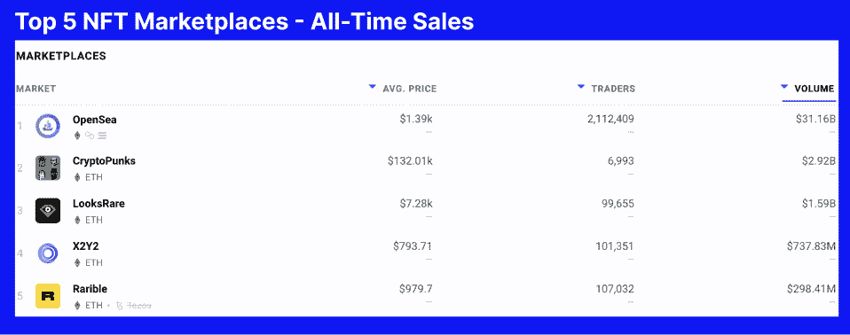

# 比较:以太坊对卡尔达诺

> 原文：<https://web.archive.org/web/https://dappradar.com/blog/comparison-ethereum-versus-cardano>

## 看着两个区块链交织在一起的过去

卡尔达诺起源于一场争论，当时两个人对以太坊区块链应该如何管理和发展意见不一。因此，无怪乎以太坊和卡尔达诺之间的争论经常会看到双方的追随者对哪个网络是最好的有着热切的看法。作为一个区块链不可知论者，DappRadar 在这场争论中不支持任何一方。但是我们列出了一些事实，让每个人有更多的了解。

**内容**

*   ***[何人，何地，何时？](https://web.archive.org/web/20230123114500/https://dappradar.com/blog/comparison-ethereum-versus-cardano/#who-where-when)***
*   ***[科技](https://web.archive.org/web/20230123114500/https://dappradar.com/blog/comparison-ethereum-versus-cardano/#technology)***

*   ***[让我们谈谈 NFTs](https://web.archive.org/web/20230123114500/https://dappradar.com/blog/comparison-ethereum-versus-cardano/#talk-nfts)***
*   ***[令牌](https://web.archive.org/web/20230123114500/https://dappradar.com/blog/comparison-ethereum-versus-cardano/#tokens)***
*   ***[以太坊 vs 卡达诺](https://web.archive.org/web/20230123114500/https://dappradar.com/blog/comparison-ethereum-versus-cardano/#eth-vs-cardano)***

[DappRadar’s Rankings for Ethereum dapps](https://web.archive.org/web/20230123114500/https://dappradar.com/rankings/protocol/ethereum)

## 谁，在哪里，什么时候？

以太坊最初是在 2013 年的一份白皮书中描述的，后来在 2014 年迈阿密的北美比特币大会上正式公布。2015 年 7 月 30 日，链中的第一个块被创建。

以太坊有一长串创始人。2013 年 12 月，共有五人:Vitalik Buterin、Charles Hoskinson、Anthony Di Iorio、Mihai Alisie 和 Amir Chetrit。加文·伍德、杰弗里·威尔凯和约瑟夫·卢宾于 2014 年加入。

Cardano 于 2015 年在瑞士楚格成立。查尔斯·霍金森想接受风险投资资金，并以营利为目的创建以太坊。维塔利科·布特林希望区块链继续作为一个非营利组织存在。

最终 Hoskinson 离开了以太坊项目，共同创立了 IOHK。该公司与卡尔达诺基金会和 Emurgo 合作开发卡尔达诺。2017 年 9 月 27 日，卡尔达诺发射升空。

## 技术

#### 工作证明

以太坊目前作为工作验证(PoW)网络运行。PoW 是一种共识机制，要求网络成员解决任意的数学难题。一旦所有成员都完成了工作并创建了一个块，这个块就被永久锁定并添加到一个链中，因此称为“区块链”。

这个系统如此安全的原因是，需要超过一半的块挖掘者同意改变散列。因为协调这一点几乎是不可能的，所以 PoW 网络上的记录块将永远不会被改变。

作为对以这种方式保护战俘网络的奖励，矿工们将获得区块链的加密货币。以以太坊为例，原生令牌为 [ETH](https://web.archive.org/web/20230123114500/https://dappradar.com/hub/token/eth/ETH) 。就目前情况来看，矿工每创造一个以太坊就能获得两个以太坊。

[https://web.archive.org/web/20230123114500if_/https://www.youtube.com/embed/pThbMD_ceXs?feature=oembed](https://web.archive.org/web/20230123114500if_/https://www.youtube.com/embed/pThbMD_ceXs?feature=oembed)

How to stake RADAR token

#### 利害关系证明

很快，以太坊将转向利益证明(PoS)共识机制。有了 PoS，验证者不再需要解谜来保护数据块，而是将他们的 ETH 锁在网络中，并在记录块创建时负责验证它们。加密货币的这种锁定被称为赌注。

本质上，硬币持有者提供他们的硬币作为抵押品，以获得保持安全网络的机会。任何人想要控制以太坊网络，都需要花费数百亿美元来获得足够的以太网。

在这个阶段，既然他们拥有如此多的 ETH，如果黑客试图利用这个系统，他们将失去所有的投资。以太坊有一个内置的安全措施，确保任何人试图恢复块将失去他们所有的赌注。

卡尔达诺是用一种被称为大毒蛇的共识机制设计和推出的。它类似于 PoS 系统，验证者将获得本地加密货币 ADA。有了大毒蛇，时间被分成纪元和时段。实际上，每个时段持续约 5 天，包含 21，600 个时隙，每个时隙持续 20 秒。

当每个槽开始时，从验证者池中随机选择一个槽头。一旦被选中，他们负责验证交易并将其转换为块。当另一个时期开始时，创建新的随机种子号，并选择不同的验证器来创建块。

[https://web.archive.org/web/20230123114500if_/https://www.youtube.com/embed/soaTlaEBdvs?feature=oembed](https://web.archive.org/web/20230123114500if_/https://www.youtube.com/embed/soaTlaEBdvs?feature=oembed)

The Ouroboros protocol explained

## 成本和速度

#### 费用

卡尔达诺的汽油费现在比以太坊低。就目前情况来看，卡尔达诺的交易成本平均约为 0.16-0.17 阿达。你可以通过使用一个代币价格网站来了解 ADA 的当前成本[。](https://web.archive.org/web/20230123114500/https://www.coingecko.com/en/coins/cardano)

由于 ETH 的高美元价值和在区块链发生的大量交易活动，以太坊交易的成本明显更高。

NFTs 的流行，加上 DeFi 的增长和牛市，促使平均每天的天然气费用攀升至 197 美元。幸运的是，成本最近已经从这些高点回落，但是以太坊仍然是最昂贵的交易网络之一。

[When are Ethereum gas fees lowest?](https://web.archive.org/web/20230123114500/https://dappradar.com/blog/when-are-ethereum-gas-fees-lowest)

#### 速度

卡尔达诺不仅比以太坊便宜，而且区块链的每秒交易量(TPS)也更快。Cardano 可以处理大约 250 TPS，而以太坊目前可以处理 30 TPS。

以太坊开发团队声称，在预期的[合并](https://web.archive.org/web/20230123114500/https://dappradar.com/blog/what-is-the-ethereum-merge)之后，他们的区块链将很快能够处理高达 100，000 TPS。如果发生这种情况，它将使网络达到我们目前拥有的最快速度。

请记住，卡尔达诺和以太坊团队一直致力于发展，以改善他们的区块链。因此，预计未来会有更高的 TPS 数据，并有望降低交易费用。

## 让我们谈谈 NFTs

以太坊也是 NFT 交易的头号区块链。看一看 [DappRadar 对以太坊](https://web.archive.org/web/20230123114500/https://dappradar.com/nft/marketplaces/protocol/ethereum)的 NFT 市场排名，我们可以看到五个最大市场的历史销售额总计超过 365 亿美元。

[DappRadar’s Ethereum NFT Marketplace rankings](https://web.archive.org/web/20230123114500/https://dappradar.com/nft/marketplaces/protocol/ethereum)

所有最著名的 NFT 项目都位于区块链以太坊。蓝筹如[隐朋克](https://web.archive.org/web/20230123114500/https://dappradar.com/ethereum/collectibles/cryptopunks)、[无聊猿游艇俱乐部](https://web.archive.org/web/20230123114500/https://dappradar.com/ethereum/collectibles/bored-ape-yacht-club)、[变异猿游艇俱乐部](https://web.archive.org/web/20230123114500/https://dappradar.com/ethereum/collectibles/mutant-ape-yacht-club)、[艺术街区](https://web.archive.org/web/20230123114500/https://dappradar.com/ethereum/collectibles/art-blocks)、[志那都红豆](https://web.archive.org/web/20230123114500/https://dappradar.com/ethereum/collectibles/azuki)、[月鸟](https://web.archive.org/web/20230123114500/https://dappradar.com/ethereum/collectibles/moonbirds)都是建立在以太坊之上的。

另一方面，卡尔达诺没有特别值得注意的收藏。 [Jpg.store](https://web.archive.org/web/20230123114500/https://www.jpg.store/) 是 Cardano NFTs 最知名的市场，处理了 63.36%的销售额。总的来说，价值 2.074 亿美元的 Cardano NFTs 已经售出(在撰写本文时的 ADA 价格)。

## 代币

以太坊的原生令牌叫做 ETH。它是市值仅次于比特币的第二高的加密货币。2021 年 11 月 10 日达到目前的历史高点 4878 美元。

对于生成和发布给网络验证者的 ETH 数量没有限制。当每种气体原料一小部分被燃烧时，供应受到控制。二级市场 [OpenSea](https://web.archive.org/web/20230123114500/https://dappradar.com/multichain/marketplaces/opensea) 是 ETH 最大的燃烧器，因为如此多的以太坊 NFT 在它的平台上交易。

卡尔达诺的代币被称为 ADA，它在 2021 年 9 月 2 日达到了自己目前的历史高点 3.09 美元。ADA 目前在总市值方面排名第八。

每个块都会生成新的 ADA，并分发给插槽负责人，用于验证和创建新的块。与以太坊不同，它有 450 亿 ADA 的寿命限制。迄今为止，已发行了 338 亿阿达。

当所有的 450 亿代币被铸造出来后，验证者将只通过交易费获得他们的奖励。

## 以太坊对卡尔达诺

如前所述，达普拉达并不认为哪个区块链是最好的，或者可能在 web3 霸权之战中胜出。我们相信，在一个去中心化的世界里，每个人都有自己的空间。有些网络更适合某些任务，而有些网络则不适合某些用途。

以太坊在 NFT 数、令牌市值、PR、第二层网络和侧链以及它托管的 dapps 总数方面明显领先市场。

Cardano 的交易费用更低，TPS 费率更高(目前而言)，是按照同行评审标准开发的，并且正在慢慢增加基于其区块链的 dapps 的数量。

当前 web3 时刻的美妙之处在于，成千上万的开发者正在创造数百种工具、dapps 和区块链，我们都可以出于任何目的从中进行选择。但如果你真的想挑选一个区块链，并对其未来前景孤注一掷，请记住，去 DYOR。

 NewsletterUnsubscribe at any time. [T&Cs](https://web.archive.org/web/20230123114500/https://dappradar.com/terms) and [Privacy Policy](https://web.archive.org/web/20230123114500/https://dappradar.com/privacy-policy)