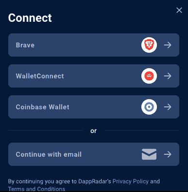

# 用勇敢的钱包连接到 DappRadar

> 原文：<https://web.archive.org/web/https://dappradar.com/blog/connect-to-dappradar-with-brave-wallet>

## 勇敢的钱包用户现在可以享受 DappRadar 上的重要功能

DappRadar 用户现在可以使用 Brave Wallet 连接到网站和工具，并在 ETH、BNB 和 Polygon 上查看他们的投资组合。此外，他们可以成为专业用户，从增强的数据功能中受益，并加入 juicy airdrops。这标志着 DappRadar 用户的钱包连接与 Metamask、WalletConnect、比特币基地和 GameStop 钱包的最新集成。

2021 年 11 月，Brave 推出了其浏览器原生加密钱包，允许 Brave 用户从单个钱包中存储、管理、增长和交换他们的加密组合。与其他加密钱包相比，这种钱包是独一无二的，因为它不需要扩展，使它更加安全和有效。

Web 3 Brave 浏览器体现了去中心化的价值观，并以隐私为中心，允许用户在他们希望的情况下接触广告，并通过基本注意力令牌(BAT)获得他们的注意力。

DappRadar 用户现在将通过连接自保管加密钱包在 ETH、BNB 和 Polygon 上看到他们勇敢的资产。勇敢的钱包用户可以跨多个链购买、接收和发送加密资产，包括以太坊和 EVM 兼容链。

需要强调的是，用户必须首先下载 Brave 浏览器才能使用 Brave 钱包，并在钱包设置下将其设置为默认浏览器扩展。否则，当他们点击“连接”时，将无法看到“勇敢钱包”选项。

[https://web.archive.org/web/20221127192532if_/https://www.youtube.com/embed/jcL8WAzIz54?feature=oembed](https://web.archive.org/web/20221127192532if_/https://www.youtube.com/embed/jcL8WAzIz54?feature=oembed)

## **如何使用勇敢钱包连接到 DappRadar】**

一旦进入 DappRadar.com，你会在右上角看到一个醒目的图标，上面写着“连接”。点击这个，你会看到不同的登录选项。选择勇敢钱包选项并继续。您必须在您的勇敢钱包中签署一项交易，以批准与 DappRadar 的连接。

恭喜你。您现在可以使用勇敢的钱包连接到[世界的 Dapp 商店](https://web.archive.org/web/20221127192532/https://dappradar.com/)。要导航到 DappRadar 投资组合跟踪器，请在以太坊上检查您的资产，返回主页，然后单击右上角的图标，现在应该会显示您勇敢的钱包地址。

点击图标，右边会出现一个带有选项的侧边栏。第一种选择是使用与 Wyre 的集成来使用 Visa 或 Mastercard 购买加密货币。选择**设置**将允许您进一步个性化您的 DappRadar 帐户，并注册或拒绝标准营销消息。

**Portfolio** 选项卡将立即打开[DappRadar Portfolio Tracker](https://web.archive.org/web/20221127192532/https://dappradar.com/hub/wallet/)中的 Brave wallet，在这里您可以跟踪和分析您的投资组合的实时可操作数据并采取行动。

## **勇敢站在 Web3 创造者经济的最前沿**

Brave 的广告服务模式旨在让创作者和消费者同时受益。收到英美烟草广告观看权的用户可以选择将它据为己有，或者将它分配给他们喜欢阅读或观看的在线出版商。

事实证明，这种模式是大规模增长的制胜法宝。据 Brave 称，该浏览器拥有超过 5742 万月活跃用户，1930 万日活跃用户，以及超过 160 万内容创作者的网络。

此外，同样重要的是，在过去一个月的熊市中，BAT(基本注意力标志)的表现超过了 BTC 和 ETH，将自己定位为领先的创造者币。

 NewsletterUnsubscribe at any time. [T&Cs](https://web.archive.org/web/20221127192532/https://dappradar.com/terms) and [Privacy Policy](https://web.archive.org/web/20221127192532/https://dappradar.com/privacy-policy)