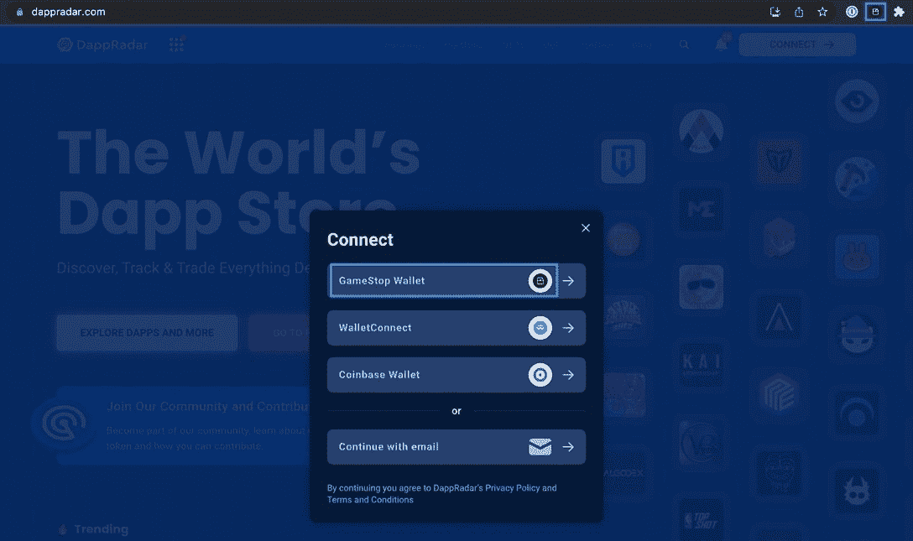
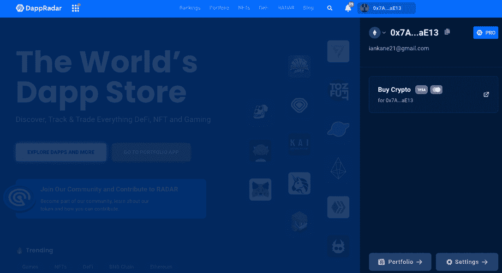

# 使用 GameStop Wallet 连接到 DappRadar

> 原文：<https://web.archive.org/web/https://dappradar.com/blog/connect-to-dappradar-with-gamestop-wallet>

## GameStop 钱包用户现在可以访问重要的 DappRadar 功能

DappRadar 用户现在可以使用 GameStop 钱包连接到网站和工具，并在以太坊上查看他们的作品集。享受作为专业用户的特权，并加入几个空投。这种集成为用户增加了额外的钱包连接，同时补充了将 GameStop NFT 市场集成到 DappRadar 的 NFT 跟踪中。

2022 年 5 月，GameStop 推出了他们基于浏览器的非托管以太坊钱包的测试版，允许持有者在不离开游戏的情况下访问、消费和交易加密货币和其他数字资产。最新的更新版本 0.6.9，使用户能够访问他们不可变的 X 购买，发送和接收货物，并连接到[不可变的 X dapps](https://web.archive.org/web/20221207034414/https://dappradar.com/rankings/protocol/immutablex) 。

GameStop Wallet 类似于 MetaMask，并利用 Loopring 的 ZK 汇总技术，这是一种以太坊第二层扩展协议，用于更便宜、更快速的交易。你可以从 Chrome 网上商店下载 GameStop 钱包作为浏览器扩展[。](https://web.archive.org/web/20221207034414/https://chrome.google.com/webstore/detail/gamestop-wallet/pkkjjapmlcncipeecdmlhaipahfdphkd)

此外，通过连接 GameStop 钱包，DappRadar 用户现在可以在一个方便的地方看到他们在以太坊上的 GameStop 资产。需要强调的一点是，用户必须确保他们的浏览器上启用了 GameStop Wallet 扩展，并在 wallet settings 下设置为默认浏览器扩展。否则，当他们点按“连接”时，将看不到 GameStop 选项。

[https://web.archive.org/web/20221207034414if_/https://www.youtube.com/embed/x587jSQhDUI?feature=oembed](https://web.archive.org/web/20221207034414if_/https://www.youtube.com/embed/x587jSQhDUI?feature=oembed)

## 如何使用 GameStop 钱包连接到 DappRadar

一旦进入 DappRadar.com，你会在右上角看到一个醒目的图标，上面写着“连接，点击这个”。您将看到不同的登录选项。选择 GameStop 钱包选项并继续。您需要在您的 GameStop 钱包中签署一项交易，以允许连接到 DappRadar。

就是这样！您现在可以使用 GameStop 钱包连接到 [World 的 Dapp 商店](https://web.archive.org/web/20221207034414/https://dappradar.com/)。要导航到 DappRadar Portfolio Tracker 并检查您在以太坊上的 GameStop 资产，[返回主页](https://web.archive.org/web/20221207034414/https://dappradar.com/)并点击右上角的图标，现在应该会显示您的 GameStop 钱包地址。

点击图标，右边会出现一个带有选项的侧边栏。第一种选择是使用与 Wyre 的集成来使用 Visa 或 Mastercard 购买加密货币。选择**设置**将允许您进一步个性化您的 DappRadar 帐户，并注册或拒绝常规营销消息。

**Portfolio** 选项卡将立即在 DappRadar Portfolio Tracker 中打开您的 GameStop 钱包，在这里您可以跟踪和分析您的投资组合的实时可操作数据，最重要的是，采取行动。

## 定位于增长

GameStop 对游戏和技术行业并不陌生，多年来一直经营着该领域最成功的零售业务之一。然而，随着消费者的购买习惯开始转移到网上，GameStop 的商业模式受到了威胁。

该公司正试图赢得投资者的支持，这些投资者可能认为 GameStop 是一家传统零售商，实体店太多，管理费用昂贵。根据一份年度文件，截至 2022 年 1 月 29 日，GameStop 经营着 4573 家商店，其中包括美国的 3018 家。

现在，该公司正在利用 NFTs 等领域实现增长，因为一些零售业观察人士预计，它们将成为最畅销的圣诞礼物。根据 Salesforce 的数据，预计在 2022 年 11 月至 12 月期间，将从零售商处购买约 50 万辆 NFT，总市值超过 5000 万美元。GameStop 很好地利用了这种宣传。

*   [查看 GameStop NFT 市场](https://web.archive.org/web/20221207034414/https://nft.gamestop.com/)
*   [下载并安装 GameStop 钱包](https://web.archive.org/web/20221207034414/https://wallet.gamestop.com/)
*   什么是 GameStop NFT 市场？

## 随身携带您的 Web3 之旅

使用 DappRadar 移动应用程序，再也不会错过 Web3。查看最受欢迎的 dapps 的性能，并关注您投资组合中的 NFT。您在 DappRadar 上的帐户会与我们的移动应用程序同步，这样您很快就可以选择实时接收提醒。

[Download the DappRadar app now](https://web.archive.org/web/20221207034414/https://dappradar.app.link/blog)[<picture></picture>](https://web.archive.org/web/20221207034414/https://play.google.com/store/apps/details?id=com.portfolio.dappradar)