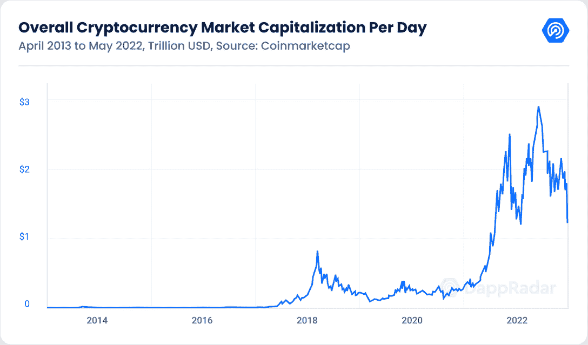
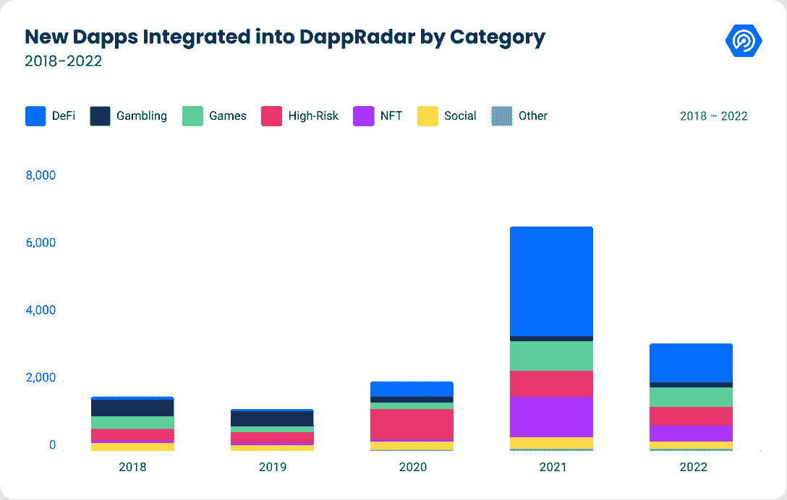
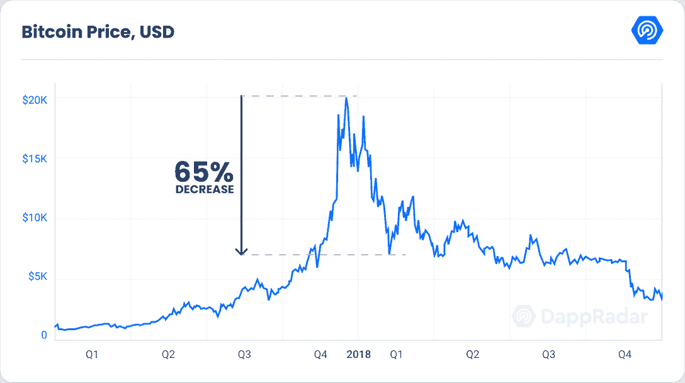
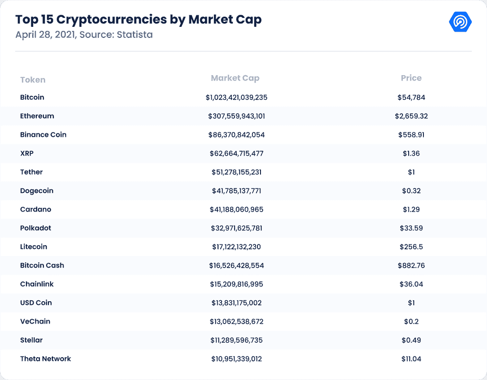
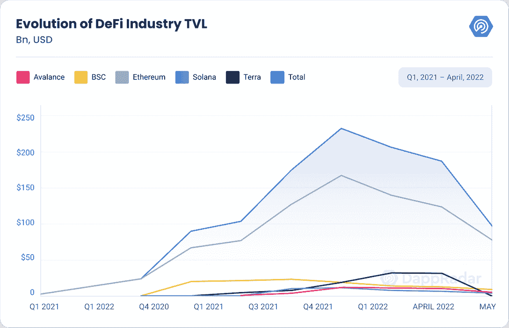
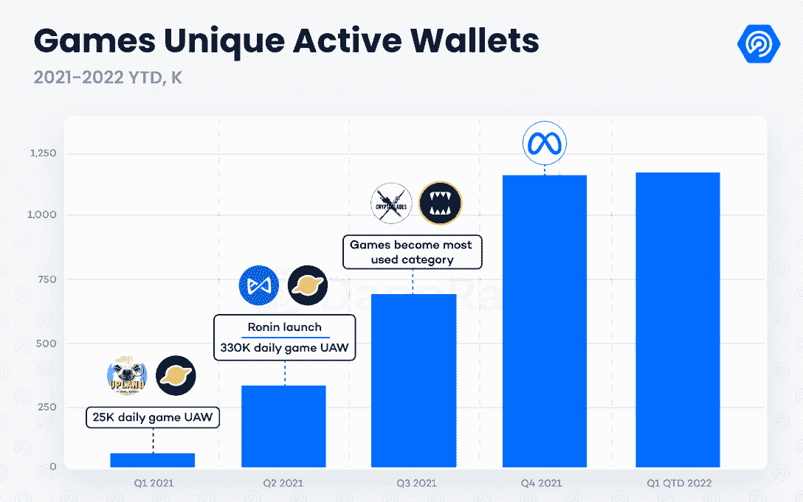
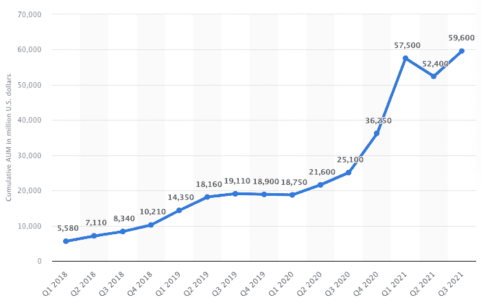
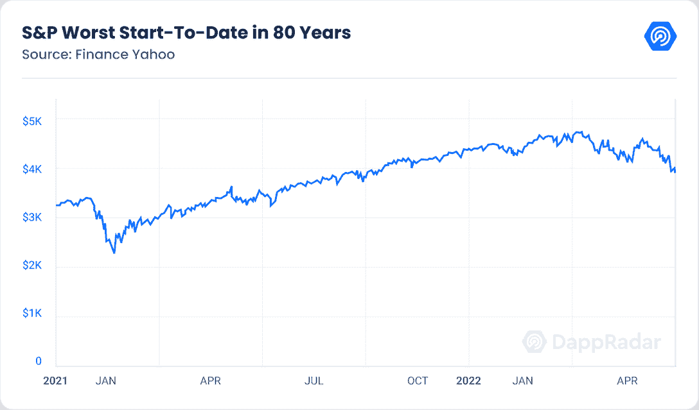
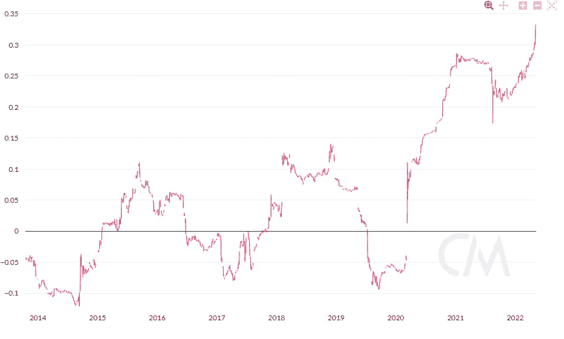

# 将 2022 年的市场崩盘与 2018 年的秘密冬天进行对比

> 原文：<https://web.archive.org/web/https://dappradar.com/blog/contrasting-the-2022-market-crash-to-2018s-crypto-winter>

## 加密冬天是一个漫长的时期，其特征是加密货币价格的持续和普遍下跌，这也阻碍了对该行业的热情。冬天来了吗？

密码行业面临着其年轻历史上最关键的时期之一。

自 2021 年 11 月达到 69000 美元的历史高点以来，比特币已经下跌了 55%。就在几周前，第二大 DeFi 生态系统 Terra 的崩溃带来了现代史上最重大的财富损失。随着市值排名第七和第十的代币在几天内蒸发，零售、机构甚至企业投资者在卢纳和 UST 损失了 600 多亿美元。

让事情变得更复杂的是，加密和股票市场之间的相关性在 2022 年达到了历史最高水平，这是自二战以来资本市场最糟糕的一年。乌克兰战争、[40 年来最高的通货膨胀率](https://web.archive.org/web/20220705011948/https://www.reuters.com/markets/uk-inflation-hits-9-highest-since-modern-records-started-2022-05-18/)以及当前的货币政策只是过去六个月中有利于熊市趋势的几个逆风。

直面另一个隐秘的冬天的不安是显而易见的。然而，自 2018 年以来，该行业经历了加速演变，去年冬天持续了约 18 个月，让数百个在 ICO 时代诞生的项目冻结在我们的记忆中。

这份报告将 2018 年的加密冬天与当前六个月的熊市趋势进行了比较，试图评估加密冬天是否即将到来，以及加密行业在未来几个月可以预期的情况。

## ICO 时代和第一个密码冬天

2017 年，加密领域正在经历其第一个引人注目的扩张阶段，这是由 ICO 热潮推动的，并在当年 12 月的第一次大牛市中达到高潮。许多现有的创业公司和新项目利用了利用加密货币作为融资机制的新概念。

从宏观角度来看，人们对经济持续复苏持乐观态度，2008 年大衰退留下的一些伤疤仍然可见。Epic 的堡垒之夜年收入 85 亿美元，而苹果成为最有价值的品牌。科技股和数码股欣欣向荣。

对加密初创公司的狂热吸引了创纪录数量的资本进入该领域，其中大部分来自未杠杆化的散户投资者。许多公司改变了他们的名字,加入了区块链或者加密这个词，而一些公司甚至决定改变他们的整个运作来迎合这一趋势——这让人想起了网络泡沫。

然而，区块链产业比今天更少被采用，甚至更不受监管。截至 2017 年底，只有 104 个 dapps 在运行，当时加密货币的总市值在牛市的巅峰时期首次超过 8000 亿美元。BCH、MIOTA、DASH 和 XMR 等加密货币与 BTC、ETH、LTC 和 XRP 并列市值前十名。

监管的缺乏和对表现不佳的项目投入的过多资本，很快让这个新兴行业变得不可持续。据估计，在 ICO 时代[构思的 90%的项目在推出后不到 6 个月](https://web.archive.org/web/20220705011948/https://enterpriseriskmag.com/why-90-of-initial-coin-offerings-icos-security-token-offerings-stos-fail-and-much-of-the-rest-may-follow/#:~:text=With%2080%25%20having%20been%20scams,if%20you%20include%20the%20scams).)就失败了。尽管如此，成为当今工业支柱的项目，如分散的土地和金恩，都是由于 ICOs 而诞生的。

多起诈骗和失败的项目给整个行业带来了不确定感。在 BTC 的价格创下历史新高，在 2017 年 12 月达到近 20，000 美元后，一系列事件给该行业带来了足够的压力，使有史以来最大的牛市变成了令人疲惫的加密冬天的开始。

在 BTC 创下历史新高的同时，首批基于比特币的期货在全球最大的衍生品交易所芝加哥商业交易所推出。机构投资者集体做空比特币，对这种数字资产施加了前所未有的抛售压力。

此外，在接下来的几个月里，关于韩国、中国和其他亚洲国家可能禁止加密交易的传言，以及造成 5 . 3 亿美元损失的 Coincheck 黑客攻击，导致日本场外交易停止，诱使空头重返市场。

结果，比特币的价格暴跌至 7700 美元，从 2017 年 12 月达到的 ATH 损失了 65%的价值。过度杠杆化的散户投资者损失的资本数量，以及不稳定市场和即将出台的监管措施的不确定性，导致了一个残酷而漫长的冬天，冻结了大多数仍处于萌芽状态的 ICO 行业。

2018 年的秘密冬天是持续了近 18 个月的低价期。除了持平的数字，这个周期的特点是很少或没有兴趣和参与水平。投资者的兴趣在 2019 年 7 月回归，当时 BTC 的价格超过了 10，000 美元大关，开始了一个恢复期，此后不久，当 COVID 流动性紧缩在 2020 年 3 月冲击市场时，这个恢复期就脱轨了。

2018 年的加密冬天是由行业本身固有的一系列因素促成的。ICO 时代的高失败率带来的不确定性、过度杠杆化的个人投资者形象，以及对即将出台的监管规定的疑虑，为加密冬天创造了完美的景观。四年后历史会重演吗？

## 秘密的冬天:没有冬眠，是时候建造了

在将当前市场形势与 2018 年进行比较之前，有必要了解区块链行业是如何达到当前状态的。之前的秘密冬天成为了迅速发展的 dapp 生态系统的关键时期。我们今天所知道的这个行业的基础就是在这个时期奠定的。

尽管呈下降趋势，但引领区块链空间的项目仍致力于构建和增强其产品。以太坊、EOS 和比特币闪电等网络实现了重要的里程碑，而包括 Axie Infinity、ETHLend(现名为 Aave)甚至 DappRadar 在内的 Web3 项目都是在对该领域缺乏兴趣的时期成功启动的。

经过 18 个月的持续奋斗，密码行业开始显示出好转的迹象。人们对这一领域的兴趣重新燃起，价格开始回升。然而，另一个挫折停止了加密恢复，因为 COVID 影响了几乎每个行业。

2020 年 3 月，全球市场在供应链大规模中断和全球范围内的密集封锁中崩溃。BTC 的价格在一天内暴跌了近 50%,而标准普尔 500 在两周内下跌了 23%。对又一个冬天的恐惧是真实的。

尽管情况复杂，但一些垂直行业利用了我们作为一个社会所经历的加速数字化。亚马逊、网飞、Zoom 和 Peloton 等科技股价格飙升。同样，随着领先项目在两年的建设后展示其增强产品，dapp 行业开始形成。

2020 年的 DeFi summer 见证了大量展示去中心化金融生态系统潜力的项目。Curve、MakerDAO、Uniswap、PancakeSwap 和其他一些 DeFi 玩家为一个数十亿美元的空间铺平了道路，这个空间几乎没有学会种植以食物命名的代币。dapp 行业的叙事已经完全改变了。

与此同时，拜登和鲍威尔的扩张性货币政策[在短短两年内印刷了历史上所有发行的美元](https://web.archive.org/web/20220705011948/https://techstartups.com/2021/12/18/80-us-dollars-existence-printed-january-2020-october-2021/)的 80%。为刺激消费而注入经济的大量资本使得散户和机构投资者将注意力转向了加密市场。

到 2020 年 10 月 10 日，BTC 的价格从 COVID 底部飙升了 120%，自 2018 年初以来首次超过 12000 美元。对区块链工业的兴趣又回来了。采用率、消费者信心和资本投入都有所上升，推动了下一轮牛市的开始。在短短六个月内，BTC 的价格上涨了 134%。

## DeFi、NFTs 和游戏为 2021 年的牛市加油

到 2021 年，加密冬天已经成为遥远的记忆。牛市让 BTC 飙升至 60，000 美元以上，加密货币市值在当年 4 月首次突破 2 万亿美元。BTC 和 ETH 巩固了前两大加密货币的地位，BNB、USDT、DOT、ADA、UNI 和 LINK 展示了行业的新面貌。

此时，dapp 行业开始收获两年前冬天种植的种子。该行业的三个主要类别——DeFi、NFTs 和游戏——在 2021 年的大部分时间里呈指数增长，吸引了数百万新用户和数十亿美元的投资。多链互操作性和即玩即赚等 Web3 范例得到了充分展示。

例如，去年 11 月，DeFi space 的所有协议的智能合同价值超过 2000 亿美元。多链范式帮助 Polygon 和 Avalanche 等区块链公司成为 DeFi 生态系统的宿主，锁定了数十亿美元的价值。

随着该领域去年产生了超过 220 亿美元的交易量，NFTs 也出现了爆炸式增长。与此同时，前 100 名最有价值的以太坊收藏估计有 167 亿美元的市值。像皮普尔、帕克和费沃奇斯这样的 NFT 艺术家将 NFTs 带入了主流舞台。像 CryptoPunks 和 BAYC 这样的收藏成为一种文化现象，具有吸引名人和品牌进入这个空间的力量。随着 NFTs 支持所有权和认证，这个区块链用例的潜力就显现出来了。

与 NFTs 类似，区块链的游戏在 2021 年呈指数级增长。像 Axie Infinity、Upland 和 Alien Worlds 这样的游戏 dapps 用加密货币和 NFT 补偿他们的玩家，创造新的收入流。这类游戏的流行，尤其是在新兴经济体，催生了“边玩边赚”的概念。

随着该行业似乎准备利用其最近的扩张，脸书的更名创造了一个围绕元宇宙叙事的新炒作周期。元宇宙相关的加密货币和 NFT 经历了明显的需求增长，导致了可观的价值评估。在 2021 年第四季度，元宇宙 dapps 从 50，000 多名独特的交易商那里获得了超过 3.3 亿美元的 NFT 销售额。风投和其他投资者在区块链的元宇宙和游戏项目上投入了创纪录的资金。

去年 11 月，区块链行业达到了目前的上限。BTC 达到了 69000 美元，一年内增长了 360%。以太坊和大多数加密市场也在同一个月达到顶峰。Meta 宣布后，加密货币市值超过 2.8 万亿美元。整个行业都充满了乐观情绪。

## 一个复杂的宏观情景引发了当前的熊市

将时钟拨到 2022 年，dapp 行业的形势比四年前好得多。数百个 dapps 吸引了超过 50 个区块链生态系统中超过 250 万个每日活跃钱包。投资者的情况也完全不同。机构和企业投资者现在主导着加密领域。随着加密衍生品越来越受欢迎，管理下的累积加密资产(AUM)接近 600 亿美元。与此同时，风投和私人投资者向区块链的项目投入了超过 300 亿美元，其中三分之一投向了游戏和虚拟世界项目，以帮助他们建立 Web3 元宇宙的基础。

*Cumulative crypto funds assets under management;* **Source:** [Statista](https://web.archive.org/web/20220705011948/https://www.statista.com/statistics/1203383/cumulative-crypto-funds-aum-worldwide/)

从宏观角度来看，情况与 2018 年不同。乌克兰战争加剧的负面影响给全球市场带来了严峻挑战。此外，早些时候对美联储即将加息以遏制通胀上升的怀疑在几周前得到了证实，当时美联储两年来首次加息 0.5%。

此外，令人震惊的印钞风潮的后果已经开始产生影响。标准普尔 500 迎来了二战以来最糟糕的开局，通货膨胀达到了近 50 年来的最高水平。这些宏观经济因素的总和正在将市场引向看似衰退的境地。

宏观经济形势阻碍了由元宇宙炒作周期推动的牛市趋势。尽管 dapp 行业在过去四年中经历了令人印象深刻的演变，但比特币自去年 11 月创下历史新高以来已经损失了 55%的价值。Terra 的情况给即将首次经历宏观经济衰退的加密市场带来了更大的压力。

## 冬天来了吗？

当比较导致 2018 年秘密冬天的一系列因素和我们现在看到的情况时，有明显的差异。首先，区块链产业已经从一小群孤立的网络发展成为一系列相互关联的生态系统，吸引了数百万的日常用户。三个主要类别——DeFi、NFTs 和游戏发展成为价值数十亿美元的垂直市场。

同样，投资者的形象也从主要是散户投资者转变为拥有更大经济实力的大型机构和企业。这个领域的认知度比以往任何时候都高，几乎每一项主要运动都有秘密赞助，全球多个城市都有宣传 Web3 产品的广告牌。比特币已经被作为法定货币，并可能成为委内瑞拉、阿根廷和其他面临恶性通货膨胀的国家的避险工具。

非功能性测试也是如此。这种类型的数字资产正在与股票和密码市场脱钩，被证明是近代史上最有弹性的资产之一。与艺术品相似，艺术品在历史上一直是最抗跌的投资工具之一。

Web3 品牌在元宇宙前沿的崛起表明了该领域的有机增长。像宇迦实验室、沙盒和 RTFKT 这样的 Web3 品牌已经与众多零售巨头合作，包括阿迪达斯、耐克、汇丰、华纳兄弟等。我们正目睹着领导 Web2 项目的人才外流到区块链世界。

尽管区块链产业已经变得举足轻重，但挑战依然存在。Terra 的崩溃让这个区域陷入瘫痪。除了戴和其他一些代币外，包括 Tether 在内的许多稳定货币都在高波动时期努力维持其联系汇率。一般来说，对算法稳定性和空间的信任程度可能会阻止聪明的资金进入被削弱的 DeFi 空间。安全和法规是需要尽快特别关注的其他主题。

除了区块链固有的这些挑战之外，股票和加密市场之间创纪录的高相关性也带来了另一个负担。如前所述，资本市场经历了自 20 世纪 40 年代以来最糟糕的一年开局。像网飞、脸书、Roku、Wix 和 Robinhood 这样的高增长科技股的价格已经大幅下跌，只有一些例外。随着衰退的可能性越来越大，资本市场的短期前景看起来并不乐观。

Historical correlation between BTC and S&P 500; **source:** [Finbold](https://web.archive.org/web/20220705011948/https://finbold.com/bitcoin-correlation-with-the-sp-500-reaches-a-new-all-time-high/#:~:text=Bitcoin's%20correlation%20to%20stock%20markets&text=The%20correlation%20coefficient%20between%20Bitcoin,is%20also%20likely%20the%20case.)

## 冬天来了

因此，在评估当前形势并将其与 2018 年进行对比后，尽管 dapp 行业令人印象深刻的成熟和 Web3 社区的加速扩张，但一个加密的冬天可能正在向我们袭来。

宏观经济形势，加上 Terra 的崩溃，可能会让已经面临元牛市回调阶段的加密市场吃不消。然而，由于采用的水平，对该行业的兴趣应该不会像 2018 年那样下降。

比特币、NFTs 和其他密码应该继续作为具有独特经济属性的新数字资产类别被需求。此外，企业和政府的采用将迫使立法者制定政策来监管数字资产，从而为主流媒体带来头条新闻。

此外，有必要考虑密码市场是由周期组成的。任何行业保持持续增长都是不可持续的。盘整和投降周期有利于在市场中创造金融稳定。在元炒作周期之后，回调是意料之中的。然而，乌克兰战争引发了一场金融危机，此时股票与加密的关联度比以往任何时候都高。

引用埃隆·马斯克的话，“衰退不一定是坏事。我经历过几次。通常会发生的是，如果繁荣持续的时间过长，就会导致资本配置不当。它开始向傻瓜砸钱。”类似的情况也适用于加密的冬天，这段时间应该被视为净化市场的机会。成功的项目会在困难时期继续建设，而空洞的项目会停滞不前。

对于新来者来说，一个隐秘的冬天可能会让人觉得泡沫已经破裂，但事实是它并没有破裂。区块链行业在过去已经经历过加密冬天，但一直很有弹性。尽管该领域即将经历首次衰退，但多个垂直领域表现出的成熟度使加密领域处于抵御长期熊市的有利位置。

现在的主要问题是，春天还要多久才会到来？