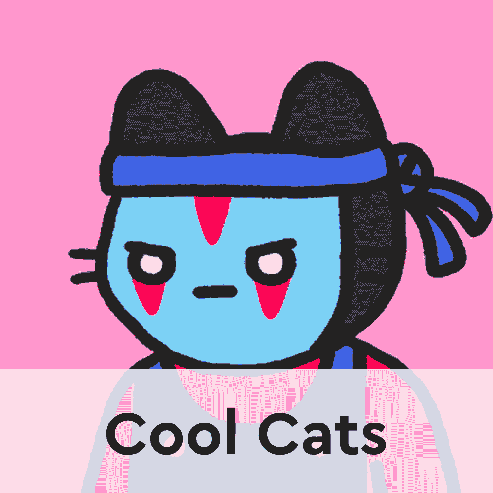
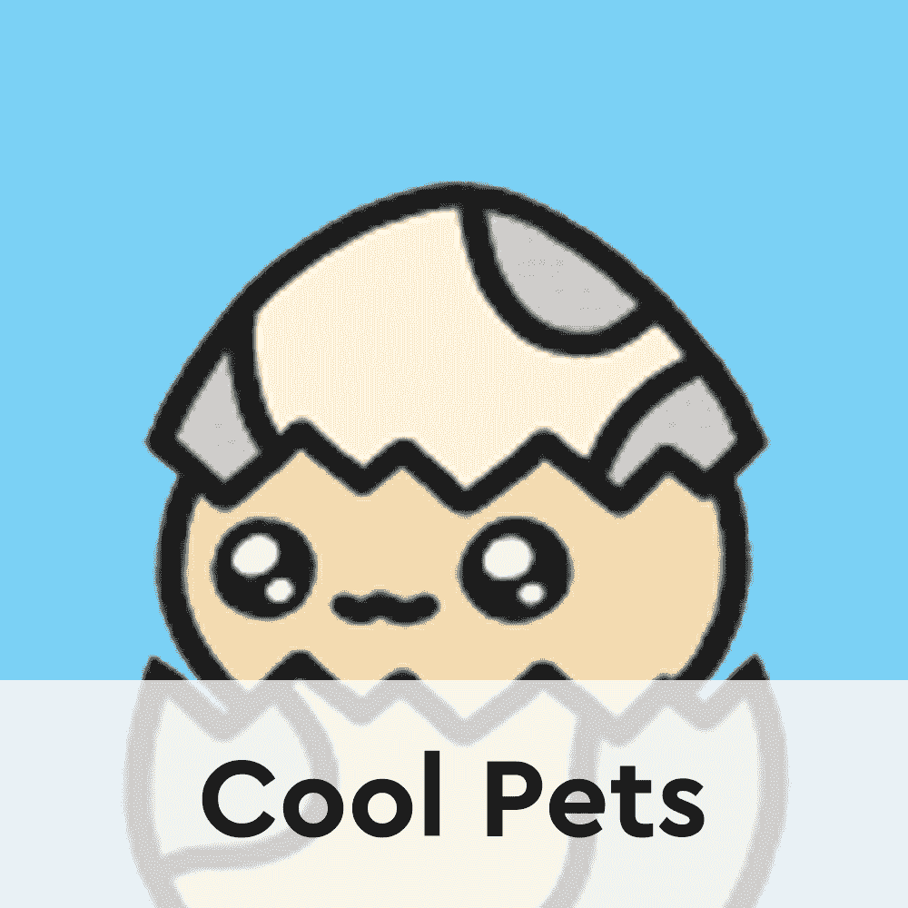

# 酷猫和酷宠物赚取 NFT 业主牛奶代币

> 原文：<https://web.archive.org/web/https://dappradar.com/blog/cool-cats-and-cool-pets-earn-nft-owners-milk-tokens>

## 了解更多关于牛奶及其工作原理的信息

广受欢迎的酷猫和酷宠物系列背后的团队宣布了生态系统的新本土牛奶令牌。牛奶是以太坊和多边形上的 ERC20 代币。 **它将为酷猫和酷宠物持有者带来更进一步的效用，跨越名为 Cooltopia 的产品生态系统。**

重要的是，牛奶令牌是向酷猫项目和酷宠物项目引入游戏化元素的一个步骤。目前，这种游戏化只是以酷酷的宠物任务的形式出现。然而，该团队正计划进一步扩展 Cooltopia 的这一面。

随着牛奶令牌的推出，酷宠物持有者将有机会发展他们的 NFT。此外，酷猫持有者将有机会获得一笔被动收入。请继续阅读，了解每个 NFT 人能赚多少牛奶，以及这个新推出的实用令牌的使用案例。

## 如何赚取牛奶代币？

根据酷猫官方白皮书，酷派粉丝可以通过多种方式获得牛奶代币。比如酷猫 NFT 就是靠酷赚奶的。这意味着，现在该团队部署了原生代币合同，持有者将每天收到空投的牛奶代币。

用户也可以通过在任务中发送他们的酷宠物来获得牛奶。奶量的多少取决于酷宠的进化阶段。更重要的是，元素也发挥着作用，例如，NFT 是否会在特定的任务中获得元素奖励。时尚弄潮儿持有者也可以通过冒险者公会在被动任务中发送最终形态的酷宠物。

如上所述，这些是牛奶的初始分配和盈利机制。酷猫团队还有更多的想法在酝酿中。这些包括进一步的游戏化和游戏赚取要素，为玩家带来牛奶奖励。

重要的是，收集者可以随时要求他们的牛奶收入。为了做到这一点，他们需要将装有酷猫 NFT 的钱包连接到官方网站，然后点击“认领牛奶”按钮。重要的是，索赔过程发生在多边形上。此外，酷猫团队已经选择支付与申领牛奶相关的所有汽油费。

## 你为什么需要牛奶，它会持续吗？

牛奶的声明发布后，围绕 crypto Twitter 出现的一个主要问题是，代币是否能够保持稳定的价格。粉丝和密码爱好者的这种不安全感是由令牌的总供应量和市场上限的缺乏引起的。此外，一些用户提出了牛奶的用例目前非常有限的事实。这可能会给代币带来额外的卖出压力，随着时间的推移，可能会降低其价格。

目前，收藏家获得牛奶代币的主要动机是进化他们的酷宠物。然而，根据这条[推文](https://web.archive.org/web/20230120114143/https://twitter.com/azfnft/status/1493710944664489992)中的计算，在最雄心勃勃的情况下，所有酷宠物 NFT 可以在大约一个月内完全进化。如果发生这种情况，牛奶代币的效用将大幅降低，从而限制了对这种货币的兴趣和需求。

当然，这是一个仅基于牛奶令牌的数学特征的非常悲观的预测。这还没有考虑到在二级市场上对完全进化的酷宠物会有多少兴趣，或者在 T2 加密交易所作为独立货币的牛奶券会有多少兴趣。

DappRadar 将继续监督酷猫和酷宠物项目，因为收藏者很快将有机会体验牛奶的全部效用。如果你想密切关注 Cooltopia，请查看下面的链接。此外，你可以在[推特](https://web.archive.org/web/20230120114143/https://twitter.com/dappradar)上关注 DappRadar，抢先听到 NFT 的最新消息。

[<picture></picture>](https://web.archive.org/web/20230120114143/https://dappradar.com/ethereum/collectibles/cool-cats)[<picture></picture>](https://web.archive.org/web/20230120114143/https://dappradar.com/ethereum/collectibles/cool-pets-nft)[<picture></picture>](https://web.archive.org/web/20230120114143/https://twitter.com/dappradar) NewsletterUnsubscribe at any time. [T&Cs](https://web.archive.org/web/20230120114143/https://dappradar.com/terms) and [Privacy Policy](https://web.archive.org/web/20230120114143/https://dappradar.com/privacy-policy)