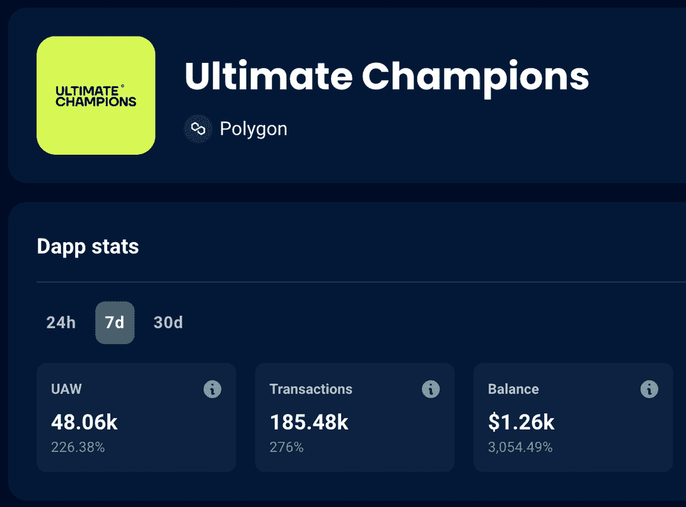
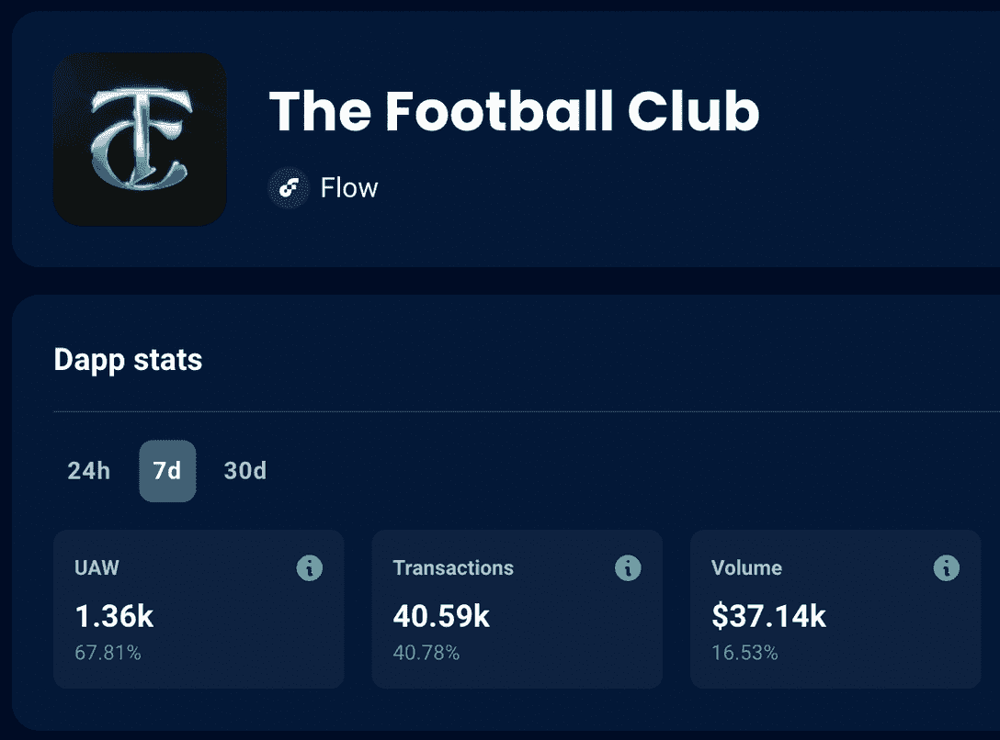
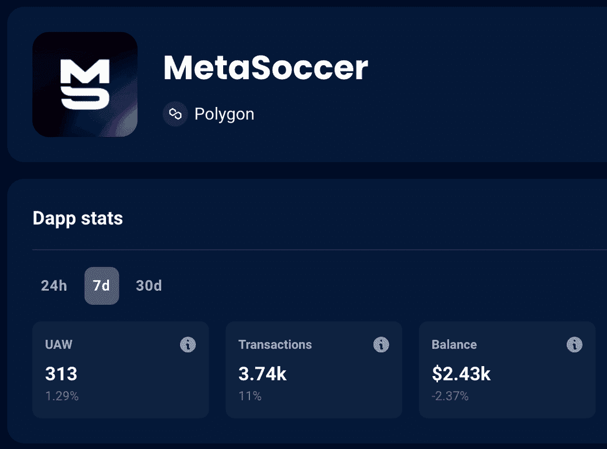

# 国际足联世界杯期间玩的 3 个酷足球游戏

> 原文：<https://web.archive.org/web/https://dappradar.com/blog/cool-soccer-games-to-play>

## 是时候拥有自己的游戏并享受乐趣了

对于全世界的足球爱好者来说，又一个节日季节终于到来了。国际足联世界杯将于本周日开幕，为了让每个人都沉浸在狂欢的气氛中，我们选择了三场精彩的足球比赛，并一直密切关注。请继续阅读，发现让您玩并赚钱的精彩游戏。

**内容**

*   [*顶级新足球玩家现在开始玩*](https://web.archive.org/web/20221202122953/https://dappradar.com/blog/cool-soccer-games-to-play/#Top-new-soccer-gamers-to-start-playing-now)
    *   *[终极冠军](https://web.archive.org/web/20221202122953/https://dappradar.com/blog/cool-soccer-games-to-play/#Ultimate-Champions)*
    *   *足球俱乐部*

*   [*下一代游戏即将登陆足球*](https://web.archive.org/web/20221202122953/https://dappradar.com/blog/cool-soccer-games-to-play/#Next-generation-gaming-is-coming-to-soccer)
*   *[用 DappRadar](https://web.archive.org/web/20221202122953/https://dappradar.com/blog/cool-soccer-games-to-play/#Track-the-best-games-with-DappRadar) 追踪最佳游戏 *

## 顶级新足球游戏玩家现在开始玩

世界杯是提高人们对足球博彩项目认识的最佳时机。一些游戏将下一代技术带入足球世界，你不会想置身事外。

这里有一些现在可以享受的最好的足球管理游戏项目。

### 1.终极冠军

Ultimate Champions 是一款完全免费的梦幻足球游戏，建立在 Polygon 上，过去一周的销量增长了 3，054.49%。在[dappardar 排名](https://web.archive.org/web/20221202122953/https://dappradar.com/rankings/category/games)中也达到了顶级游戏的**第 11 位** n。

[<picture></picture>](https://web.archive.org/web/20221202122953/https://dappradar.com/polygon/games/ultimate-champions)

Via [DappRadar](https://web.archive.org/web/20221202122953/https://dappradar.com/polygon/games/ultimate-champions)

在这个次世代游戏中，你在世界杯期间收集、管理和交易你最喜欢的球员。最棒的是，所有这一切都受到区块链技术的保护，而你拥有的每个球员都是 NFT。

通过真正拥有游戏中的资产，你可以在游戏内外利用你的足球经验。有了终极冠军，你实际上可以用 NFT 和游戏币冠军换取现实世界的金钱。

此外，游戏与大品牌合作，在世界杯期间吸引他们的社区，正如我们的数据所指出的那样，这似乎取得了很好的效果。

[https://web.archive.org/web/20221202122953if_/https://www.youtube.com/embed/mtTPVf4KagQ?feature=oembed](https://web.archive.org/web/20221202122953if_/https://www.youtube.com/embed/mtTPVf4KagQ?feature=oembed)

终极冠军与拥有 210 万用户的梦幻体育游戏 Superbru 合作，创建了终极冠军世界杯预测超级池。UC 用户将与 UC 新用户竞争预测每场 FIFA 世界杯比赛的结果，总赢家将获得 34，000 CHAMP 奖金池和 Odegaard 独特卡。

此外，在所有世界杯活动中，还有 50，000 个冠军代币的奖金池。毫无疑问，这是一个在多边形区块链上开始这个有前途的游戏的有趣时间。

[See More About Ultimate Champions](https://web.archive.org/web/20221202122953/https://dappradar.com/polygon/games/ultimate-champions)

### 2.足球俱乐部

另一个值得观看的有趣比赛是足球俱乐部，也被称为 TFC。这是一个免费的足球幻想游戏，只能在手机上玩，已经慢慢地在最好的领域中占据了强势地位。

[<picture></picture>](https://web.archive.org/web/20221202122953/https://dappradar.com/flow/games/the-football-club)

Via [DappRadar](https://web.archive.org/web/20221202122953/https://dappradar.com/flow/games/the-football-club)

足球俱乐部就像任何幻想足球游戏一样，意味着你每周都要让你的球队排队，根据他们在比赛中的真实表现得分。每周都有新的挑战加入，并赢得奖品、硬币和 XP。当你升级的时候，你可以接触到商店的新成员，你可以在市场上用他们交换现实世界的金钱。

然而，在今年的国际足联世界杯期间，事情变得更加令人兴奋。对于世界杯，你还可以参加世界俱乐部挑战赛，并打赌你认为每场现实生活中的比赛会是什么样的。

> 🤩𝙁𝙍𝙀𝙀 𝙏𝙊 𝙋𝙇𝘼𝙔 [@play_tfc](https://web.archive.org/web/20221202122953/https://twitter.com/play_tfc?ref_src=twsrc%5Etfw) 世界杯幻想中有一个 50，000 美元的奖金池！🎁🏆
> 🎮 𝙋𝙇𝘼𝙔 𝙉𝙊𝙒 🎮
> 
> iOS📲[https://t.co/GeeQikr9he](https://web.archive.org/web/20221202122953/https://t.co/GeeQikr9he)安卓
> 📲[https://t.co/wcZ8DLAtK0](https://web.archive.org/web/20221202122953/https://t.co/wcZ8DLAtK0)
> 🔞|广告[pic.twitter.com/Ois4XcejnH](https://web.archive.org/web/20221202122953/https://t.co/Ois4XcejnH)
> 
> — Fantasy Football Scout (@FFScout) [November 15, 2022](https://web.archive.org/web/20221202122953/https://twitter.com/FFScout/status/1592609632718946304?ref_src=twsrc%5Etfw)

要开始玩，你只需要在你的 iOS 或 Android 移动设备上下载应用程序，创建一个帐户，并加入挑战。

当然，你也可以购买游戏内的物品来提高你的头像，但最棒的是，你在游戏中购买的任何东西都是属于你的，并且可以在你的流量数字钱包中找到。

根据 DappRadar 的数据，过去一周，连接到游戏的唯一活跃钱包数量增加了 **67.81%** 。

该足球俱乐部仍处于发展的初级阶段，但它计划将最好的足球体验带到元宇宙——这是我们将密切关注的事情。

[Check Out The Football Club](https://web.archive.org/web/20221202122953/https://dappradar.com/flow/games/the-football-club)

### 3.MetaSoccer

本届世界杯另一个要开始玩的游戏是 [MetaSoccer](https://web.archive.org/web/20221202122953/https://dappradar.com/polygon/games/metasoccer/) 。新人，这是一个足球元宇宙，你可以创建自己的俱乐部，甚至从游戏中的表现产生现实世界的收入。

[<picture></picture>](https://web.archive.org/web/20221202122953/https://dappradar.com/polygon/games/metasoccer/)

Via [DappRadar](https://web.archive.org/web/20221202122953/https://dappradar.com/polygon/games/metasoccer/)

现在，你可以通过排列你的团队和俱乐部并加入对抗人工智能的友谊赛来开始这个多边形构建的游戏。

像我们列表中的其他游戏一样，MetaSoccer 也允许你以 NFT 的形式拥有游戏中的物品。在这种情况下，这包括所有的游戏项目。此外，MetaSoccer 生态系统还有两个令牌，一个称为 MSU 的治理令牌和一个实用令牌 MSC。

[https://web.archive.org/web/20221202122953if_/https://www.youtube.com/embed/ZPX2IWeMjSg?feature=oembed](https://web.archive.org/web/20221202122953if_/https://www.youtube.com/embed/ZPX2IWeMjSg?feature=oembed)

这是一个很有前途的游戏，仍处于早期阶段，需要你有一个多边形钱包和一些硬币才能开始。创建团队也是要花钱的。MetaSoccer NFT 玩家的费用从 1 美元到 10，000 美元不等，根据他们的网站，你赢的越多，你赚的越多。

尽管如此，这也是那些热爱足球并想了解更多游戏的人最好的游戏之一。

[Start Playing MetaSoccer](https://web.archive.org/web/20221202122953/https://dappradar.com/polygon/games/metasoccer/)

## 下一代游戏正走向足球

罗纳尔迪尼奥、梅西、克里斯蒂亚诺·罗纳尔多和皮克是最近已经涉足 Web3 游戏和数字收藏品项目的一些大腕。

像许多科技行业一样，他们看到游戏和足球的未来给了玩家更多的权力。毕竟，没有一个强大的社区，一个团队什么都不是。

通过拥有游戏中的物品并从游戏表现中获利，游戏达到了一个全新的水平。

## 用 DappRadar 追踪最好的 Web3 游戏

现在你知道一些主要的下一代足球游戏了。我们希望你在世界杯期间玩得开心，享受精彩的比赛。

DappRadar 可以根据准确的数据、市场分析和简单的指南帮助您发现顶级的游戏。

加入我们在 Twitter 上的社区，成为第一个了解 Web3 行业最新动态以及如何保持领先的人。

### 有用的链接

*   [本月 10 款最佳即玩即赚游戏](https://web.archive.org/web/20221202122953/https://dappradar.com/blog/best-play-to-earn-crypto-nft-games)
*   什么是玩即赚游戏，为什么要玩？
*   [体育迷的十大 NFT 收藏](https://web.archive.org/web/20221202122953/https://dappradar.com/blog/top-10-nft-collectibles-for-sports-fans)

***以上不构成投资建议。此处给出的信息仅供参考。请尽职调查并自行研究。***

 NewsletterUnsubscribe at any time. [T&Cs](https://web.archive.org/web/20221202122953/https://dappradar.com/terms) and [Privacy Policy](https://web.archive.org/web/20221202122953/https://dappradar.com/privacy-policy)