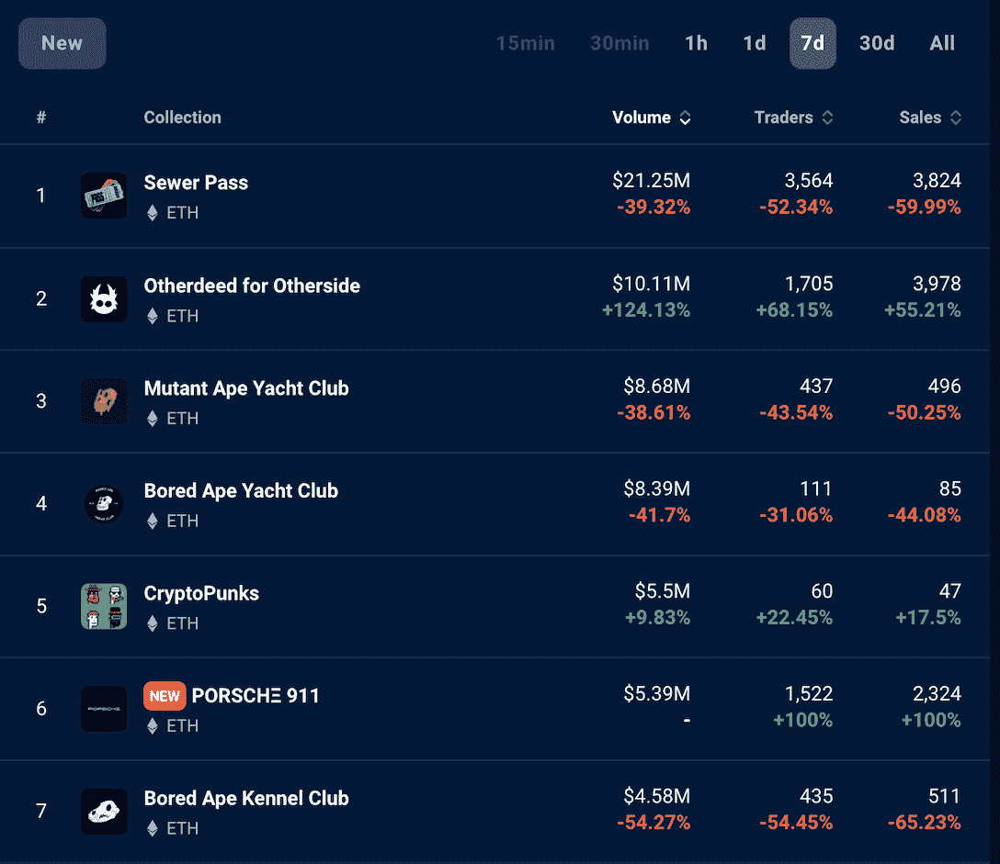
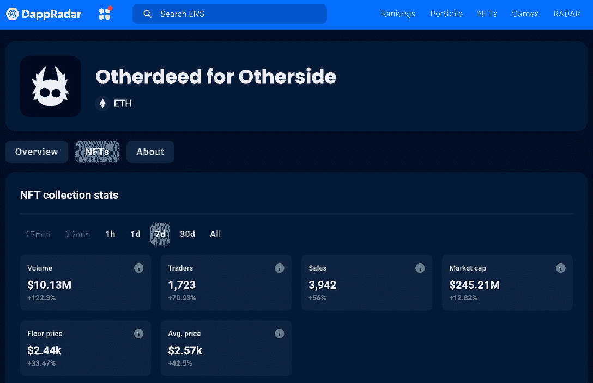
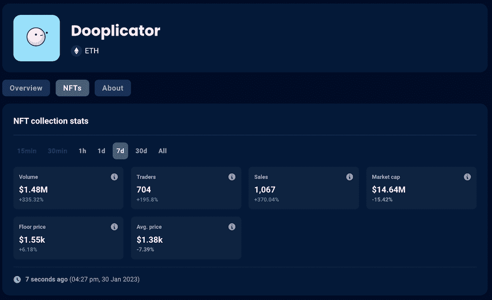
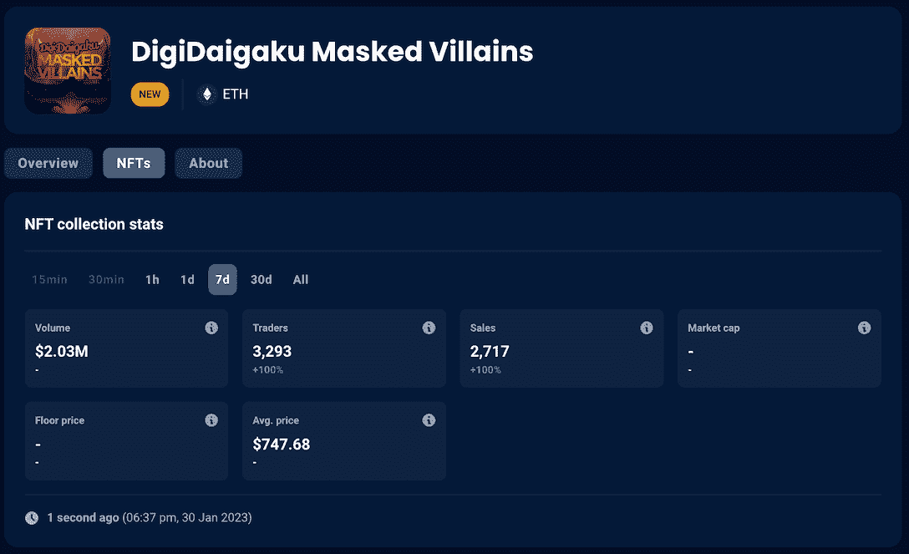
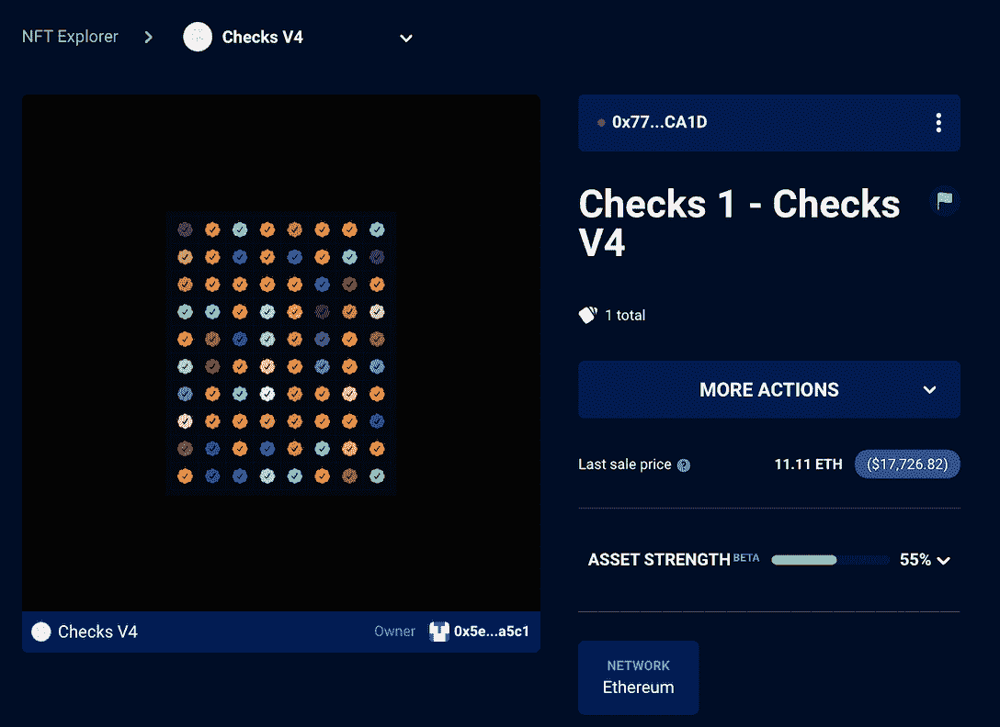
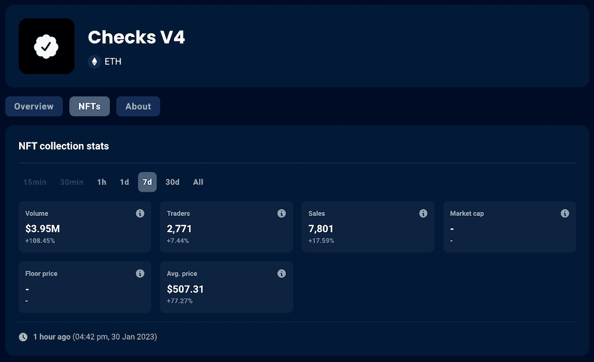

# 另一边会点燃另一个元宇宙炒作周期吗？

> 原文：<https://web.archive.org/web/https://dappradar.com/blog/could-otherside-be-igniting-another-metaverse-hype-cycle>

## Otherdeed 看到了项目指标的整体增长，而宇迦实验室的其他项目记录了交易量的下降。

Otherdeed 土地销售再次飙升，过去一周的交易量超过 1000 万美元。备受期待的元宇宙游戏 Otherside 将于今年 3 月推出第二次旅程，虚拟土地 Otherdeed 的持有者有望获得第一手体验。

元宇宙的崛起激发了用户重新想象他们的数字生活。许多有远见的公司和个人已经采取行动在元宇宙立足。因此，虚拟世界中的土地越来越受欢迎。

目前最火的虚拟世界项目有[沙盒](https://web.archive.org/web/20230130145132/https://dappradar.com/multichain/games/the-sandbox/)和[去中心化](https://web.archive.org/web/20230130145132/https://dappradar.com/multichain/social/decentraland/nfts)。前者已经积累了 2.53 亿美元的交易量，而后者已经产生了 2.1834 亿美元。

然而，对另一边的期待和兴趣最近有所增长。

## Otherdeed 交易量排名第二

对 Dookey Dash 和 Sewer Pass 的大肆宣传将宇迦实验室 NFT 项目的价格和交易量推至极高水平。然而，随着比赛将于 2 月 8 日结束，下水道口，BAYC，MAYC 和 BKYC 惊人的交易数字已经开始下降。

*Data source:* [*DappRadar NFT Rankings*](https://web.archive.org/web/20230130145132/https://dappradar.com/nft/collections)

Dookey Dash 是宇迦实验室推出的游戏化铸造实验，为其生态系统中的 NFT 提供了短暂但强大的推动力。此外，这也是为其元宇宙游戏《彼岸》做准备，该游戏将于今年 3 月开始第二次旅行。Otherside 的第一次旅行为 Otherdeed 的土地所有者提供了一个先睹为快的机会，并且，很可能，新的旅行将只对那些拥有这些虚拟土地的人开放。

可能正是由于这种预期，Otherdeed 的收藏在上周开启了上升趋势。根据 DappRadar 的数据，该系列的交易量增加了 122%，项目楼层增加了 33%，交易量增加了 56%。

[View more stats about Otherdeed](https://web.archive.org/web/20230130145132/https://dappradar.com/ethereum/collectibles/otherdeed-for-otherside/nfts)

市场看好 Otherdeed 的另一个原因可能是 10KTF 与该项目之间的合作关系。10KTF 由著名的密码艺术家 Beeple 共同创立，已经确认将在 Otherside 开设店铺。不过，这并不令人惊讶，因为宇迦实验室在 2022 年 11 月以未披露的金额收购了 10KTF。

> 对于 [@yugalabs](https://web.archive.org/web/20230130145132/https://twitter.com/yugalabs?ref_src=twsrc%5Etfw) 和 [@wenewlabs](https://web.archive.org/web/20230130145132/https://twitter.com/wenewlabs?ref_src=twsrc%5Etfw) 的联手，没有人比 [@beeple](https://web.archive.org/web/20230130145132/https://twitter.com/beeple?ref_src=twsrc%5Etfw) …也许除了 [@GordonGoner](https://web.archive.org/web/20230130145132/https://twitter.com/GordonGoner?ref_src=twsrc%5Etfw) ，他很想参观 [@OthersideMeta](https://web.archive.org/web/20230130145132/https://twitter.com/OthersideMeta?ref_src=twsrc%5Etfw) 世界中的新东京。[pic.twitter.com/1KLDUU11iw](https://web.archive.org/web/20230130145132/https://t.co/1KLDUU11iw)
> 
> — The Fucking Metaverse Podcast (@FvckingMeta) [January 24, 2023](https://web.archive.org/web/20230130145132/https://twitter.com/FvckingMeta/status/1617931910755520515?ref_src=twsrc%5Etfw)

## NFT 空间中值得注意的趋势的快照

### 涂鸦者

Doodles 生态系统在过去一周表现强劲，由 Dooplicator 引领增长。它在 7 天内产生了 148 万美元的交易，增长了 335.32%，累计交易 1067 笔，增长了 195%。

Dooplicator 是一款具有无限效用的 NFT，可以为涂鸦持有者增加价值。Dooplicator 的初始功能允许它利用涂鸦为即将到来的 Doodles 2 创建可穿戴设备。此外，使用 Dooplicator 还可以打开一个测试版通行证，允许访问流量区块链上 Doodles 2 的私有测试版。

[View more Dooplicator stats](https://web.archive.org/web/20230130145132/https://dappradar.com/ethereum/collectibles/dooplicator/nfts)[View more Doodles stats](https://web.archive.org/web/20230130145132/https://dappradar.com/ethereum/collectibles/doodles/nfts)

### 数码时代蒙面反派

在 DigiDaigaku 生态系统中，拥有创世纪 NFT 的玩家可以在后续掉落中免费获得更多 NFT。第一滴是烈酒。通过将他们与他们的创世纪人物结合，持有者可以创造不同的英雄 NFT。

上周，Digidaigaku 开始铸造反派角色 NFTs。同样，《英雄》和《创世纪》NFT 持有者可以使用先前奖励的特殊 NFT 来改变这些反派的属性，使他们成为超级反派。

像所有其他项目 NFT 一样，恶棍可以自由铸造。出于对 Digidaigaku 未来游戏项目的乐观，反派 NFT 的交易活动激增，交易额超过了 200 万美元。

[View more stats about Masked Villains](https://web.archive.org/web/20230130145132/https://dappradar.com/ethereum/collectibles/digidaigaku-masked-villains)

### 检查

去年 11 月，成为 Twitter 新主人的埃隆马斯克(Elon Musk)为该平台的蓝色支票图标推出了 8 美元的月费。此举在社交媒体上引发了激烈的辩论，并激发了艺术家杰克·布彻的最新 NFT 项目“支票”。

杰克·布彻的数字艺术品的最初版本有 80 种不同颜色的验证标记，售价为 8 美元。公开版看到了 16031 薄荷糖。后来，该项目允许玩家按照一定的规则燃烧 NFT 来获得新的。

通过这种机制，Checks 试图验证稀有性和价格之间的关系。最终，用户行为将决定哪些版本的 NFT 在市场上流通，最终在稀缺性和多样性之间找到平衡。

这个极具实验性和时代精神的项目在过去的一周里表现得非常好。它实现了几乎 400 万美元的交易量，平均价格从 8 美元上升到 500 美元。

[View more stats about Checks](https://web.archive.org/web/20230130145132/https://dappradar.com/ethereum/collectibles/checks-v4/nfts)

## 查看 NFT 销售亮点列表

*注意:出售时给出的美元价值是正确的。*

每周，DappRadar 不仅会重点报道 NFT 最昂贵的[销售](https://web.archive.org/web/20230130145132/https://dappradar.com/nft/sales)，还会报道过去七天中最有趣的销售。虽然庞大的数字肯定会占据头条，但突出新兴趋势并让 DappRadar 社区保持领先也是至关重要的。

*   [BAYC # 4281](https://web.archive.org/web/20230130145132/https://dappradar.com/hub/assets/eth/0xbc4ca0eda7647a8ab7c2061c2e118a18a936f13d/4281)-$ 387，350/305 ETH-[车主的钱包](https://web.archive.org/web/20230130145132/https://dappradar.com/hub/wallet/eth/0x7eb413211a9de1cd2fe8b8bb6055636c43f7d206?utm_source=rankings&utm_medium=nft&utm_campaign=nft_sales)
*   [other deed # 61978](https://web.archive.org/web/20230130145132/https://dappradar.com/hub/assets/eth/0x34d85c9cdeb23fa97cb08333b511ac86e1c4e258/61978)-253，240 美元/155 ETH-[业主的钱包](https://web.archive.org/web/20230130145132/https://dappradar.com/hub/wallet/eth/0x7eb413211a9de1cd2fe8b8bb6055636c43f7d206?utm_source=rankings&utm_medium=nft&utm_campaign=nft_sales)
*   [fiden za # 157](https://web.archive.org/web/20230130145132/https://dappradar.com/hub/assets/eth/0xa7d8d9ef8d8ce8992df33d8b8cf4aebabd5bd270/78000157)-199，740 美元/125 ETH-[车主钱包](https://web.archive.org/web/20230130145132/https://dappradar.com/hub/wallet/eth/0x16b79a1b44c21abc9e9815231f4b7f9da836eb89?utm_source=rankings&utm_medium=nft&utm_campaign=nft_sales)
*   [crypto punk # 7167](https://web.archive.org/web/20230130145132/https://dappradar.com/hub/assets/eth/0xb47e3cd837ddf8e4c57f05d70ab865de6e193bbb/7167)-$ 184640/114 ETH-[主人的钱包](https://web.archive.org/web/20230130145132/https://dappradar.com/hub/wallet/eth/0x51eac3daa1c34f5c2874aa62097ac9965a180b6d?utm_source=rankings&utm_medium=nft&utm_campaign=nft_sales)
*   [Autoglyph # 352](https://web.archive.org/web/20230130145132/https://dappradar.com/hub/assets/eth/0xd4e4078ca3495de5b1d4db434bebc5a986197782/352)-$ 169，160/104.69 ETH-[车主的钱包](https://web.archive.org/web/20230130145132/https://dappradar.com/hub/wallet/eth/0xc9ff792d842ce164478d810437834725e4aa330e?utm_source=rankings&utm_medium=nft&utm_campaign=nft_sales)
*   [DG Estate 2](https://web.archive.org/web/20230130145132/https://dappradar.com/hub/assets/eth/0x959e104e1a4db6317fa58f8295f586e1a978c297/5397)—$ 165390/250000 法力—[主人的钱包](https://web.archive.org/web/20230130145132/https://dappradar.com/hub/wallet/eth/0xf519172dc3cc531786db0db7292a51a1bcfa7d82?utm_source=rankings&utm_medium=nft&utm_campaign=nft_sales)

[Check out all the NFT market trends](https://web.archive.org/web/20230130145132/https://dappradar.com/nft/sales)

## 随身携带您的 Web3 之旅

使用 DappRadar 移动应用程序，再也不会错过 Web3。查看最受欢迎的 dapps 的性能，并关注您投资组合中的 NFT。您在 DappRadar 上的帐户会与我们的移动应用程序同步，这样您很快就可以选择实时接收提醒。

[Download the DappRadar app now](https://web.archive.org/web/20230130145132/https://dappradar.app.link/blog)[<picture></picture>](https://web.archive.org/web/20230130145132/https://play.google.com/store/apps/details?id=com.portfolio.dappradar)