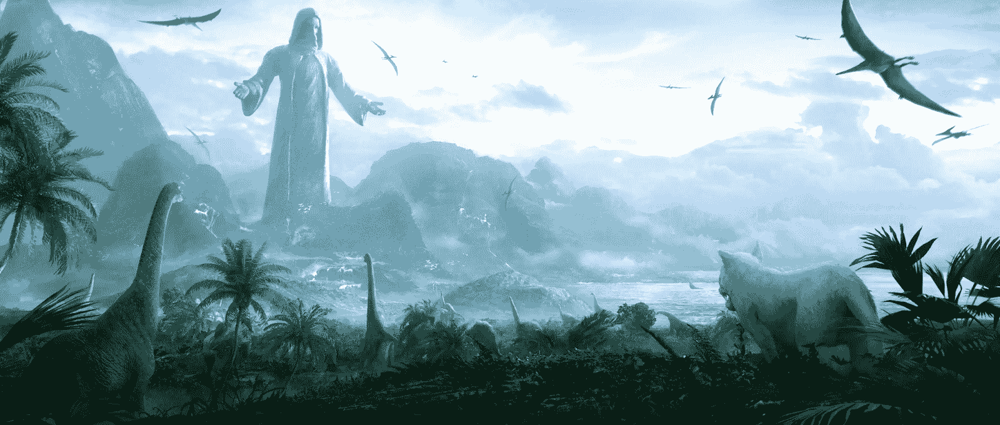

# 摇篮和下一代会消亡的非功能性食物

> 原文：<https://web.archive.org/web/https://dappradar.com/blog/cradles-and-next-generation-nfts-that-can-perish>

## 了解有关 ERC-3664 的更多信息，这是一种创新的非功能性测试方法

即将到来的游戏《摇篮世界》将引入下一代会随着时间流逝而消亡的非功能性玩具。区块链和 NFTs 的世界以其无止境的创新而闻名。然而，一些新的发展和补充更令人兴奋。这就是基于区块链的新游戏《摇篮:物种起源》和它的时间敏感的 NFTs 的情况。

相对不知名的游戏公司 DRepublic 正在开发 [**摇篮:物种起源**](https://web.archive.org/web/20221208071122/https://www.cradles.io/) ，这是一款利用区块链技术创造独特游戏机制的游戏。他们还利用人工智能(AI)的力量和游戏引擎的进步来提供新鲜的游戏。

游戏以所有生命起源的故事为素材，将其划分为几个独特的世界。身临其境的游戏可以让玩家遇到曾经在地球上漫游的生物，亲身体验曾经环绕它们的大自然。

在去中心化的治理模式下，游戏汇集了世界各地的支持者参与其构建。更准确地说，来自世界各地的游戏玩家是在“体验、治理、维护整个世界的生态”。

## 下一代 NFTs: ERC-3664

当他们探索游戏时，玩家可以获得平台的本地令牌 CRDS(摇篮硬币)，并使用它们来创建自己的 NFT。他们可以交易 NFT，把它们卖给其他玩家，或者下注以获得额外的利润。这些令牌基于新的 **ERC-3664** 标准，该标准由开发人员引入，旨在解决以前的标准遇到的一些问题。

他们发现 ERC-1155 标准不能支持游戏道具的所有操作，比如添加属性、升级等等。道具的属性和功能过于丰富，使得玩家几乎不可能在智能合约上查询所有的 NFT 属性。

因此，下一代 NFT 标准应运而生。ERC-3664 完全兼容并扩展了 ERC-1155 标准。ERC-3664 利用 ERC-20 的变体作为游戏属性的一部分，通过它创建的任何合同都可以有多个属性令牌。

下一代 NFT 标准使用四种不同的属性类别:

1.  **普通多变属性:**像 NFT 攻击力和生命值。
2.  **可转移属性:**在毁灭或者其他情况下可以转移到其他 NFT。
3.  **可升级属性:**玩家支付费用来提升 NFT 等级及其其他值。
4.  **可进化属性:**模拟现实世界中的时间属性，赋予 NFTs 时变特征。

虽然这些可变属性无疑是 NFT 空间的一场革命，但关于摇篮 NFTs 还有一个更令人兴奋的细节——时间。

## 时间管理

摇篮使用区块链生成速度来模拟稳定的时间流逝。这是它在实践中的样子。

每个世界的时间流逝速度不同。玩家需要使用平台币、摇篮币(CRDS)购买时间水晶，以及其他 NFT 形式的道具。购买的时间晶体的能量随着时间慢慢消散。这种情况发生的速度也因世界而异，好处也是如此。

摇篮中的世界也是熵增的——这在游戏世界中是一个先例，在那里一切都是静止的，不受时间流逝的影响。在摇篮中，角色会衰老和死亡，物品会腐烂——这一切都符合现实世界的物理学。

确保整个世界的生态系统自然运行取决于玩家，否则它将陷入混乱。一旦混乱程度达到临界点，游戏会强制关闭一段时间，在混乱冷却后重新开放。在此期间，所有玩家都无法获得世界福利和赌注硬币。因此，保持生态系统的自然运行符合所有参与者的利益。

## 创新从未停止

由摇篮开创，创造一个符合现实世界物理原理的元宇宙游戏是一个全新的和开创性的概念。因此，它为玩家和开发者以及整个区块链游戏空间带来了很多机会。

摇篮的建筑师目前正在努力工作，使这一异常创新的想法成为现实。我们迫不及待地想体验最终产品。要了解游戏和 NFT 空间的最新消息，请在 Twitter 上关注 DappRadar。或者，加入我们充满活力的 [Discord](https://web.archive.org/web/20221208071122/https://discord.gg/4ybbssrHkm) 社区。

 NewsletterUnsubscribe at any time. [T&Cs](https://web.archive.org/web/20221208071122/https://dappradar.com/terms) and [Privacy Policy](https://web.archive.org/web/20221208071122/https://dappradar.com/privacy-policy)