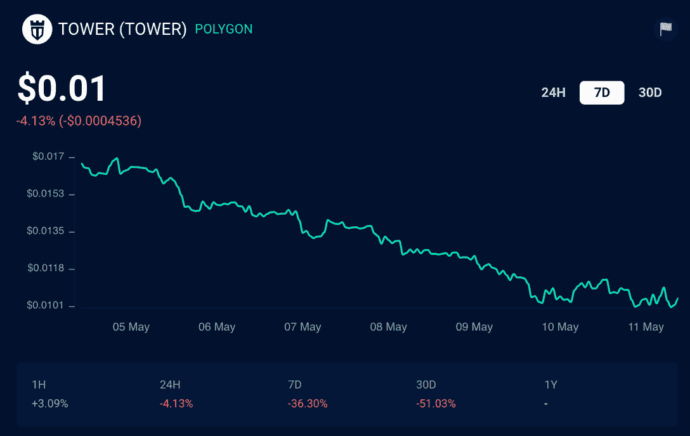

# 疯狂防御英雄现在需要 KYC 来领取塔奖励

> 原文：<https://web.archive.org/web/https://dappradar.com/blog/crazy-defense-heroes-now-requires-kyc-for-tower-reward-claiming>

## Animoca Brands 还宣布了 5 月和 6 月的 180 万塔奖励池

最受欢迎的移动游戏之一《疯狂防御英雄》现在推出了塔牌奖励提款的 KYC 验证要求。这对该领域的许多玩家来说可能是一个打击。 **KYC 的手续通常会使申领过程复杂化，当然也暴露了球员的真实身份。**

## 摘要

*   新的[疯狂防御英雄](https://web.archive.org/web/20221128044910/https://dappradar.com/polygon/games/crazy-defense-heroes) KYC 将要求想要声称分享大量个人数据的玩家分享他们的姓名、地址和护照细节
*   重要的是，在 [KYC 过程](https://web.archive.org/web/20221128044910/https://dappradar.com/blog/crazy-defense-heroes-now-requires-kyc-for-tower-reward-claiming/#selfie)中提供的钱包将是唯一一个能够为批准的帐户申领塔奖励的钱包
*   Animoca Brands 还宣布，在 5 月和 6 月期间，玩家将能够从 1，800，000 [TOWER](https://web.archive.org/web/20221128044910/https://dappradar.com/hub/token/polygon/from=0x2bc07124d8dac638e290f401046ad584546bc47b) 奖励池中获益
*   根据 DappRadar 排名，疯狂防御英雄目前每月吸引大约 60，000 个不同的钱包

## 疯狂防御英雄带来了 KYC

虽然疯狂防御英雄队没有在那里吹嘘 KYC 的要求，但它是存在的。想要领取[塔](https://web.archive.org/web/20221128044910/https://dappradar.com/hub/token/polygon/from=0x2bc07124d8dac638e290f401046ad584546bc47b)奖励代币的玩家需要首先通过 KYC 程序并获得验证。

加密空间与 KYC 进程有着爱恨交加的关系。一些人认为这是让空间对每个人都更安全的方法。然而，其他人认为 KYC 正在贬低区块链技术和加密货币的基本原则。

[疯狂防御英雄](https://web.archive.org/web/20221128044910/https://dappradar.com/polygon/games/crazy-defense-heroes)与 Blockpass 合作开展了解客户(KYC)验证流程。希望获得高塔奖励的玩家需要访问[页面](https://web.archive.org/web/20221128044910/https://verify-with.blockpass.org/?clientId=crazy_defense_heroes_and_tower_ecosystem_e4262)，首先获得他们的 KYC 验证。

验证过程相当严格，需要玩家提供大量个人信息。这包括他们的护照或驾驶执照的复印件，他们的地址，地址证明文件，和一张自拍照。在加密领域，这可能听起来有点夸张。尽管如此，Animoca Brands 和疯狂防御英雄已经决定走这条路。

KYC 验证是疯狂防御英雄玩家完全革新的声明页面的一部分。重要的是，申请页面仍然没有显示四月份的奖励积分，但是，这些积分应该很快就可以申请了。

## 验证以分享 1，800，000 塔奖励池

虽然 KYC 进程可能会对游戏生态系统产生一些负面影响，但疯狂防御英雄仍将继续存在。Animoca Brands 宣布 5 月和 6 月的奖励池将分别为 1，800，000 塔。

在撰写本文时，[塔](https://web.archive.org/web/20221128044910/https://dappradar.com/hub/token/polygon/from=0x2bc07124d8dac638e290f401046ad584546bc47b)的价值为 0.01 美元。尽管估值稳步下降，但接下来两个月的奖金池目前为每人 18，000 美元。此外，高楼总有反弹和升值的可能。

Animoca Brands 推广疯狂防御英雄的原生令牌的方式之一是融入其他游戏赚取平台。例如，最近 [Arc8](https://web.archive.org/web/20221128044910/https://dappradar.com/polygon/games/arc8-by-gamee-1) 玩家有机会参加比赛并获得[塔](https://web.archive.org/web/20221128044910/https://dappradar.com/hub/token/polygon/from=0x2bc07124d8dac638e290f401046ad584546bc47b)，而不是该平台的本地令牌 [GMEE](https://web.archive.org/web/20221128044910/https://dappradar.com/hub/token/polygon/GMEE?from=0xcf32822ff397ef82425153a9dcb726e5ff61dca7&selectedWallet=portfolio) 。

## 疯狂防御英雄的表演

看看新的 KYC 验证过程是否会对积极参与游戏的玩家数量产生影响将会很有趣。在撰写本文时，疯狂防御英雄仍然是多边形区块链上表现最好的游戏之一，在 24 小时活动中排名第三。

然而，与游戏互动的独立活跃钱包数量的下降已经显而易见。仅在过去 24 小时内，该游戏吸引的钱包就减少了 4.5%。7 天的数据也显示出了一个负面的趋势，因为疯狂防御英雄的活跃钱包减少了 50%以上。令牌价格的下降和加密市场的悲观前景也在其中发挥了作用。

随着 KYC 验证的消息传到更多的玩家手中，达普拉达将继续关注疯狂防御英雄。如果想紧盯游戏，可以查看官方[狂防英雄单 Dapp 页面](https://web.archive.org/web/20221128044910/https://dappradar.com/polygon/games/crazy-defense-heroes)。此外，你可以在 Twitter 上关注 DappRadar，抢先获得最新的区块链博彩新闻。

 NewsletterUnsubscribe at any time. [T&Cs](https://web.archive.org/web/20221128044910/https://dappradar.com/terms) and [Privacy Policy](https://web.archive.org/web/20221128044910/https://dappradar.com/privacy-policy)