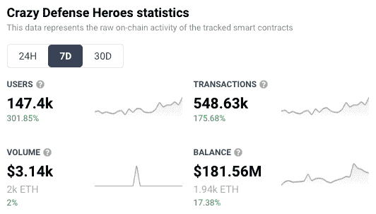
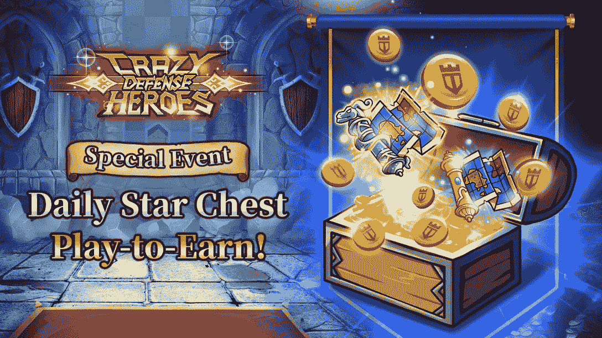

# 疯狂防御英雄看到链上活动疯狂上升

> 原文：<https://web.archive.org/web/https://dappradar.com/blog/crazy-defense-heroes-sees-crazy-rise-in-on-chain-activity>

## 每日明星宝箱为游戏赚取平台施展魔法

**[【疯狂防御英雄】](https://web.archive.org/web/20221219122259/https://dappradar.com/ethereum/games/crazy-defense-heroes)的链上活动每周都有大幅增长，独特的活跃钱包与平台的连接增加了 300%以上，超过 147，000 个。在此之前，游戏制造商承诺将提供更多奖励，并宣布了另一项每日明星基金活动。**

大多数从小玩电脑游戏长大的人都会花很多时间享受塔防游戏。恼人的上瘾和经常引起头痛，总是有更多的水平需要征服，或者更适合的防守者更有效地定位。

《疯狂防御英雄》于 2021 年初问世，并从那时起稳步获得了一批忠实的追随者。但在过去一周，该平台的链上分析显示，各种指标都有大幅增长。

以下是该游戏平台令人印象深刻的数字:

*   用户增长 301.85%
*   交易量增长 175.68%
*   余额增长 17.38%

这都是过去 7 天的事了。这些巨大的百分比增长代表了真正的收益，因为上周的数字已经很大了。下表显示了这些增长是多么令人印象深刻。

DappRadar 7-day Crazy Defense Heroes analytics

## 通过每日明星宝箱获得奖励

Animoca Brands 在 2 月 28 日宣布，已经在进行的每日明星胸部活动将持续到 3 月。该活动让玩家有机会赢得以塔牌支付的奖励，塔牌是 Animoca Brands 组合中各种塔防游戏的原生货币。不过，玩家现在也可以获得塔图 NFT，有各种稀有的:**普通**，**稀有**，**史诗**和**传奇**。更高等级的地图给用户更多更好的奖励。所有的塔图 NFT 都可以在 OpenSea 上交易。

NFTs 可用于解锁不同级别的专属游戏地图，每个地图都开辟了新的领域。NFT 的主人还可以使用各种装有各种奖励和资产的箱子。

[Daily Star Chest event to continue into March](https://web.archive.org/web/20221219122259/https://medium.com/tower-token/crazy-defense-heroes-daily-star-chest-play-to-earn-event-adds-new-tower-map-nfts-in-march-2022-9189e2dc0c7c)

玩家需要通过很多关卡才能获得奖励。所以，在你决定购买之前，请确保你熟悉这些条款和条件。

有关区块链游戏和分散应用世界的更多新闻，请继续关注 [DappRadar](https://web.archive.org/web/20221219122259/https://dappradar.com/blog/) 并在 [Twitter](https://web.archive.org/web/20221219122259/https://twitter.com/DappRadar) 上关注我们。你也可以参加我们每周四下午 4 点的[不和谐](https://web.archive.org/web/20221219122259/https://discord.com/invite/QMnwjGzrkG)节目。