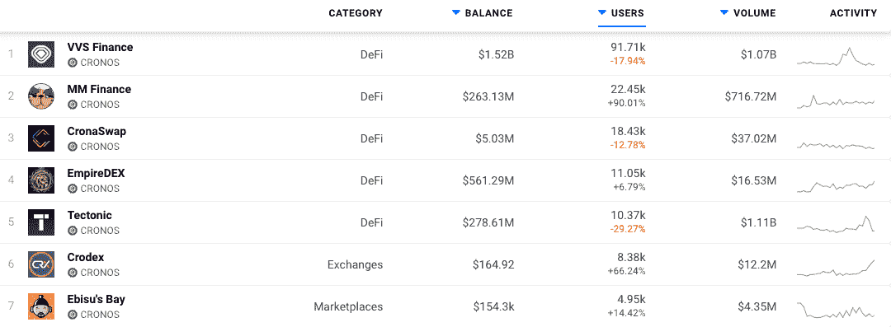
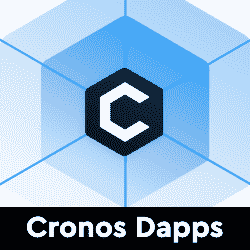
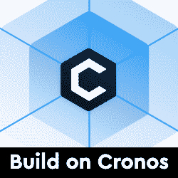

# 克罗诺斯链 Dapps 现在在 DappRadar 上

> 原文：<https://web.archive.org/web/https://dappradar.com/blog/cronos-chain-dapps-now-on-dappradar>

## 由主要交易所 Crypto.com 支持的区块链

DappRadar 现在向用户提供 Cronos 区块链 **上的** [**dapps，这是由广受欢迎的 Crypto.com 交易所支持的 EVM 兼容网络。用户现在可以通过 Cronos 排名分析哪些 dapp 吸引了最多的量、最独特的用户钱包，或者处理了最多的交易，从而深入了解哪些 dapp 和令牌构建了稳固的社区和价值。**](https://web.archive.org/web/20221209062603/https://dappradar.com/rankings/protocol/cronos)

Cronos 是基于 Cosmos SDK 构建的 EVM 兼容链。它与以太坊和宇宙生态系统互操作，支持分散式金融、NFT 和元宇宙应用。这个新推出的区块链旨在通过为开发者提供从以太坊和其他 EVM 兼容链快速移植 dapps 的能力来大规模扩展 Web3 生态系统。Cronos 的价值主张还包括低交易费用、快速终结和小的环境足迹。

Cronos 拥有强大的基础，有来自粒子 B 的 1 亿美元 EVM 基金的支持和资助。此外，它还拥有来自 Crypto.com 和 Crypto.org 生态系统的一千多万用户。

Cronos 是最近几个月增长最快的第一层生态系统之一。自 2021 年 11 月推出 Cronos Mainnet 测试版以来，该生态系统已经产生了越来越多的建筑商和用户需求，在推出一个月后，它已经成为总价值锁定(TVL)的前十大公共区块链之一。目前，超过 100 个 dapps 部署并运行在 Cronos mainnet beta 上，[拥有超过 20 亿美元的 TVL](https://web.archive.org/web/20221209062603/https://defillama.com/chain/Cronos) 。

## 克罗诺斯·达普斯

最初，DappRadar 将跟踪 Cronos 上 [40 个 dapps 的活动。接下来的几周和几个月还会有更多。开发者可以独立提交他们的 dapps，并通过](https://web.archive.org/web/20221209062603/https://dappradar.com/rankings/protocol/cronos/1)[开发者仪表板](https://web.archive.org/web/20221209062603/https://dappradar.com/dashboard/submit-dapp)获得对数千名参与用户的可见性。40 个 dapp[中的 37 个位于 DeFi](https://web.archive.org/web/20221209062603/https://dappradar.com/rankings/protocol/cronos/category/defi) 和 Exchange 类别，进一步展示了 Cronos 的能力，同时还有[三个 NFT 市场](https://web.archive.org/web/20221209062603/https://dappradar.com/rankings/protocol/cronos/category/marketplaces)可供检查。

[Explore Cronos Dapps on DappRadar](https://web.archive.org/web/20221209062603/https://dappradar.com/rankings/protocol/cronos/1)

## Dapp 开发人员

Dapp 构建者可以依靠 Cronos 提供快速、低成本、可伸缩且易于部署的第 1 层区块链来构建 Web3 应用。此外还有生态系统资助计划，旨在为生态系统中的建设者提供技术、资金、营销和合作支持。

EVM 支持允许标准的 solidity 智能合约和 Web3 工具，使得从其他链简单移植 dapp 成为可能。Cronos 通过区块链间通信协议(IBC)以无缝和无信任的方式与 Cosmos Hub 和 Terra 等流行的 Cosmos 链互操作。

[<picture></picture>](https://web.archive.org/web/20221209062603/https://dappradar.com/blog/tag/cronos)[<picture></picture>](https://web.archive.org/web/20221209062603/https://cronos.crypto.org/) NewsletterUnsubscribe at any time. [T&Cs](https://web.archive.org/web/20221209062603/https://dappradar.com/terms) and [Privacy Policy](https://web.archive.org/web/20221209062603/https://dappradar.com/privacy-policy)