# 区块链行为报告——加密采用率上升:Reddit 指明方向

> 原文：<https://web.archive.org/web/https://dappradar.com/blog/crypto-adoption-on-the-rise-reddit-showing-the-way>

## 该报告分析了影响区块链行业 2022 年第三季度的最重要的行为趋势。

尽管宏观经济前景不确定，Web3 开发者仍在继续建设。在所有已公布和确认的智能合同中，近 36%是在今年执行的。

即使在严酷的熊市中，dapp 行业的炒作仍然存在。根据 Visa 的数据，94%对家庭资金有判断力的成年人现在都知道加密货币。正如 Reddit 向我们展示的那样，加密货币正在从有限投资者网络的专业资产类别转变为主流投资者和新采纳者更容易进入的市场。

Reddit NFTs 集合的大规模亮相之所以如此与众不同，是因为它采用了一种策略来掩盖这 4 万项资产实际上是多边形 NFTs 的事实。该系列的[公告](https://web.archive.org/web/20221128122636/https://www.redditinc.com/blog/blockchain-backed-collectible-avatars-coming-to-reddit-via-new-storefront)中不可避免地提到了加密货币和区块链，但只是在不需要购买的情况下(因为只有菲亚特可以使用)。

此外，NFT 这个词从未被提及，当谈到可能是最困难的 Web3 方面，即加密钱包时，Reddit 通过用“Vault”代替它来避免这个可能令人不快的术语。Reddit 让新用户轻松进入 NFTs 的世界，这可以被视为今年 Web3 最大的事件之一。

DappRadar 的区块链行为报告描述了上一季度影响区块链用户的最相关的行为趋势。

## 关键要点

*   52%的传统游戏玩家不熟悉术语区块链游戏，而只有 15%的 Web3 用户有兴趣在未来玩它。
*   与今年第一季度相比，智能合约的部署量攀升了 40%，第三季度的每个月都创下了历史新高；在区块链公布和确认的所有智能合约中，几乎有 36%是在 2022 年执行的；
*   卡尔达诺的采用率持续上升；在过去的 30 天里，其 NFT 交易量达到 1900 万美元，成为第三大 NFT 协议。此外，10 月 19 日，网络交易量达到 82，880 笔，为 5 月以来的最高水平。
*   自 7 月份以来，Reddit 用户已经在 Polygon 网络上创建了 300 万个加密钱包，在活跃钱包数量方面超过了 OpenSea。四个独特的 Reddit 收藏头像系列在过去七天的七天交易量中占据了 OpenSea 前十名的位置。
*   乌克兰、印度尼西亚和俄罗斯是采用加密技术增长最快的国家。自 7 月以来，他们的收养率分别增加了 143.17%、115.59%和 88.28%。

## 内容

*   Reddit 是如何成为 Web3 NFT 顶级竞争者的？
*   [Web3 游戏仍远未成为主流](https://web.archive.org/web/20221128122636/https://dappradar.com/blog/crypto-adoption-on-the-rise-reddit-showing-the-way/#Web3-games-still-far-from-reaching-mainstream)
*   [区块链开发者活动在 2022 年达到峰值](https://web.archive.org/web/20221128122636/https://dappradar.com/blog/crypto-adoption-on-the-rise-reddit-showing-the-way/#Blockchain-developer-activity-peaks-in-2022)
*   [在 Web 2.0 行业中，Web3 的采用率正在上升](https://web.archive.org/web/20221128122636/https://dappradar.com/blog/crypto-adoption-on-the-rise-reddit-showing-the-way/#Web3-adoption-is-rising-within-the-Web-2.0-industry)
*   [在 Vasil 升级期间，Cardano 交易激增](https://web.archive.org/web/20221128122636/https://dappradar.com/blog/crypto-adoption-on-the-rise-reddit-showing-the-way/#Cardano-transactions-spike-amid-the-Vasil-upgrade)
*   [DappRadar 人口统计透视](https://web.archive.org/web/20221128122636/https://dappradar.com/blog/crypto-adoption-on-the-rise-reddit-showing-the-way/#DappRadar-demographics-perspective)
*   [加密规则的增加](https://web.archive.org/web/20221128122636/https://dappradar.com/blog/crypto-adoption-on-the-rise-reddit-showing-the-way/#Increase-in-crypto-regulation)
*   [结论](https://web.archive.org/web/20221128122636/https://dappradar.com/blog/crypto-adoption-on-the-rise-reddit-showing-the-way/#Conclusion)

## Reddit 是如何成为 Web3 NFT 顶级竞争者的？

Reddit 宣布在 2022 年 7 月 7 日推出一个新项目，可收藏的头像。这些限量版 PFPs 由独立艺术家与该公司(除了著名的 Reddit 社区创作者之外)合作设计，将为其所有者提供专属的平台津贴。

这是 Reddit 首次大规模进入 NFT 领域，得到了 Polygon 区块链的支持，并在菲亚特以设定的价格提供购买。

在该业务推出其 NFT 计划三个月后，四个不同的 Reddit 收藏头像系列在 DappRadar 的 7 天交易量前 10 名中占据一席之地。此外，最近有消息称，自 7 月份以来，Reddit 用户已经在 Polygon 网络上创建了 300 万个 Vault crypto 钱包，在其平台上的活跃钱包数量方面超过了 OpenSea。

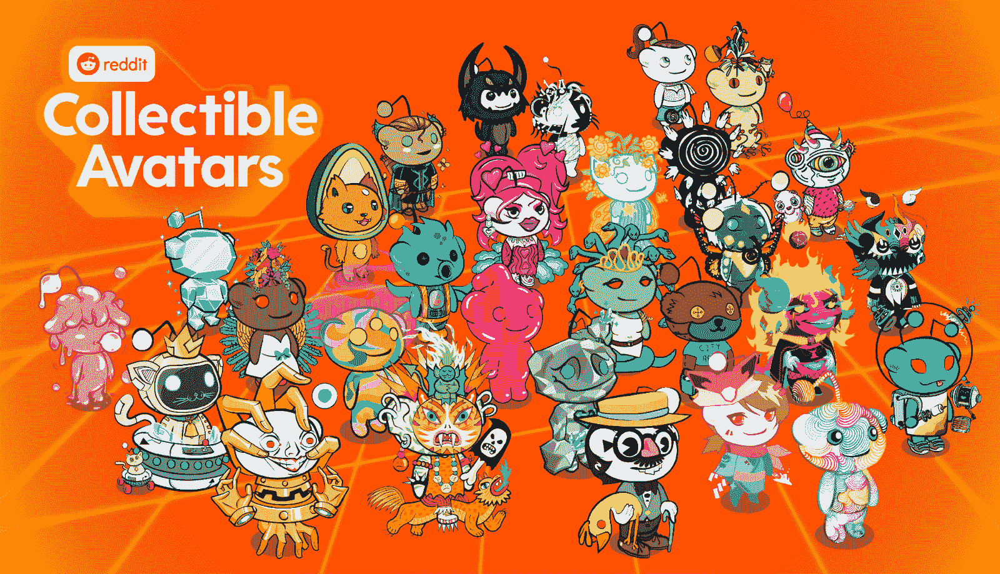

来源: [NFTgators](https://web.archive.org/web/20221128122636/https://www.nftgators.com/reddit-begins-airdropping-polygon-based-collectible-avatars/)

这是怎么发生的？Reddit 对它的社区很熟悉。它也意识到非功能性测试在那些不熟悉网络 3 的人中不受欢迎。

在推出可收藏的头像之前，该公司发布了一项名为[非功能性头像的基础知识](https://web.archive.org/web/20221128122636/https://connect.redditinc.com/hubfs/ABCs-of-NFTs.pdf?hsCtaTracking=6b246fc6-81f3-4c1f-a797-5cf8a53a33cc%7Cae0a2ae7-e1f7-45e8-ad5b-f7f6a9bbcf56)的调查，其中他们发现 70%的 Reddit 用户愿意从他们最喜欢的品牌购买 NFT，但 35%的人表示这些品牌可能会“毁掉非功能性头像的未来”换句话说，他们意识到他们必须正确地执行他们的 NFTs 方法，避免与技术相关的负面看法，同时使它们易于获得。

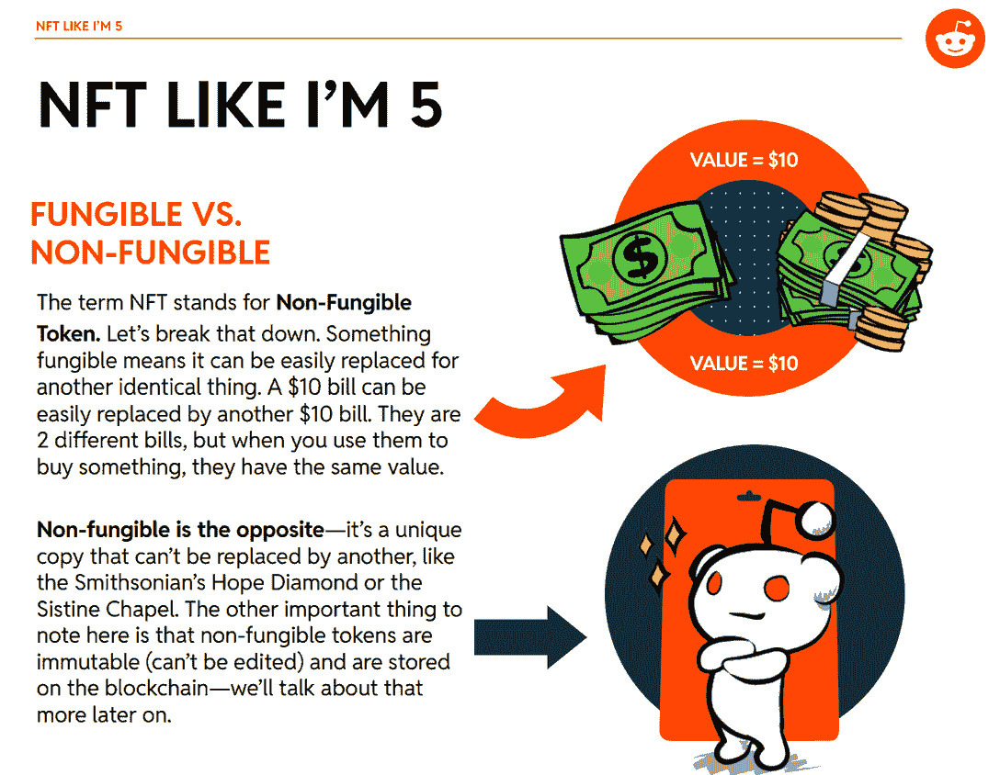

Source: [Reddit](https://web.archive.org/web/20221128122636/https://connect.redditinc.com/hubfs/ABCs-of-NFTs.pdf?hsCtaTracking=6b246fc6-81f3-4c1f-a797-5cf8a53a33cc%7Cae0a2ae7-e1f7-45e8-ad5b-f7f6a9bbcf56)

该公司聘请独立艺术家，并在其自己的平台上认可人才，以创造艺术上独特的数字化身。这些 NFT 授予所有者在 Reddit 上的特定效用，并在知识产权使用方面给予他们类似于 CC0 许可证的东西——这反过来又激励平台用户在这个过程中获得一个很酷的新 PFP，可以使用法定货币而不是加密货币购买。

此外，Reddit 在避免使用“NFT”一词的同时实现了这一点这个词在 Reddit 7 月份的新闻稿中根本没有出现。

这项技术显然没有被用户群遗忘。然而，在这一点上，Reddit 用户因之臭名昭著的尖刻、聪明、偶尔恶毒的评论再多，也无法阻止可收藏头像的迅速崛起。

为了扩大其可收藏的头像项目的覆盖范围和可见性，Reddit 在 8 月份向一些顶级社区建设者和贡献者分发了[免费空投](https://web.archive.org/web/20221128122636/https://www.reddit.com/r/CollectibleAvatars/comments/wqsuwj/four_collectible_avatar_styles_to_choose_from_who/)。通过特定资格条件的 Reddit 用户可以访问 Aww Friends、Drip Squad、Meme Team 和 Singularity collections 的 NFT。然而，这些收藏品的交易量远远小于个人从市场上购买的数量。

在这种情况下，Reddit 的成就是不可能被夸大的。因此，考虑到它的成功，许多对 NFTs 持观望态度的 Web2 公司可能会采用它的方法来接近 NFTs，甚至不使用这个术语。

## Web3 游戏仍远未成为主流

总部位于区块链的娱乐制作商 Coda Labs 最近调查了 Web3 游戏的市场意见。尽管区块链游戏在游戏界迅速流行，但调查显示，它们离主流还有很长的路要走。

区块链和 NFTs 实现了一种新的游戏模式。在网络游戏中，它引入了所有权、透明度和去中心化。基于 Web3 的游戏拥有玩家创造、拥有和交易手中资产的能力，改变了力量的平衡。从而为在线游戏玩家提供了一种将他们的体验货币化的手段。

[Read our Q3 blockchain gaming report](https://web.archive.org/web/20221128122636/https://dappradar.com/blog/dappradar-x-bga-games-report-q3-2022)

据[报道](https://web.archive.org/web/20221128122636/https://codaplatform.com/web3-user-study/)称，尽管 Web3 游戏带来了众多优势，但传统游戏玩家仍对尝试 Web3 游戏犹豫不决。人们仍然不熟悉 crypto 和 NFTs。此外，民意调查显示，缺乏加密钱包是影响 Web3 游戏低采用率的主要因素。

这项民意调查在五个国家进行，包括英国、美国、巴西、南非和日本。只有 16%的受访者是密码游戏玩家。这些玩家经常使用加密货币，拥有加密钱包，并在市场上进行 dex 和 NFT 的加密交易。

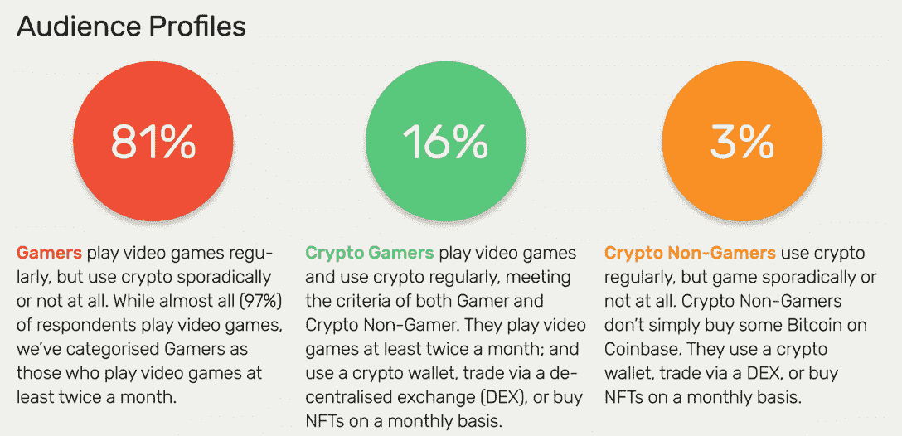

Source: [Coda Labs](https://web.archive.org/web/20221128122636/https://codaplatform.com/web3-user-study/)

Coda 实验室的报告强调，52%的游戏玩家不熟悉术语 Web3 游戏。同时，只有 15%的 Web3 用户有兴趣在未来玩这些游戏，因为他们主要将这些项目视为投资机会。少数人听说过“玩即赚”,事实上，这是加密游戏玩家最熟悉的术语。

那些没有玩过 Web3 游戏的人被问及他们是否有兴趣玩游戏赚钱。总的来说，19%的人感兴趣。此外，在所有小组的参与度中，加密收益是最明显的 Web3 游戏收益。

###### Web3 游戏的优势

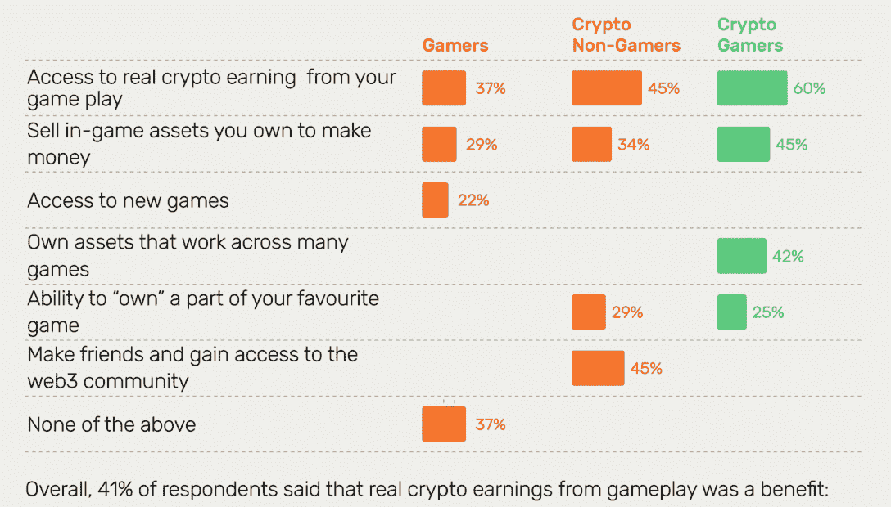

Source: [Coda Labs](https://web.archive.org/web/20221128122636/https://codaplatform.com/web3-user-study/)

Web3 游戏的主要障碍是游戏玩家对其运作方式缺乏了解。大多数接受调查的非加密玩家不知道如何购买和交易加密货币和 NFT。

积极地说，加密的非玩家群体是 Web3 游戏平台的一个新的目标人群。这些人经常交易加密货币和 NFT，并且精通市场。

## 区块链开发者活动将于 2022 年达到峰值

尽管加密熊市，Web3 开发人员比以往任何时候都要多。Web3 开发平台 Alchemy 在 10 月 13 日发布的一份新的 2022 年第三季度研究报告中表示，2022 年可能是 Web3 开发者“有史以来最重要的一年”。

Source: [Alchemy](https://web.archive.org/web/20221128122636/https://www.alchemy.com/blog/web3-developer-report-q3-2022)

根据这项研究，在区块链发布和确认的所有智能合同中，几乎有 36%是在 2022 年执行的。与已执行的超过 323，700 份合同相比，总共有近 118，000 份智能合同。

尽管自今年年初以来，乙醚的价格已经下降了约 66%,而分散融资(DeFi)协议中锁定的总价值(TVL)也下降了约 70%。

Alchemy 报告称，与今年第一季度相比，智能合同的部署量攀升了 40%，第三季度的每个月都创下了新的历史纪录，在 9 月份达到了 17，376 份合同。

数据还表明，与 2021 年第三季度相比，智能合同的部署激增了 143%，到 2022 年第三季度达到 48，500 多份。

以太坊合并后的两周内，当区块链从工作证明转向利益证明共识时，智能合约的部署激增了 14%。这表明一些开发者可能一直在等待该事件来启动他们的项目。

此外，该公司评估了两个 Web3 脚本库 Ethers.js 和 Web3.js 的使用情况。这些脚本库使开发人员能够访问区块链数据并创建 Web3 产品。

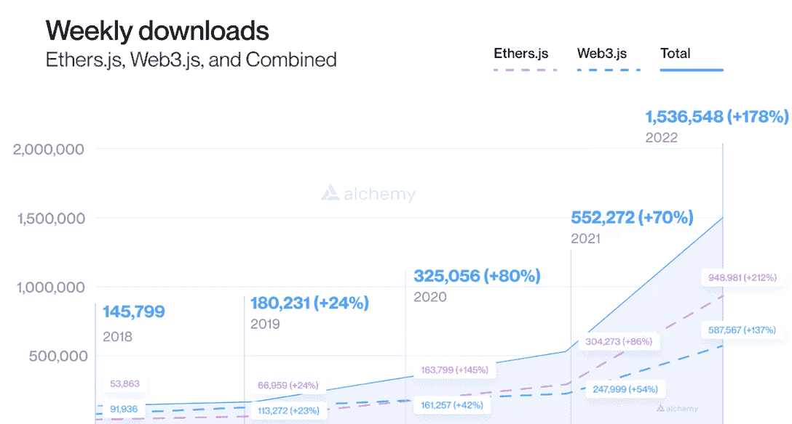

Source: [Alchemy](https://web.archive.org/web/20221128122636/https://www.alchemy.com/blog/web3-developer-report-q3-2022)

研究人员发现，自 2021 年第三季度以来，安装这两个库的开发者平均每周人数增加了两倍，达到 150 多万。

尽管有人断言，目前的秘密熊市是开发 Web3 商品的理想时机，但在之前的周期中，情况未必如此。

正如 Alchemy 的数据所表明的那样，2017 年至 2020 年的熊市在 2018 年至 2019 年的周期中间，智能合约安装量下降了 45%，但这一指标从 2021 年至 2022 年增长了 50%。

该报告显示，尽管宏观经济形势艰难，但项目仍集中在建设上。事实上，本季度，DappRadar 集成了 1304 个 dapp，占所有 dapp 集成的 10.29%。

## 在 Web 2.0 行业中，Web3 的采用率正在上升

尽管对元宇宙的兴趣似乎正在降温，但去中心化的区块链或基于 Web3 的元宇宙的概念仍然很流行。到 2022 年的这个时候，区块链游戏和元宇宙项目已经筹集了大约 70 亿美元，即使第三季度是资本筹集的最低水平，我们仍然设法达到了 12 亿美元。

此外，一项衡量 Twitter 提及趋势的社会分析显示，随着宏观经济形势的变化，元宇宙对 Web3 的兴趣呈下降趋势。

![Web_3.0_Metaverse_Twitter_Mention_Trends[1]](img/2c8944d5a9b96fda765ec92b7d4b7965.png)

即使某些指标有所下降，正如我们在元宇宙的报告中看到的那样，本季度我们看到政府、品牌和传统游戏公司对 Web3 的大量采用。

为了提高其元宇宙的互操作性，Meta 于 8 月份允许用户在脸书和 Instagram 上交叉发布 NFT。该公司已经支持许多支持以太坊、多边形和流量区块链的钱包。

9 月 20 日，纳斯达克推出了一家新的数字资产公司。一旦获得 NYDFS 的批准，新项目最初将专注于为机构客户开发先进的 BTC 和 ETH 托管解决方案，之后可能会提供其他解决方案。

BNY 梅隆银行是美国历史最悠久的银行，管理着全球 20%以上的可投资资产，于 10 月 11 日推出了一个新的数字资产托管平台。它使选定的客户能够直接保留 BTC 和瑞士联邦银行以及传统资产。

## 在 Vasil 升级期间，Cardano 交易激增

卡尔达诺区块链上的网络活动激增。10 月 19 日，网络交易达到 82，880 笔，是自 5 月以来的最大数量。凭借这些数据，区块链网络的月环比增长率达到了 75%。

Vasil 升级于 9 月 22 日在 Cardano mainnet 上激活，全部功能于 9 月 27 日发布。由于 Vasil 升级，Cardano dapps 的用户参与度大幅提高。

Cardano DEX Minswap 的独特活跃钱包在最近 30 天内增长了 19.89%，交易量增长了 15.11%，达到了 7700 万美元。此外，Cardano marketplace JPG 店在过去 30 天内的独立活动钱包数量增长了 13.66%。此外，NFT 市场的交易量增长了 40%，达到 1120 万美元。

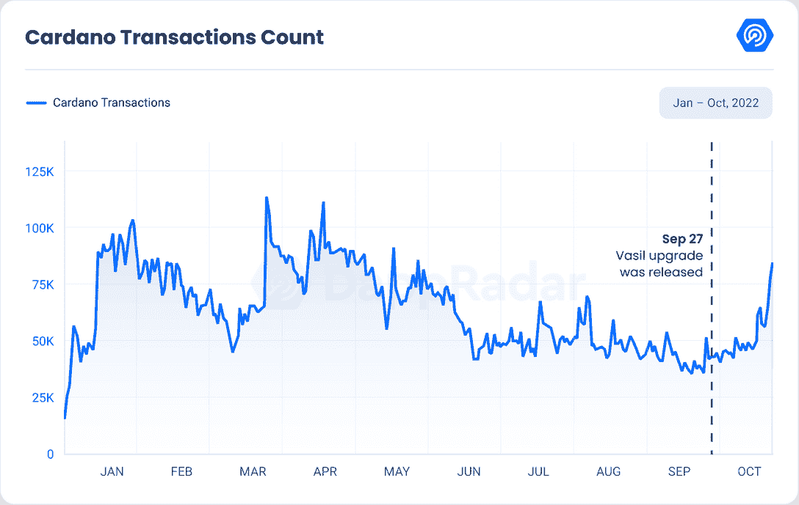

卡尔达诺目前是 NFT 交易量排名前三的区块链之一。在过去的 30 天里，该网络的 NFT 交易量达到 1900 万美元，使 Cardano 成为仅次于以太坊和 Solana 的第三大 NFT 协议。

然而，卡尔达诺的 TVL 仍然没有受到影响。这可能部分归因于投资者对 DeFi 的总体负面看法。卡尔达诺的 TVL 在过去 30 天内下跌了约 20%，至 8377 万美元。

## DappRadar 人口统计视角

使用 DappRadar 的流量分析，我们可以得出一些关于一般 dapp 市场行为模式的结论。

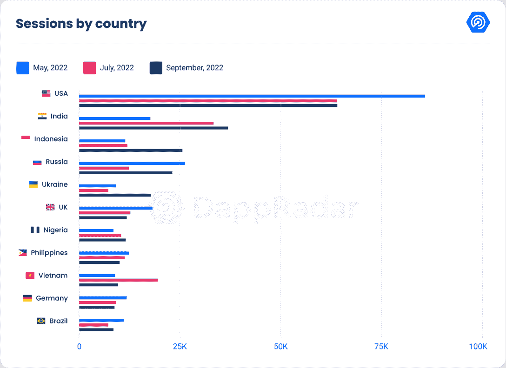

美国仍然是最大的加密市场，自 7 月以来，流量保持不变。印度继续保持增长，排名第二，从 7 月到 9 月增长了 10.40%。

与印度类似，印尼的排名也有所攀升，从 7 月份的第五名升至 9 月份的第三名。自 7 月以来，其流量激增 115.59%。

9 月份，来自俄罗斯的流量增长了 88.28%，但仍从第二位下滑至第四位。

遵循与印度尼西亚相同的模式，乌克兰本月排名攀升，达到第五位，流量较 7 月增长 143.7%。

英国已跌至第六位，过去几个月一直呈下降趋势。与 7 月份相比，9 月份下降了 6.40%。

流量下降幅度最大的是越南，尽管保持了排名，但流量下降了 49.30%。7-8 月，菲律宾下降 9.78%，尼日利亚攀升 12.52%。

德国从 7 月份开始上升，目前排名第九，尽管下跌了 3.38%。

最后，巴西以 16.60%的涨幅攀升至第十位。

#### 性别优势

自上个季度以来，性别优势基本保持不变，因为男性仍然保持大约 75/25 的比例。本季度，DappRadar 的女性观众增长了 6.16%个百分点。

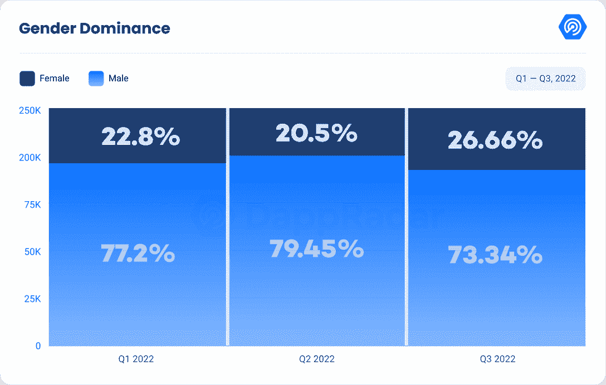

#### 设备使用

设备使用量也保持不变。略超过一半的用户喜欢通过台式电脑访问网站，而不到一半的用户是移动用户。剩下的都是平板用户。

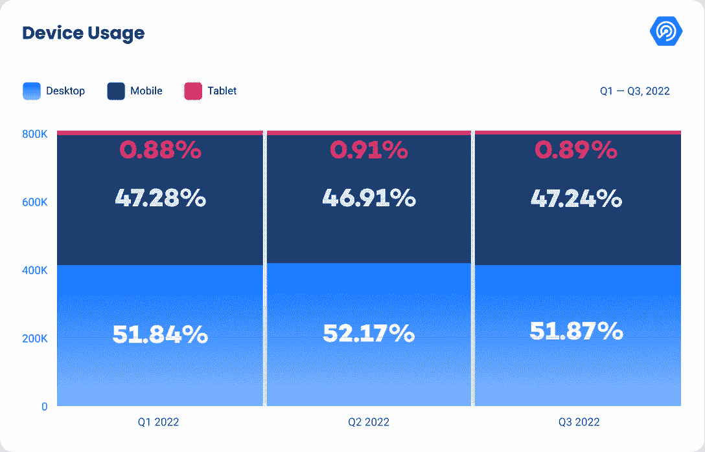

#### 年龄优势

自上一季度以来，年龄差距似乎大幅扩大。自上一季度以来，年轻一代在观众中所占比例越来越大。25 岁至 44 岁的千禧一代占 DappRadar 访客的近一半(48.13%)，其次是 24 岁及以下的 GenZ，他们现在占网站流量的三分之一，比 Q2 增加了 7%。

X 一代，即 45 岁至 64 岁的人，占整体流量的 14.49%，这一数字与上一季度持平，就像婴儿潮一代(65+)的百分比一样。

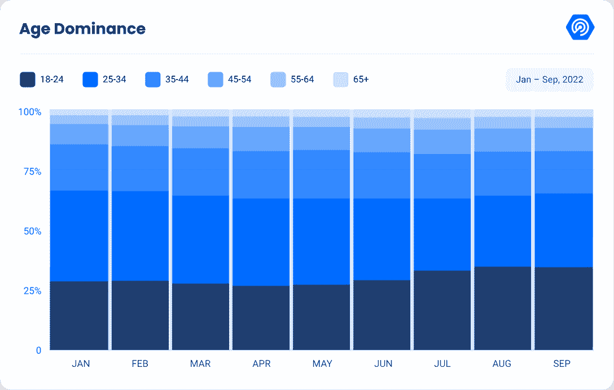

## 加密监管的增加

第三季度，白宫发布了首个“负责任的加密资产增长综合框架”。尽管该文件内容宽泛，但它在投资者保护和行业友好特性之间保持了平衡。

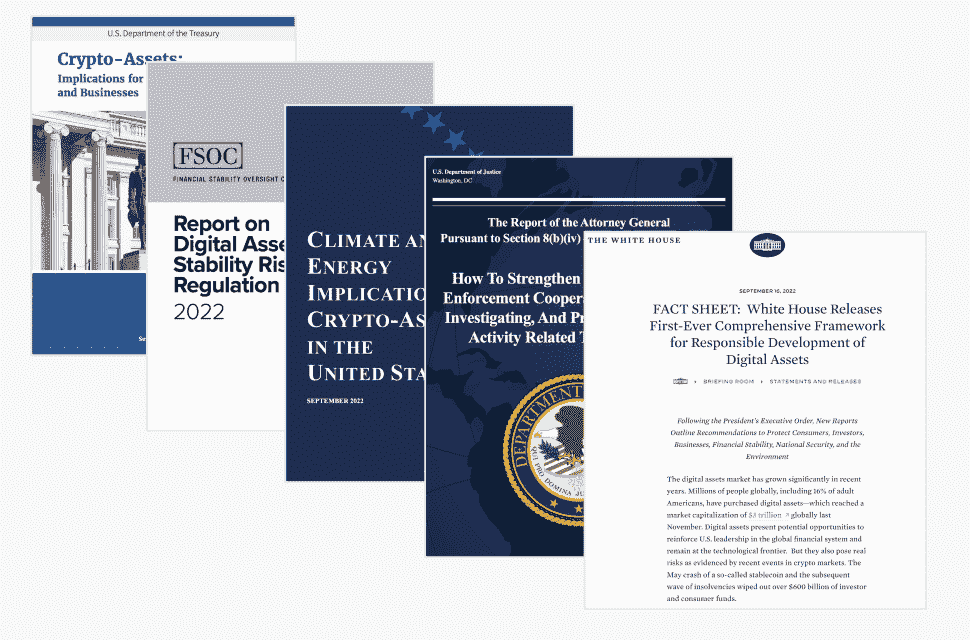

Source: [Bitwise](https://web.archive.org/web/20221128122636/https://bitwiseinvestments.com/)

此外，SEC 再次公开强调其作为主要加密监管机构的地位，并威胁对加密交易场所(如比特币基地)提起强制诉讼。美国证券交易委员会(Securities and Exchange Commission)主席加里詹斯勒(Gary Gensler)在一次演讲中表示，他认为大多数加密资产都是证券，加密交易场所必须注册为经纪自营商。

[Discover Crypto Regulations Worldwide](https://web.archive.org/web/20221128122636/https://dappradar.com/blog/guide-to-all-crypto-regulations-worldwide)

在同样的趋势下，多个带有明显亲加密元素的两党提案正在国会漂浮，国会已经成为加密的可能倡导者。许多市场观察人士认为，需要新的立法来有效监管加密货币。。国会对这一领域越来越采取进步的立场。

在 10 月 10 日的一条推文中，ECON 成员 Stefan Berger 承认委员会批准了 MiCA 法，这是欧盟理事会、欧盟委员会和欧洲议会讨论的结果。

MiCA 提案最初于 2020 年 9 月提交给欧盟委员会，旨在为欧盟 27 个成员国的加密货币建立统一的监管框架。在法律和语言审查，议会批准该文件的最新版本，并在欧盟官方杂志上发表后，加密法规可能会在 2024 年生效。

10 月 25 日，英国国会议员投票赞成将加密资产视为受监管的金融工具和产品。

最近为任命 Rishi Sunak 为该国新总理而欢呼的当地加密行业，可能会接受给予数字资产更广泛法律地位的倡议。

## 结论

加密行业的状态保持强劲和稳定，在顶级市场有一些变化。美国仍在这一领域占据主导地位，其次是印度、印度尼西亚、俄罗斯和乌克兰。当按性别细分时，我们看到大多数用户仍然是男性，但女性观众在本季度增长了 6.16%。

总而言之，加密货币行业在监管方面似乎呈上升趋势。新法规的制定和现有法规的执行很可能会对该行业产生积极影响，因为这将赋予加密货币更多的合法性，并促进其采用。

随着我们进入 2022 年第四季度，投资者不确定会发生什么。加密货币会继续第三季度开始的小幅反弹吗，还是负面的宏观经济消息会压倒基本面，并将价格推至历史低点？鉴于加密正在成为监管机构和立法者中越来越多地讨论和激烈争论的话题，它将在下届美国中期选举中发挥什么作用(如果有的话)？