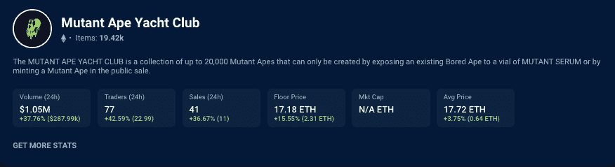
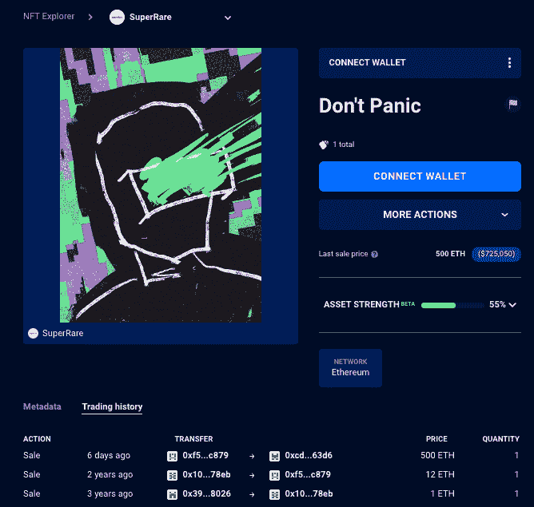
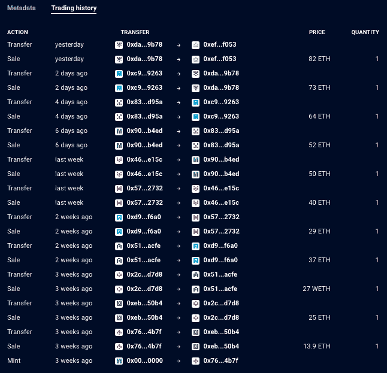

# Crypto Art 以 500 ETH NFT 采购抢尽风头——NFT 十大亮点

> 原文：<https://web.archive.org/web/https://dappradar.com/blog/crypto-art-steals-the-show-with-500-eth-nft-purchase-top-10-nft-highlights>

## 查看 8 月 21 日至 28 日之间的 NFT 销售亮点排名

**XCOPY****的数码艺术品** [**通过**](https://web.archive.org/web/20220925231346/https://dappradar.com/hub/assets/eth/0x41a322b28d0ff354040e2cbc676f0320d8c8850d/2076) [**超级稀有的 NFT 市场**](https://web.archive.org/web/20220925231346/https://dappradar.com/ethereum/marketplaces/superrare) **易手，成为最近七天 NFT 最有价值的拍品。加密艺术似乎成了本周的热门话题，Fidenza 和 Chromie Squiggle 系列的几件作品在 NFT 进行了高价值的拍卖。**

除了 NFT 的秘密艺术品购买，NFT 变种人猿游艇俱乐部收藏本周也获得了销量的提升，因为收藏家们从以太的贬值中获利。[数百只变异猿 NFT](https://web.archive.org/web/20220925231346/https://dappradar.com/hub/nft-explorer/collection/mutant-ape-yacht-club)在过去七天内转手，将底价推高超过 15%。与此同时，过去七天里[卖出的最贵的 MAYC](https://web.archive.org/web/20220925231346/https://dappradar.com/hub/assets/eth/0x60e4d786628fea6478f785a6d7e704777c86a7c6/28631)为 40 ETH，约合 5.8 万美元。

然而，底价是最令人感兴趣的，因为它会影响公共需求。最便宜的 MAYC 现在的价格是 14.7 ETH，几乎比一周前上涨了 14%。你可以在这里查看变种人猿游艇俱乐部系列[的底价](https://web.archive.org/web/20220925231346/https://dappradar.com/hub/nft-explorer/collection/mutant-ape-yacht-club)。

随着每天都有大量高价值的 NFT 拍卖会发生，DappRadar 希望为您带来一份引人入胜的拍卖清单，它可以表明 NFT 系列的未来趋势或更新。此外，加密货币的[贬值至关重要，因为非金融交易是以加密货币定价的。当加密货币的美元价值下跌时，任何 NFT 的价格都会下跌，这可以刺激以折扣价销售](https://web.archive.org/web/20220925231346/https://dappradar.com/hub/tokens/ethereum/all/1)[蓝筹股和非常受欢迎的非加密货币](/web/20220925231346/https://dappradar.com/blog/what-are-blue-chip-nft-collections/)。

随着[对合并的谈论](/web/20220925231346/https://dappradar.com/blog/what-is-the-ethereum-merge/)开始渗透到投资者的零售领域，以太坊的本地令牌 ETH 在过去一个月里一直在升值。然而，最近价格开始大幅下跌，在过去两周内损失了超过 25%的价值。从基本面来看，蓝筹股 NFT 现在比几周前便宜了 25%。

## 查看 NFT 销售亮点列表

***注意:美元价值在销售时给出***

1.  [不要慌，XCOPY](https://web.archive.org/web/20220925231346/https://dappradar.com/hub/assets/eth/0x41a322b28d0ff354040e2cbc676f0320d8c8850d/2076)——80.58 万美元/ 500 瑞士法郎—[买家的钱包](https://web.archive.org/web/20220925231346/https://dappradar.com/hub/wallet/eth/0xf52393e120f918ffba50410b90a29b1f8250c879/nfts)
2.  [矮胖企鹅# 6873](https://web.archive.org/web/20220925231346/https://dappradar.com/hub/assets/eth/0xbd3531da5cf5857e7cfaa92426877b022e612cf8/6873)——630，780 美元/400 ETH—[买家钱包](https://web.archive.org/web/20220925231346/https://dappradar.com/hub/wallet/eth/0x7a32b409353930e6650008e94f64be536a79055b)
3.  [fiden za # 250](https://web.archive.org/web/20220925231346/https://dappradar.com/hub/assets/eth/0xa7d8d9ef8d8ce8992df33d8b8cf4aebabd5bd270/78000250)-249，170 美元/ 150.69 瑞士法郎-[买家钱包](https://web.archive.org/web/20220925231346/https://dappradar.com/hub/wallet/eth/0x144822a06f8eda20012f1310b51dbeb1bbfbc139)
4.  [Axie Infinity 地块-30，14](https://web.archive.org/web/20220925231346/https://explorer.roninchain.com/address/0xeb62eec22ccf13f60a9c3352ec507f00720b00e0/txs)-235，820 美元/160.85 WETH-[买家钱包](https://web.archive.org/web/20220925231346/https://explorer.roninchain.com/address/0x999f5799ebef6bac8742f6947288f1529dc41944/txs)
5.  [chrome Squiggle # 7046](https://web.archive.org/web/20220925231346/https://dappradar.com/hub/assets/eth/0x059edd72cd353df5106d2b9cc5ab83a52287ac3a/7046)——234，780 美元/ 150 枚—[买家钱包](https://web.archive.org/web/20220925231346/https://dappradar.com/hub/wallet/eth/0x8682a78ea82bd94c3e250539079119b6eef132db)
6.  [fiden za # 561](https://web.archive.org/web/20220925231346/https://dappradar.com/hub/assets/eth/0xa7d8d9ef8d8ce8992df33d8b8cf4aebabd5bd270/78000561)——178，520 美元/120 WETH—[买家钱包](https://web.archive.org/web/20220925231346/https://dappradar.com/hub/wallet/eth/0xee84d8bd442b06d1ca636d8950d907530cc8d74c)
7.  [志那都红豆# 4914](https://web.archive.org/web/20220925231346/https://dappradar.com/hub/assets/eth/0xed5af388653567af2f388e6224dc7c4b3241c544/4914)-137740 美元/ 88 瑞士法郎-[买家钱包](https://web.archive.org/web/20220925231346/https://dappradar.com/hub/wallet/eth/0x9979d204e93229c4355431dfb520e608c81bbd0c)
8.  [chrome Squiggle # 5987](https://web.archive.org/web/20220925231346/https://dappradar.com/hub/assets/eth/0x059edd72cd353df5106d2b9cc5ab83a52287ac3a/5987)-62580 美元/ 40 瑞士法郎-[买家钱包](https://web.archive.org/web/20220925231346/https://dappradar.com/hub/wallet/eth/0x9fcd919c0d4bc0ca1c212d218f986010289454ba)
9.  [变种人猿游艇俱乐部# 28631](https://web.archive.org/web/20220925231346/https://dappradar.com/hub/assets/eth/0x60e4d786628fea6478f785a6d7e704777c86a7c6/28631)-$ 67140/40 ETH-[买家钱包](https://web.archive.org/web/20220925231346/https://dappradar.com/hub/wallet/eth/0xc76f66368af0ea7f609b851ae01f8ca022bcae2a)
10.  [变种人猿游艇俱乐部# 5796](https://web.archive.org/web/20220925231346/https://dappradar.com/hub/assets/eth/0x60e4d786628fea6478f785a6d7e704777c86a7c6/5796)-53020 美元/31.8 ETH-[买家钱包](https://web.archive.org/web/20220925231346/https://dappradar.com/hub/wallet/eth/0xe731778639c53afbcb4683eeb3873796a3a54431)

## 秘密艺术浪潮

上周易手的最昂贵的 NFT 是一件名为[不要惊慌](https://web.archive.org/web/20220925231346/https://dappradar.com/hub/assets/eth/0x41a322b28d0ff354040e2cbc676f0320d8c8850d/2076)的生成性加密艺术作品，由数字艺术家 XCOPY 在 2019 年创作，可在 [NFT 艺术平台 SuperRare](https://web.archive.org/web/20220925231346/https://dappradar.com/ethereum/marketplaces/superrare) 上获得。自 2019 年第一次铸造以来，NFT 已经在[走过了一段不平凡的旅程](https://web.archive.org/web/20220925231346/https://dappradar.com/hub/assets/eth/0x41a322b28d0ff354040e2cbc676f0320d8c8850d/2076)。两年前最初以 12 个 ETH 易手，现在以 500 个 ETH 易手，价值超过 72.5 万美元。

在这个 NFT 的案例中，我们可以看到买家有一个名为 Yugen.eth 的 [ENS 域名](https://web.archive.org/web/20220925231346/http://explainer/)，在购买后不要惊慌，新的所有者将 NFT 转移到另一个钱包中，这个钱包代表了 [AOI 收藏](https://web.archive.org/web/20220925231346/https://dappradar.com/hub/wallet/eth/0xd1e8a92f44bdc83bc620c56a7913fd97de5abe10/nfts)。AOI 收藏是一组精选的多维艺术作品，以不可替代的符号为代表。[在那个钱包](https://web.archive.org/web/20220925231346/https://dappradar.com/hub/wallet/eth/0xd1e8a92f44bdc83bc620c56a7913fd97de5abe10/nfts)里，你会发现一个[收藏，估计价值 112 万美元](https://web.archive.org/web/20220925231346/https://dappradar.com/hub/wallet/eth/0xd1e8a92f44bdc83bc620c56a7913fd97de5abe10/nfts)。

深入买家的钱包，我们发现了一批价值超过 700 万美元的 NFT，包括[几个密码朋克、BAYC 和许多密码艺术品](https://web.archive.org/web/20220925231346/https://dappradar.com/hub/wallet/eth/0xf52393e120f918ffba50410b90a29b1f8250c879/nfts)。此外，在过去七天里，由 NFT 艺术街区市场主办的 Chromie Squiggle 和 Fidenza 收藏馆的数字艺术作品的大量[高价值销售](https://web.archive.org/web/20220925231346/https://dappradar.com/nft/sales/2)中，可以更清楚地看到秘密艺术易手的趋势。

## Axie 无限地块

上周[我们重点报道了来自](https://web.archive.org/web/20220925231346/https://dappradar.com/blog/bored-ape-kennel-club-for-500k-blue-chip-nft-discounts-top-10-nft-highlights)[领先的玩赚游戏 Axie Infinity](/web/20220925231346/https://dappradar.com/blog/what-is-axie-infinity-and-how-does-it-work/) 的 Axie 以 84.16 wet 的价格出售，或者大约 143，000 美元。本周，NFT 第八高的拍卖是 Axie Infinity universe 的一块土地，售价为 160.85 WETH，约合 23.6 万美元。

Axie 家园 Lunacia 被分割成一块块象征性的土地，作为 Axie 的家园和行动基地。剧情可以随着时间的推移使用各种资源和玩游戏时发现的工艺成分升级。

[https://web.archive.org/web/20220925231346if_/https://www.youtube.com/embed/y-dKjMxMo4Q?feature=oembed](https://web.archive.org/web/20220925231346if_/https://www.youtube.com/embed/y-dKjMxMo4Q?feature=oembed)

## 骗局预警！

在整理十大名单时，我们遇到了可疑的，有时甚至是彻头彻尾的骗局 NFT 项目，我们必须向我们的社区强调这一点。DappRadar 跟踪链上数据，并从 OpenSea 共享店面拉 NFT 集合。当我们发现问题时，这些集合有时会自动添加，然后追溯删除。

通过查看 NFT 的[交易历史，我们可以看到销售的频率和价值以及进行交易的钱包。当我们在几个钱包之间的短时间内看到许多交易时，可以肯定地认为](https://web.archive.org/web/20220925231346/https://dappradar.com/hub/assets/eth/0x8dcb8b2d721c022552d826f8bcf2995747248d31/7)[清洗交易正在发生](/web/20220925231346/https://dappradar.com/blog/looksrare-nft-marketplace-hit-by-wash-trading-amidst-airdrop/)以人为抬高藏品的平均价格和底价。

为什么？因为增加这些指标将提升该系列在 DappRadar 等网站上的排名，并可以欺骗人们认为有一个他们应该模仿的[热门新 NFT 系列。](/web/20220925231346/https://dappradar.com/blog/marketing-genius-or-foul-play-two-wallets-generate-1-1-billion-on-looksrare/)

点击每一个链接将带你到集合中的一个 NFT，那里的交易历史看起来非常可疑，你可以自己进一步调查，并开始了解在研究潜在的 NFT 投资时要寻找什么。

*   [半只猫](https://web.archive.org/web/20220925231346/https://dappradar.com/hub/assets/eth/0x495f947276749ce646f68ac8c248420045cb7b5e/105645911729364582169193343438641643314658248840997808904717200683344813096961)
*   [女猿](https://web.archive.org/web/20220925231346/https://dappradar.com/hub/assets/eth/0x495f947276749ce646f68ac8c248420045cb7b5e/71599777317896889596593422567297748181657612122279694726789610174501569429505)
*   [女猿游艇俱乐部](https://web.archive.org/web/20220925231346/https://dappradar.com/hub/assets/eth/0x8dcb8b2d721c022552d826f8bcf2995747248d31/7)

***Sara 加入了区块链，以突出时尚、NFTs 和元宇宙*** 之间的联系

[https://web.archive.org/web/20220925231346if_/https://www.youtube.com/embed/bZkSZ1jqoDI?start=2445&feature=oembed](https://web.archive.org/web/20220925231346if_/https://www.youtube.com/embed/bZkSZ1jqoDI?start=2445&feature=oembed)

***以上不构成投资建议。此处给出的信息仅供参考。请行使尽职调查，做你的研究。作者持有多种加密货币的头寸，包括 BTC、瑞士法郎和雷达。***

 NewsletterUnsubscribe at any time. [T&Cs](https://web.archive.org/web/20220925231346/https://dappradar.com/terms) and [Privacy Policy](https://web.archive.org/web/20220925231346/https://dappradar.com/privacy-policy)