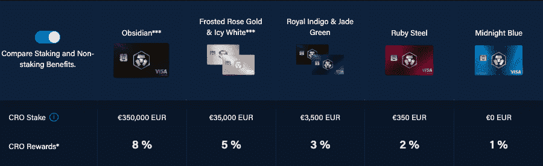
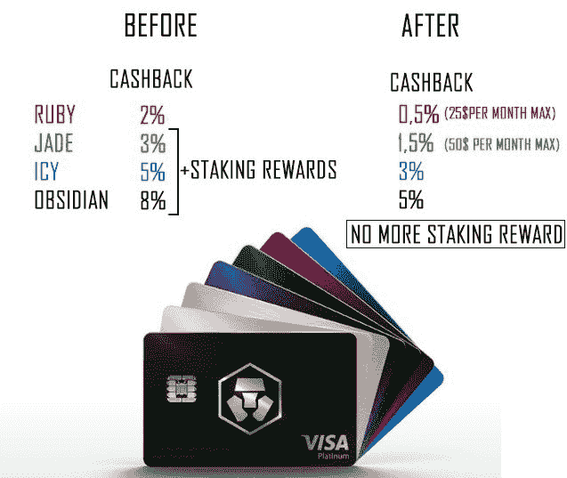
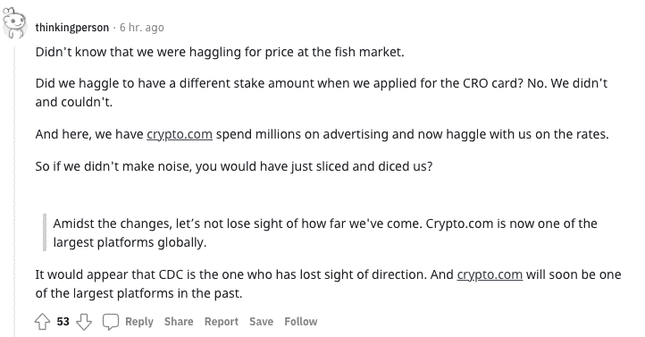
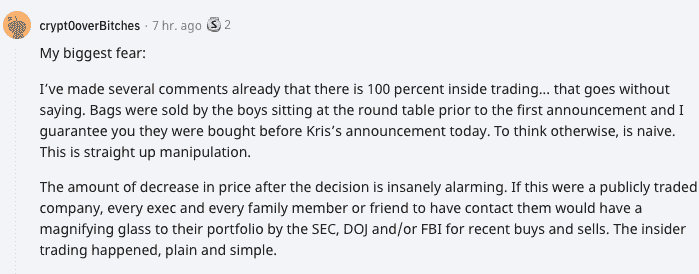
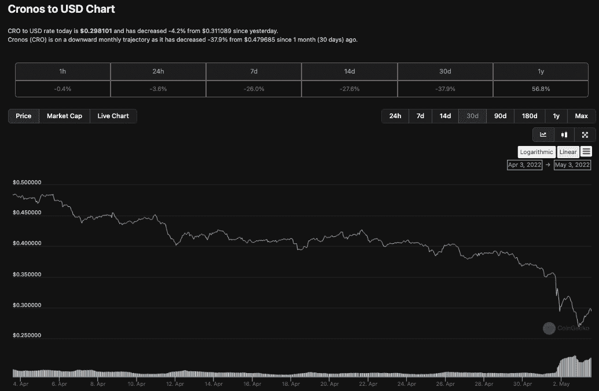
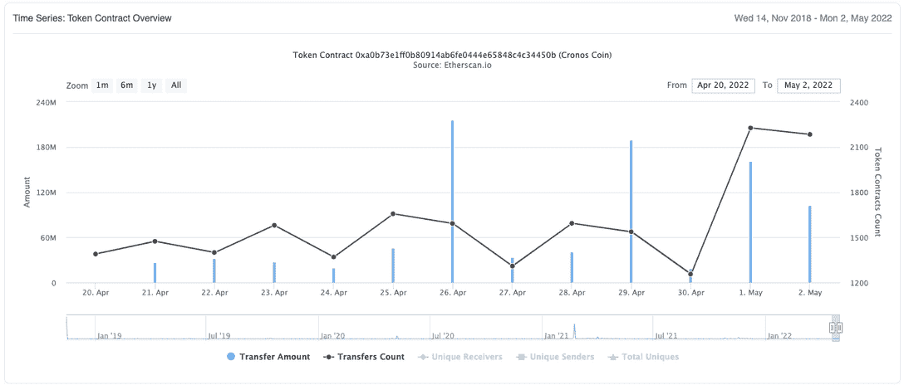
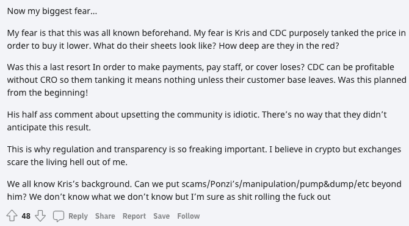
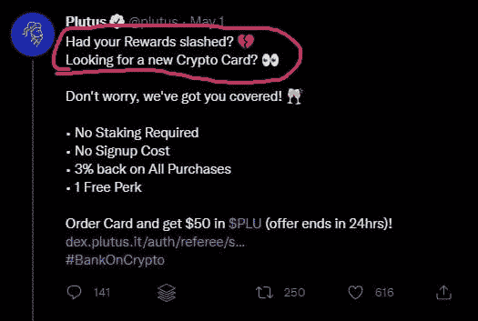

# 削减赌注和牌奖励后的 Crypto.com 人字拖

> 原文：<https://web.archive.org/web/https://dappradar.com/blog/crypto-com-flip-flops-after-cutting-staking-card-rewards>

## 社区发出声音，要求改变，但为时已晚吗？

集中式加密平台 Crypto.com 在宣布削减赌注和卡奖励后，遭到了客户的强烈反对，似乎正在改变立场。上周，Crypto.com 首席执行官克里斯·马斯扎克在推特上宣布了对集中式交易所的 earn 功能的重大改变，但客户并不高兴。在此之后，当地的 CRO 代币贬值了 25%以上。

## 摘要

*   Crypto.com 在 4 月 30 日宣布，他们将彻底改革他们的奖励和赌注服务，有效地减少和限制客户奖励
*   客户的强烈反对导致 crypto.com 首席执行官对这些变化做了一些修改
*   [在 4 月 30 日的声明发布后，CRO 股价下跌超过 25%](https://web.archive.org/web/20221006040444/https://dappradar.com/blog/crypto-com-flip-flops-after-cutting-staking-card-rewards/#Tinfoil-hat-time-)
*   随着 crypto.com 首席执行官在推特上发布修订版，CRO 价格略有回升
*   [内幕交易指控](https://web.archive.org/web/20221006040444/https://dappradar.com/blog/crypto-com-flip-flops-after-cutting-staking-card-rewards/#Tinfoil-hat-time-)Reddit 上的价格操纵指控

## 一些背景

Crypto.com 可能是世界上最著名的集中交易市场之一。很难错过随处可见的巨型广告牌，好莱坞名人倡导的平台，或者传奇的斯台普斯中心，现在称为 Crypto.com 竞技场。正如马特·达蒙(Matt Damon)所说，“财富青睐勇敢的人”，自 2017 年摩纳哥的萌芽期以来，Crypto.com 无疑一直很勇敢。

除了简单的入职手续、KYC 和安全性，吸引用户前往 Crypto.com 的一个主要因素是他们的借记卡等级。通过这些卡，消费者可以获得在 CRO 支付的现金返还交易，同时还可以在 CRO 获得赌注奖励，以获得一张借记卡。真正有趣的是，有一天你可以收集一些 CRO 代币作为现金返还和奖励，几天、几周或几个月后，这些代币可能会更值钱。

借记卡要求用户在 Crypto.com 拥有活跃的股份才能获得最高奖励，即每一层都要求用户在 CRO 拥有一定数量的法定股份才能使用该卡。在宣布变化之前，有五个支付卡等级，从午夜蓝到黑曜石黑。

## 返现的变化

现在，在新提议的奖励系统下，卡返现将从蓝卡中完全移除，并且在较低等级的卡上显著减少，并且引入了返现限制。此外，由于强加的限制，Ruby 和 Jade 持卡人的利益几乎变得微不足道。此外，新提案概述了持卡人将不再获得他们为获得一张卡而下注的 CRO 金额的赌注奖励，无论是哪一级。这是该社区最重要的症结所在，而反弹就是从这里开始的。

Source: [Twitter](https://web.archive.org/web/20221006040444/https://twitter.com/kalianji_cro/status/1520791713576636416/photo/1)

上图描述了正确的返现百分比，但赌注奖励再次被修改。最初的提案希望取消持卡人的所有赌注奖励，不管他们的等级如何。Crypto.com 现在表示，他们不会完全取消信用卡赌注收益率，而是会提供一种更平衡的方法:黑曜石、冰白色和磨砂玫瑰金持卡人享受 8%的 APY，皇家靛蓝和翡翠绿色持卡人享受 4%的 APY。

快速回顾一下发生了什么:CRO 在四层牌上的赌注奖励从 12%，12%，10%，到 0%。在所有四张卡片上降至 0%,然后在蓝色卡片上回升至 8%、8%、4%和 0%。然而，两个较低层级卡的返现限制仍然存在，四张卡的返现从 8%、5%、3%、1%下降到 5%、3%、1.5%、0.5%。

## 命运过去总是偏爱勇敢的人

从积极的一面来看，那些涉足 Crypto.com 甚至早在摩纳哥时期的人可能已经赚了一大笔钱。最初，为了获得一张卡，他们必须持有一定数量的 CRO，而不是 CRO 的法定数量。CRO 在这几年升值了很多，所以早期用户不应该感到太不公平。在过去的 12 个月里，以赌注和返现的高比例回报承诺吸引的新用户将在这场辩论中发出最大的声音。幸运的是，他们发出了自己的声音，或者如 Reddit 上的一位评论员所说:

## 锡纸帽时间

加密领域的一些旁观者并不相信 Crypto.com 或克里斯·马斯扎克，他们在 Reddit 上开始了一场围绕 CRO 内幕交易的对话。Crypto.com 的联合创始人兼首席执行官克里斯·马斯扎克(Kris Marszalek)在客户和商业伙伴的指责声中辞去了之前的工作。总部位于澳大利亚的 Ensogo 公司提供类似 Groupon 的在线交易。2016 年 6 月，它突然停止了在东南亚的业务，就在 Marsazlek 迈出大门加入 Crypto.com 的时候。

根据香港报纸[在](https://web.archive.org/web/20221006040444/https://www.thestandard.com.hk/section-news/section/11/170732/Anger-as-BeeCrazy-buzzes-off)辞职后第二天发表的一篇报道，Ensogo 平台上的买家和卖家被关闭弄得措手不及，并留下了“数十万美元的损失”据报道，一些商人告诉警方他们被骗了。一位企业主说，Marszalek 创立的 Ensogo 子公司 Beecrazy 欠了她两个月的货款。她声称，该平台在关闭前曾发布促销活动来增加收入——这些交易后来变得一文不值。听起来熟悉吗？在做出会影响用户的重大改变之前，要加大广告和用户获取的力度。一位 Reddit 用户更进一步。

深入了解 CRO 自声明发布以来的活动可以揭示更多信息。此外，重要的是要声明，虽然上述行业观察家已经清楚地表达了他们的感受，但我们只是列出了所有的发现，供我们的读者确定。

## 我们所知道的

我们知道，在最初的公告对 Crypto.com 的客户收入潜力进行了大规模修改后，CRO 的价格大幅下跌。CRO 上周收于 0.38 美元左右。然后，到了周一晚上，也就是社区发出声音的时候，价格降到了 0.27 美元。一旦它触及低点，新闻开始流传关于可能的翻转和修改新的卡条款和赌注奖励，将我们带到今天和克里斯·马扎莱克的推文以及 CRO 再次向北移动的价格。我们还看到，在 4 月和 5 月的大部分时间里，交易量保持稳定，但在 5 月 1 日突然飙升。这可能表明由于价格下跌和人们希望套现或换成稳定的硬币以保持一些价值而进行的象征性销售。它也可以代表买入，因为那些想要更多 CRO 的人抓住了低价位的机会。同样，这可能意味着投资者正在跳槽，清理他们的 CRO，要么全部，要么到另一个平台，因为这些公告留下了不好的味道。通过以太扫描和 CRO 合同的进一步调查揭示了更多。

最初的宣布是在 4 月 30 日，我们可以看到，当天通过 2，227 次转账，超过 1.61 亿 CRO，即超过 4，800 万美元，超过了前一天通过 1，255 次转账的 1，800 万 CRO。奇怪的是，在 CRO 转移的价值增加了五倍多，但转移的数量不到一倍，这表明一些鲸鱼在 4 月 30 日转移了大量的 CRO。回溯到 Reddit 上的评论，这位旁观者在谴责其首席执行官 Crypto.com 以及他们可能在做什么方面走得更远。

我们可以确定的另一件事是，有几个追求者正在排队取代 Crypto.com，并向客户提供他们想要的奖励类型。Nexo 多年来一直在打造自己的品牌，并提供与 Crypto.com 相同的功能和更丰厚的回报。此外，普路托斯提供声卡返现率，并在欧盟和英国运营。具有讽刺意味的是，在过去的几天里，PLU 代币的价值已经翻了三倍。

Crypto.com 可能无意中将其曾经忠诚的用户群推向了其最大竞争对手的怀抱。或者这一直都是计划好的？可以说，大多数平台通过介绍性优惠吸引用户，大多数加密交易所最近大幅降低了费率，但大多数平台没有让用户投资像 CRO 这样的超级不稳定资产来兑换服务。随着故事的进一步发展，我们将尽力让我们的读者了解最新情况。

 NewsletterUnsubscribe at any time. [T&Cs](https://web.archive.org/web/20221006040444/https://dappradar.com/terms) and [Privacy Policy](https://web.archive.org/web/20221006040444/https://dappradar.com/privacy-policy)

***以上不构成投资建议。此处给出的信息仅供参考。请行使尽职调查，做你的研究。作者持有多种加密货币的头寸，包括 BTC、瑞士法郎和雷达。***