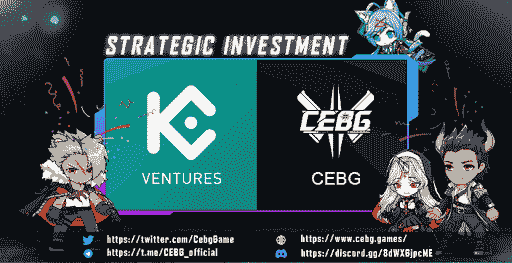

# 引领 GameFi 2.0 时代的加密精英战场

> 原文：<https://web.archive.org/web/https://dappradar.com/blog/crypto-elites-battlegrounds-leading-the-gamefi-2-0-era>

## CEBG 是一款有 NFT 升级系统的玩赚区块链游戏

《秘密精英的战场》( CEBG)是第一款基于区块链的具有动漫视觉风格的皇家战役动作游戏，表明 GameFi 正在进入其 2.0 时代。动作游戏混合了游戏赚取机制、可升级的 NFT 英雄和游戏内代币，凸显了 GameFi 2.0 中的游戏元素变得更加重要。值得注意的是，CEBG 已经完成了由 KuCoin Ventures 牵头的天使轮投资。

GameFi 一直与游戏化的 DeFi 联系在一起，只是增加了一点互动，但没有乐趣。crypto Elite ' s Battlegrounds(CEBG)通过创造一种实际上很好玩的产品来改变这种情况。此外，该游戏具有“玩赚”机制，玩家可以使用游戏内的令牌、CEC 和 CEG 升级他们的 NFT 英雄。值得注意的是，NFT 升级过程伴随着低级非功能性测试的消耗。因此，CEBG 生态系统中的 NFT 将始终具有价值。

[根据 2 月份的 Dapp 行业报告，](https://web.archive.org/web/20220925072014/https://dappradar.com/blog/dapp-industry-report-february-2022/#blockchain-games)与上月相比，区块链游戏行业表现略逊一筹。博彩业占该行业活动的 49%，较 1 月份下降 3%。然而，由于密码货币市场的熊市，博彩业的统计数据略有下降是正常的。此外，在区块链游戏领域，从游戏性到象征性经济学，都有相当大的改进空间。目前，许多团队已经意识到这个问题。

幸运的是，许多雄心勃勃的团队正在试图创造一个在用户体验和令牌组学方面都进行优化的 GameFi 2.0 时代。crypto Elite ' s Battlegrounds(CEBG)是游戏市场如何积极地将 GameFi 发展到其 2.0 版本的一个很好的例子。

## **CEBG 游戏解说**

著名的 battle royale 游戏 PUBG 启发了 CEBG 的核心玩法。但是，更重要的是，CEBG 将《最后一人站》游戏中令人肾上腺素飙升的游戏性与生存、探索和清除元素融合在一起。此外，玩家可以选择单打独斗或与朋友组队。

随着 4G 甚至 5G 技术的进步，现在的游戏玩家通常会短时间玩游戏。简单来说，只要有空闲时间，他们就会玩手机。CEBG 意识到了这样的用户需求，并允许玩家享受这款手机友好型游戏。此外，凭借强大的社交属性，CEBG 将使玩家能够在游戏空间中交友。此外，玩家可以与现实生活中的朋友一起玩游戏，以寻求胜利。最后但同样重要的是，CEBG 嵌入了免费游戏机制，为新玩家进入游戏扫除了障碍。然后他们可以成为 CEBG 元宇宙的共同创造者和参与者。

## **NFTs 为游戏提供动力**

NFT 在加密精英的战场上扮演着重要的角色。开发者将在游戏中引入三种类型的 NFT:

*   英雄
*   武器
*   炸薯条

为了维持游戏内 NFT 的健康循环，团队引入了精心设计的 NFT 放气机制。具体来说，低级英雄的合并可以提高属性和稀有度。这样低级英雄的消耗就会在升级的时候发生。同样的机制也适用于武器。

因此，游戏内的 NFT 可以通过升级中的消耗机制继续升值，因为低级别的 NFT 正在被烧毁。值得一提的是，更高水平的 NFT 也会给玩家带来更高的回报，这为最专注的玩家创造了获得多个 NFT 的理由。

## **CEBG 代币以及如何使用**

CEBG 元宇宙采用双令牌模式，包括 CEC 治理令牌和 CEG 游戏令牌。

**CEC 的效用**

*   购买 NFTs 的付款方式。
*   升级 NFTs
*   解锁独家内容和体验。
*   在流动资金池中下注以获得奖励。
*   对治理提案进行投票。

**CEG 的公用事业**

*   能量购买:能量是游戏中的资源，需要参与游戏赚取机制。玩家需要通过 CEG 来补充能量。
*   修复石油购买:武器会在游戏中被损坏。玩家需要购买修复油来修复武器。
*   升级 NFTs:为了升级 NFTs，玩家需要同时拥有 CEC 和 CEG。在 P2E 生态系统中，更高级别的非功能性团队可以获得更多奖励。

## 【CEBG 的未来如何

作为第一款基于区块链的 PUBG 类型的动画视觉风格游戏，人们对 CEBG 的期望很高。该团队制定了一个雄心勃勃的路线图，由于他们的辛勤工作，他们已经实现了几个里程碑。整个游戏将于 2022 年 Q2 年初推出。值得注意的是，CEBG 每月都会进行版本升级，致力于为其社区带来终极游戏体验，让他们在游戏中获得乐趣和收益。

由于一系列的战略合作伙伴关系，CEBG 拥有一个充满坚实的市场计划和广泛的社区支持的光明未来。CEBG 与之结盟的关键合作伙伴之一是多元宇宙游戏(MVP)。它是一个 GameFi DAO，拥有 80，000+的游戏收入玩家和投资者。这对 CEBG 来说非常重要，因为 MVP 庞大的社区和在游戏发行方面的海量经验将为 CEBG 赋能，为其顺利进入 GameFi 2.0 保驾护航。

## **最后几句话**

即使没有统一的定义，GameFi 2.0 的总使命是解决 GameFi 1.0 面临的问题。在 GameFi 1.0 中，游戏只吹嘘自己的金融属性，仅仅依靠经济利益来吸引玩家。因此，这些游戏严重缺乏娱乐功能。然而，GameFi 2.0 强调通过向整个生态系统引入更多可玩性和可持续的机制来延长项目的生命周期。怀着这样的愿景，CEBG 将在 GameFi 2.0 时代为用户带来耳目一新的游戏体验。

## **关于**秘密精英的战场

crypto Elite ' s Battlegrounds(CEBG)是一款基于区块链的皇家战役动作游戏，具有动漫视觉风格。它努力引领 GameFi 2.0 的运动。CEBG 得到了 KuCoin Ventures 的支持，ku coin Ventures 是 KuCoin Exchange 的领先投资部门，支持加密和 Web 3.0 开发。

**了解关于**的更多信息

[网站](https://web.archive.org/web/20220925072014/https://www.cebg.games/)
[电报](https://web.archive.org/web/20220925072014/https://t.me/CEBG_official)
[推特](https://web.archive.org/web/20220925072014/https://twitter.com/CEBG_GAME)
[不和](https://web.archive.org/web/20220925072014/https://discord.gg/8dWX6jpcME)

**联系人**

[【电子邮件保护】](/web/20220925072014/https://dappradar.com/cdn-cgi/l/email-protection)

**免责声明** —这是一篇赞助文章。DappRadar 不认可本页面上的任何内容或产品。DappRadar 旨在提供准确的信息，但读者应该在采取行动之前总是自己做研究。DappRadar 的文章不能被认为是投资建议。