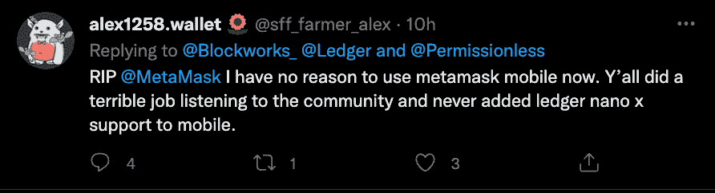

# 加密硬件钱包分类帐启动连接浏览器扩展

> 原文：<https://web.archive.org/web/https://dappradar.com/blog/crypto-hardware-wallet-ledger-launches-connect-browser-extension>

## 通过桌面或移动设备将您的总帐帐户安全地连接到 dapps

领先的硬件钱包 Ledger 正在推出 Ledger Connect，允许硬件钱包连接到区块链的 dapps。这款多链 Web3 钱包允许用户使用其 Ledger Nano X 从任何地方连接到以太坊和 Solana 上的 dapps，以防止黑客入侵并保护数字资产的安全。测试版等候名单的注册现在已经开放，拥有 Nano X 和 iOS 智能手机的人都可以使用。

莱杰的硬件钱包是多币种钱包，用于离线存储加密货币的私钥。Ledger 提供了两种硬件钱包:Nano S 和 Nano x。Ledger 设备可以用来安全地存储您的所有密码，有点像个人银行金库，锁住您的私人密钥，只有您可以访问。那些有兴趣参与测试阶段的人需要一个 iOS 和 Nano X 设备，并可以在这里注册。

## 分类帐连接

Ledger 已经作为一个安全可靠的加密和数字资产存储解决方案占据了一席之地。网络钱包的加入使 Ledger 与 MetaMask 等传统钱包并驾齐驱，后者享有健康的先发优势和主导地位。尽管可以说没有提供最好的产品或互操作性。

使用 Connect，Nano X 用户现在可以跳过像 MetaMask 这样的软件钱包，因为它直接连接，这意味着用户可以在移动中签署交易并与 dapps 交互。最初，Ledger Connect 用户将能够访问 Solana 和 Ethereum dapps，不久将支持更多连锁店。

对莱杰来说，安全始终是最重要的。Ledger Connect 内置的一个新功能是 Web3 Check，它可以警告用户任何潜在的危险交互，并帮助他们避免这些交互。向流程中添加另一层安全和人工检查意味着用户可以完全控制。

[https://web.archive.org/web/20220705012309if_/https://www.youtube.com/embed/SV15K_H82_U?feature=oembed](https://web.archive.org/web/20220705012309if_/https://www.youtube.com/embed/SV15K_H82_U?feature=oembed)

## 为什么我需要像 Ledger 这样的硬件钱包？

分类帐设备可用于存储密码，如个人银行金库。这意味着用户获得所有资产和私钥的完全所有权。它还允许您直接通过 Ledger Live 应用程序，以及现在通过 Connect，通过各种提供商安全地购买、出售、交换和获得加密。Ledger 还可以作为投资组合管理工具和其他第三方服务的登录选项。

当您第一次设置分类帐设备时，它会生成一个由 24 个单词组成的列表，称为主密钥。简而言之，这是一个管理所有密钥的密钥，允许您管理存储在钱包中的所有私钥。您的私钥在硬件钱包中保持离线和安全。除了你之外，没有人可以访问或使用钱包或任何持有的资金。

设备内部的安全元件与信用卡和护照中使用的芯片类型相同。此外，您可以看到您签署的内容，这意味着每个请求的操作，无论是购买还是出借加密，都必须经过分类帐硬件钱包的验证和确认。

[<picture></picture>](https://web.archive.org/web/20220705012309/https://dappradar.com/blog/4-tips-on-blockchain-cybersecurity-stay-safe-in-crypto)[<picture></picture>](https://web.archive.org/web/20220705012309/https://dappradar.com/blog/how-to-start-using-defi-dapps-and-crypto-wallets-on-solana)[<picture></picture>](https://web.archive.org/web/20220705012309/https://dappradar.com/blog/best-cryptocurrency-wallets-for-2022)

## 聚光灯下的 Web3 钱包

莱杰[报告](https://web.archive.org/web/20220705012309/https://cryptonews.com/news/ledger-valued-at-usd-1-5b-plans-defi-solutions-own-operating-10634.htm)称，截至 2021 年 6 月，其销售了 300 万台 Nano S 和 Nano X 设备，这表明了[加密钱包](https://web.archive.org/web/20220705012309/https://dappradar.com/blog/category/crypto-wallet)部门的重要性。加密和数字资产的拥有和采用持续稳步增长，激发了加密钱包市场的新投资和发展。

Statista 显示，十大最受欢迎的钱包应用的下载量从 2020 年 12 月开始上升，而 Blockchain.com 基于软件的钱包[的全球下载量到 2021 年 12 月增长到超过 8000 万](https://web.archive.org/web/20220705012309/https://www.statista.com/statistics/647374/worldwide-blockchain-wallet-users/)。随着竞争的白热化，越来越多的组织也开始涉足 Web3 钱包领域，交易平台罗宾汉[本周早些时候也宣布了一款 Web3 钱包。](https://web.archive.org/web/20220705012309/https://twitter.com/Blockworks_/status/1526618593856823297)

这表明，越来越多的密码所有权和使用通常会导致[钱包](https://web.archive.org/web/20220705012309/https://dappradar.com/blog/category/crypto-wallet)的使用增加，许多行业观察家预计这一趋势将在 2022 年继续。此外，一些人预测，我们将看到钱包扩大其服务，而长期持有者加密和 NFT 持有者的增长也可能看到软件与硬件的比例更有利于硬件钱包。

 NewsletterUnsubscribe at any time. [T&Cs](https://web.archive.org/web/20220705012309/https://dappradar.com/terms) and [Privacy Policy](https://web.archive.org/web/20220705012309/https://dappradar.com/privacy-policy)

***以上不构成投资建议。此处给出的信息仅供参考。请行使尽职调查，做你的研究。作者持有多种加密货币的头寸，包括 BTC、瑞士法郎和雷达。***