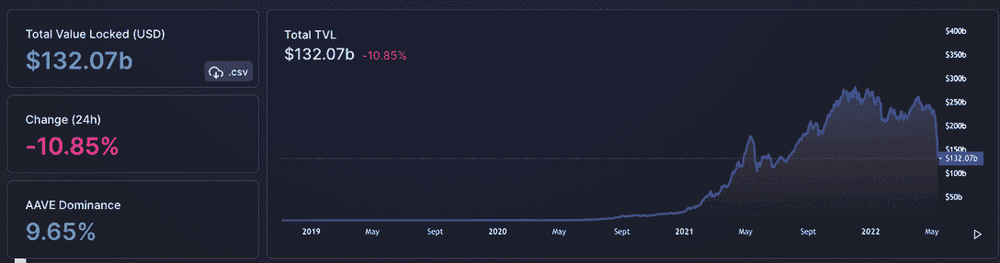
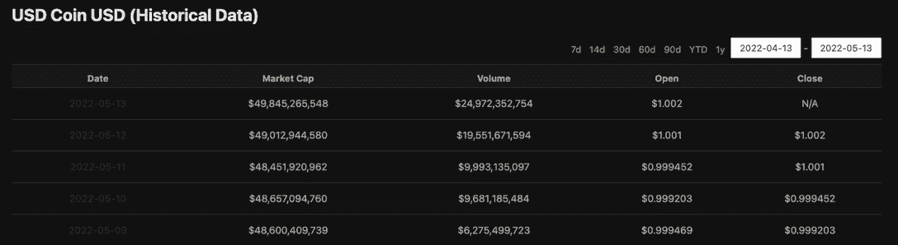
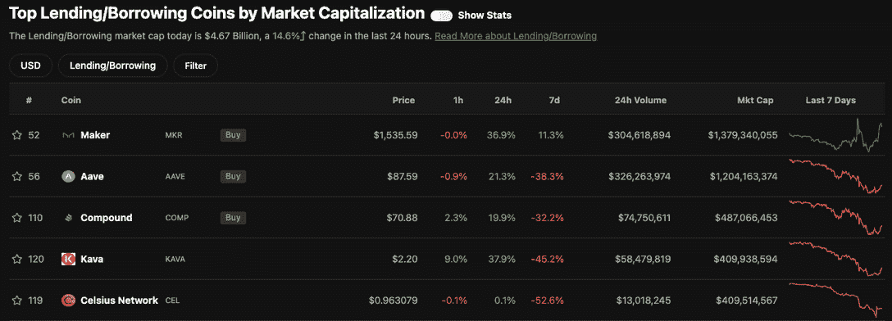
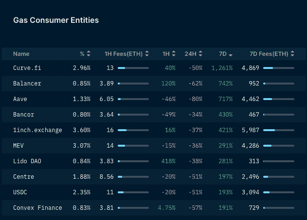

# 加密贷款在熊市和特拉 UST 崩溃中遭受损失

> 原文：<https://web.archive.org/web/https://dappradar.com/blog/crypto-lending-suffers-amidst-bear-market-terra-ust-debacle>

## TVL 在过去的 7 天里下跌了 41%

随着投资者开始将代币转换为稳定的硬币，意图兑现为菲亚特，关键贷款协议锁定的总价值正在下降。在加密史上最大的财富流失中，几个网络上的关键贷款协议的 TVL 数字被大幅削减，而 Terra 上的贷款 dapps 的 TVL 减少了 99%以上。

投资者考虑与密码相关的贷款有两个主要原因。首先，投资者可以将其持有的加密货币作为抵押，以获得现金贷款。这样，投资者可以释放流动性，而不必完全套现。抵押加密资产的另一个原因是为了卖空。

卖空者抵押他们的加密货币，实际上是押注加密资产的价格会下跌。当未平仓空头头寸平仓时，下注的投资者将收到现金或一笔额外的加密货币，这取决于合同是如何制定的。另一方面，如果价格在空头头寸打开时上涨，一部分抵押品将会损失。

然而，在对 Terra、UST 和 LUNA 的巨大担忧中，交易者似乎受到了惊吓，将大量稳定的 coins 移出了协议。具有讽刺意味的是，在三年前的上一次熊市中，Aave 的首席执行官 Stani Kulechov 称加密贷款为“真正的魔法”,因为这种商业模式在熊市中仍然表现良好。

## 特拉和 UST 问题威胁贷款

在加密领域贷款背后的一般逻辑是为投资者提供一个更好的出口，而不是让他们为菲亚特出售他们的密码。因为那会对价格产生负面影响。然而，泰拉的月神和 UST 代币的失败已经在整个行业引起了恐慌。首先，它加剧了 BTC 价格的下跌，同时也打破了其他稳定货币的钉住汇率制度。此外，[Terra 的垮台](/web/20220929115323/https://dappradar.com/blog/terra-validators-pause-network-as-luna-drops-to-zero/)重申了旁观者和投资者对稳定货币资产类别生存能力的担忧。

DeFi 锁定的总价值从 5 月 1 日的 2240 亿美元下降到撰写时的 1320 亿美元。加密贷款似乎是它的下一个受害者，因为数据表明交易商正在将加密从 DeFi 协议转移到 USDC 和 USDT 等稳定的国家，并计划赎回菲亚特。

## 机构投资者利用稳定账户远离加密

[USDC 是该领域的重要参与者](/web/20220929115323/https://dappradar.com/blog/backing-stablecoins-how-does-this-work/),因其合规性而被机构投资者和美国交易员大量利用。USDC 的交易量通常在每天 50 亿美元左右徘徊，然而，在过去的几天里，交易量出现了爆炸式增长，在过去的 24 小时内达到了近 250 亿美元的峰值。USDC 的流通供应量目前为 498 亿，低于 2022 年 3 月初的 530 亿。

今天借贷的市值为 46.7 亿美元，在过去 24 小时内变化了 14.6%。此外，贷款协议价格对形势的反应并不好。随着 AAVE 本周下跌 38%,主要贷款协议的标志全线下跌。卡瓦在过去一周下跌了 45.2%，而 COMP 在此期间的跌幅超过了 32%。

进一步的证据来自于通过[超声波烧钱排行榜](https://web.archive.org/web/20220929115323/https://ultrasound.money/)查看过去七天燃烧的天然气量，因为 USDT 和 USDC 都排在前五位，燃烧了超过 5,000 ETH，或他们之间约 1000 万美元的交易。而[来自南森](https://web.archive.org/web/20220929115323/https://pro.nansen.ai/gas-tracker)的数据显示，USDC 和 USDT 的燃气费在过去一周分别上涨了约 190%和 160%。而[曲线](https://web.archive.org/web/20220929115323/https://dappradar.com/multichain/defi/curve)、[平衡器](https://web.archive.org/web/20220929115323/https://dappradar.com/ethereum/exchanges/balancer)和 [Aave](https://web.archive.org/web/20220929115323/https://dappradar.com/multichain/defi/aave) 在同一时间段内的用气量都大幅增加。

尽管流通中的 USDC 减少了，但在熊市的情况下，似乎没有太多的人对它感兴趣。人们的预期是，交易将会减少，任何计划中的基础设施投资可能会推迟，直到市场恢复一定的稳定。

stablecoin 的未来一直受到质疑，但值得记住的是，与由加密资产支持的 UST 不同，大多数 stable coin 资产都有更切实的支持。例如，USDC 由法定货币支持，USDC 储备资产存放在美国监管的金融机构的独立账户中。

一旦尘埃落定，我们可能会看到交易者回到谈判桌前，在熊市期间求助于更成熟的交易技术。在上一个周期中，放贷非常活跃，我们预计，随着投资者寻求安全的价值储存手段和对冲全球通胀，押注和提供流动性以换取回报等行动将取得胜利。现在，爆米花已经出来了，我们将继续跟踪这个故事的发展。

 NewsletterUnsubscribe at any time. [T&Cs](https://web.archive.org/web/20220929115323/https://dappradar.com/terms) and [Privacy Policy](https://web.archive.org/web/20220929115323/https://dappradar.com/privacy-policy)

***以上不构成投资建议。此处给出的信息仅供参考。请行使尽职调查，做你的研究。作者持有多种加密货币的头寸，包括 BTC、瑞士法郎和雷达。***