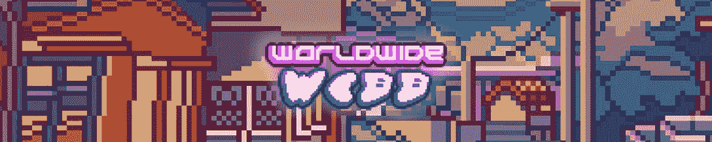

# 隐刃镰刀在我们的排名中一路领先

> 原文：<https://web.archive.org/web/https://dappradar.com/blog/cryptoblades-scythes-its-way-to-the-top-of-our-rankings>

## 用户数量增加了 1，966%，达到 31，520 人

CryptoBlades 荣登 DappRadar 本周游戏榜首。这是与 dapp 互动的独立活动钱包数量增加 1，966%的结果。主导空间的大标题再次出现。Axie Infinity、Splinterlands 和沙盒出现了。但全球韦布也是如此，这是一个虚拟的元宇宙游戏，拥有狂热的追随者和有趣的愿景。

尽管问题继续席卷 web3 世界，CryptoBlades 设法在过去 7 天内将其用户数量增加到 31，520 人。我们很快就会看到为什么这么多人涌向站台。

根据[最新的 DappRadar 和 BGA Games 报告](https://web.archive.org/web/20220728134139/https://dappradar.com/blog/dappradar-x-bga-games-report-4-blockchain-games-continue-to-ascend-despite-collapsing-markets)，区块链博彩活动在 4 月份创下历史新高。游戏 dapps 吸引了超过 120 万个独特的活动钱包。这篇文章通过结合连锁活动、NFT 交易量、代币估值和围绕项目的新闻，来观察本周最热门的游戏 dapps。

在下面浏览本周十大区块链游戏的完整列表。您还可以点击相应的图片，了解每个平台的更多信息。

[https://web.archive.org/web/20220728134139if_/https://www.youtube.com/embed/D1IsWCIbRe0?feature=oembed](https://web.archive.org/web/20220728134139if_/https://www.youtube.com/embed/D1IsWCIbRe0?feature=oembed)

DappRadar’s Games of the Week

## 隐叶片

[<picture></picture>](https://web.archive.org/web/20220728134139/https://dappradar.com/multichain/games/cryptoblades)

CryptoB[l](https://web.archive.org/web/20220728134139/https://dappradar.com/multichain/games/cryptoblades)[ades](https://web.archive.org/web/20220728134139/https://dappradar.com/multichain/games/cryptoblades)做得很好，吸引了 1966%的用户，而 web3 的不确定性正在上升。这可能是他们在 Twitter 上取笑的重大声明的结果，也可能是免费赠送 NFT 的结果。无论如何，31520 个独特的钱包与 dapp 互动，这有助于将 dapp 放在我们的名单上。

## 无限轴

[<picture></picture>](https://web.archive.org/web/20220728134139/https://dappradar.com/multichain/games/axie-infinity)

总部位于区块链的浪人 Axie Infinity 以超过 183，000 名用户在本周的排名中排名第二。游戏开发商继续改善 Axie Infinity: Origin 上游戏的平衡、节奏和感觉。本周还举行了[电子竞技 Axie](https://web.archive.org/web/20220728134139/https://twitter.com/EsportsAxie) 的 Axie Origin 锦标赛。

## 夹板地

[<picture></picture>](https://web.archive.org/web/20220728134139/https://dappradar.com/multichain/games/splinterlands)

在过去的七天里，超过 250，000 个独特的活动钱包与[splitterlands](https://web.archive.org/web/20220728134139/https://dappradar.com/multichain/games/splinterlands)dapp 互动。然而，其令牌的价格下跌了 24.9%，这表明即使是受欢迎的游戏也不能幸免于[熊市](https://web.archive.org/web/20220728134139/https://dappradar.com/blog/new-dapps-report-goblin-town-defying-tradition-and-the-bear-market/)。

## 疯狂防御英雄

[<picture></picture>](https://web.archive.org/web/20220728134139/https://dappradar.com/multichain/games/crazy-defense-heroes)

《疯狂防御英雄》凭借其 183%的用户数量增长，在我们的榜单上排名第四。《疯狂防御英雄》在 [DappRadar 的多边形游戏排名中也位列第四](https://web.archive.org/web/20220728134139/https://dappradar.com/rankings/protocol/polygon/category/games)。它的塔牌在过去一周下跌了 40%，但塔防游戏仍然在玩家中很受欢迎。

## 沙盒

[<picture></picture>](https://web.archive.org/web/20220728134139/https://dappradar.com/multichain/games/the-sandbox)

沙盒不仅是一个虚拟世界，是蓬勃发展的元宇宙的重要组成部分，它还是一个游戏平台。凭借其 NFT 藏品的巨大交易量，它在我们的排名中名列第五。仅在七天内，用户购买并[出售了价值 809，910 美元的游戏 NFTs](https://web.archive.org/web/20220728134139/https://dappradar.com/hub/nft-explorer/collection/the-sandbox/sales-activity) 。

## 分散土地

[<picture></picture>](https://web.archive.org/web/20220728134139/https://dappradar.com/ethereum/games/decentraland)

类似于沙盒，[，](https://web.archive.org/web/20220728134139/https://dappradar.com/ethereum/games/decentraland)是一个巨大的虚拟世界，用户可以在这里玩各种各样的[游戏](https://web.archive.org/web/20220728134139/https://dappradar.com/rankings/category/games)。尽管它的[法力](https://web.archive.org/web/20220728134139/https://dappradar.com/hub/token/eth/MANA?from=0x0f5d2fb29fb7d3cfee444a200298f468908cc942)令牌下降了 51.6%，但分散之地的用户数量增加了 28%。正因如此，它在我们的榜单中名列第六。

## 全球韦伯

[<picture></picture>](https://web.archive.org/web/20220728134139/https://dappradar.com/ethereum/collectibles/worldwide-webb-land)

《环球韦布》是对元宇宙的略带讽刺的报道。但这丝毫无损于项目本身的严肃性。它仍处于早期阶段，但社区正在共同发展这款游戏，其用户数量在过去一周增长了 32.95%。

## 外星世界

[<picture></picture>](https://web.archive.org/web/20220728134139/https://dappradar.com/multichain/games/alien-worlds)

在过去的七天里，[外星世界](https://web.archive.org/web/20220728134139/https://dappradar.com/multichain/games/alien-worlds)拥有 280，000 名用户，在本周的榜单中排名第八。这仅仅是 5%的增长，但是在一个有很多趋势线向下的市场中，保持你的表现就算成功了。

## 农民世界

[<picture></picture>](https://web.archive.org/web/20220728134139/https://dappradar.com/wax/games/farmers-world)

过去一周，超过 186，000 个独特的活动钱包与[农民世界](https://web.archive.org/web/20220728134139/https://dappradar.com/wax/games/farmers-world)互动。[蜡像游戏](https://web.archive.org/web/20220728134139/https://dappradar.com/rankings/protocol/wax/category/games)的链上分析目前可能是一片红色的海洋，但与其他游戏相比，它做得还不错。

## Aavegotchi

[<picture></picture>](https://web.archive.org/web/20220728134139/https://dappradar.com/polygon/games/aavegotchi)

由于其强劲的 [NFT](https://web.archive.org/web/20220728134139/https://dappradar.com/nft) 交易量，Aavegotchi 在我们的榜单上排名第十。在过去的七天里，用户买卖了价值 373，640 美元的 Aavegtochi NFTs。这是一个积极的信号，表明社区对 web3 产品仍有需求。

## 我们会随时向您报告最新情况

DappRadar 将继续关注区块链游戏市场，随着熊市的继续影响，为您带来新闻和更新。在推特上关注 DappRadar 以获得最新的独家新闻，并浏览[完整的区块链运动会排名](https://web.archive.org/web/20220728134139/https://dappradar.com/rankings/category/games)。

 NewsletterUnsubscribe at any time. [T&Cs](https://web.archive.org/web/20220728134139/https://dappradar.com/terms) and [Privacy Policy](https://web.archive.org/web/20220728134139/https://dappradar.com/privacy-policy)