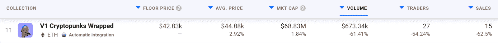
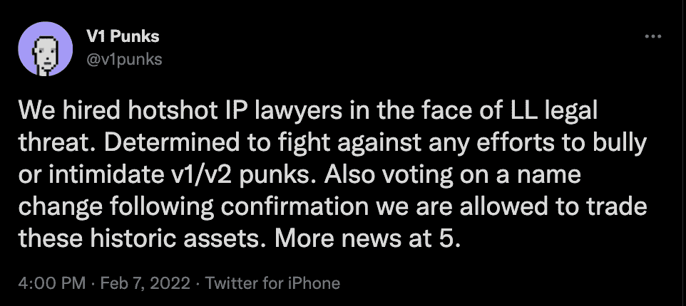
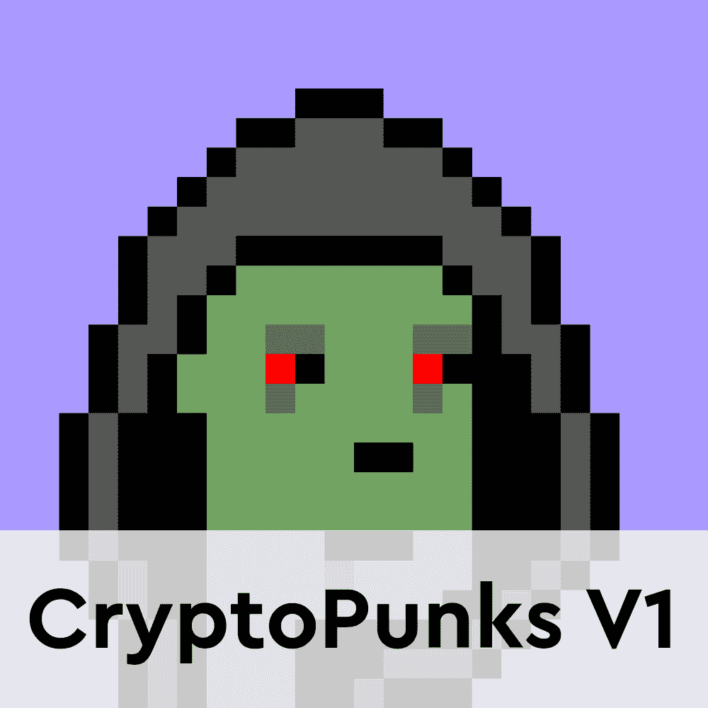
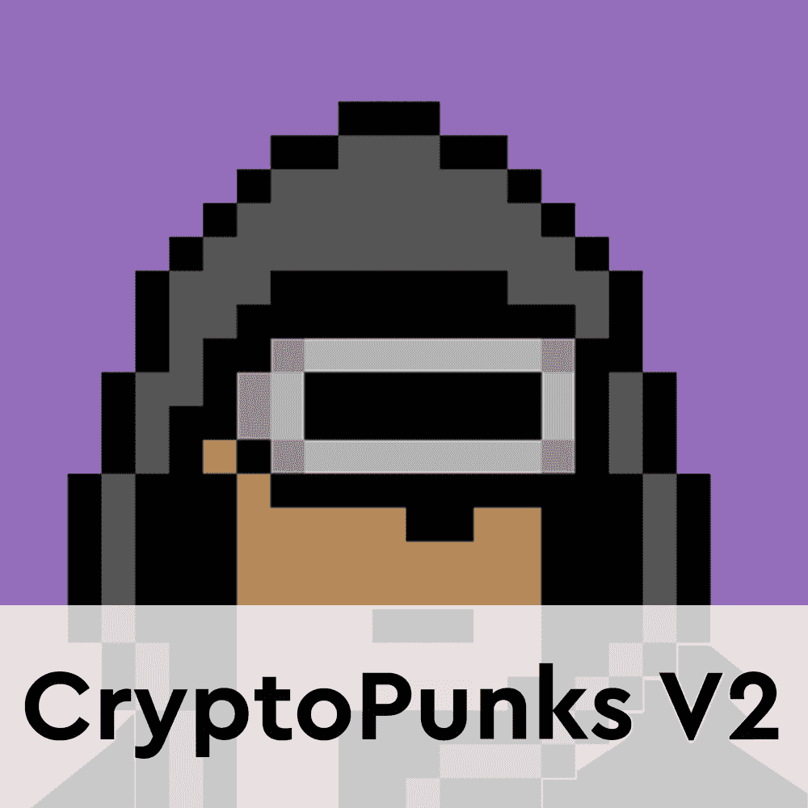
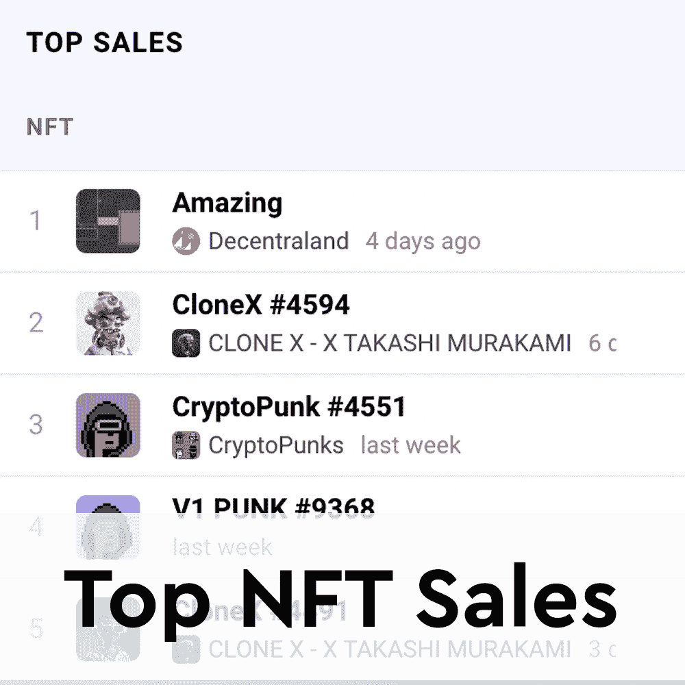

# V1 面临法律斗争

> 原文：<https://web.archive.org/web/https://dappradar.com/blog/cryptopunks-v1-face-legal-struggle>

## 当幼虫实验室团队出售他们的 v1 时，OpenSea 取下了收集品

随着幼虫实验室宣布反对这个由社区主导的项目，V1 的 CryptoPunks 经历了动荡的 24 小时。除了公开驳回 V1 的收藏，幼虫实验室还采取行动，要求 OpenSea 将 V1 朋克从他们的列表中删除。

有趣的是，在撰写本文时，幼虫实验室团队成员已经以总计近 230 ETH 或超过 710，000 美元的价格出售了他们拥有的加密朋克 V1，几天后就出现了这种情况。开发者解释说，他们认为这将表明他们不喜欢 V1 项目。然而，从本质上来说，他们设法推高了底价，吸引了对该项目的额外关注。在写这篇文章的时候，V1 朋克的底价是 42.830 美元。

DappRadar [最近报道了 CryptoPunks V1 项目](https://web.archive.org/web/20221007092918/https://dappradar.com/blog/cryptopunks-v1-resurrected-in-wrapped-form/)，因为这个收藏正稳步吸引人们的注意。然而，随着最近从 OpenSea 退市，V1 朋克智能合约处理的交易量和交易量开始走下坡路。OpenSea 是 NFT 最大的市场，1 月份的交易额为 45 亿美元。市场上没有 V1 朋克，很难接触到更多的观众。

重要的是，幼虫实验室的行为被认为是不恰当的，甚至被比作拉地毯。该团队首先出售他们的 V1 朋克，然后开始攻击 DMCA 的项目。在某些方面，这些指控是有根据的。看到这一点，CryptoPunks V1 社区通过几项重要的治理投票采取了行动。

## 处于守势的 V1

为了回应幼虫实验室采取的行动，CryptoPunks V1 社区雇佣了一个知识产权律师团队。根据官方推特的消息，V1 社区将反对任何通过幼虫实验室在 V1 收藏和 V2 官方朋克之间制造紧张的努力。

此外，CryptoPunks V1 社区正在就该项目的更名进行投票。目的是把他们从幼虫实验室的收藏中分离出来。这一声明发布后，V1 朋克的 Twitter 账户出现了一波质疑和指控。其中大多数声称该项目是一个欺诈和骗局。

本质上，V1 的密码朋克可以被认为是一个骗局。重要的是，NFTs 中的所有艺术品最初都是由幼虫实验室创作的。然而，有一种观点认为，V1 朋克只是区块链上复活的代码，允许收藏者安全地交易他们的加密资产。类似的事情发生在去年，当像隐密猫、月猫和隐密头骨这样的项目被重新发现时。

达普拉达将继续关注 V1 和 V2 之间的战斗。如果你想了解这两个系列的更多信息，请点击下面的链接。此外，你可以在 Twitter 上关注 DappRadar，以获得关于朋克崩溃的最新消息。

[<picture></picture>](https://web.archive.org/web/20221007092918/https://dappradar.com/blog/cryptopunks-v1-resurrected-in-wrapped-form)[<picture></picture>](https://web.archive.org/web/20221007092918/https://dappradar.com/ethereum/collectibles/cryptopunks)[<picture></picture>](https://web.archive.org/web/20221007092918/https://dappradar.com/nft/collections) NewsletterUnsubscribe at any time. [T&Cs](https://web.archive.org/web/20221007092918/https://dappradar.com/terms) and [Privacy Policy](https://web.archive.org/web/20221007092918/https://dappradar.com/privacy-policy)