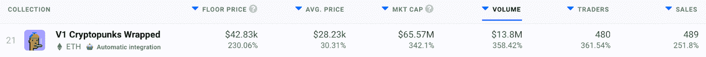
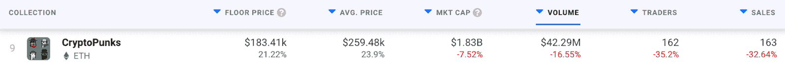

# V1 隐朋克以包裹的形式复活

> 原文：<https://web.archive.org/web/https://dappradar.com/blog/cryptopunks-v1-resurrected-in-wrapped-form>

## 过去一周，原始加密朋克的交易量飙升

CryptoPunks V1 是以太坊区块链的首个系列，多亏了包装机制，它才得以复活。现在，拥有 V1 朋克的收藏者可以包装代币并安全交易，而不会成为迫使幼虫实验室重写收藏智能合同的初始错误的受害者。

当 CryptoPunks 于 2017 年 6 月由幼虫实验室在 2017 年首次推出时，NFT 最初是免费的，任何有以太坊钱包的人都可以申请，而 mint 只收取汽油费。朋克乐队在发行时大受欢迎。所有这些都很快被认领了。不幸的是，最初的 CryptoPunks 智能合约包含一个代码错误。这导致在购买时以太坊被分配给买方而不是卖方。

换句话说，买家可以立即获得退款，并保留朋克。在这个 bug 被发现后不久，一个新版本的朋克合约(版本 2，V2)发布了，朋克被空投到这个新合约。然而，现在一组狂热分子创造了一个包装合同，允许 V1 朋克的主人安全地交易他们的 NFT。

需要注意的是，幼虫实验室不支持 V1 加密朋克。这是一个社区的努力，以恢复这一被遗忘的部分加密朋克的历史。现在也由社区来决定哪个版本更有价值。

## V1 的密码朋克 vs V2 的密码朋克

在过去的七天里，V1 的密码朋克吸引了大量的活动。该系列共售出 489 件，交易额达到 1380 万美元。这是一个在短短一周内超过 358%的峰值。

另一方面， [CryptoPunks V2](https://web.archive.org/web/20221002000145/https://dappradar.com/ethereum/collectibles/cryptopunks) 系列产生了更大的交易量，达到 4329 万美元。不过，如果我们看看该系列的销售额，情况就大不相同了。与记录了近 5000 笔交易的 V1 不同，V2 只成功吸引了 163 笔交易。

销售数字上的这种差异可能暗示着 crypto 朋克 V1 可能会被超越。尽管由于较高的底价，V2 仍在创造更大的交易量，但销售活动也是一个需要监控的重要统计数据。

DappRadar 将继续监视 CryptoPunks 集合的两个版本。如果你也想追踪 NFT 的销售数据，请前往 [DappRadar 顶级 NFT 收藏](https://web.archive.org/web/20221002000145/https://dappradar.com/nft/collections/1)页面。此外，你可以加入 [DappRadar PRO](https://web.archive.org/web/20221002000145/https://dappradar.com/token/pro) ，在 DappRadar 社区的独家 Discord 频道中讨论销售数据。

 NewsletterUnsubscribe at any time. [T&Cs](https://web.archive.org/web/20221002000145/https://dappradar.com/terms) and [Privacy Policy](https://web.archive.org/web/20221002000145/https://dappradar.com/privacy-policy)