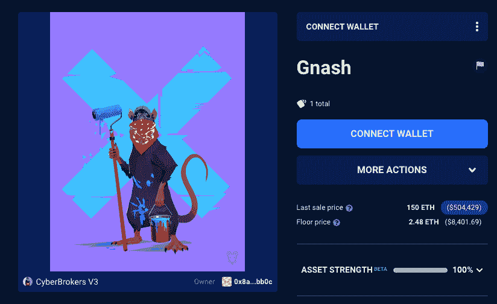
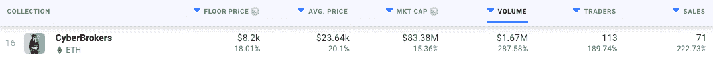
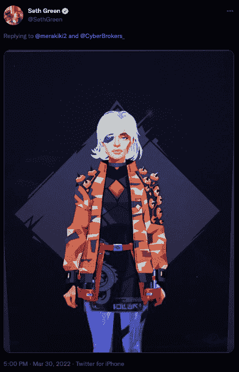

# 网络经纪人从造币厂到 20 天获利 50 万美元

> 原文：<https://web.archive.org/web/https://dappradar.com/blog/cyberbrokers-from-mint-to-500000-profit-in-20-days>

## 网络经纪人吸引眼球，赛斯·格林等名人加入社区

乔西·贝里尼的《网络经纪人》是三月最受追捧的 NFT 藏品之一，一些收藏家已经成功从中获利。贾斯汀·凯斯(Justin Case)自 2018 年以来一直是 OpenSea 的用户，在将网络经纪人 Gnash 出售给 j1mmy.eth 后，他已经获得了略低于 150 ETH 的利润

出售发生在官方造币厂发行 20 天后，在此期间，NFT 的定价为 0.35 ETH。贾斯汀·凯斯(Justin Case)铸造了 NFT，并把它转移到一个他命名为 [GnashNest](https://web.archive.org/web/20221007192556/https://dappradar.com/hub/wallet/eth/0x2394d43219a22f454ccc322893c80ba8233e7b99/assets) 的热门钱包里。现在，网络经纪人 Gnash 的新主人是 j1mmy.eth，一位多产的 NFT 收藏家和企业家，他拥有[四家网络经纪人 NFT](https://web.archive.org/web/20221007192556/https://dappradar.com/hub/wallet/eth/0x8ad272ac86c6c88683d9a60eb8ed57e6c304bb0c/nfts/1/cyberbrokers-v3)，几件[乔西·贝里尼艺术品](https://web.archive.org/web/20221007192556/https://dappradar.com/hub/wallet/eth/0x8ad272ac86c6c88683d9a60eb8ed57e6c304bb0c/nfts/1/josie)，以及大量其他高价值收藏品。

Gnash 是迄今为止最卖座的网络经纪人之一。除了 Justin Case 获得的几乎不可思议的利润之外，j1mmy.eth 似乎对这个项目有很大的预测。他还花了 100 ETH 买了藏品中的另一幅 NFT。在撰写本文时，NFT 一家网络经纪商的底价是 2.4 ETH，约合 8400 美元。从这个角度来看，根据新主人的说法，Gnash 的价格比 NFT 的底价高出约 60 倍。

除了 Gnash，贾斯汀案件铸造了一个网络经纪人 NFT。目前它仍在他手中。此外，他还拥有[六辆多合一 NFT](https://web.archive.org/web/20221007192556/https://dappradar.com/hub/wallet/eth/0x1e83b53d58084f649e9b4f007d418cfc126d1123/nfts/1/multi-of-unity)和[巨型加密城 NFT](https://web.archive.org/web/20221007192556/https://dappradar.com/hub/assets/eth/0xc20cf2cda05d2355e218cb59f119e3948da65dfa/17963) 。尽管如此，这些公司的价值都无法与 Gnash 实现的 50 万美元利润相提并论。

## 网络经纪人红极一时

在过去的几个星期里，网络经纪人已经成为 NFT 空间中谈话和活动的中心话题。艺术家乔西·贝里尼的最新项目吸引了众多投资者的目光。据 [DappRadar 数据](https://web.archive.org/web/20221007192556/https://dappradar.com/nft/collections)显示，仅在过去的 24 小时内，CyberBrokers 的销售数量就增长了超过 222%。

当然，50 万美元的 Gnash 销售将交易量推高至 167 万美元，与前一天相比增长了 287%。除了令人印象深刻的销售，名人对该系列的活动也在增加。

赛斯·格林在更受欢迎的网络经纪人粉丝中脱颖而出。这位演员拥有四辆[网络经纪人 NFT](https://web.archive.org/web/20221007192556/https://dappradar.com/hub/wallet/eth/0xedbd2c0a9a813789ba6f2ed5427f6c0bb9d2e906/nfts/1/cyberbrokers-v3)，是几周前以底价购买的。这四家公司的总购买价值约为 10 ETH，接近 33，000 美元。

格林似乎也是网络经纪人社区的活跃成员，最近在 Twitter 上展示了他的一个网络经纪人。除了网络经纪人，这位演员还在宇迦实验室的收藏上投入巨资，拥有[一个 BAYC](https://web.archive.org/web/20221007192556/https://dappradar.com/hub/wallet/eth/0xedbd2c0a9a813789ba6f2ed5427f6c0bb9d2e906/nfts/1/bored-ape-yacht-club-3) 和[两个 MAYC NFT](https://web.archive.org/web/20221007192556/https://dappradar.com/hub/wallet/eth/0xedbd2c0a9a813789ba6f2ed5427f6c0bb9d2e906/nfts/1/mutant-ape-yacht-club)。他还拥有[3 Women NFTs](https://web.archive.org/web/20221007192556/https://dappradar.com/hub/wallet/eth/0xedbd2c0a9a813789ba6f2ed5427f6c0bb9d2e906/nfts/1/world-of-women-nft)和[两个涂鸦收藏品](https://web.archive.org/web/20221007192556/https://dappradar.com/hub/wallet/eth/0xedbd2c0a9a813789ba6f2ed5427f6c0bb9d2e906/nfts/1/doodles-official)。

达普拉达将继续关注乔西·贝里尼的热门系列，因为它达到了新的高度，吸引了更多杰出的 NFT 爱好者。如果你想了解更多关于网络经纪人的信息，请查看他们的官方 dapp 页面。此外，你可以在[的 Twitter](https://web.archive.org/web/20221007192556/https://twitter.com/dappradar) 上关注 DappRadar，首先获得最新的 NFT 新闻。

 NewsletterUnsubscribe at any time. [T&Cs](https://web.archive.org/web/20221007192556/https://dappradar.com/terms) and [Privacy Policy](https://web.archive.org/web/20221007192556/https://dappradar.com/privacy-policy)