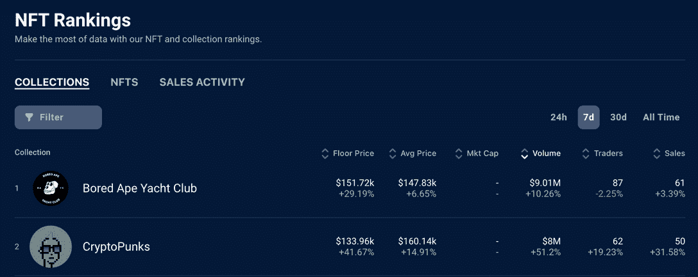

# CyberBrokers V3，名词& opensea . eth–NFT 销售亮点

> 原文：<https://web.archive.org/web/https://dappradar.com/blog/cyberbrokers-v3-nouns-opensea-eth-nft-sales-highlights>

## 查看 7 月 31 日至 8 月 7 日之间的 NFT 销售亮点排名

本周的 NFT 销售亮点是 CyberBroker V3 和名词系列中的几个 NFT，同时有人抢到了 Opensea.eth ENS 域名。跟随周趋势，CryptoPunks 和 Bored Ape 游艇俱乐部 NFTs 继续吸引最高的交易量。

在过去的七天里，NFT 最高价值的拍卖是 CryptoPunk #7622 ，它以 260 ETH 的价格易手，约合 45.1 万美元。其次，售价为 195 ETH，约合 33.7 万美元的[无聊猿游艇俱乐部#6567](https://web.archive.org/web/20220925231434/https://dappradar.com/hub/assets/eth/0xbc4ca0eda7647a8ab7c2061c2e118a18a936f13d/6567) ，里面有一只穿着豹纹长袍、头戴金冠的猿。进一步深入到[BAYC # 6567](https://web.archive.org/web/20220925231434/https://dappradar.com/hub/wallet/eth/0x01477733654da24e03f497c7fe8d1a5e25b7795a/nfts)主人的钱包，发现了一个价值约 154 万美元的 NFT 收藏，还有[几个蓝筹股 NFT。](https://web.archive.org/web/20220925231434/https://dappradar.com/hub/wallet/eth/0x01477733654da24e03f497c7fe8d1a5e25b7795a/nfts)

在这些高价值销售的背后，我们看到一群朋克和 T2、NFT 和 T3 的收藏品在转手。更有趣的是， [CryptoPunk NFTs](https://web.archive.org/web/20220925231434/https://dappradar.com/hub/nft-explorer/collection/cryptopunks) 的底价涨幅超过 41%，而 [BAYC 在过去七天的涨幅超过 29%](https://web.archive.org/web/20220925231434/https://dappradar.com/hub/nft-explorer/collection/bored-ape-yacht-club) ，两者的平均价格分别上涨了 7%和 15%。

[BAYC and CryptoPunks in the top two spots](https://web.archive.org/web/20220925231434/https://dappradar.com/hub/nft-explorer?period=week)

## OpenSea.eth

除了更成熟的 [BAYC 和 CryptoPunk collection 销售](https://web.archive.org/web/20220925231434/https://dappradar.com/nft/sales)之外，NFT 的各种销售亮点都值得一探究竟。最有趣的可能是[以 99.89 ETH，或大约 17.3 万美元的价格出售 ENS 域名 opensea.eth](https://web.archive.org/web/20220925231434/https://dappradar.com/hub/assets/eth/0x57f1887a8bf19b14fc0df6fd9b2acc9af147ea85/100567917540867090294947113176792694600738763480337589720715443766007246631145) 。NFT 倡导者和有影响力的鄂霍次克人[发了一条推特](https://web.archive.org/web/20220925231434/https://twitter.com/NFTherder/status/1554690299976454145)声称 OpenSea 已经购买了这个 ENS 域名。

[查看购买 ENS 域名的钱包](https://web.archive.org/web/20220925231434/https://dappradar.com/hub/wallet/eth/0x5b3256965e7c3cf26e11fcaf296dfc8807c01073/assets)内部，我们看到一个价值超过 130 万美元的加密组合[和几个 NFT，包括](https://web.archive.org/web/20220925231434/https://dappradar.com/hub/wallet/eth/0x5b3256965e7c3cf26e11fcaf296dfc8807c01073/assets) [opensea.eth 和 seavault.eth](https://web.archive.org/web/20220925231434/https://dappradar.com/hub/wallet/eth/0x5b3256965e7c3cf26e11fcaf296dfc8807c01073/nfts/1/ens) ，这将表明这是 opensea 的官方持有钱包。然而，这仍然是未经证实的写作。

在其他 OpenSea 新闻中，NFTs 和 DAOs 的律师 Jesse Halfon 已经对 NFT 市场 OpenSea 提起诉讼，指控其盗窃 NFT 保单。这个案例集中在 OpenSea 如何处理被报告为被盗的 NFT。政策规定，OpenSea 不允许在平台上出售偷来的 NFT。然而，由于这一政策，用户发现他们的 NFT 被锁定，现在无法出售。

更有趣的是，杰西·哈尔丰通过小额索赔法院提起诉讼，许多用户现在要求加入该案件，使其成为集体诉讼。DappRadar 将监测局势，并在事态发展时作出报告。

### 查看以下 NFT 销售亮点的完整列表:

*   [opensea . ETH](https://web.archive.org/web/20220925231434/https://dappradar.com/hub/assets/eth/0x57f1887a8bf19b14fc0df6fd9b2acc9af147ea85/100567917540867090294947113176792694600738763480337589720715443766007246631145)–99.89 ETH/$ 16.39 万-[买家钱包](https://web.archive.org/web/20220925231434/https://dappradar.com/hub/wallet/eth/0x5b3256965e7c3cf26e11fcaf296dfc8807c01073)
*   [名词# 109](https://web.archive.org/web/20220925231434/https://dappradar.com/hub/assets/eth/0x9c8ff314c9bc7f6e59a9d9225fb22946427edc03/109)–95 ETH/$ 161，760—[买家钱包](https://web.archive.org/web/20220925231434/https://dappradar.com/hub/wallet/eth/0x99e14da3a40ae897ebd88e972683f0046b4d7fe6)
*   [fiden za # 23](https://web.archive.org/web/20220925231434/https://dappradar.com/hub/assets/eth/0xa7d8d9ef8d8ce8992df33d8b8cf4aebabd5bd270/78000023)–85 ETH/$ 135，470—[买家钱包](https://web.archive.org/web/20220925231434/https://dappradar.com/hub/wallet/eth/0x585f4fbe2d2a889c286fa71fb81d01f30773f4b1)
*   [名词# 134](https://web.archive.org/web/20220925231434/https://dappradar.com/hub/assets/eth/0x9c8ff314c9bc7f6e59a9d9225fb22946427edc03/134)–82 ETH/$ 132，820—[买家钱包](https://web.archive.org/web/20220925231434/https://dappradar.com/hub/wallet/eth/0x7decf7a31168778f311c57b9a948abaa7321001e)
*   [CyberBrokersV3 Spirita](https://web.archive.org/web/20220925231434/https://dappradar.com/hub/assets/eth/0x892848074ddea461a15f337250da3ce55580ca85/6981)–69 ETH/$ 114，290—[买家钱包](https://web.archive.org/web/20220925231434/https://dappradar.com/hub/wallet/eth/0xeae448e1537aa3c6b2a37e2ab26bba7ca2de9436)
*   [妮娜的超酷世界](https://web.archive.org/web/20220925231434/https://dappradar.com/hub/assets/eth/0x670d4dd2e6badfbbd372d0d37e06cd2852754a04/4969)–50 WETH/$ 80，570—[买家钱包](https://web.archive.org/web/20220925231434/https://dappradar.com/hub/wallet/eth/0xd0afdb750dd8c5c6a82a17e90333944d1ecdfcea)
*   [志那都红豆# 571](https://web.archive.org/web/20220925231434/https://dappradar.com/hub/assets/eth/0xed5af388653567af2f388e6224dc7c4b3241c544/571)–50 ETH/$ 85，500-[买家的钱包](https://web.archive.org/web/20220925231434/https://dappradar.com/hub/wallet/eth/0x9b41c74c35ef76d4d0e7f01a253ff6bdb52d1e05)
*   [艺术块–原型# 494](https://web.archive.org/web/20220925231434/https://dappradar.com/hub/assets/eth/0xa7d8d9ef8d8ce8992df33d8b8cf4aebabd5bd270/23000494)–45 WETH/$ 75，000-[买家钱包](https://web.archive.org/web/20220925231434/https://dappradar.com/hub/wallet/eth/0x144822a06f8eda20012f1310b51dbeb1bbfbc139)
*   [CloneX # 2429](https://web.archive.org/web/20220925231434/https://dappradar.com/hub/assets/eth/0x49cf6f5d44e70224e2e23fdcdd2c053f30ada28b/16250)–45 ETH/$ 73，660—[买家钱包](https://web.archive.org/web/20220925231434/https://dappradar.com/hub/wallet/eth/0x18beceb3674f20ee3f75c03ef06542c8c882d088)
*   [CryptoDickbutt # 324](https://web.archive.org/web/20220925231434/https://dappradar.com/hub/assets/eth/0x42069abfe407c60cf4ae4112bedead391dba1cdb/324)–32.69 ETH/$ 55300—[买家钱包](https://web.archive.org/web/20220925231434/https://dappradar.com/hub/wallet/eth/0x3f7047a40f6d24902ef114931252e9777c442b24)

[https://web.archive.org/web/20220925231434if_/https://www.youtube.com/embed/Hx8bdw4kQio?feature=oembed](https://web.archive.org/web/20220925231434if_/https://www.youtube.com/embed/Hx8bdw4kQio?feature=oembed)

## NFT 市场的演变

尽管 NFT 市场自 2021 年 6 月以来首次未能达到 10 亿美元的交易额，但泡沫破裂的问题并不那么容易回答。市场正面临历史性的熊市。流动性下降，这种下降严重影响了加密货币的价格，转售的潜在利润也不是很高。

因此，许多用户已经[决定清算他们在 NFT 市场的投资](https://web.archive.org/web/20220925231434/https://dappradar.com/blog/dappradar-blockchain-industry-report-july-2022/#bubble-burst)，等待更好的时机或者转移到通常称为“持有”的位置，直到“加密冬天”过去。以美元衡量的交易量显示市场正在收缩，环比下降 25%。此外，从 2021 年 7 月起，[的交易者数量减少了 8%](https://web.archive.org/web/20220925231434/https://dappradar.com/blog/dappradar-blockchain-industry-report-july-2022/#bubble-burst),但仍增加了 40%。

或许更有意思的是，随着新进入者扩大他们的产品和新平台的出现，NFT 市场的格局正在发生变化。我们正在见证两个新市场的出现:2022 年 7 月 11 日首次亮相的 [Gamestop NFT 市场](https://web.archive.org/web/20220925231434/https://nft.gamestop.com/)，以及 2022 年 7 月 19 日在[推出的](https://web.archive.org/web/20220925231434/https://mobile.twitter.com/nickelodeon_nft/status/1549480228828975105)[Nickelodeon NFT 市场](https://web.archive.org/web/20220925231434/https://nickelodeon.xyz/marketplace/)。

在运营的头两天，GameStop NFT 市场[超过了比特币基地 NFT 市场](https://web.archive.org/web/20220925231434/https://www.coindesk.com/business/2022/07/19/gamestops-nft-marketplace-opening-week-sales-eclipses-coinbase-volume/)。自推出以来，前 50 名藏品的总交易量约为 1200 万美元。[赛博船员【C4】](https://web.archive.org/web/20220925231434/https://nft.gamestop.com/collection/cybercrew?r=MCwzNzE4Myw1OQ%3D%3D)系列销量领先，3,000 ETH。此外， [Nickelodeon 的 NFT 市场](https://web.archive.org/web/20220925231434/https://nickelodeon.xyz/)的推出也取得了巨大成功；在不到三周的时间里，它见证了超过 200 万美元的总成交量。

 NewsletterUnsubscribe at any time. [T&Cs](https://web.archive.org/web/20220925231434/https://dappradar.com/terms) and [Privacy Policy](https://web.archive.org/web/20220925231434/https://dappradar.com/privacy-policy)