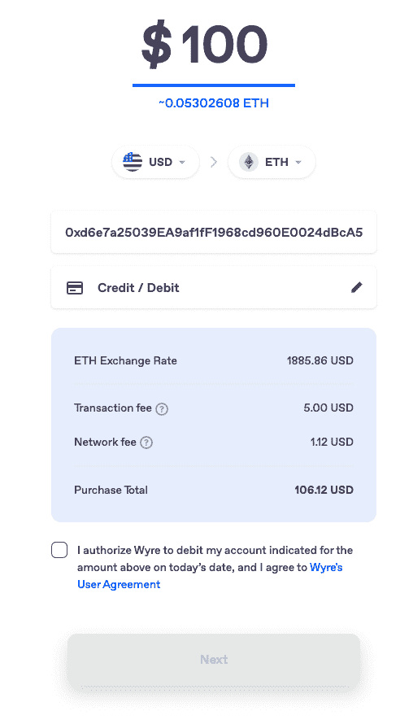

# 直接由信用卡支付驱动的 Dapp 活动

> 原文：<https://web.archive.org/web/https://dappradar.com/blog/dapp-activity-directly-powered-with-credit-card-payments>

## Wyre SmartRamps 连接菲亚特支付和智能合同

随着 SmartRamps 的推出，Web3 支付平台和开发商 Wyre 在提供工具以促进大规模采用方面又迈进了一步。这意味着 dapp 构建者可以将他们的智能合同连接到传统的支付方式，允许最终用户通过直接交易与 Web3 进行交互。

认识到大部分 Web3 开发者没有资源、专业知识或许可证来使这些步骤对用户来说更简单，Wyre 推出了 SmartRamps 来消除障碍，并允许最终用户像在线购物一样轻松地访问 Web3。

SmartRamps 允许构建者将非加密原生程序加载到他们的 dapps 中，构建简单的用户购买流程，并创新新的智能合同用例。这些是推动区块链和 dapps 进一步走向大众化所需要的最关键的因素。

## SmartRamps 简介

[SmartRamps](https://web.archive.org/web/20220630233210/https://docs.sendwyre.com/docs/smartramps) 用最简单的话来说，就是对智能合约的直接冲击。这意味着建筑商可以将他们的智能合同与传统的支付方式联系起来，让最终用户可以通过直接交易与 Web3 互动。

智能合约广泛应用于 DeFi dapps、区块链游戏、DAOs、时尚、NFTs、创造者经济、供应链以及其他一些新颖的用例中。有了 SmartRamps，用户现在可以利用这些智能合同的效用，而不需要他们以前需要的深入的技术知识。这对于主流的采用无疑是至关重要的。

更重要的是，关于 Web3 和去中心化的一切的核心都有一个被误解的元素——智能合同。它们是成功构建 Web3 的基石，而大多数人甚至不知道它们是什么。

没关系，真的，因为他们都是被设计来执行特定规则的数字中间人。就像自动售货机的工作方式。你把钱放进去，然后按下火星条按钮。你得到了玛氏巧克力棒，因为合同被完美地执行了，因为机器被编程为按命令执行。除了当物品卡在那个圆形的有风的东西里时，你必须敲打玻璃才能把它释放出来。你可以认为这是一次失败的交易。

此外，允许用户使用信用卡或借记卡进行交易的 dapps 在入职时非常成功。当前的系统使得普通消费者很难获得 Web3 提供的机会。他们必须使用 onramps、exchanges、多钱包、bridges 等。他们不得不自学如何驾驭资金流动来进行购买。虽然有些人接受了挑战，但许多人却退缩了，从未迈出进入 Web3 的第一步。

## DappRadar 使用 Wyre

Wyre 已经很好地整合了几个基本的 Web3 服务、NFT 市场和交易所，DappRadar 使用 Wyre 允许网站访问者给他们的加密钱包充值。例如，一旦用户找到他们喜欢的 NFT，他们可以简单地点击立即购买并被重定向到 Wyre Widget，在那里他们可以使用信用卡将 ETH 和 40 多种加密资产添加到他们的钱包中。

Wyre 有潜力将 crypto 提升到一个新的水平，而且可以说已经在这么做了。SmartRamps 的推出将使 dapp 开发人员能够利用现有最平滑的菲亚特 onramps 推出其 dapp 的最佳迭代。Wyre 正在推出有史以来第一个 SmartRamp with Sequence，但计划最终开源 SmartRamp 代码，以便整个生态系统可以向大众敞开大门。

可能性是无穷无尽的，熊市为建筑提供了完美的条件。监视发布会如何进行以及哪个项目将采用 SmartRamps 将是非常有趣的。

 NewsletterUnsubscribe at any time. [T&Cs](https://web.archive.org/web/20220630233210/https://dappradar.com/terms) and [Privacy Policy](https://web.archive.org/web/20220630233210/https://dappradar.com/privacy-policy)

***以上不构成投资建议。此处给出的信息仅供参考。请行使尽职调查，做你的研究。作者持有多种加密货币的头寸，包括 BTC、瑞士法郎和雷达。***