# 2022 年 Dapp 行业报告

> 原文：<https://web.archive.org/web/https://dappradar.com/blog/dapp-industry-report-2022-dapp-industry-proves-resilient-in-crypto-winter>

## Dapp 行业在寒冬中表现出弹性

多好的一年啊！当回顾 Web3 和 dapp 行业的发展时，2022 年将永远是一个里程碑。

围绕去中心化理念构建的所有新型创新商业模式，以及传统行业和企业对区块链技术的日益采用，导致了更广泛的 dapps 的发展。不同行业的许多大公司都在探索如何进入 Web3 世界。

*结果；尽管经历了严酷的加密冬天，我们还是看到了 dapp 行业令人难以置信的恢复力。*

*2022 年，DappRadar 覆盖了 50 个区块链地区，跟踪了近 13，000 个 dapps 和超过 13，500 个 NFT 系列。dapps 的高数量反映了该行业的状况，尽管条件不利，但成功的项目仍在继续建设。*

2023 年将会更加精彩！

是的，我们已经看到意外事件可能会在几天甚至几小时内改变一切。但是 dapp 行业将继续发展和成熟，不断开发和采用新的创新应用。

我们知道熊市是为了建设，所以我们会继续做下去。

祝大家新年快乐！

Skirmantas Januškas

首席执行官/联合创始人 DappRadar

**对于区块链、dapp 和密码行业来说，2022 年无疑是一系列的高潮和低谷。宏观因素，如美国美联储加息、高通胀、裁员和经济增长普遍放缓，导致了许多不确定性。恶劣的市场条件在很大程度上成为了这一年大部分时间的标准，但这并没有阻止区块链和 dapp 行业取得许多令人难以置信的技术成就。**

分散式金融(DeFi)领域的改善就像零知识(ZK)生态系统的进军一样，不管怎样都在继续。在过去的一年里，ZK proofs 展示了其在区块链以外的应用。它们可以在实现新型身份认证方面发挥至关重要的作用，并有可能为集中化参与者创建新的责任标准。随着迪士尼、星巴克、阿迪达斯、耐克和许多其他家喻户晓的品牌开始接受区块链，机构对加密技术的采用也在快速发展。大型银行也对该领域表现出越来越大的兴趣。例如，富达为投资者推出了一项加密服务，贝莱德与比特币基地合作，为其机构客户提供加密服务，高盛也在创建一项加密数据服务。

今年的一个行业亮点是 9 月份的以太坊合并，网络从工作验证(PoW)过渡到利益验证(PoS)，以太坊的能耗大幅降低了 99.9%。其次，专心致志的开发商在这次熊市中继续建设，最近已经有几个可靠的项目走出熊市。尽管是艰难的季节，dapp 生态系统的另一个好处是从 2022 年带来的每一次灾难性事件中吸取的教训。许多项目——甚至是 crypto 中的整个类别——在这些情况下显示了它们的弹性。如果说 crypto 的存在证明了什么的话，那就是它可以在整个不利时期生存下来。正因为如此，dapp 行业将以 2022 年赋予它的强度和耐用性水平进入 2023 年。

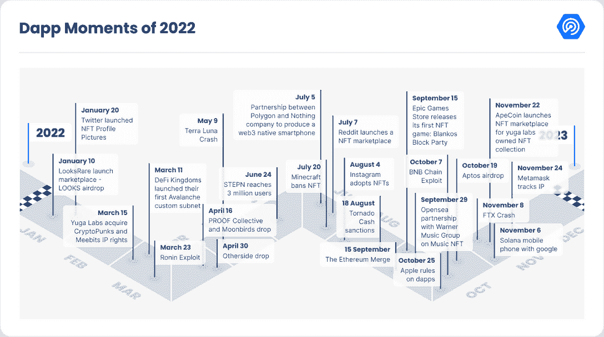

## 关键要点

*   dapp(去中心化应用)行业在 2022 年经历了 50%的独特活跃钱包(dUAW)增长，从 2021 年的平均 158 万个每日 dUAW 上升到 2022 年的平均 237 万个。然而，由于各种事件，包括乌克兰战争、Terra Luna 的崩溃和 FTX 局势，该行业一直呈下降趋势。尽管面临这些挑战，dapp 行业已经展示了其弹性和成熟度，而消费者和企业对区块链技术的采用表明该行业的未来是光明的。
*   2022 年，DeFi 行业面临的挑战包括 Terra Luna 平台的崩溃和加密货币价格的下跌，导致锁定的总价值(TVL)大幅下降 73.97%，降至 12 月的 550 亿美元。在这些困难中，DeFi 部门继续扩张和创新，智能合约金融应用程序和传统金融机构使用 DeFi 协议进行试点或交易。
*   以太坊仍然是占主导地位的 DeFi 协议，在 TVL 为 321.2 亿美元，下降了 74.56%。BNB 链重新夺回了第二大 DeFi 生态系统的地位，下降了 62.50%，达到 65 亿美元。第二层解决方案似乎受加密动荡的影响最小，Arbitrum 下跌 12.07%，至 17.4 亿美元。乐观的 TVL 增长了 127.60%，达到 6.69 亿美元。
*   今年 NFT 市场的环比指标似乎是积极的，因为 2022 年 NFT 交易量与 2021 年相比仅增长了 0.41%，平均 ETH 价格为 2015 美元。进一步来看，独立交易商数量同比增长 876.89%，达到 1060 万。销量也呈上升趋势，今年总体增长 10.16%，达到 6835 万辆。
*   NFT 蓝筹系列仍然是今年交易量最大的系列，并继续关注其路线图。志那都红豆成为第一个出现在 F1 赛车上的 NFT 品牌。VeeFriends 在 7 月份完成了 5000 万美元的种子融资，PROOF 的 Moonbirds 在 8 月份又筹集了 5000 万美元，以进一步扩大品牌规模。
*   宇迦实验室继续扩张，收购了 CryptoPunks、Meebits 和 NFT 初创公司 WENEW Labs。其 NFT 藏品在第四季度占据了 NFT 市场的主导地位，在 100 个最有价值的 NFT 藏品中占 55%，价值 150 亿美元。
*   今年，新的参与者进入了 NFT 市场行业。X2Y2 在排行榜上攀升，在一年内成为 NFT 交易量排名前十的市场之一，交易量超过 15 亿美元。在同样的趋势下，10 月份推出的 Blur 在两个月内成为 2022 年 NFT 十大交易市场中的最后一名，交易量超过 2.05 亿美元。然而，Opensea 并没有失去其主导地位，即使销量在过去一个月有所下降，仍然占整个 NFT 有机交易量的 73.1%。
*   2022 年，区块链游戏占所有 dapp 活动的 49%，平均每天有 115 万个独立活跃钱包，74 亿次交易。《夹板王国》仍然是最受欢迎的游戏，2022 年每月有 217，914 个独特的活跃钱包，增长了 85.78%。《异形世界》以 178，118 个月的独立活跃钱包排名第二，下降 3.67%。
*   2022 年，发生了 312 起加密攻击，造成了 487.4 亿美元的损失，是任何一年的最高值。Terra Luna 丑闻是这些攻击中最严重的，造成了 400 亿美元的损失。不包括这一事件，每次攻击的平均损失为 28.3 万美元，每月总损失为 7.28 亿美元。集中式平台是最常见的目标，损失总额为 447.1 亿美元。BNB 和 ETH 连锁店受到的攻击最多，拉地毯是最常见的攻击类型。
*   2022 年，加密货币和其他数字资产的监管格局出现了重大发展，欧洲推出了首个白宫加密法规法案和 MiCA 法规。这些规则和法律旨在为加密货币和其他数字资产的监管建立一个全面的框架，并表明了对区块链技术日益增长的重要性的认可。

## 内容

*   [Dapp 行业概述](https://web.archive.org/web/20230313162029/https://dappradar.com/blog/dapp-industry-report-2022-dapp-industry-proves-resilient-in-crypto-winter/#Dapp-Industry-Overview-) –[DeFi、赌博和游戏:2022 年平均每日唯一活跃钱包中最受欢迎的 Dapp 类别](https://web.archive.org/web/20230313162029/https://dappradar.com/blog/dapp-industry-report-2022-dapp-industry-proves-resilient-in-crypto-winter/#DeFi,-Gambling,-and-Games:-the-most-popular-categories-of-dapps)
    –[BNB 链和 WAX lead 协议](https://web.archive.org/web/20230313162029/https://dappradar.com/blog/dapp-industry-report-2022-dapp-industry-proves-resilient-in-crypto-winter/#BNB-Chain-and-WAX-lead-protocols-in-average-daily-Unique-Active-Wallets-in-2022)
    [–2022 年交易计数中的 WAX 和 Solana lead 协议](https://web.archive.org/web/20230313162029/https://dappradar.com/blog/dapp-industry-report-2022-dapp-industry-proves-resilient-in-crypto-winter/#WAX-and-Solana-lead-protocols-in-transaction-count-in-2022) [–2022 年提交给 DappRadar 的 Dapp 数量创纪录](https://web.archive.org/web/20230313162029/https://dappradar.com/blog/dapp-industry-report-2022-dapp-industry-proves-resilient-in-crypto-winter/#Record-number-of-dapps-submitted-to-DappRadar-in-2022)

*   [DeFi Dapps 概述](https://web.archive.org/web/20230313162029/https://dappradar.com/blog/dapp-industry-report-2022-dapp-industry-proves-resilient-in-crypto-winter/#DeFi-Dapps-Overview) [–DeFi Layer-2 协议在 2022 年在 TVL 实现强劲增长](https://web.archive.org/web/20230313162029/https://dappradar.com/blog/dapp-industry-report-2022-dapp-industry-proves-resilient-in-crypto-winter/#Top-DeFi-Layer-2-protocols-see-strong-growth-in-TVL-in-2022) [–采访 Blue Clarity，Trader Joe 营销主管](https://web.archive.org/web/20230313162029/https://dappradar.com/blog/dapp-industry-report-2022-dapp-industry-proves-resilient-in-crypto-winter/#Interview-with-Blue-Clarity,-Marketing-Lead-at-Trader-Joe)

*   [2022 年漏洞利用中最常见的黑客攻击](https://web.archive.org/web/20230313162029/https://dappradar.com/blog/dapp-industry-report-2022-dapp-industry-proves-resilient-in-crypto-winter/#Rug-pulls-and-access-control-breaches-among-most-common-hacks-in-exploits-in-2022)
    [——2022 年十大加密骗局、黑客攻击和漏洞利用](https://web.archive.org/web/20230313162029/https://dappradar.com/blog/dapp-industry-report-2022-dapp-industry-proves-resilient-in-crypto-winter/#Top-10-crypto-scams,-hacks-and-exploits-of-2022-)

*   [NFT 市场的现状:对连锁指标、蓝筹股集合、 领先的 NFT 市场](https://web.archive.org/web/20230313162029/https://dappradar.com/blog/dapp-industry-report-2022-dapp-industry-proves-resilient-in-crypto-winter/#The-State-of-the-NFT-Market:-a-review-of-on-chain-metrics,-blue-chip-collections,-and-leading-NFT-marketplaces)
    [–2022 年连锁指标预测 NFTs 前景看好](https://web.archive.org/web/20230313162029/https://dappradar.com/blog/dapp-industry-report-2022-dapp-industry-proves-resilient-in-crypto-winter/#2022-on-chain-metrics-forecast-a-bullish-future-for-NFTs)
    [–按市值分析前 100 名 NFT 藏品](https://web.archive.org/web/20230313162029/https://dappradar.com/blog/dapp-industry-report-2022-dapp-industry-proves-resilient-in-crypto-winter/#Analysis-of-the-top-100-NFT-collections-by-market-capitalization) [–探索 2022 年新 NFT 市场](https://web.archive.org/web/20230313162029/https://dappradar.com/blog/dapp-industry-report-2022-dapp-industry-proves-resilient-in-crypto-winter/#Exploring-the-top-new-NFT-marketplaces-of-2022) [–2022 年 NFT 市场竞争升温](https://web.archive.org/web/20230313162029/https://dappradar.com/blog/dapp-industry-report-2022-dapp-industry-proves-resilient-in-crypto-winter/#The-NFT-marketplaces-competition-heats-up-in-2022) [–版税困境](https://web.archive.org/web/20230313162029/https://dappradar.com/blog/dapp-industry-report-2022-dapp-industry-proves-resilient-in-crypto-winter/#Royalties-dilemma)
    [–顶级蓝筹藏品分析](https://web.archive.org/web/20230313162029/https://dappradar.com/blog/dapp-industry-report-2022-dapp-industry-proves-resilient-in-crypto-winter/#Analysis-of-the-top-blue-chip-collections)

*   [2022 年游戏行业占全行业使用量的 49%](https://web.archive.org/web/20230313162029/https://dappradar.com/blog/dapp-industry-report-2022-dapp-industry-proves-resilient-in-crypto-winter/#The-gaming-sector-accounts-for-49%-of-the-industry’s-usage-in-2022)
    [——专访 Animoca Brands](https://web.archive.org/web/20230313162029/https://dappradar.com/blog/dapp-industry-report-2022-dapp-industry-proves-resilient-in-crypto-winter/#Interview-with-Robby-Young,-CEO-of-Animoca-Brands) 首席执行官 Robby Young
*   [新法规反映了区块链技术日益增长的重要性](https://web.archive.org/web/20230313162029/https://dappradar.com/blog/dapp-industry-report-2022-dapp-industry-proves-resilient-in-crypto-winter/#New-regulations-reflect-growing-importance-of-blockchain-technology-)

*   [关闭](https://web.archive.org/web/20230313162029/https://dappradar.com/blog/dapp-industry-report-2022-dapp-industry-proves-resilient-in-crypto-winter/#Closing)

## Dapp 行业概述

dapp 行业在 2022 年继续增长和发展，独特的活动钱包数量显著增加。2021 年，日均唯一活跃钱包数(dUAW)为 158 万，但在 2022 年，这一数字增长了 50%，达到 237 万。消费者和企业不断采用区块链，加上投资者越来越多的支持，有助于行业整合。这一背景证实了该行业的弹性和成熟度。

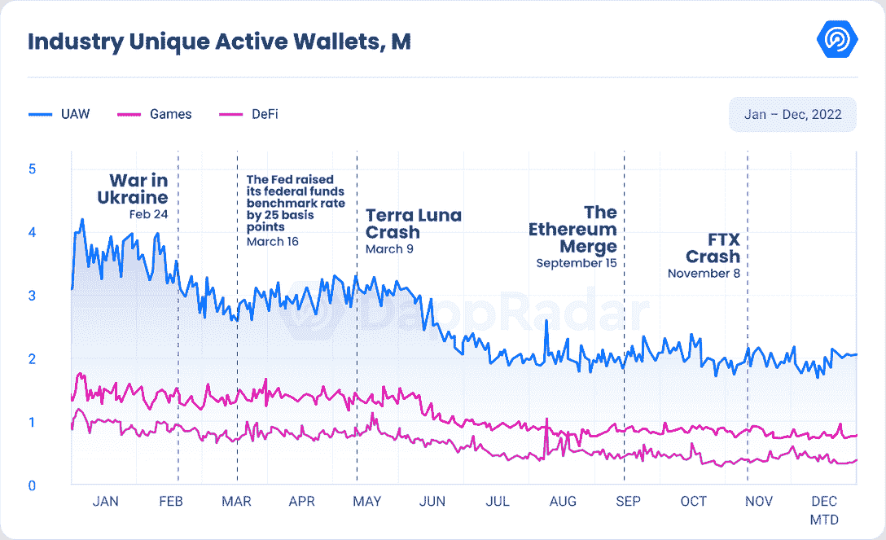

虽然 dapp 活动在年初创下历史新高，但全年的不同事件为行业独特的主动钱包创造了下降趋势。

2 月 24 日开始的乌克兰战争对 dapp 的前景产生了明显的影响。随着乌克兰和俄罗斯之间的紧张局势升级，许多乌克兰人转向区块链技术，将其作为安全可靠的资产存储方式。此外，不同的组织利用加密货币甚至 NFT 来帮助有需要的人。虽然对区块链解决方案的需求激增导致该地区独特的活跃钱包数量增加，但随着宏观经济形势变得黯淡，接下来几周连接到 dapps 的日常钱包数量减少了。

尽管经济条件恶劣，dapp 行业开始复苏，在 5 月初恢复了 300 万 UAW 的日产量。然而，它将再次感受到熊市的影响。这一次，来自行业内部。2022 年 5 月 7 日，当时该领域第二大 DeFi 协议 Terra 崩溃，导致成千上万的用户、投资者和开发者遭受重大损失。

Terra Luna 的崩溃几乎证实了人们所担心的加密冬天，从那以后，这个行业就没有超过 200 万 dUAW。尽管如此，有弹性的 dapp 行业再次显示出成熟和发展的迹象，特别是来自于 web2 品牌采用率的增加。然而，另一个黑天鹅事件即将发生。

11 月初，围绕当时第五大集中交易市场 FTX 即将破产的传言开始在业内流传。这种情况导致了银行挤兑的情况，FTX 被迫停止取款，让数千名用户蒙受巨大损失。几天后，涉及阿拉米达研究和平台本身的调查证实了最坏的情况。

尽管 2022 年的挑战和事件影响了区块链工业，但该技术已被证明是有弹性的。此外，来自机构、个人和一些最大的传统品牌的不可否认的采用证明了 dapp 行业的未来是光明的。随着越来越多的人和组织开始看到区块链技术的好处，我们很可能会在未来几年再次看到独特的活动钱包数量的积极趋势。

### DeFi、赌博和游戏:最受欢迎的 dapps 类别

在 DappRadar 上，我们将 dapps 分为七类，其中 DeFi、赌博和游戏是最受欢迎的。然而，这些并不是增长最快的类别。

从 DeFi(分散金融)开始，这是一类基于区块链的应用程序，包括广泛的金融服务，如借贷和交易。2021 年，DeFi 申请量显著增长，平均达到 641，510 dUAW。今年，这一数字仅增长了 2%，达到日均 652，970 辆。尽管增长很小，但在 Terra Luna 垮台、密码价格暴跌和区块链大桥被盗之后，DeFi 部门仍然取得了令人印象深刻的成就。

赌博 dapps 构成了区块链的另一个受欢迎的类别。这些应用程序允许用户使用加密货币或代币下注和玩碰运气游戏。2021 年，赌博 dapps 平均为 53,364 dUAW。这一数字在 2022 年大幅增长，平均达到 110，140 dUAW，增长了 106%。

游戏仍然是区块链应用程序中最受欢迎的类别，主导着整个行业。2021 年，游戏平均拥有 622，620 个 dUAW。这一数字在 2022 年增长了 85%，平均达到 1，152，255 dUAW。

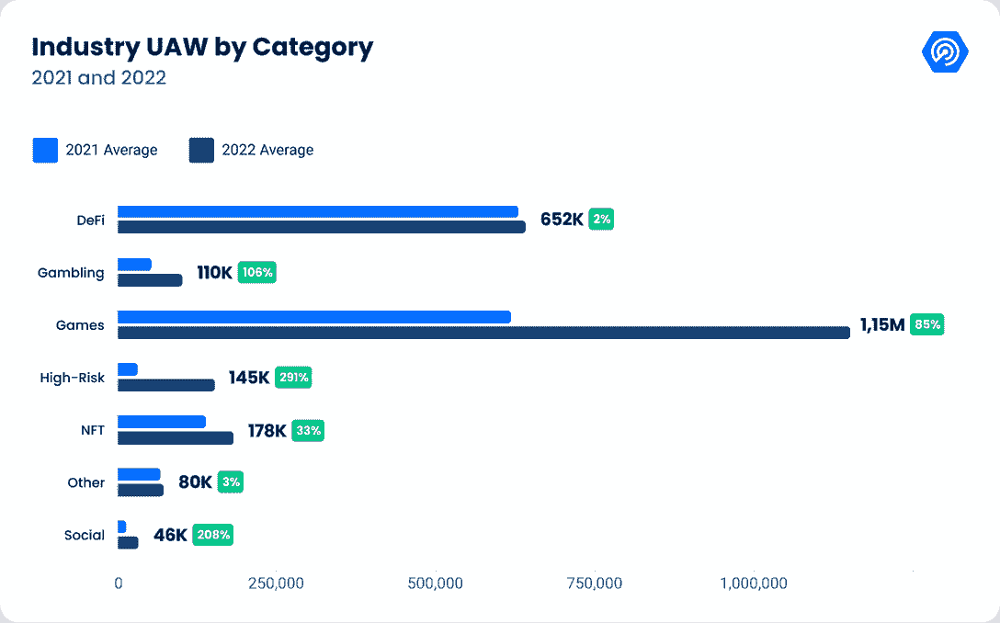

DappRadar 还跟踪高风险类别中的 dapp，该类别显示由于其性质或潜在后果而被认为风险过大的 dapp。在 2021 年，高风险应用平均有 37，269 个 dUAW。这一数字在 2022 年大幅增长，平均达到 145，825 dUAW，增长了 291%。这种突然的增长可能证明区块链用户并不厌恶风险。

NFT 或不可替代的代币 dapps 允许用户购买、出售和交易独特的数字资产，如收藏品、艺术品和游戏中的物品。2021 年，NFT dapps 的平均日活数为 133，783。这一数字在 2022 年增长了 33%，平均达到 178，095 dUAW。

我们需要提到的最后一类是社交 dapps。这些侧重于实现用户之间的通信和交互，如社交网络和消息平台。2021 年，社会 dapps 平均有 15，054 个 dUAW。这一数字在 2022 年增长了 206%，平均达到 46，410 dUAW。

### 到 2022 年，BNB 链和蜡铅协议将成为每日唯一的活动钱包

2022 年，日均唯一活跃钱包(dUAW)最高的区块链是 BNB 链、瓦克斯和索拉纳，平均分别为 599，766，420，575 和 271，077 dUAW。这些协议也实现了同比增长，BNB 链条和 WAX 分别实现了 10.60%和 42.46%的增长，而 Solana 实现了 755.87%的惊人增长。

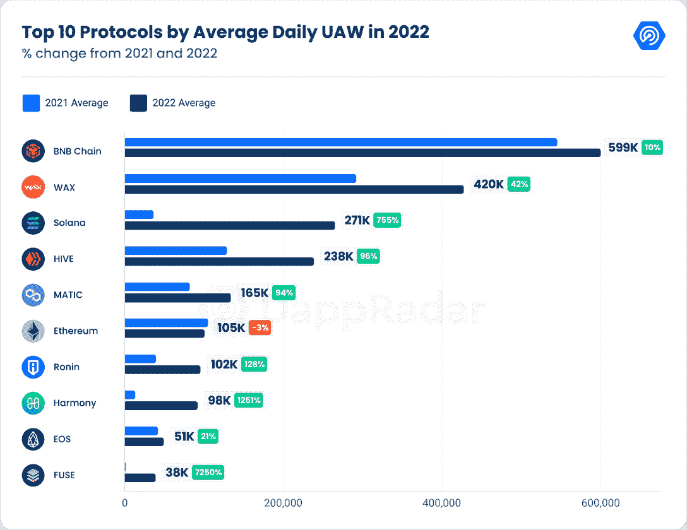

Hive (96.02%)、Polygon (94.78%)、Ronin (128.69%)、Harmony (1，251.30%)、Avalanche (156.78%)和 DEPchain (723.75%)在 2022 年也出现了显著的年度增长。其中一些协议，包括 Harmony、DEPchain 和 Avalanche，在 2021 年的平均 dUAW 相对较低，这有助于它们的年增长率。

Fuse、乐观和 Near 在 2022 年也实现了较大的同比增长，Fuse 和乐观分别实现了 7，250.66%和 2，186.11%的惊人增长。

另一方面，以太坊、创和 EOS 的平均 dUAW 同比下降，创的降幅最大，为-35.36%。

尽管一些协议每年都在增长，但其他协议在最近几个月似乎呈下降趋势。然而，新协议在第四季度增加了他们的受欢迎程度，并在平均每日唯一活动钱包方面迅速攀升至榜首。

BNB 连锁店以 629，828 dUAW 领先，与 Q1 相比增长了 111.41%。WAX 和 Hive 也很活跃，分别增长了 120.90% (361，349 dUAW)和 207.83% (162，829 dUAW)。Polygon、Ethereum 和 Solana 在第 4 季度都有显著增长，增幅分别为 141.86% (156，705 dUAW)、162.05% (81，585 dUAW)和 339.75% (74，926 dUAW)。

心流、融合、EOS 和乐观在活动方面排在前十位，尽管与前三位相比增长较为温和。乐观主义增加最少，为 4.90%，平均达到 34，308 个每日唯一活跃钱包。

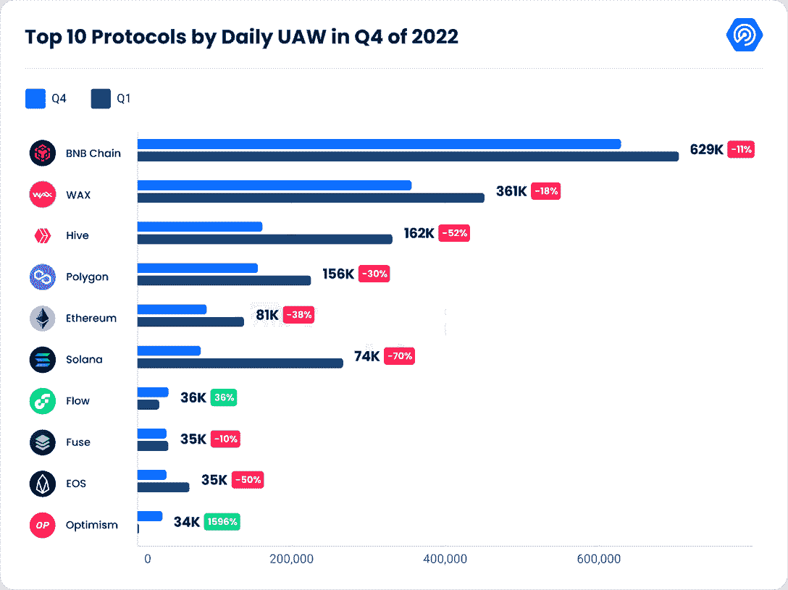

总体而言，数据表明，在 2022 年，重点关注 DeFi 和和游戏的协议在平均每日唯一活跃钱包方面经历了最显著的增长，而更成熟的协议则出现了下降或增长放缓。

### WAX 和 Solana 在 2022 年交易计数中领先协议

与前一年相比，2022 年前 10 大协议的交易数量出现了增长和下降。与 2021 年相比，WAX 协议经历了交易数量的最大增长，增长了 48.26%(63.2 亿)，是交易数量最多的协议。Hive 协议也取得了显著增长，交易量增长了 27.57%(7.3 亿)。这两个网络都是由游戏驱动的。

在同样的趋势下，Polygon 和 Theta 的交易数量也出现了大幅增长，较上年分别增长了 36.08%(2.3 亿笔)和 38.78%(1.14 亿笔)。最后，由于 DeFi 王国的努力，Harmony 协议的交易量比上一年增长了 57.66%(1.14 亿)。

Solana 网络的交易量增长非常小，与去年相比增长了 0.06%(9.42 亿)，但在 2022 年仍是交易量第二大的协议。

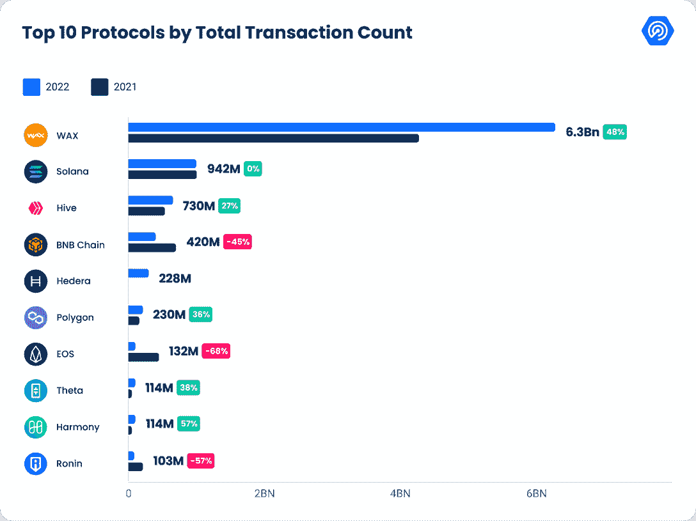

另一方面，BNB 连锁店的交易数量大幅下降，尽管吸引了最高数量的 dUAW，但与去年相比仍下降了 45.32%(4.2 亿英镑)。EOS 和 Ronin 是另外两个交易量骤降的协议。在这种情况下，分别下降了 68.22%(1.32 亿)和 57.25%(1.03 亿)。

总体而言，今年每个产品类别的交易数量都有增长和下降。游戏已经成为脱颖而出的类别，与前一年相比，交易量增长了 94.17%(74 亿英镑)。

另一个增长令人印象深刻的类别是高风险类别，该类别的交易数量增长最快，达到 1，170.71%(1.69 亿)。与去年相比，NFT 类别的交易量增长了 207.45%(8.3 亿英镑)，社交类别的交易量增长了 378.29%(5800 万英镑)。

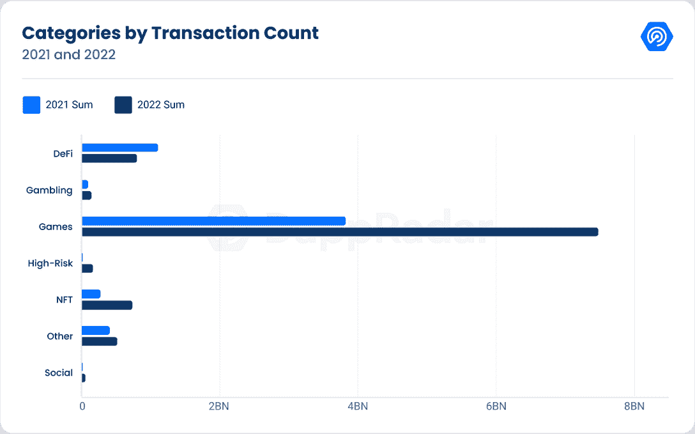

虽然各种类别都出现了可观的增长，但也有一个产品领域受到了重创。随着加密价格的下降和各种各样的黑客攻击，DeFi 类别得到了一张糟糕的牌。与前一年相比，DeFi 的交易量下降了 31.96%(7.91 亿英镑)。

值得注意的是，所有类别的整体交易数量都有显著增长，与去年相比增长了 72.90%，达到 99.8 亿。这意味着所有区块链和产品类别的 dapp 活动在 2022 年都有显著增长。

### 2022 年提交给 DappRadar 的 dapps 数量创纪录

今年，开发者向 DappRadar 提交了 8，255 个 dapps。我们的团队人工批准了其中的 5604 个，我们的机器学习工具接受了 1523 个。在撰写本文时，72 个 dapps 仍在审批过程中，等待批准出现在排名中。我们还拒绝了 1，056 个 dapp，因为我们有责任保护用户免受恶意 dapp 的影响。

如果提交错误，DappRadar 会拒绝 dapps，这意味着其中包含空的令牌合同，他们的电子邮件地址无法验证，或者他们没有网站或社交媒体。此外，当项目未能遵循我们的提交流程，或者有太多危险信号时，我们会拒绝 dapps。8，255 个提交的 dapps 是我们平台的新纪录，高于去年的 7，187 个。

正如您在下图中看到的，提交给 DappRadar 的大多数 dapps 都属于 DeFi 和游戏类别。大多数获得批准的 dapps，总计 30.5%，属于 DeFi 类别，而游戏类别以 18.9%位居第二。

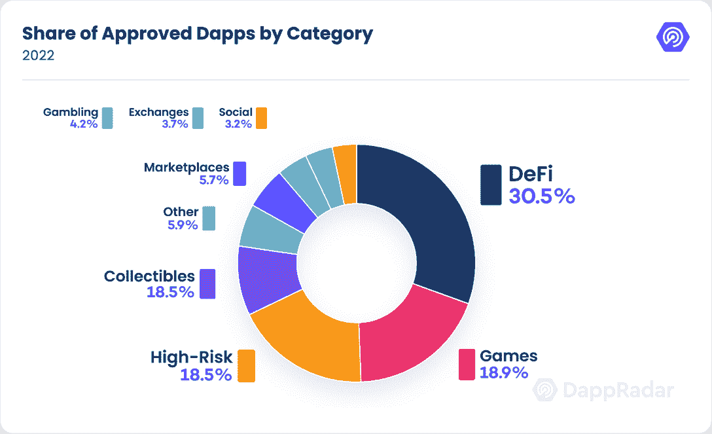

目前，DappRadar 跟踪超过 50 个区块链网络、12，000 多个 dapps 和超过 250 万份智能合同。在过去的一年中，数百万用户来到 DappRadar，以获得最实时、最透明的 dapp 相关数据。

我们还收集了关于用户如何与 DappRadar 的跟踪工具交互的数据，并将其放在另一篇文章中。它将为不同的行业利益相关者提供见解，例如哪些 dapps 吸引了用户的注意力，受众来自哪里。

## DeFi Dapps 概述

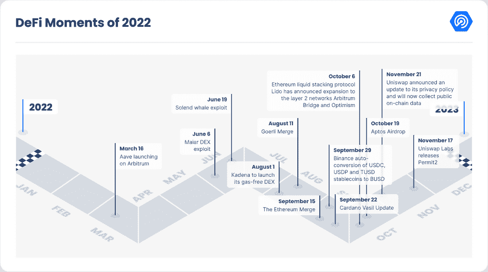

对于分散金融(DeFi)行业而言，2022 年是充满挑战的一年，因为锁定的总价值(TVL)大幅下降。代表 DeFi 项目锁定资金总价值的 TVL 从 1 月份的 2114 亿美元的高点跌至 12 月份的 550 亿美元，跌幅达 73.97%。

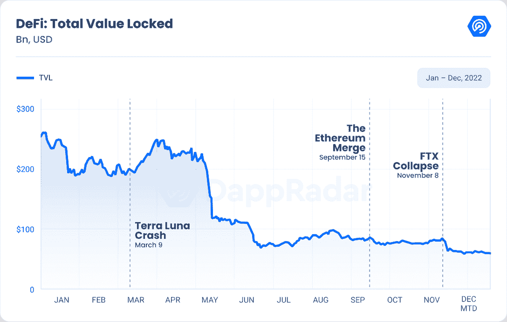

有几个因素导致了 TVL 的下降。首先，加密货币价格的整体下降对 DeFi 行业产生了影响。随着托管 DeFi 生态系统的基础加密货币价格下跌，TVL 自然也会跟着下跌。总之，加密市场在这一年中损失了很大一部分价值，这对 DeFi 产生了直接影响。

另一个主要因素是 Terra Luna 平台的崩溃，导致了约 500 亿美元的损失。当时第二大 DeFi 生态系统 Terra Luna 的崩溃对整个行业产生了重大影响，并损害了对 DeFi 的信心。

除了这两个重大事件之外，不断下滑的市场状况和较低的加密货币价格也在 TVL 的下跌中发挥了作用。由于在 DeFi 贷款中提供的抵押品价值下降，个人以抵押品为抵押获得贷款的动机降低。

尽管这一年充满了挑战，DeFi 行业仍然保持着活力，并继续增长和发展。在 2022 年，我们看到越来越多的金融应用正在智能合同上开发，服务于各种目的，例如在传统银行无法访问的地区提供基本银行服务，以及促进传统金融机构和 DeFi 协议之间的交易。

总体而言，2022 年也可以被视为弥合 DeFi 和传统金融之间差距的一年，因为亨廷顿谷银行、法国兴业银行、摩根大通和星展银行等机构都与 DeFi 协议进行了试点或交易。这也是巩固和改进的一年，因为 DeFi 项目，如 UniSwap，努力改善用户体验，并使其平台更容易被更多的受众使用。

虽然 TVL 在 2022 年出现了大幅下滑，但 DeFi 行业展示了其韧性，并在面临挑战的情况下继续创新。在 2022 年奠定的基础上，该行业可能会在未来几年继续增长和发展。

### 2022 年，顶级 DeFi 第 2 层协议将在 TVL 实现强劲增长

以太坊是 2021 年最大的 DeFi 协议，其锁定的总价值下降了 74.56%(320 亿美元)。这种下降很可能是上述市场条件与第二层(L2)协议的日益采用相结合的结果。尽管如此，以太坊仍然在整个 DeFi 市场占据了超过 58%的 TVL 市场份额。就以太坊上的 TVL 而言，流动性赌注 dapp LIDO 已经成为最大的 DeFi 应用。2022 年，其 TVL 增长了 1.98%，达到 61.8 亿美元。增长本来可以更多，但利多已经深受 Terra Luna 崩溃的影响，因为它在一周内损失了近 100 亿美元。

提醒一下，DeFi 的 TVL 在 2021 年飙升了 1，200%以上，以太坊占据了整个 DeFi 行业的大部分赌注价值，占据了 62%的市场主导地位，正如 Finbold 在 2021 年 12 月报告的那样。

[Report on the impact of the Ethereum Merge on Layer2](https://web.archive.org/web/20230313162029/https://dappradar.com/blog/dapp-industry-report-2022-dapp-industry-proves-resilient-in-crypto-winter/#https://dappradar.com/blog/measuring-the-impact-of-ethereums-merge-on-layer-2)

随着 Terra 的崩溃，BNB 链重新成为第二大 DeFi 生态系统。尽管如此，从 2021 年到 2022 年，币安品牌的网络总价值下降了 62.50%，至 65 亿美元。然而，有些事情是不会改变的。PancakeSwap 仍然是整个 dapp 行业中使用最多的 dapp，平均每月超过 165 万 UAW。虽然最受欢迎的 dapp 的 TVL 也比上一年下降了 60%，至 31.5 亿美元，但其受欢迎程度仍未受到影响。

DeFi 借贷平台 Venus 仍然是 BNB 连锁店最受欢迎的 dapps 之一。然而，该平台今年的 TVL 下降了 64.40%，达到 7.2532 亿美元。此外，BiSwap 在 TVL 也有所下降。从 1 月到现在，DeFi 平台注意到 TVL 下降了 66%,现在在其智能合同中注册了 2 . 35 亿美元。

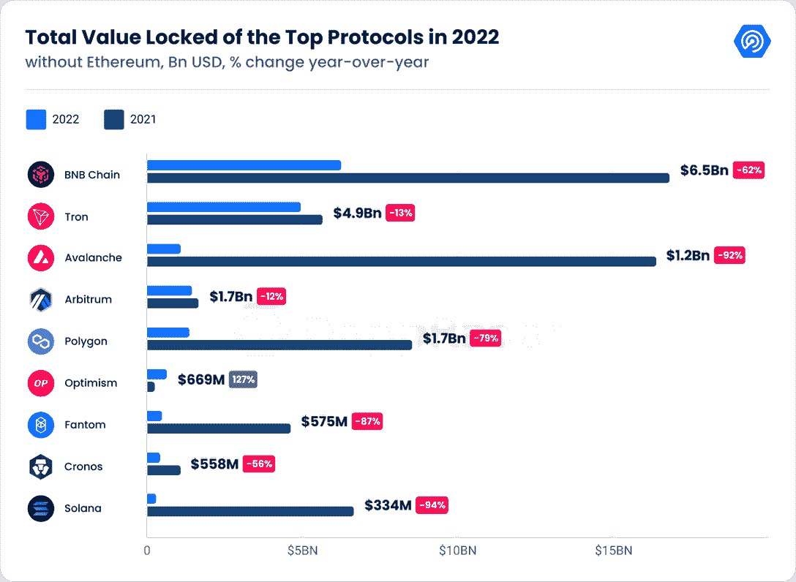

Terra 的陷落导致了 DeFi 排行榜的巨大变化。然而，创仍然是最稳定的 DeFi 链之一，尽管围绕其创始人贾斯汀孙的故事经久不衰。2022 年，Tron 锁定的总价值下降了 13.52%(57 亿美元)，降幅略小。Tron 驱动的硬币市场协议 JustLend 今年一直呈上升趋势，其 TVL 增长了 61%，达到 29.3 亿美元。

另一方面，Avalanche 的 TVL 同比大幅下跌 92.54%，目前 DeFi smart 合约锁定了 12.7 亿美元。Aave 是一个开源的非托管协议，用于赚取存款利息和借入资产，其 TVL 大幅下降，尤其是在雪崩链上。1 月份，TVL 有 31.3 亿美元，现在只有 3.23 亿美元。这是一个惊人的 89.6%的降幅。在同样的趋势下，非托管流动性市场协议本齐今年也遭受了损失。从 1 月 1 日在 TVL 的 15.6 亿美元增加到 2022 年底编写本报告时的 1.69 亿美元。一年之内下降了 89%。

在 Terra 留下的巨大空洞之后，扩展解决方案似乎是最大的受益者。

Arbitrum 的跌幅较小，仅为 12.07%，目前在 TVL 拥有 17.4 亿美元。毫无疑问，2022 年对于 Arbitrum、乐观和不可变 X.

等二层解决方案非常重要，自 2022 年初以来，分散式现货和永久交易所 GMX 在 Arbitrum 上的 TVL 一直在上升。目前，平台锁定的代币总价值达到 4.3975 亿美元，同比增长 307.15%。

Arbitrum 并不是唯一一个增长的二级公司，乐观公司的 TVL 增长了 127.60%，目前为 6.69 亿美元。这一成功可能来自于生态系统与各种已建立的 DeFi 协议的合作，以及空投运动的成功。然而，并非所有事情都因乐观而成功，因为 DeFi 衍生品交易的支柱 Synthetix 因乐观而遭受 TVL 下降。尽管乐观情绪很强，但其 TVL 下降了 37.7%，至 3.0622 亿美元。另一方面，在这一年中，各种新的 DeFi dapps 基于乐观情绪推出，如自动做市商 Velodrome。这款 DeFi dapps 自上市以来一直呈上升趋势。6 月份，Velodrome 的 TVL 有 2，848 万美元，但在撰写本文时，其头寸增长了 162%，达到 7，467 万美元。

多边形区块链生态系统的 TVL 也大幅下降，下降了 79.60%，至 16.9 亿美元。领先的 DEX 和 lending protocol QuickSwap 今年一直处于下降趋势，其 TVL 损失了 79%，达到 1.78 亿美元。此外，DeFi liquidity platform Balancer 与 Polygon 上的 TVL 处于同一下行列车，下跌 45.3%，至 1.1322 亿美元。今年，Fantom 的 TVL 减少了 87.30%，现在其 DeFi smart 合约价值 5.75 亿美元。在生态系统中，流动性协议艾斯特公司注意到其 TVL 大幅下降 86%，目前在其 DeFi 平台上锁定了 9369 万美元的代币。自动化做市商 SpookySwap 引领了同样的趋势，今年大幅下降 91.6%，达到 8823 万美元。对两个 dapps 来说，Terra Luna 的崩溃都有很大的影响。

Cronos 的趋势与之前提到的 DeFi 生态系统相同，因为它今年遭受了 56%的损失，现在其 TVL 有 5.58 亿美元。在这一总价值的下跌中，VVS 金融的平台价值最大。自 1 月份以来，DeFi dapp 的 TVL 已经下跌了超过 11 亿美元。然而，自年初以来，跨链货币市场结构仅下降了 13.2%。此外，自动做市商福禄(Ferro)甚至自今年 5 月推出以来，以令人瞠目结舌的 5，915%的速度增加了其 TVL。克罗诺斯土著 AMM 现在拥有 5667 万美元的 TVL。

今年索拉纳受创最大，TVL 下跌 94.95%。自今年年初以来，该链的 TVL 呈下降趋势，但 Terra Luna 崩溃和后来的 FTX 崩溃对该协议产生了巨大影响。在 Solana 的顶级 DeFi 项目中，贷款平台 Solend 今年损失了 96.6%的 TVL，目前约有 2020 万美元锁定在该协议中。一月份，dapp 的智能合约中仍有 6 亿美元。此外，Marinade Finance 失去了 93%的 TVL，目前拥有 9317 万美元，成为 Solana 最大的 DeFi 项目。分散式交易所 Raydium、Serum 和 Orca 在过去一年中分别损失了 97%、99.67%和 93.6%的 TVL。

总体而言，2022 年 DeFi 协议锁定的总价值下降可以归因于多种因素，包括市场波动性、投资者情绪的变化以及加密货币市场的整体状态。尽管存在这些负面的市场条件，但仍有充分的理由对仍处于萌芽状态的 DeFi 行业的未来保持乐观，该行业继续吸引着数量惊人的风险资本。 [HashKey 的报告](https://web.archive.org/web/20230313162029/https://newsdirect.com/news/hashkeys-latest-report-highlights-a-defi-sector-thats-poised-for-institutional-adoption-and-rapid-acceleration-568187315)披露，仅在 2022 年上半年，风投就向总共 725 个加密项目投资了超过 140 亿美元，其中包括众多的 DeFi 协议。

### 
采访 Trader Joe 的营销主管 Blue Clarity

你能向我们的读者解释一下分散金融(DeFi)和传统金融(TradFi)之间的主要区别吗？

DeFi 是一项颠覆性技术，旨在创建一个新的金融系统。它是开放的、无权限的、透明的，并且不需要集中的中介。DeFi 由智能合约和应用程序提供支持，这些应用程序最初由以太坊区块链公司推出，但后来被其他区块链采用。DeFi 是一个有弹性且不可改变的空间，有可能扰乱传统的金融体系。

相比之下，TradFi 通常是封闭的，需要许可才能访问，不透明，并且依赖于集中的中介。它也倾向于收取比 DeFi 协议更高的费用。

尽管有潜力，但 DeFi 一直难以获得广泛采用，尤其是在散户投资者中。你认为采用 DeFi 的主要障碍是什么，尤其是对散户投资者而言？

采用 DeFi 的一个障碍是散户投资者的高准入门槛。DeFi 仍处于相对早期的阶段，需要一定水平的技术知识和对加密货币钱包的熟悉程度才能访问和使用它。对于那些不懂技术的人来说，这可能会让他们感到害怕或困惑。此外，DeFi 领域缺乏监管和安全性也是散户投资者担心的一个问题。

谈到 DeFi investments，许多机构投资者一直保持观望态度。你认为 DeFi 项目必须建立在传统的金融基础之上才能增加这些投资者的参与吗？需要发生什么来让更多的团体采用 DeFi 协议？

由于缺乏监管和安全性，机构投资者可能对进入 DeFi 领域犹豫不决。为了提高这些投资者的参与度，DeFi 项目应着重解决这些问题。这可能包括与监管机构合作，建立明确的合规性准则，以及实施强有力的安全措施来防范黑客攻击和利用。此外，DeFi 项目应考虑建立在传统金融基础之上，如稳定信贷和抵押贷款，以使传统投资者更容易进入和熟悉这一领域。

## 2022 年漏洞利用中最常见的黑客攻击是拉地毯和违反访问控制

区块链是有史以来最安全的技术框架之一，这要归功于它的密码加密机制和去中心化的基础设施。尽管如此，智能合约代码中的缺陷、不法行为者或糟糕的安全实践都可能导致不良后果。每年大量的加密攻击强调了更多地了解它们和开发安全措施的重要性。

迄今为止最大的事件之一是 Terra Luna 丑闻，它导致了 400 亿美元的加密令牌损失。这大大超过了 2022 年所有骗局的损失总和。

根据 Rekt 的数据，排除 Terra Luna 丑闻，欺诈数量相对较低，每次攻击的中值损失为 28.3 万美元，每月损失总额为 3.45 亿美元。平均每月有 25 次黑客攻击。

集中式平台是最具破坏性的黑客攻击的源头，总计损失 447.1 亿美元。LUNC+CEX 平台是其中最具破坏性的。

集中式交易所(CEX)是一种加密货币交易所，允许用户通过中央机构买卖数字资产。另一方面，分散交易所(DEX)是一种加密货币交易所，允许用户直接相互交易数字资产，而不需要中央机构持有和管理用户资金。

“不是你的钥匙，不是你的硬币”的概念是加密货币社区中广泛使用的口号，强调自我保管的重要性和将资金委托给第三方的风险。通过使用 DEX 或其他 DeFi 平台，用户可以控制自己的资金和交易，从而有可能降低与集中交易相关的风险。

然而，值得注意的是，分散式交易所和 DeFi 平台并非没有自身的风险和挑战。虽然它们可以为用户提供更好的安全性和控制，但它们也需要更高水平的技术知识，并且使用起来可能比集中式交换更复杂。

尽管大多数连锁店今年只经历了一次黑客攻击，但黑客攻击的频率和规模之间存在反比关系。这意味着更少的黑客攻击往往会导致更大的支出。BNB 链和以太坊是被黑客攻击最多的协议，BNB 遭受的攻击比以太坊更多，损失也更大。

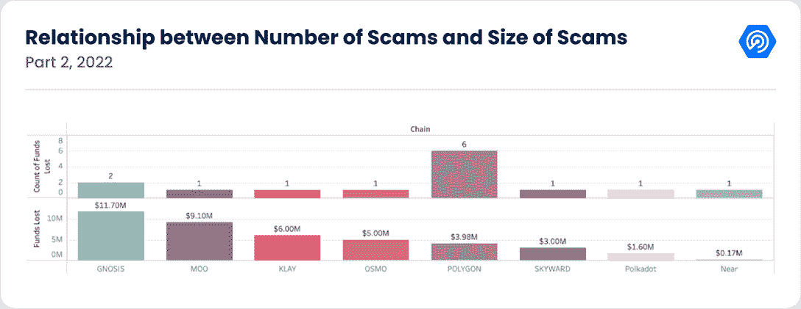

然而，以太坊链上每个黑客被盗的平均金额比 BNB 链上每个黑客被盗的平均金额高 30%。例如，如果 BNB 链上每个黑客被盗资产的平均价值是 100，000 美元，以太坊上被盗资金的平均金额将是 130，000 美元。

总共有超过 15.78 亿美元在 BNB 链上被盗，而 10.2 亿美元在以太坊链上被盗。这意味着 BNB 链经历了更多的黑客攻击，整体损失更大，但以太坊上每次黑客攻击被盗资产的平均价值更高。

对 Web3 中网络犯罪的分析显示，恶意攻击是最常见的攻击类型，共发生了 119 起事件，被盗资金达 2 亿美元。rug pull 是一种退出骗局，其中项目创建者突然从平台提取流动性，导致平台的代币或资产价值暴跌。

“其他”类型包括难以量化的独特案例，它们占 73 起事件和 468.5 亿美元的损失。访问控制漏洞是第二常见的问题，30 起事件导致 1.02 美元的损失。访问控制漏洞涉及对区块链网络的未授权访问和控制。

闪贷攻击，即攻击者从 DeFi 平台借入大量资产，并在迅速偿还贷款之前将其用于恶意目的，造成了 20 起事件和 2.4 亿美元的损失。退出骗局，即项目创建者携带投资者的资金潜逃，造成了 20 起事件和 5000 万美元的损失。攻击者利用区块链网络中的漏洞进行的攻击造成了 19 起事件和 2 . 2 亿美元的损失。

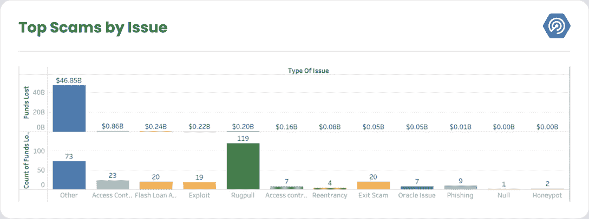

网络钓鱼攻击，即攻击者诱骗个人透露其私钥或其他敏感信息，造成了 9 起事件和 0.1 亿美元的损失。甲骨文问题，其中区块链的甲骨文系统受到损害，造成 7 起事件和 0.5 亿美元的损失。

### 2022 年十大加密骗局、黑客攻击和漏洞利用

根据 Rekt 数据库，2022 年最大的漏洞利用来自 Terra Luna 网络，发生在 2022 年 5 月，造成了 400 亿美元的损失。该网络专注于两种本土货币:LUNC 和 UST，中国科大充当算法稳定币，LUNC 充当卫星资产，吸收中国科大的波动性。然而，USTC 从以太网上的 Curve3pool 迁移，加上 Anchor 协议的大量退出，导致了 USTC 和池中其他稳定成员之间的不平衡，以及 USTC 在交易所的贬值。这导致 LUNC 和 USTC 的估值迅速下跌，并导致 Anchor 协议中抵押品的清算。

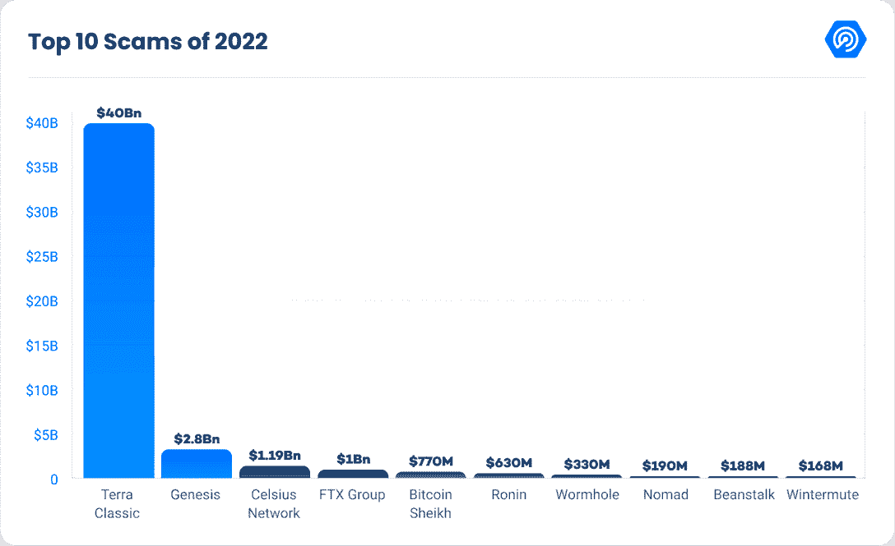

接下来，Genesis 是第二大资金损失，发生在 2022 年 11 月 21 日，导致损失 28 亿美元。这一漏洞似乎受到了 FTX 崩溃的严重影响，因为 Genesis 是一个加密交易平台，其资产负债表上有 28 亿美元的未偿贷款。该公司透露，其 FTX 账户中有 1.75 亿美元，但由于市场状况，被迫停止提款。

此外，第三名是遭受重大损失的 Celsius Network，该公司在 2022 年 6 月 13 日的损失超过 12 亿美元。Celsius 是一家集中交易、借贷和盈利协议的公司，申请了第 11 章破产，并在其资产负债表上列出了 11.9 亿美元的赤字。该公司的负债达到 55 亿美元，而其资产价值为 43 亿美元。声明发布前一个月，该平台的运营被叫停，理由是“极端的市场条件”。

第四，旅行者加密平台也在 2022 年 5 月 7 日经历了一次利用，申请第 11 章破产，负债估计在 10 亿至 100 亿美元之间。该平台的运营在披露其对三箭资本(Three Arrows Capital)有 6.61 亿美元的敞口后暂停，三箭资本是一家加密对冲基金，也申请了破产。

排名第五的是加密贷款平台 BlockFi，该平台于 11 月 11 日停止提款，理由是对 FTX 交易所和阿拉米达研究对冲基金有重大敞口。该公司根据破产法第 11 章申请破产保护，并起诉应急富达科技公司索要其所欠的抵押品。BlockFi 估计，它有 10 亿至 100 亿美元的负债，最大的债权人是 Ankura Trust，该公司被欠约 7.29 亿美元。

随后，在 2022 年 11 月，FTX 和阿拉米达研究公司的首席执行官萨姆·班克曼-弗里德在发现阿拉米达的抵押品由 FTX 本地令牌$FTT 主导后，宣布两家公司破产。这在 FTX 客户中引起了恐慌，导致数十亿美元被从交易所撤出。在短短 24 小时内，FTT 币的价值暴跌了 95%以上，其他依赖 FTX 的项目也报告了重大损失。

2022 年 10 月，巴西当局破获了由 Francisco Valdevino da Silva 经营的庞氏骗局，也被称为“比特币酋长”，他以 20%的回报承诺诈骗了数千人 7.66 亿美元。名人和足球运动员是在该计划中损失金钱的投资者之一，这个庞氏骗局在 2022 年十大最大骗局中排名第七。

2022 年 3 月 29 日，托管热门游戏 Axie Infinity 的 Ronin 网络遭到黑客攻击，导致 173，600 以太币和 2，550 万 USDC 从网络中流出。攻击者使用被黑的私钥伪造假提款，并能够通过一个无气 RPC 节点绕过安全措施。币安追回了一些被盗资金，交易所牵头的一轮融资筹集了 1.5 亿美元，用于部分偿还用户和维持运营。

第九名和第十名分别是虫洞桥和游牧桥，两者都被利用，分别导致 120，000 wet 和大约 1 . 9 亿美元被盗。虫洞攻击是攻击者绕过验证过程的结果，而 Nomad 攻击是由一个操作错误造成的，该错误已在审计报告中指出，但没有得到妥善解决。

总之，互联网上诈骗和其他邪恶活动的盛行是一个主要问题。虽然这些攻击的数量相对较少，但它们可能造成的损害是巨大的。个人和组织必须意识到这些威胁，并采取措施保护自己。

## NFT 市场的状态:对连锁指标、蓝筹股集合和领先 NFT 市场的回顾

NFT 市场在 2022 年继续增长和发展，全年都有重大发展和趋势。在年度 Dapp 报告的这一部分，我们将全面了解定义 2022 年 NFT 市场的关键数据和统计数据，包括交易量、销售计数和独特交易商计数。我们还将深入研究十大 NFT 市场及其交易量，以及市场之间日益激烈的竞争。

此外，我们将探讨 NFT 市场正在进行的关于特许权使用费的辩论，并分析全年底价蓝筹股集合的表现。我们还将仔细研究 NFT 以太坊市值前 100 名，并将其与 ETH 价格进行比较，以及各行业对 NFT 的日益采用。通过这一分析，我们将更好地了解 2022 年 NFT 市场的状况及其未来的潜力。

### 2022 年链上指标预测 NFTs 的未来看涨

已经出现的一个关键趋势是 NFT 交易量的波动性，全年有很大的增减。2022 年第一季度，NFT 市场产生了 124.6 亿美元的交易量，成为 NFT 历史上最好的一个季度。然而，在严酷的宏观条件导致加密价格下跌以及围绕 Terra 崩溃的不确定性之后，第二季度的交易量下降了 84 亿美元。

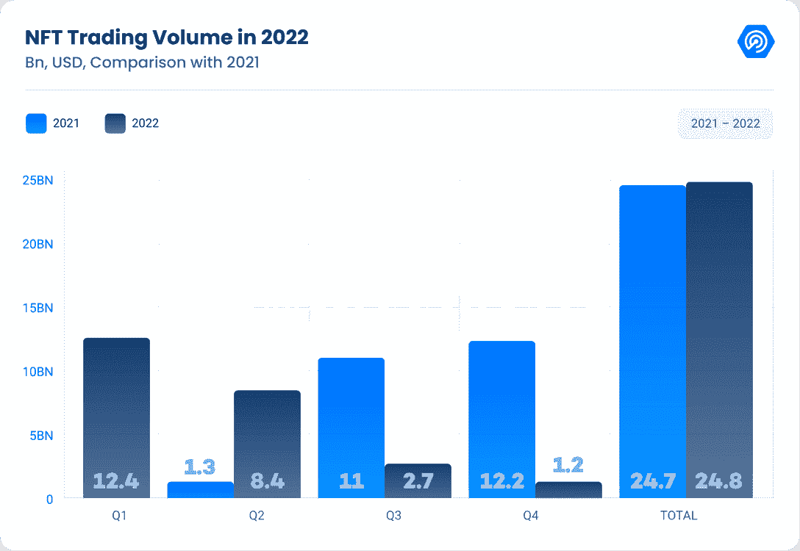

2022 年 6 月，NFT 市场的月交易量首次未能超过 10 亿，这一趋势仍有待扭转。今年下半年的轨迹与 2021 年下半年不同，第三季度和第四季度的交易量仅为 44 亿美元，而 2021 年为 232 亿美元。

尽管存在这种波动，NFT 市场仍在继续增长和发展，新的技术和平台正在开发，以支持对非功能性交易日益增长的需求。就销售而言，2022 年是 NFTs 的突破年，与前一年相比，销售数量大幅增加。2022 年第一季度，销售数量达到 2844 万，比 2021 年同季度的 488 万大幅增长 483.14%。2022 年第二季度的销售数量也有所增加，共售出 2023 万台 NFT。这比 2021 年同季度的 1164 万增长了 73.87%。

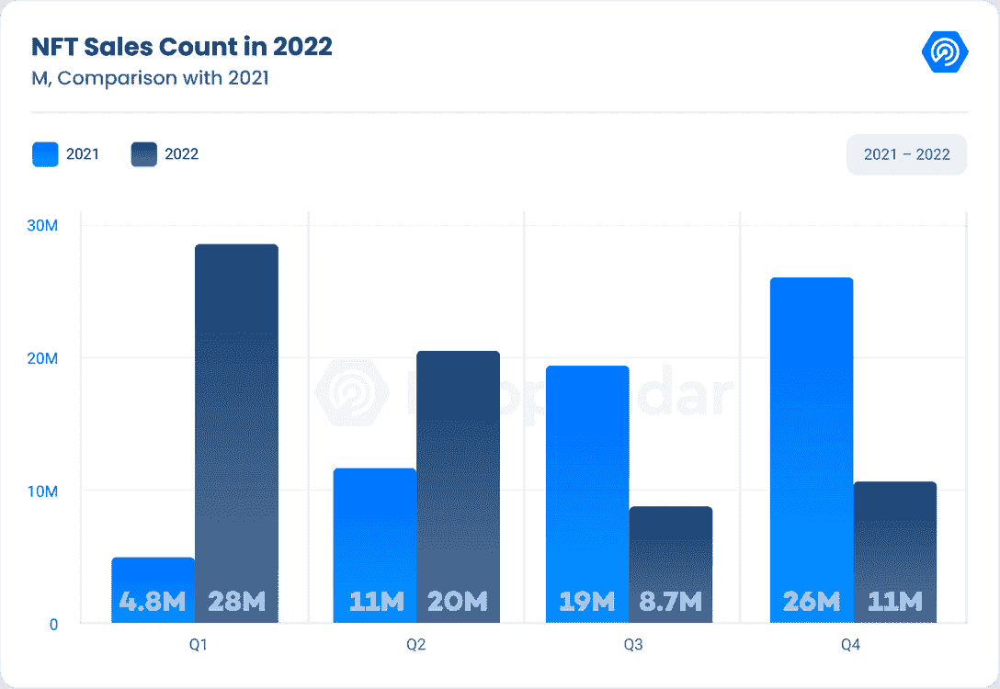

然而，2022 年第三季度和第四季度的销售数量有所减少，分别为 878 万辆和 1091 万辆。这比 2021 年第三季度和第四季度分别下降了 54.89%和 58.15%。

2022 年出现的另一个关键趋势是 NFT 独特交易者的爆炸式增长，交易者数量在全年都有显著增长。2022 年第一季度，交易者人数达到 318 万，比 2021 年同季度的 409，298 人大幅增长 675.88%。2022 年第二季度，交易商数量也有所增加，总数达到 226 万，同比增长 130.42%。

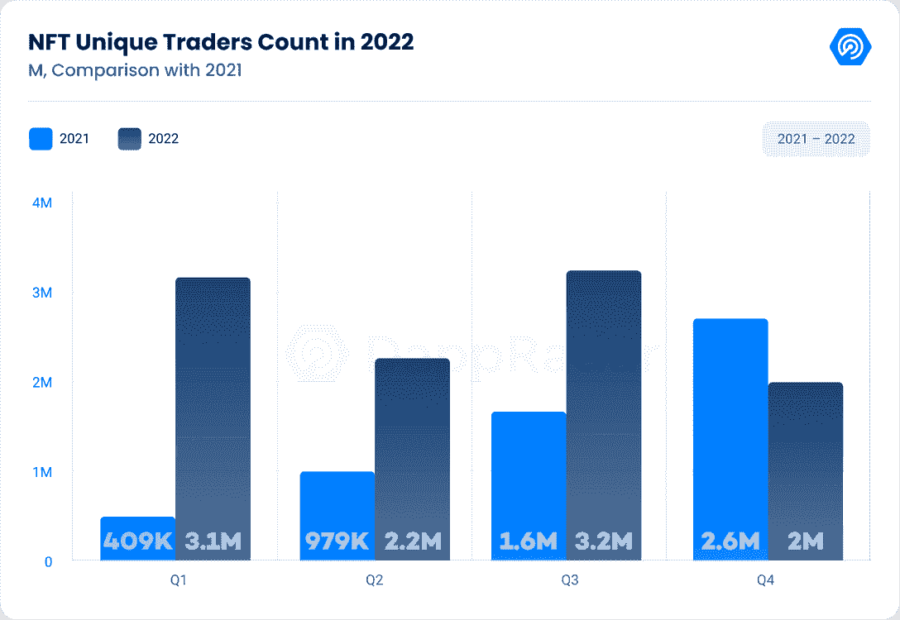

2022 年第三季度，交易员人数略有增加，总数为 320 万，比 2021 年同季度的 160 万增长了 96.12%。2022 年第四季度交易商数量减少，总数为 199 万，与 2021 年同季度的 270 万相比减少了 25.53%。

新人决定在 2022 年进入 NFT 市场有几个原因。主要原因之一是加密货币的价格下降，这使得人们进入 NFT 市场更具吸引力。此外，主流行业(如艺术界和游戏业)越来越多地采用 NFT，也有助于推动市场兴趣。非金融交易新技术和平台的发展也使人们更容易获得和交易这些资产，这也可能有助于独特交易者的增加。

总体而言，NFT 市场在 2022 年取得了显著的增长和发展，在这一年中出现了一系列趋势和发展。市场在未来几年将如何发展还有待观察，但很明显，非功能性测试是一个令人兴奋的快速增长的市场，具有进一步增长和发展的巨大潜力。

### 按市值分析前 100 名 NFT 收藏

前 100 名 NFT 藏品的市值在过去一年出现了大幅波动，与以美元计的 ETH 价格密切相关。在本节中，我们将分析美元和 ETH 的市值，以及 ETH 的美元价格，以更好地了解 NFT 市场的趋势。

在 2021 年显著增长后，2022 年前 100 名 NFT 藏品的市值分别为 148.4 亿美元和 568 万美元。今年 1 月，ETH 价格为 2610 美元。这一市值在 2 月份小幅下降 0.1%，至 148.2 亿美元和 564 万美元，ETH 价格为 2629 美元。然而，3 月份市值大幅增长 27.4%，美元达到 188.7 亿美元，ETH 达到 5.78 亿美元，ETH 价格为 3，384 美元。

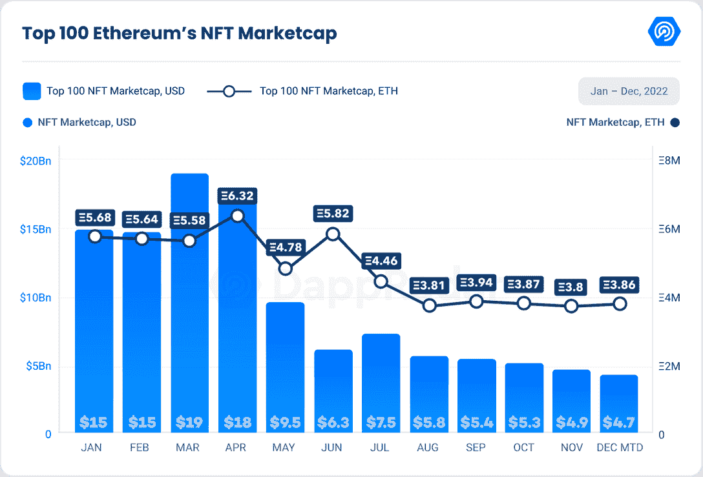

在第二季度，前 100 名 NFT 收藏的市值受到 Terra Luna 崩溃的严重影响，价值大幅下降。从 4 月到 6 月，前 100 名 NFT 藏品的总价值以美元计下降了 64.09%，以瑞士法郎计下降了 7.93%，从 178 亿美元降至 63 亿美元。在同一时期，ETH 的价值从 2817 美元暴跌至 1099 美元。

在 2022 年第三季度，NFT 行业转向可负担性和可访问性，导致市值下降。所有行业的主要参与者，包括视频游戏、金融、娱乐、时尚和体育，都以较低的价格推出了自己的 NFT 项目，使它们更容易被散户投资者接受，并增加了采用率。尽管 7 月份略有 13.8%的增长，但该季度剩余的两个月中，前 100 名 NFT 藏品的市值进一步下降。9 月份，ETH 的市值从 75.7 亿美元和 440 万美元上升到 54.4 亿美元和 394 万美元。而 ETH 的价格从 1697 美元下降到 1380 美元。

2022 年最后一个季度，市场状况相对稳定。10 月份市值保持相对稳定，为 53.7 亿美元或 387 万 ETH，ETH 价格为 1，389 美元。在撰写本文时，11 月和 12 月的市值降至 47 亿美元，相当于 387 万 ETH，价格为 1，274 美元。

总体来看，过去一年，NFT 前 100 名藏品的市值出现了大幅波动。虽然没有人能准确预测不可替代代币的未来，但预计许多市场参与者将继续扩大 NFT 市场。

对 2022 年销售额约为 250 亿美元的 NFT 市场的预测似乎很乐观。尽管在利率和通胀因素不确定、战争和全球冲突持续以及其他因素影响市场的时候，所有市场都经历着更大的波动，但无论发生什么样的起伏，NFTs 收藏都表现出了持久的强烈迹象。

### 探索 2022 年新 NFT 的顶级市场

在过去的几个月里，越来越多的市场开始运作，以促进非关税壁垒的交易。这些市场提供了一系列功能，并专注于不同的领域，包括游戏、社区建设和去中心化，为 NFT 买家和卖家提供了选择。在这一部分，我们将看看 2022 年推出的一些最重要的 NFT 市场，以及 NFT 市场的整体格局是如何变化的。

1.  LooksRare 是一个分散的、社区第一的 NFT 市场，积极奖励参与该平台的交易者、代币持有人、创作者和收藏者。marketplace 于 2022 年 1 月推出，由两位匿名的联合创始人 Zodd 和 Guts 创建。LooksRare 声称是“由 NFT 人、为 NFT 人”制作的，旨在提供一个有益于社区的市场，而不是专注于 IPO 和商业利益。从合格集合中购买或出售 NFT 的用户可以获得其本地实用工具 LOOKS 令牌，并且在 2021 年 6 月 16 日至 12 月 16 日之间交易 3 ETH 或更多的 OpenSea 用户有资格获得 LOOKS airdrop。

2.  X2Y2 是下一代 NFT 市场，也是在 2022 年 1 月推出的，其使命是挑战市场的大玩家，如 OpenSea，建立一个“真正去中心化”的平台，并赋予 NFT 创作者权力。该平台的主要目标是为社区成员提供完全去中心化的、安全的、经过行业验证的服务，并声称令牌持有人可以获得 100%的利润。X2Y2 是专门为提高 NFT 市场的便利性和功能性而设计的，将创造者和他们的利益放在第一位，为每个成员提供一套工具来帮助他们管理 NFT 的铸造过程。

3.  GameStop Marketplace 于 2022 年 7 月推出，专注于游戏相关的 NFT。Gamestop 之前以其视频游戏零售店连锁店而闻名..该公司已经彻底改造了自己，现在正通过进军游戏 NFT 领域引领潮流。GameStop Marketplace 的首次推出见证了交易量高达 200 万美元的增长，在推出当天共售出 41，000 件。该平台旨在将 marketplace 作为其游戏业务的延伸，并在社交媒体上获得了极大的热情。

4.  Nickelodeon 也在 7 月推出了 NFT 市场，主打歌是 Rugrats 和 Hey Arnold！人物。预售期间，该系列不到十分钟就销售一空。尼克 NFT 市场通过各种与 Rugrats 和 Hey Arnold 相关的特征进行过滤！人物，包括 NFT 类型，人物名称，起源，系列，粘液评分，服装，等等。每个 NFT 都有一个粘液分数，表明它的相对稀有性，持有者可以通过兑换 Nickelodeon NFTs 获得稀有的、独一无二的混搭 NFT。

5.  SudoSwap 是一个 NFT 市场，致力于为用户提供一个分散的、安全的平台。该平台于 2022 年 8 月推出，将自动做市商(AMM)的概念引入 NFT 交易。AMMs 使资产交易能够使用加密流动性池作为交易对手，而不是传统的买方和卖方系统。SudoSwap 允许用户在双向流动性池中交易和交换 NFT，除 ETH 外，还可以选择出售 NFT。该平台还允许用户转换到流动性提供商提供的可定制债券曲线。SudoSwap 为非传统金融产品开辟了道路，并打破了 NFT 市场的分散性，给予消费者更多的控制权。

6.  Blur 的目标是通过提供零交易费和专注于专业交易者(于 2022 年 10 月推出)，使自己与其他 NFT 市场区分开来。该平台包括跨多个市场扫地、狙击和投资组合分析工具等功能。此外，BLUR 计划向在过去六个月中交易过基于以太坊的 NFT 的任何人空投其原生 Blur 令牌。该平台获得了风险投资公司 Paradigm、专注于 NFT 的投资基金 6529 和数字艺术收藏家 Cozomo de' Medici 超过 1400 万美元的支持。

在过去的几个月里，进入市场的 NFT 市场数量激增。这导致了市场从只有一个主导者的“垄断”向有几个主导者的“寡头垄断”的转变。这些新市场的出现为 NFT 买家和卖家增加了更多竞争和选择，并在这些平台上产生了各种各样的非功能性交易和功能。随着越来越多的参与者进入这一领域，市场将如何演变，现有市场将如何适应日益激烈的竞争，这将是一件有趣的事情。

### 2022 年 NFT 市场竞争升温

NFT 市场近年来经历了显著增长，2022 年前十大市场的交易总额达到 227.1 亿美元以上。这比上一年略有下降，2021 年的交易总额达到 241.6 亿美元。

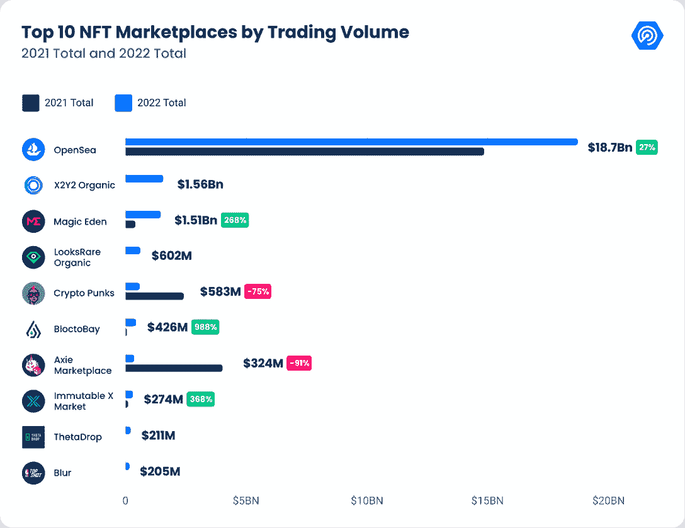

就交易量而言，最值得注意的市场之一是 OpenSea，与前一年相比，2022 年的总交易量增长了 26.22%(186 亿美元)。其次是 Magic Eden，其交易量增长了 268.13%，达到 15.4 亿美元，BloctoBay 由于交易量增长了 983.99%，达到 4.28 亿美元。另一个引人注目的是 Immutable X Market，其 NFT 交易量增长了 185.19%，达到 2.46 亿美元。

X2Y2 和 LooksRare 是 2022 年推出的两个市场，但它们已经设法在排行榜上排名上升，分别达到 15.4 亿美元和 5.94 亿美元的交易额。这两个市场都出现了大量的 wash 交易，DappRadar 已经从这些年度交易量数据中过滤掉了这些交易。

在最后一个地方，有模糊的地方。这个 3 个月大的市场成功吸引了 2.05 亿美元的 NFT 交易量，在创纪录的时间内攀升图表。

另一方面，与前一年相比，一些市场在 2022 年的交易量有所下降。CryptoPunks 下降了 75.99%，至 5.76 亿美元，而 NBA Top Shot 下降了 74.37%，至 1.98 亿美元。我们看到 Axie Marketplace 上的交易量出现了最大幅度的下降，大幅下降了 91.78%，至 3.23 亿美元。

值得注意的是，2022 年前十大市场的总交易量占所有 NFT 市场总交易量的 96.52%，2022 年达到 250 亿美元以上。此外，在 2021 年，NFT 市场的交易量由 OpenSea 主导，占市场份额的 58.6%。Axie Marketplace 以 15.64%的份额位居第二，其次是 CryptoPunks 和 NBA Top Shot，份额分别为 9.6%和 3.1%。Solanart、Mobox、Magic Eden、AtomicMarket、Rarible 和 SuperRare 位列前十。

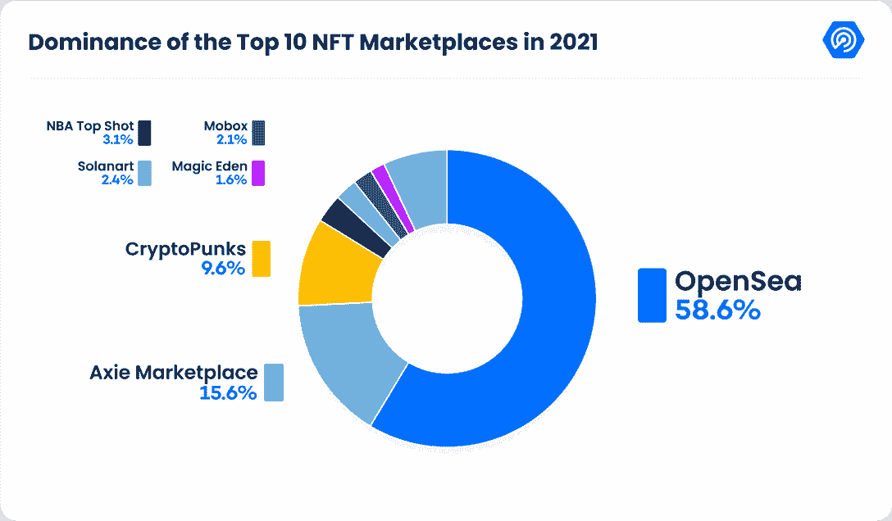

快进到 2022 年，我们看到 NFT 顶级市场的主导地位发生了重大转变。OpenSea 增长了其主导地位，并以 73.1%的交易量保持领先地位，前 10 名中有许多新进入者。X2Y2 在第一年以 6.1%的交易量位居第二，其次是 Magic Eden 的 5.9%和 LooksRare 的 2.4%。2021 年是第四大市场的 CryptoPunks 已经跌至第五位，交易量为 2.3%。

前十名中的其他公司包括 BloctoBay，1.7%，Axie Marketplace，1.34%，Immutable X Market，1.02%，ThetaDrop，0.87%，NBA Top Shot，0.82%。

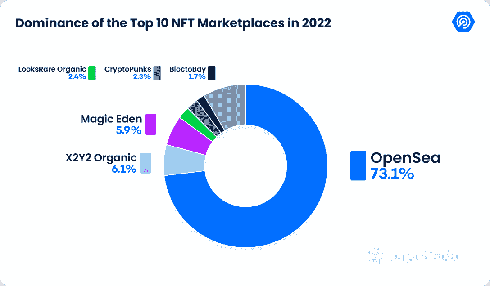

从 2021 年到 2022 年，NFT 顶级市场的主导地位发生了变化，原因有很多。一个关键因素是 NFT 市场的整体增长，吸引了新的进入者，加剧了竞争，如上文所述。此外，分散融资(DeFi)的兴起和使用不可替代的代币作为贷款抵押品可能也在这一转变中发挥了作用。

总之，从 2021 年到 2022 年，NFT 顶级市场的主导地位发生了显著变化，新进入者和竞争加剧导致排名发生变化。虽然 OpenSea 仍然遥遥领先，但现在有许多其他市场正在争夺交易量的份额。随着 NFT 市场的持续增长和发展，观察这些排名在未来几年的变化将会非常有趣。

### 版税困境

最近，关于 NFT 版税的辩论一直是加密社区的热门话题，一些人认为版税对于创作者从其工作的成功中获得额外收入至关重要，而另一些人则认为版税不公平，具有掠夺性。DeGods 生态系统最近从其所有附属的 NFT 收藏中移除了版税，这在 NFT 生态系统的主导者中引发了一波变革。

NFT 特许权使用费简史显示，这是一个相对较新的概念，首批 NFT 市场将于 2020 年实施。这些版税通常由市场本身强制执行，而不是硬编码到发行的智能合同中。加密空间的这种分散性导致了 NFT 市场结构的多样化，一些人将免版税的 NFT 交易作为核心价值主张。

在过去几年中，不可替代令牌(NFT)市场中的版税使用有所增加。最初，许多 NFT 项目，如 CryptoPunks，并没有对他们的收藏征收版税。然而，Bored Ape Yacht Club 等系列的成功导致了行业标准的形成。Bored Ape Yacht Club 通过收取 2.5%的版税为其创作者赚取了 5400 万美元的二次销售收入。这一趋势随着一些实施 5%版税的收藏而延续，如 Otherdeeds 和 Meebits。

最近，NFT 的一些项目开始尝试更高的版税，如 Goblintown，它对二次销售征收 7.5%的版税。NFT 世界的版税最高，为 9.5%，尽管收藏表现不佳，用户增长乏力，但该团队仍获得了 1500 万美元。

由于更广泛的熊市使用户对价格更加敏感，有人反对继续通过版税赚取收入而不兑现承诺的收藏。这导致免版税的 NFT 市场活动增加。SudoSwap 等零版税 NFT 市场的引入，加剧了关于版税在 NFT 市场中作用的辩论。SudoSwap 使用与 Uniswap 类似的自动做市商(AMM)模式，提供较低的费用，并且不支持征收版税。事实证明，这种价值主张很受寻求利润最大化的卖家的欢迎。作为回应，其他 NFT 市场，如 X2Y2 和 Yawww，已经让买家和卖家可以选择支付版税。

索拉纳 NFT 生态系统比以太坊 NFT 生态系统对这场争论更加敏感。Magic Eden 之前占据了索拉纳 NFT 市场 90%的份额，在推出免版税的替代产品后，其市场份额下降到了 60%。Magic Eden 的回应是在其平台上选择版税，从而恢复到之前 90%的市场份额。

索拉纳和以太坊 NFT 生态系统对零版税运动的不同反应可能是由于每个平台上的用户类型不同。索拉纳·NFT 的交易者更可能是专注于最大化利润的投机者，而以太坊 NFT 的用户更经常是对表明地位和在稀有收藏品中储存价值感兴趣的高净值个人。这可能会使以太坊用户对与版税相关的费用不那么敏感。

尽管 NFT 版税对创作者有潜在的好处，但人们也有理由担心其可执行性和公平性。如前所述，特许权使用费并没有被硬编码到发行的智能合约中，这使得它们很容易被市场修改或删除。DeGods 和 Magic Eden 已经发生了这种情况，导致创作者收入流的潜在损失。此外，一些人认为版税是不必要的，是掠夺性的，夺走了 NFT 买家的利润，降低了 NFT 的整体价值。

这个问题的一个潜在解决方案是实施基于智能合同的版税。通过将版税硬编码到发布的智能合同中，它们将是可执行的和透明的，允许创作者从其作品的成功中获得持续的收入。这也将为 NFT 买家提供保证，他们的购买将支持创作者和保持 NFT 的价值。

总之，关于 NFT 版税的争论是复杂而有争议的，双方都有合理的论据。虽然版税已被证明是收藏所有者的一个有利可图的收入来源，但其可执行性和公平性仍然是一个问题。实施基于智能合同的版税可以为这个问题提供一个解决方案，允许创作者从他们的工作中获得持续的收入，同时也为 NFT 买家提供透明度和保证。

### 顶级蓝筹股系列分析

在这项分析中，我们考察了三个月内五种不同的 NFT 藏品在瑞士法郎和美元中的底价。

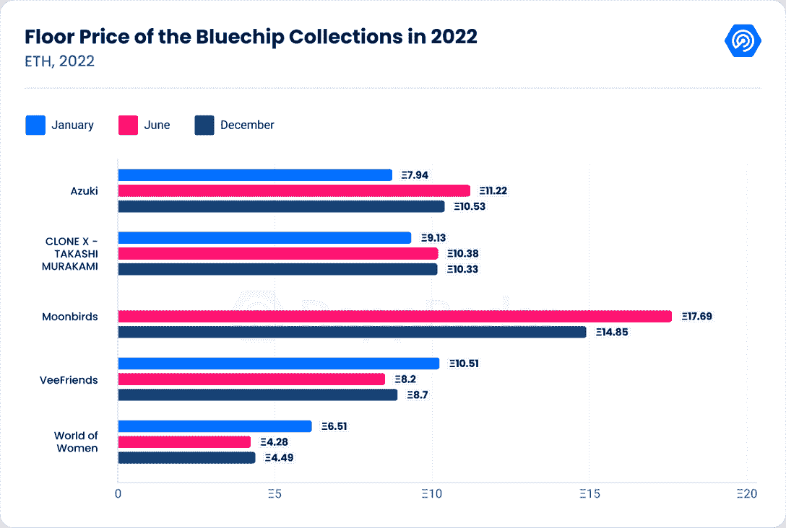

从 1 月到 12 月，志那都红豆·NFT 集合交易所的瑞士法郎底价增加了 32.62% (10.53 瑞士法郎)，但美元底价下降了 37.69%(13，289 美元)。该系列于 2022 年 1 月引入 NFT 市场，并迅速获得了 NFT 爱好者的关注。由于其高昂的薄荷价格和复杂的路线图，它被视为 NFT 市场的潜在领导者，也被有影响力的人视为热门商品。志那都红豆的创建者有一个目标，那就是创建最大的分散的元宇宙品牌，由它的持有人社区所拥有。

此外，今年，F1 车队甲骨文红牛车队与 Bybit 和志那都红豆的创造者 Chiru Labs 合作。在阿布扎比举行的 2022 赛季决赛中，车队的汽车采用了志那都红豆 NFT，这是蓝筹 NFT 首次出现在 F1 赛车上。为了准备阿布扎比站的比赛，志那都红豆车队还向参赛者提供了 F1 比赛夹克。

CLONE X–X TAKASHI MURAKAMI 的 ETH 底价今年上涨了 13.14% (10.33 ETH)，但其美元底价却下降了 46.84%(13，036 美元)。克隆 X 是设计工作室 RTFKT 和日本当代艺术家村上隆的合作。它为村上艺术风格的粉丝提供了一个机会，以 NFT 的形式拥有他的一件数码作品。克隆 X 系列也因其多样性而脱颖而出，有各种肤色和种族的克隆体可供选择，包括一些患有罕见皮肤病白癜风的克隆体。

除了作为收藏品，拥有克隆人 X NFT 还可以进入 RTFKT 生态系统，该生态系统专注于数字可穿戴设备等元宇宙产品。这包括特殊的好处，如获得真实世界的活动和早期机会购买新系列的 NFT。Clone X 路线图旨在使用户更容易访问和参与元宇宙，能够定制和个性化可在各种平台上使用的 3D 文件。

克隆 X 在社交媒体上获得了强大的追随者，并在 NFT 收藏家中广受欢迎。2022 年 12 月 13 日，耐克宣布收购 RTFKT，以利用该公司在增强现实、区块链和数字资产方面的专业知识。

从 6 月到 12 月，Moonbirds 的瑞士联邦交易所底价和美元底价分别下降了 16%和 33.61%。Moonbirds 系列于 2022 年 4 月 16 日推出。该系列很快获得了关注，并产生了巨大的反响，10，000 件 NFT 在推出时(通过抽奖)有 7，875 件在两天内销售一空。Moonbirds 总共筹集了 19，687 ETH，当时的价值约为 6，000 万美元，并继续在 NFT 二级市场为持有人创造数百万美元的收入。

月鸟成功的部分原因是它与证据集体的联系。当 PROOF Collective NFTs 首次进入市场时，它们的售价是 1 ETH。然而，它们的价值逐渐增加到两位数，甚至在月鸟发射前达到 100 ETH 以上。害怕错过(FOMO)和与月鸟相关的恶名相结合，促成了该项目的价值迅速上升。

随后，VeeFriends 的 ETH 底价下跌了 17.22%，美元价格下跌了 61.11%。Gary Vee 的 VeeFriends 作为世界上最成功的 NFT 会员之一继续蓬勃发展。该品牌包括 Mini Drops、图书游戏和即将推出的“Series 2”系列，共有 10，255 个 VeeFriends 代币。7 月，VeeFriends 还完成了由 Andreessen Horowitz 牵头的 5000 万美元的种子融资，他们将利用这笔资金支持 283 个 VeeFriends 角色的开发，并扩大品牌的创意、技术和体验运营。

2022 年 10 月，VeeFriends 发布了以该系列人物为特色的实体产品，包括任性的巫师、冒险的宇航员、实用的孔雀等等。这些产品带有二维码，可以播放 3D 动画电影和人物歌曲。实体 VeeFriends 系列可在梅西百货玩具“R”美国网站、手机应用程序和全国范围内的店内购买，价格从 9.99 美元到 29.99 美元不等。

最后，但同样重要的是，妇女世界将其 ETH 底价降低了 31.03%，其美元底价降低了 67.59%。2022 年 1 月，人才经理 Guy Oseary 宣布，他将代表 WoW 探索电影、电视、音乐、游戏和消费产品方面的机会。一个月后，瑞茜·威瑟斯彭的制作公司 Hello Sunshine 宣布与 WoW 合作，将他们的世界扩展到各种形式的知识产权，包括故事片和电视剧。

WoW 的联合创始人兼艺术家 Yam Karkai 还被委托为 2022 年 Billboard Women in Music 活动和峰会制作独一无二的杂志封面，封面上有麦当娜、玛丽亚凯莉和克里斯蒂娜·阿奎莱拉。2022 年 2 月，该项目的一件 NFT 在佳士得伦敦晚间拍卖会上以 260 ETH(约合 56.7 万英镑)的价格售出。

2022 年 3 月，WoW 推出了女性银河世界，这是一个由 22，222 个 NFT 组成的新集合，这些 NFT 是使用原始集合中的 NFT 创建的，随着它们通过一个门户进入银河系而进化和繁殖。

随后，WoW 宣布它将“大力投资于元宇宙”，并宣布与沙盒合作建立 WoW 基金会，该基金会将在五年内获得 2 500 万美元，以支持妇女在分散空间中的代表性。该倡议将侧重于四项原则:慈善捐赠、支持艺术家和资助项目、提高以妇女为中心的事业的能见度以及教育新来者。WoW Galaxy 系列销售额的 10%也将捐赠给该基金会。

总体而言，这些 NFT 蓝筹股的价值在给定的时间段内有所波动，有些上涨，有些下跌。值得注意的是，NFT 的价值会受到各种因素的影响，如市场需求和特定收藏或艺术家的受欢迎程度。同样值得注意的是，ETH 和 USD 的价值不能直接比较，因为 ETH 的价值可以独立于 NFT 藏品的价值波动。

### 宇迦实验室的足迹进一步扩展到 NFT 市场

宇迦实验室在 NFTs 领域经历了多事之秋。该品牌的 NFTs 在一年中经历了一系列的价格波动，一些系列经历了下降，而另一些则略有上升。总体而言，以太网价格底价相对稳定，仅美元底价出现大幅下降，原因是以太网美元价格下跌。

无聊猿化学俱乐部、突变猿游艇俱乐部和 Meebits 系列在这一年中略有增加，无聊猿化学俱乐部增加了 3.78%，突变猿游艇俱乐部系列增加了 0.56%，Meebits 系列增加了 2.18%。

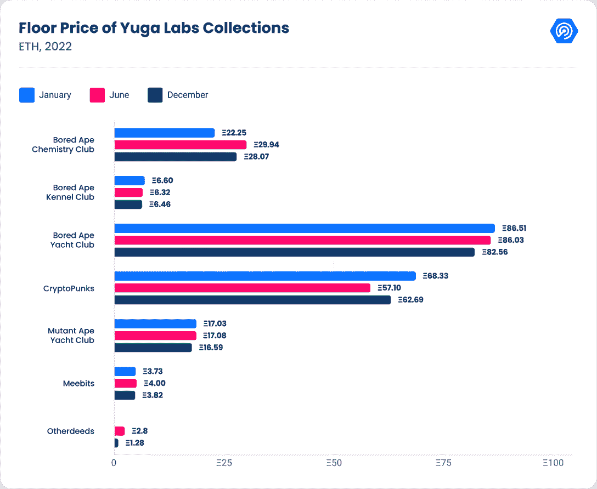

宇迦实验室在 3 月份获得产权的 CryptoPunks collection 的底价也有所下降，从 1 月份的 68.33 ETH 降至 12 月份的 62.69 ETH，降幅为-8.26%。Otherdeeds 系列的变化最大，其底价从 6 月的 2.80 ETH 降至 12 月的 1.28 ETH，降幅为 54.29%。

五月，元宇宙的另一个项目取得了巨大的成功，出售了它的另一份地契。这些元宇宙土地 NFT 在公开销售的三个小时内销售一空，总共带来了 1670 万枚硬币(当时为 3.17 亿美元)，使其成为创纪录的 NFT 造币厂。NFT 给予买家在元宇宙另一边要求土地的权利，这是一个由宇迦实验室开发的虚拟世界，不太可能。2022 年，该项目继续蓬勃发展，Eminem 和 Snoop Dog 在元宇宙的另一边表演年度 MTV 音乐录影带大奖，并带着他们的 Bored Ape 游艇俱乐部 NFTs。7 月，宇迦实验室的游戏项目还聚集了 4300 名“旅行者”进行首次技术演示，并参观由 implementable 开发的沉浸式互联网环境。

在这一年中，突变猿游艇俱乐部和米比特系列都有小幅增长，突变猿游艇俱乐部系列的 ETH 价格增长了 0.56%，米比特系列的 ETH 价格增长了 2.18%。

此外，11 月 14 日，宇迦实验室宣布收购 NFT 初创公司 WENEW Labs 及其 10KTF Web3 时尚品牌，该品牌由著名艺术家 Mike“bee ple”winkel Mann 共同创立。WENEW Labs 联合创始人兼首席执行官迈克尔·菲格(Michael Figge)将担任新的首席内容官。Beeple 因在 2021 年 3 月的拍卖会上以 6930 万美元的价格出售一件 NFT 艺术品而闻名，他将担任宇迦实验室的顾问。

今年，蓝筹股 NFT 藏品的交易非常集中，尤其是宇迦实验室的藏品。事实上，按市值计算，超过 55%的前 100 名 NFT 来自宇迦实验室的收藏。除此之外，在 2022 年 NFT 销量前 12 名中，宇迦实验室 NFT 占据了图表的主导地位。

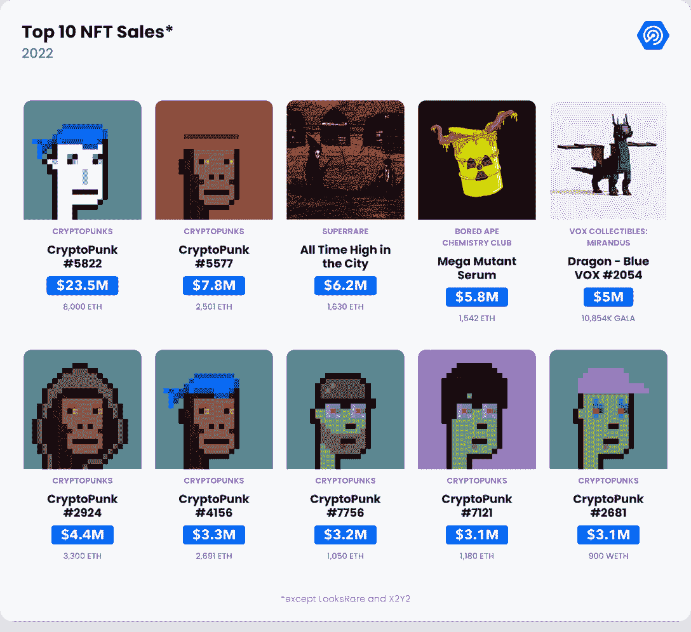

总体而言，很明显，宇迦实验室在 NFT 市场取得了成功，开展了各种创新项目和合作。虽然其 NFT 系列的底价在这一年中显示出喜忧参半的趋势，但该公司继续取得成功，并推动 NFTs 的发展。

### 探索 2023 年 NFTs 的潜力

近年来，NFT 因其能够代表区块链上独特的数字资产而获得了极大的关注。这些资产可以是任何东西，从艺术品到收藏品，从门票到虚拟房地产。最重要的是，它们在各种行业越来越受欢迎。据雅虎称，到 2026 年底，NFT 市场的 CAGR 将达到 824.3 亿美元。

公用事业 NFT，如游戏内 NFT、身份令牌和令牌门控社区、软件和活动，预计将在 2023 年出现显著增长。这些类型的非关税壁垒有可能通过授予持有者特定的特权来扰乱各种行业。例如，PROOF Collective 允许 NFT 持有者访问未来的产品投放，并参与社区活动，如现场活动和私人不和小组。

以太坊联合创始人 Vitalik Buterin 也发布了一篇关于 soul bound token(SBT)的[论文](https://web.archive.org/web/20230313162029/https://vitalik.ca/general/2022/01/26/soulbound.html)，SBT 是保存链上信息的 NFT，不能交易，已经被一些项目采用。此外，游戏行业的 NFT 交易显著增加，娱乐行业也开始探索 NFT 来吸引粉丝。

传统公司也一直在探索采用非功能性技术。蒂芙尼(Tiffany's)发布了一系列面向 CryptoPunks NFT 持有者的吊坠，Instagram 宣布将 NFTs 纳入其平台，耐克(Nike)收购了元宇宙时装公司 RTFKT。此外，星巴克推出了使用区块链技术的忠诚度计划，而三星在其最新的电视中集成了 NFT 显示选项。在音乐行业，Royal 允许粉丝直接投资歌曲，克里斯蒂亚诺罗纳尔多(Cristiano Ronaldo)等体育运动员发行了 NFT 专辑，以增加粉丝的参与度，并可能提供其他额外补贴。

在 2023 年，我们可以期待在加密和传统领域看到实用 NFT 的进一步发展和实验。公司将很可能开始使用 NFT 来为他们的所有者提供价值和独特的体验。总的来说，行业颠覆和创新使用 NFTs 的潜力是令人兴奋的，在未来的一年里值得关注。

## 到 2022 年，游戏行业将占整个行业使用量的 49%

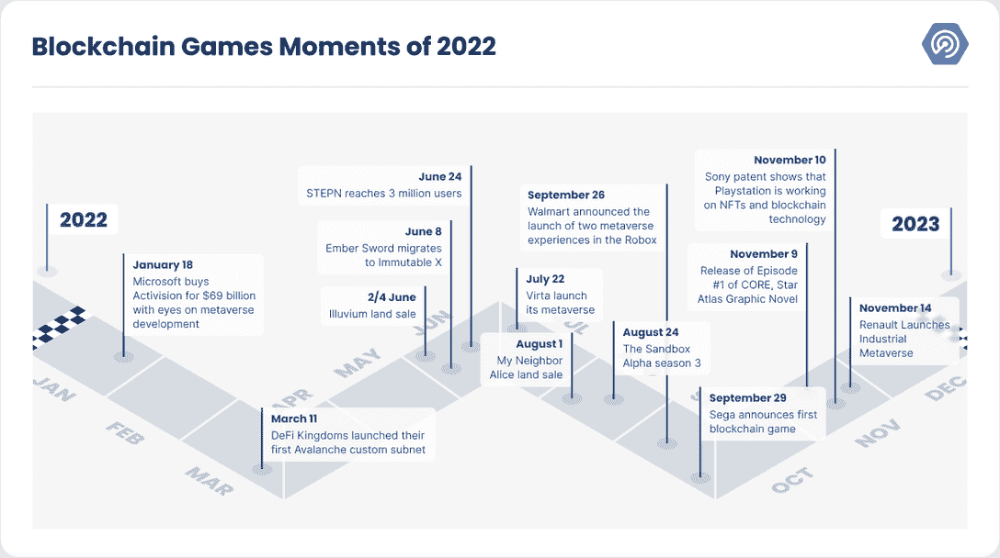

近年来，区块链博彩业面临着相当大的挑战，但在 2022 年，市场已经开始复苏，并显示出采用率的增加。区块链博彩业的独立活跃钱包(UAW)数量今年平均增加了约 115 万 dUAW，占区块链日均活动的 49%。此外，交易数量今年增长了 94.17%，达到 74.4 亿。

以太坊保持了其在市场上的主导地位，基于游戏内 NFT 的二级市场交易，占据了约 60%的市场份额。然而，其他平台如 Solana、Polygon 和 Immutable X 积极参与竞争，并试图将自己定位为区块链游戏开发者的首选。

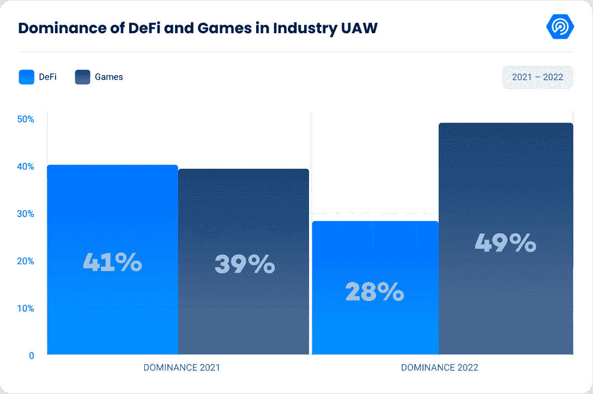

“玩到赚”(P2E)游戏行业经历了显著的低迷，大多数主要项目在 2022 年损失了超过 90%的市值。虚拟土地 NFT 代表尚未推出的游戏中的资产，也出现了类似的下降趋势。然而，该行业正在向区块链游戏的第三个时代转变，这将建立在过去的教训基础上，优先考虑乐趣，同时解决可扩展性和经济设计问题。

2022 年的顶级比赛已经显示出了韧性，他们设法增加了他们的活动。《夹板王国》仍然是最受欢迎的游戏，2022 年每月有 217，914 个独特的活跃钱包，增长了 85.78%。排在第二位的是外星世界，它的活动在 2022 年略有减少。随着 3.67%的下降，《异形世界》现在达到了平均每月 178，118 个独立活跃钱包。

最近几个月，区块链博彩业的融资情况也是喜忧参半。在 2022 年第三季度，该行业出现了同比负增长，交易总额下降，今年早些时候开始的市场调整仍在继续。交易数量确实同比增长了 2.6 倍，但交易总额下降了 19%。季度环比增长指标也有所下降，表明调整仍在继续。

无论市场是调整，还是走向下一个发展阶段，许多公司都会转向新的商业模式。远离“玩即赚”,宣扬“自由拥有”或“玩即赚”。随着这种对区块链游戏开发的新观点，也出现了一个新的焦点，包括建立强大的社区，提供投资管理服务，开发技术产品，提供增值服务，以及创造引人入胜的内容。获得资金最多的公司是那些能够利用区块链游戏基础设施制作高质量内容的公司。

钱包解决方案是推动区块链游戏大规模普及的一个关键领域。钱包是玩家的主要互动点，拥有用户友好和可靠的选项将成为吸引和保留大量用户群的关键。像 Sequence by Horizon 和 Stardust Vault by Stardust 这样的公司值得关注，因为它们希望在这个领域提供创新的解决方案。

主要平台也开始接受区块链游戏，Epic Games 商店托管 Blankos Block Party 和 Gala Games 的产品，而苹果将允许销售 NFT，尽管容量有限。这对该行业来说是一个充满希望的迹象，因为它将增加 NFTs 和 Web3 技术在更大受众中的存在。支持区块链游戏的发行将是大规模采用的主要催化剂。

传统游戏开发商向区块链博彩业的迁移也已开始，带来了他们的专业知识，并有可能扰乱传统游戏市场。通过使用 NFTs，真正的数字所有权和稀缺性的潜力增加了吸引力和新的机制，这将为创新的游戏设计铺平道路。

总的来说，随着市场的成熟和向更吸引人和有趣的内容的转变，区块链游戏的未来看起来是光明的。虽然仍有许多挑战需要克服，如可扩展性和经济设计，但该行业已经为未来的增长和大规模采用做好了准备。

> “在过去的两年里，大量的投资涌入了 GameFi 领域，我们可以期待在 2023 年看到这些投资的成果。虽然早期的区块链游戏通常优先考虑加密货币而不是实际的游戏体验，但趋势正在转向无缝集成加密货币和 NFT 的传统游戏。随着对 NFT 集中化潜力的认识不断提高，我们也可以预期对全链 NFT 的需求会增加。在未来的一年，克劳莉娅将专注于构建我们的测试网络，扩展我们的生态系统，并引入一个新的 dapp 平台，该平台提供可扩展性、链上数据存储、可定制的费用结构和增强的 NFT 功能。”
> 
> According to Anastasia Plane, Senior Marketing Lead at Chromia & ChromaWay

要了解更多关于 2022 年区块链博彩业的统计数据，请关注我们将于 2023 年 1 月底发布的新年度博彩业报告。

### 采访 Animoca Brands 首席执行官 Robby Young

区块链博彩与传统博彩的区别是什么？与传统游戏相比，区块链游戏的优势是什么？

关键的区别在于所有权。在令牌化游戏中，玩家拥有真正的数字所有权，这改变了开发者的商业模式和玩家的价值主张。这改变了玩家参与产品的方式。

**可扩展性一直是区块链技术的主要问题。随着用户数量的增加，区块链游戏能在不牺牲其他功能的情况下扩大规模吗？**

是的，我相信他们可以。聪明人总会找到解决这些挑战的办法，就像我们知道如何让 AAA 游戏在手机上变得有趣，以及我们知道如何降低以太坊(第二层)的油价一样。

用户经常抱怨区块链游戏缺乏多样性和逼真的画面。要使区块链奥运会达到 AAA 级的标准，需要做些什么？

这是一个简单的时间问题。区块链的游戏很少，所以选择有限。我没有官方数据，但如果区块链游戏的数量每个季度都翻一番，我不会感到惊讶。

你认为区块链博彩会带来下一波应用浪潮吗？

如果采用区块链是真的，那么是的，它将由游戏带来。

## 新法规反映了区块链技术日益增长的重要性

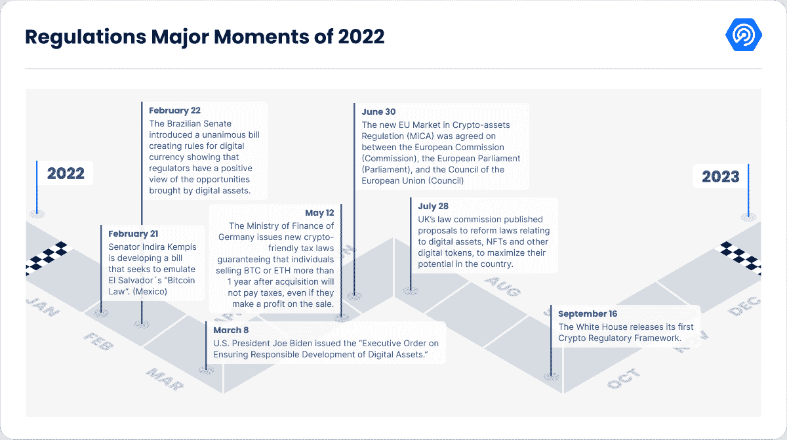

2022 年，区块链行业的主要法规侧重于提高区块链系统的透明度和问责制。这包括打击洗钱、欺诈和其他非法活动的措施，以及为使用区块链技术建立明确规则和指导方针的努力。

一项值得注意的法规是金融行动特别工作组(FATF)的旅行规则，该规则要求金融机构收集和交换关于虚拟资产发送者和接收者的信息。这旨在提高虚拟资产的可追溯性，并防止其用于非法目的。

另一个重要的法规是美国证券交易委员会关于在证券业使用区块链技术的指导。这明确了对利用区块链发行和交易证券的公司的监管要求，旨在保护投资者和促进公平有序的市场。

随后，今年推出了第一个白宫加密法规法案，旨在为加密货币和其他数字资产的监管建立一个全面的框架。该法案提出了打击洗钱、欺诈和其他非法活动的措施，以及对加密交易所和其他市场参与者进行注册和监督的指导方针。

在欧洲，引入了加密资产市场(MiCA)监管，旨在为整个欧盟的加密资产监管建立一个统一的框架。该法规涵盖了广泛的问题，包括对加密资产服务提供商的许可和注册要求、投资者保护以及对市场参与者的监管。

就监管的方向而言，很可能将继续侧重于提高区块链系统的透明度和问责制。这可能涉及打击洗钱和其他非法活动的进一步措施，以及加强国家和国际两级监管机构之间的协调与合作。

此外，随着区块链技术的不断发展和扩大，可能需要新的法规来应对新出现的挑战和机遇。这可能包括与将区块链用于新应用相关的法规，如分散融资和不可替代的令牌，以及支持区块链行业增长和促进创新的法规。

总体而言，区块链行业的监管环境非常复杂，并且在不断变化。2022 年的主要法规旨在提高区块链系统的透明度和问责制，这很可能将继续成为未来的一个重点。

## 关闭

在 2021 年突破性的一年之后，dapp 行业达到了前所未有的高度，2022 年是 dapp 表现出弹性和进化的一年。即使在灾难性事件中，第二大 DeFi 生态系统和第五大最受欢迎的集中交易所在几个小时内消失，该空间仍坚守阵地，展示其弹性和真正的潜力。

2022 年，DappRadar 实现了 49 个区块链集成，跟踪了近 13，000 个 dapps 和超过 13，500 个 NFT 系列。大量的集成 dapps 反映了该行业的现状，尽管条件恶劣，但成功的项目仍在继续建设。

同样，知名品牌越来越多的采用从未真正停止。从 Twitter 在 1 月份推出 NFT 整合到 MetaMask 和 PayPal 之间的最新整合，我们看到了一条进军新一波 Web3 用户的坚定道路。Instagram 和 Reddit 完全接受通过区块链存储的数字收藏品。与此同时，Ticketmaster 与 Flow 合作，这有望成为非功能性票务服务最具吸引力的用例之一。与此同时，通过区块链科技推出元宇宙战略的顶级品牌已经很难量化了。

毫无疑问，区块链奥运会和 NFTs 是 2022 年 dapps 的驱动力。虽然 2021 年是 NFTs 年，但数字资产在过去 12 个月中经历了最关键的时期。如前所述，机构和企业的不断采用本身就是一个乐观的信号。然而，散户投资者越来越多的参与，是对区块链资产接受度上升的最新证明。自 2021 年以来，NFT 交易的数量增加了 10%，而同期交易者的数量激增了 870%。虽然一些人可能会认为交易量停滞不前，但有必要考虑到市场产生的交易量与一年前相同，当时大多数密码的价格比峰值高出 70%。

尽管《阿凡达》NFT 的泡沫不久前破裂了，但我们仍然见证了开创性的 NFT 系列在加密寒冬中推出并取得成功。Moonbirds、Digidaigaku、GoblinTown、QQL、RENGA 和其他人证明，如果在创新概念的支持下启动，相关项目仍有留下足迹的空间。

更重要的是，NFTs 的成功不像前几年那样局限于以太坊和心流。Solana、Polygon、Immutable 和 Cardano 成为评估 NFT 市场的主要参与者。

同样，整合不同的 NFT dapp 来挑战 OpenSea 的市场主导地位应该被视为朝着正确方向迈出的一步。虽然仍有挑战需要解决，如版税困境和高价交易仍在一些市场中发生，但公开竞争应该能让每个人发挥出最佳水平。Magic Eden、X2Y2、Blur、BenDAO、LooksRare、GameStop 和其他公司将在 2023 年增加市场份额，而 Gem 和 Genie 等 NFT 聚合器已经改变了我们交易 NFT 的方式。

Web3 游戏领域也向前迈进了一大步。尽管有起有落,《外星世界》、《分裂之地》、《Axie Infinity》、《高地》和《沙盒》,都是一致性的衡量标准。这些区块链游戏在两年多的时间里一直高居游戏排行榜的榜首。

同样，一些网络被证实是强大的游戏生态系统。从不可改变的 X 开始，以太坊的第二层解决方案是流行的交易卡游戏《被解放的神》和幻想 RPG《守护者协会》的家园。此外，最受期待的游戏之一 Illuvium 成功结束了封闭的 alpha 赛季，目前正在进行 beta 测试。去年 6 月，Immutable X 还正式迎来了在线角色扮演游戏 Ember Sword，因为该游戏结束了资产的迁移。

除了不可变的 X，Polygon 证明了自己是 Web3 游戏的一员。像 Aavegotchi，Arc8，疯狂防御英雄，医生这样的游戏 dapps。世卫组织:世界是分开的，沙盒，给区块链另一个理由保持乐观。同样，联欢晚会仍然是一股不可忽视的力量。这家区块链游戏公司的投资组合中有 18 款游戏，其中两款在 Steam 上，一款在 Epic Games Store 上。Gala Games 甚至有更多的王牌，如米兰多斯，行尸走肉:帝国和遗产，同时仍有未经证实的项目数量未公布。

风险资本家和私人投资者对 2022 年博彩和元宇宙项目的承诺可以被视为锦上添花。Web3 元宇宙项目今年筹集了近 80 亿美元，几乎是 2021 年的三倍。

> “2022 年的 web3 游戏浪潮并不是加密和游戏的交集。通过设计拙劣的游戏或用昂贵的 NFT 看守玩家来强加加密动态，如种植过度膨胀的代币从来都不是一个好主意。我们预计这些趋势将在 2023 年逐渐消失。然而，我们预计这些趋势将在 2023 年逐渐消失，因为我们看到了对传统游戏玩家有吸引力的高质量和有趣的游戏的出现。此外，将会有越来越多的基础设施产品，使游戏开发者能够轻松地将 crypto 集成到他们的游戏中，我们将会看到更多的项目选择建立在 Algorand 这样的协议上。虽然开发 web3 游戏的游戏开发者数量将会增加，但我们仍然需要一款与传统 AAA 游戏数量相似的 web3 游戏来充分吸引游戏开发者社区的注意力，我们预计这不会在 2023 年发生。”
> 
> According to Piergiacomo Palmisani, the Head of Gaming at Algorand

虽然游戏和非功能游戏在这一年取得了突破，但 DeFi 遭受了 Terra 和 FTX 崩溃的后果。由于 crypto 价格暴跌，该行业的 TVL 下跌了 73.97%。泰拉损失了 300 亿美元，索拉纳无法转移 FTX 的压力。然而，对 DeFi 爱好者来说也有一线希望。

在 dapp 日历中最关键的事件之一中，以太坊最终完成了向利益相关网络的转变，合并了 T1。结果，第二层和扩展解决方案最终繁荣起来，填补了 Terra 留下的部分空白。PancakeSwap 和 Uniswap 等流行的 DeFi 平台仍然是全区块链最受欢迎的 dapps，这要归功于它们优化的用户旅程和独特的主张。

然而，在 DeFi 中仍然有一个粗略的教训要吸取，因为 2022 年是加密史上资金被盗最多的一年。桥梁仍然是黑客的主要目标，尤其是臭名昭著的拉扎罗斯集团。互操作性是该领域最重要的特征之一，但是在执行跨平台交易时需要提高安全性。

总的来说，2022 年对于身处迷人的 web3 环境中的每个人来说都是充满挑战的一年，但我们一直在努力并保持强大。随着这一年的结束，我们感谢所有积极的事态发展，但与此同时，我们也意识到，所有这些不利的情况都应该作为我们的经验教训，帮助我们变得有韧性，并决心变得更加强大。

当我们展望新的一年时，我们满怀希望和乐观。我们知道未来有许多未知，但我们已经准备好以勇气和决心面对它们。我们感谢 DappRadar 社区的支持和关爱，我们很高兴看到光明的未来。