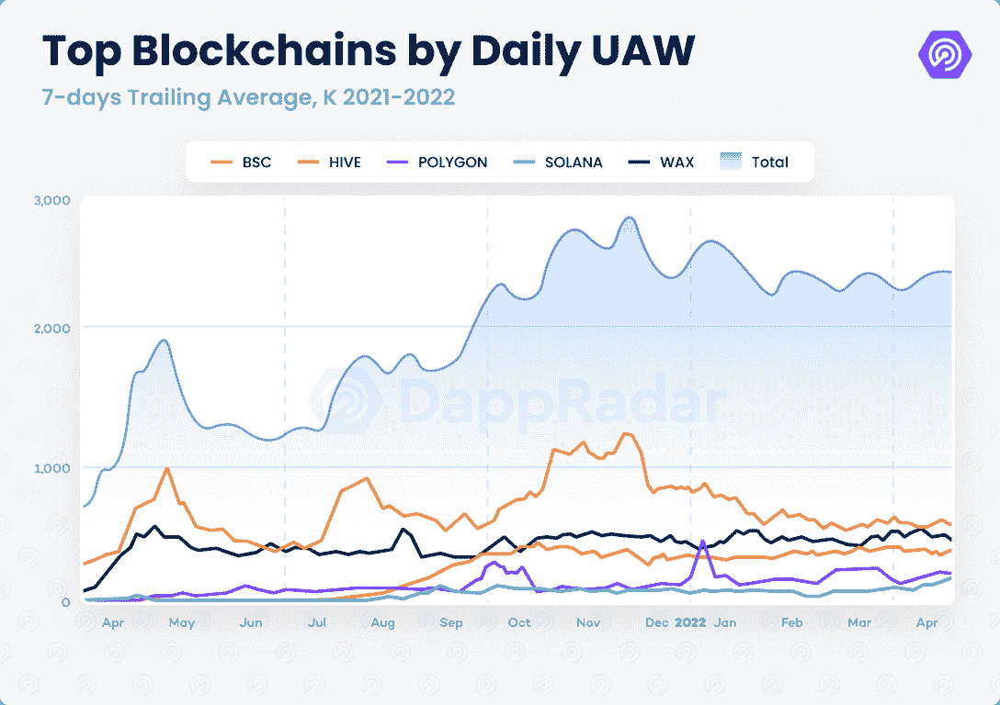
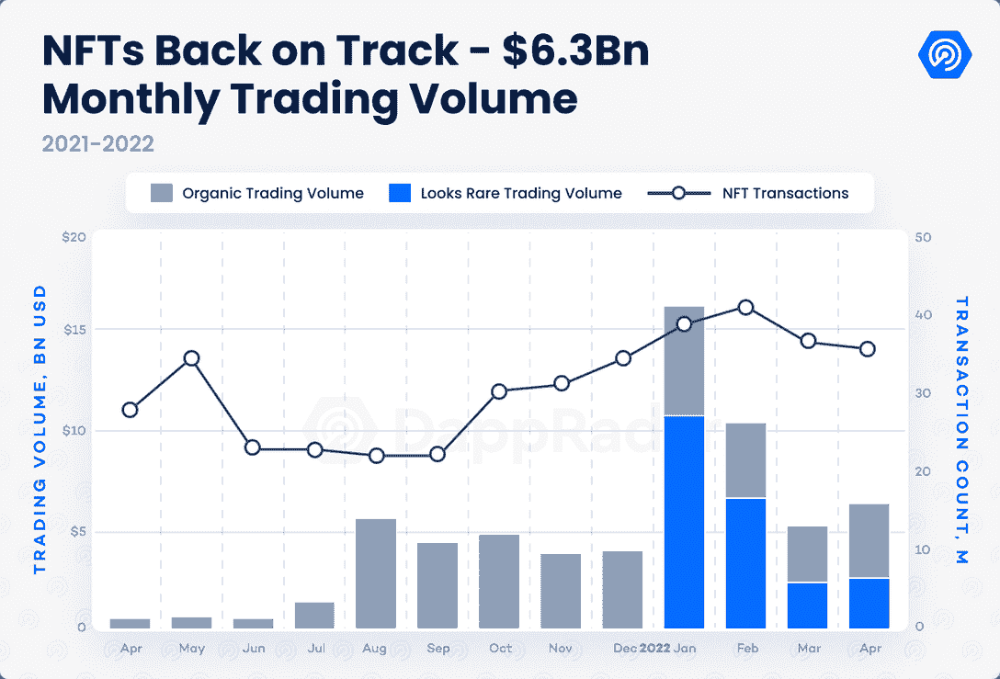
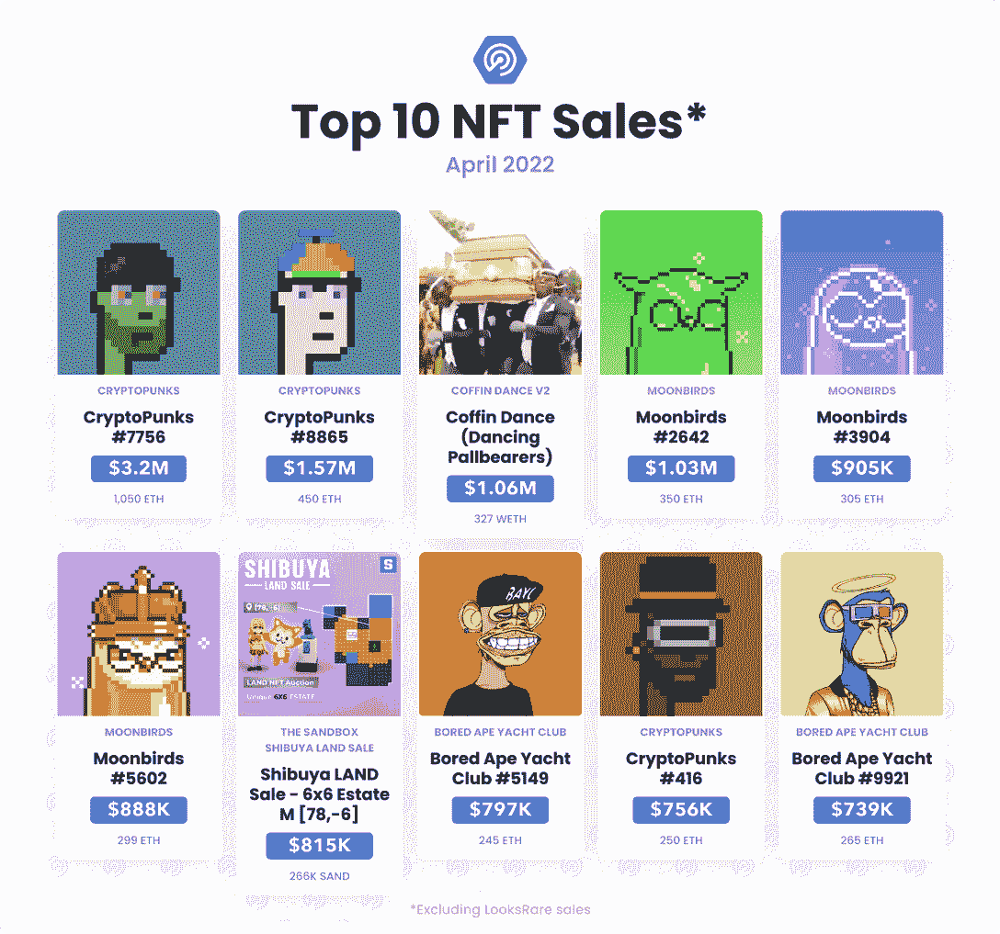
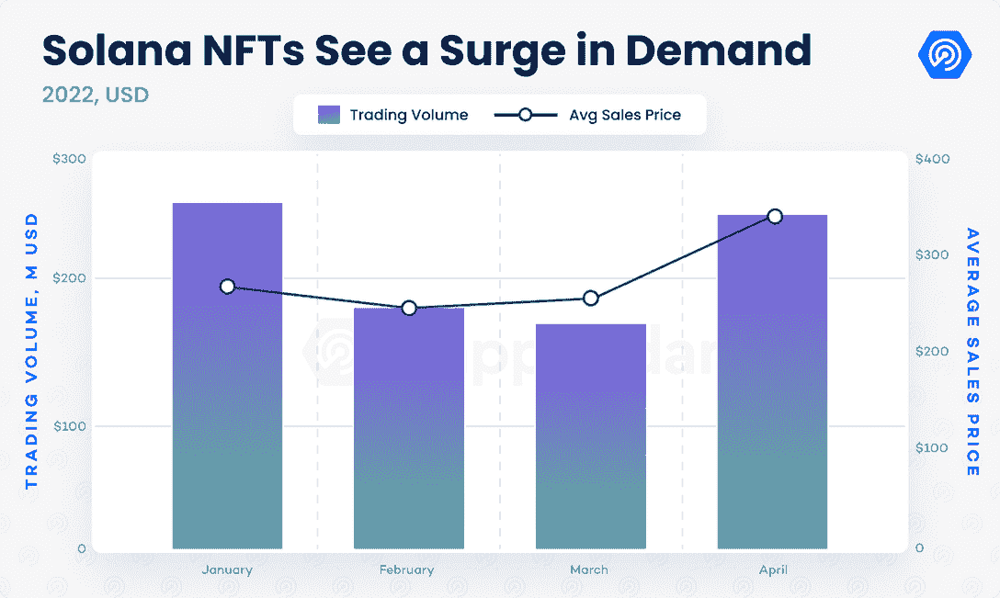
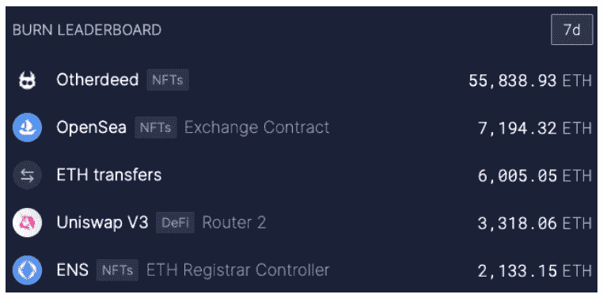
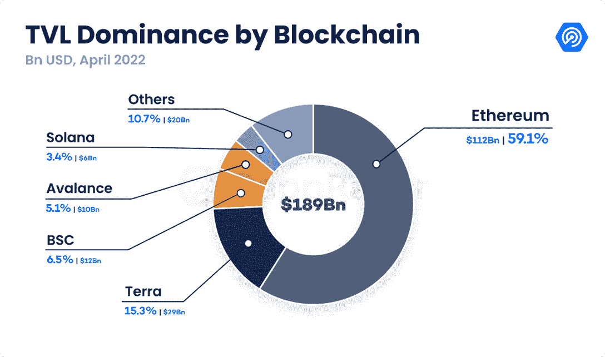
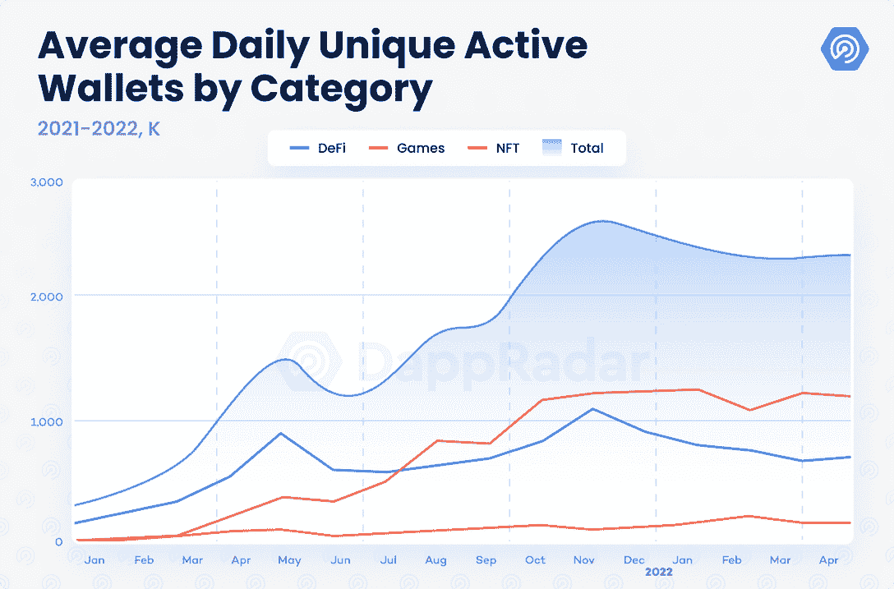
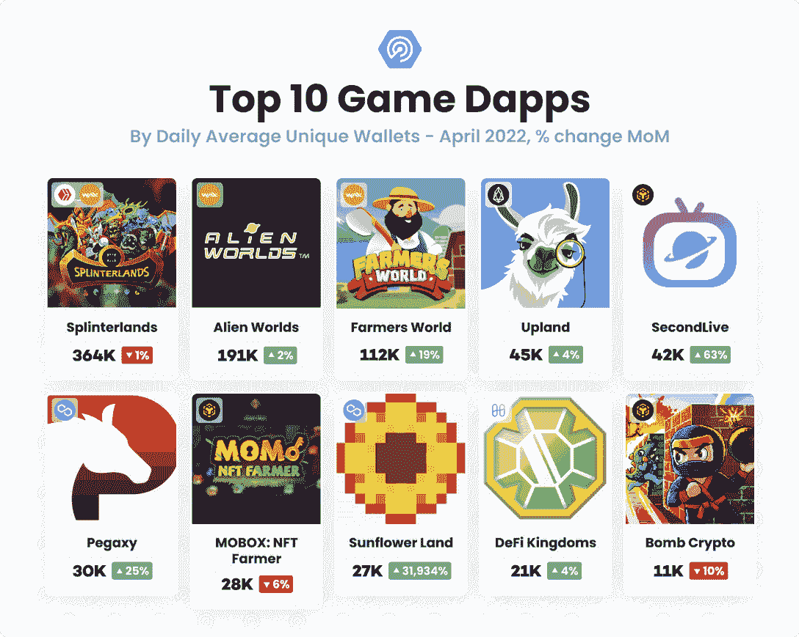

# Dapp 行业报告–2022 年 4 月

> 原文：<https://web.archive.org/web/https://dappradar.com/blog/dapp-industry-report-april-2022>

## 月鸟和索拉纳帮助 NFTs 重回正轨，DeFi 发现多链成功，而区块链游戏继续推动 dapp 和区块链的使用

以与任何 dapp 互动的每日唯一活跃钱包(UAW)数量衡量，今年 4 月的区块链活动超过了 3 月的水平。4 月，超过 236 万的每日 UAW 连接到区块链 dapps，比 3 月略有 0.2%的增长。

BNB 连锁店和蜡像馆的钱包平均使用率最高，每日 UAW 分别为 56.8 万英镑和 49.2 万英镑。Hive 和 Polygon 是最受欢迎的区块链游戏网络，也是使用率最高的网络之一，这证明游戏促进了该行业的活动。

Source: [DappRadar](https://web.archive.org/web/20221201192814/https://dappradar.com/)

值得注意的是，连接到 Solana dapps 的 UAW 数量比 3 月份增加了 58%,首次超过了每日 10 万个 UAW。 [Orca Finance](https://web.archive.org/web/20221201192814/https://dappradar.com/solana/defi/orca) 是一家分散式交易所(DEX)，成为该连锁店使用最多的 dapp，其使用率从 3 月份开始增长了 200%。 [Magic Eden](/web/20221201192814/https://dappradar.com/blog/magic-eden-marketplace-becomes-new-nft-hotspot-on-solana/) ，Solana 的第二大用户 dapp 和最受欢迎的 NFT 市场，由于对 Solana 的 NFT 的需求持续增长，吸引了比上个月多 15%的钱包。

尽管如此，索拉纳还是在 4 月 30 日遭遇了另一次大停电，当时由于 Metaplex Candy Machine(索拉纳 NFT 项目用来发布他们的产品系列的程序)出现问题，网络完全中断了大约八个小时。

4 月份的数据显示，在创纪录的通货膨胀加剧的复杂金融形势下，加密货币和 dapp 的采用率持续上升。随着两个最受期待的系列的推出以及对 Solana NFTs 需求的激增，NFT 市场在经历了六周的冷却后，似乎再次变得火热。领先智能合约平台以太坊(Ethereum)和索拉纳(Solana)的 NFT 活动导致的网络拥塞，说明了一切。

此外，[区块链奥运会](https://web.archive.org/web/20221201192814/https://dappradar.com/rankings/category/games)吸引了创纪录水平的风险投资，并带动了达普拉达跟踪的区块链所有活动的一半以上。与此同时， [DeFi space](https://web.archive.org/web/20221201192814/https://dappradar.com/rankings/category/defi) 面临着可怕的市场和暴跌的加密价格的挑战。

## 关键要点

*   NFT 市场从六周的冷却期恢复过来，月交易量为 63 亿美元；月鸟是一大驱动力，交易产生了 5 亿美元，成为历史上交易量第 11 大的收藏。
*   Solana 的 NFT 交易量较 3 月份增长了 90%，达到 2.95 亿美元；Okay Bears 和 DeGods 在 4 月份进入了 NFT 交易量最高的 30 家 dapps。
*   宇迦实验室的另一边土地下降搅动加密市场，从造币厂获得 3.4 亿美元的 APE 和 4.2 亿美元的二级交易；尽管如此，这一下降导致超过 55，000 ETH 被烧毁，450 万美元的交易失败。
*   Terra 的 DeFi 增长锁定了 290 亿美元；该行业的 TVL 估计为 1980 亿美元，较上月萎缩 12%，但比 2021 年 4 月高出 47%

## 内容

*   [月鸟和索拉纳帮助 NFT 重回正轨](https://web.archive.org/web/20221201192814/https://dappradar.com/blog/dapp-industry-report-april-2022/#Moonbirds-and-Solana-help-NFTs-get-back-on-track)
*   [其他事迹 24 小时内创收 7.6 亿美元](https://web.archive.org/web/20221201192814/https://dappradar.com/blog/dapp-industry-report-april-2022/#Otherdeeds-generate-$760-million-in-24-hours)
*   [DeFi 的 TVL 缩水 12%,而 Terra 的 TVL 优势增长到 15%](https://web.archive.org/web/20221201192814/https://dappradar.com/blog/dapp-industry-report-april-2022/#DeFi’s-TVL-shrinks-12%-as-Terra’s-TVL-dominance-grows-to-15%-)
*   [区块链游戏带动行业 52%的使用量](https://web.archive.org/web/20221201192814/https://dappradar.com/blog/dapp-industry-report-april-2022/#Blockchain-games-drive-52%-of-the-industry’s-usage-)
*   [移动挣钱和日常活动的货币化](https://web.archive.org/web/20221201192814/https://dappradar.com/blog/dapp-industry-report-april-2022/#Move-to-earn-and-the-monetization-of-routine-activities)
*   [关闭](https://web.archive.org/web/20221201192814/https://dappradar.com/blog/dapp-industry-report-april-2022/#Closing)

## 月鸟和索拉纳帮助 NFTs 重回正轨

NFT 市场似乎已从 2 月中旬以来的冷却期复苏。历史上第三次，月度交易量超过 60 亿美元(63 亿美元)，比 3 月份增长 23%。在 NFT 交易产生近 3 亿美元后，索拉纳区块链的交易量环比增长 91%。以太坊市场的交易额超过 25 亿美元，环比增长 9%，而 OpenSea 的交易额为 34 亿美元。

顶级系列如 BAYC、志那都红豆、RTFKT 和 VeeFriends 展示了各自生态系统的强大效用。这些 NFT 的持有者将获得额外的 NFT 奖励，如 Otherdeeds、Beanz、CryptoKicks 或 VeeFriends 2 等有价值的底价。尽管如此，还是一个新的 NFT dapp 在 4 月份抢了头条。

由 PROOF Collective 成员发起的 NFT 项目 Moonbirds ，通过产生近 5 亿美元的交易，激发了 NFT 市场的活力，这是 4 月份 NFT 收藏中最高的。《月鸟》是 NFT 有史以来交易量第 11 大的收藏，在发布后两周内就超过了 Meebits、Doodles 和 Cool Cats 等知名项目。对像素化猫头鹰的需求一直很强劲，并帮助 Moonbirds 的底价反弹超过 30 ETH(撰写本文时为 34 ETH)。

由凯文·罗斯和贾斯汀·梅泽尔领导的 1000 名收藏家和创作者组成的私人会员团体 PROOF Collective，越来越像一个领先的 Web3 元宇宙品牌，具有坚实的实用性和社区因素。在接下来的几个月里，监测 PROOF 的活动是值得的。

Source: [DappRadar](https://web.archive.org/web/20221201192814/https://dappradar.com/)

同样，索拉纳为基础的非功能性测试继续看到需求激增。像 DeGods 和 Okay Bears 这样的收藏品在 4 月份分别以 4400 万美元和 2300 万美元的销售额进入了 NFT 交易量前 30 名。索拉纳 NFT 牛市可以部分归因于网络与 OpenSea 的集成，因为领先的 NFT 市场指数级地增加了这些 NFT 的可见性。关注 Solana 与 OpenSea 的整合是否会影响生态系统中其他 NFT 市场的表现将会很有意思。

尽管如此，像索拉纳猴业、Aurory 和退化猿学院这样的收藏，以及像索拉纳和魔法伊甸园这样的市场，才是索拉纳生态系统中真正的先锋。除了这些 dapps，网络社区还为提高性能铺平了道路。

4 月份，索拉纳在 NFT 交易中获利 2.95 亿美元，较 3 月份的交易量增长了 91%。同样，值得注意的是，在这个网络中，NFTs 的平均销售价格已经上升到大约 350 美元，显示了这些资产的价值。

Source: [DappRadar](https://web.archive.org/web/20221201192814/https://dappradar.com/)

NFT 市场继续证明反对者是错误的。像 Moonbirds 或 Otherside 这样的炒作项目继续在以太坊上积累大量数据，而 Solana 和其他区块链人准备在他们各自的网络中拓展 NFT 市场。此外，监测比特币基地的市场(该市场于 4 月 20 日在以太坊推出测试版)也是一件值得关注的事情。

## 其他行为在 24 小时内产生了 7.6 亿美元

历史上最令人期待的 NFT 下降发生在 4 月 30 日(美国时间)，当时 100，000 块 Otherside 地块或其他契约中的 55，000 块可用于铸币厂在宇迦实验室/ Animoca Brands KYC 进程中注册的地址。这项活动预计将导致高昂的天然气费用，因为其他行为可能代表着成为充满活力的 BAYC 生态系统的一部分的最后机会。但气价比预期差，造币期间超过 2.5 ETH。这一下降导致以太坊拥堵了至少三个小时，影响了成千上万的用户，平均燃气费为 196 gwei，这是自 2020 年 DeFi 夏季以来的最高水平。以太坊的矿工们对这一下降感到高兴。

Source: [DappRadar](https://web.archive.org/web/20221201192814/https://dappradar.com/)

此外，Otherdeeds 的下降将以太坊的燃烧率推至自 EIP-1559 实施以来的最高水平。铸造过程[燃烧了大约 56，000 ETH](https://web.archive.org/web/20221201192814/https://ultrasound.money/) ，或者说在过去的七天里燃烧了大约 70%的资产。另一边设法单枪匹马地将以太坊变成了一种通缩资产。

Source: Ultrasound.Money

Otherdeeds 的薄荷带着苦乐参半的经历离开了 NFT 市场。一方面，令人印象深刻的是，宇迦实验室在仅仅一年的时间里就创造了一个 Web3 品牌，成为世界上最具排他性的社区之一。此外，一年前铸造一个 0.08 ETH 的 BAYC，并持有它直到上周末的全部效用超过至少 100 万美元的 NFTs。

这一下降为宇迦提供了来自一级市场的 3.4 亿美元的 APE 和来自二级市场交易的 15 万 ETH(4.2 亿美元)的至少 2100 万美元的创作费。Otherside 将宇迦实验室定位于探索游戏和 Web3 元宇宙之间激动人心的融合的最前沿。

问题仍然是，车队是否可以采取不同的方式来避免 55，000 ETH(约 1.5 亿美元)。)在这个过程中烧了。然而，最重要的是，本可以做些什么来防止 [14，000 次失败交易](https://web.archive.org/web/20221201192814/https://dune.com/sealaunch/Failed-Transactions-Gas-Cost-on-Otherdeed-Mint)，这导致 11，800 多个钱包损失了 450 万美元的交易费用。作为一种积极的姿态，宇迦实验室已经确认将补偿那些在造币过程中失去 ETH 的用户。尽管如此，这一事件让 Web3 社区质疑接近 NFT 滴滴的最佳方式。

## DeFi 的 TVL 缩水 12%，而 Terra 的 TVL 优势增长到 15%

按照今年大部分时间观察到的趋势，DeFi 努力应对熊市。不断下降的加密价格继续影响 DeFi 蓝筹股，如 UNI、CAKE 和 AAVE，它们已经从去年在 Q2 创下的历史高点下跌了 80%。随着代币价格的下降，该行业的总价值锁定(TVL)缩水。这意味着锁定智能合约的代币价值已经下降。

Source: [DappRadar](https://web.archive.org/web/20221201192814/https://dappradar.com/)

该行业的 TVL 较前一个月萎缩了 12%，未能保持 3 月份的势头。富含 DeFi 的区块链如 Fantom 和 Solana 已失去吸引力，尽管 dapps 如 SpookySwap、Orca 和 Raydium 仍被大量使用。展望未来，该行业的 TVL 自 2021 年 4 月以来增长了 47%，目前约为 1980 亿美元。

更重要的是， [DeFi 已经扩展到以太坊之外的多个生态系统](https://web.archive.org/web/20221201192814/https://dappradar.com/rankings/category/defi)，以太坊在一年前垄断了 TVL 92%的土地。[在撰写本文时，以太坊在 TVL 的主导地位已降至 59%](/web/20221201192814/https://dappradar.com/blog/defi-dapps-are-adopting-optimism-as-a-viable-alternative/) ，而泰拉现在持有该行业 15%的 TVL。

Source: [DappRadar](https://web.archive.org/web/20221201192814/https://dappradar.com/)

上个月，Terra 宣布承诺购买价值 100 亿美元的 BTC，为其本土的 UST 稳定币建立储备，从而抢走了加密和金融科技的头条新闻。尽管此举被认为是冒险的，但市场对这一消息反应积极。尽管如此，在 4 月 7 日，露娜基金会警卫透露了他们策略的更新。 [Terra 与 Avalanche](https://web.archive.org/web/20221201192814/https://dappradar.com/blog/climbing-the-tvl-ranks) 合作，旨在通过从 Avalanche 基金会获得价值 1 亿美元的雪崩代币来分散风险，以在未来几个月内增加 stablecoin 储备。

基于 Cosmos 的网络已经成为一个 DeFi 发电站，其 [DeFi 协议](https://web.archive.org/web/20221201192814/https://dappradar.com/defi)中锁定了近 300 亿美元的价值。例如，Anchor 是 TVL 的前三大 dapp，超过 160 亿美元锁定在协议中，超过了领先的 dapp[，如 MakerDAO、Uniswap、Aave 和 PancakeSwap](https://web.archive.org/web/20221201192814/https://dappradar.com/defi) 。借贷协议提供了最有吸引力的[稳定的货币](/web/20221201192814/https://dappradar.com/blog/climbing-the-tvl-ranks/)收益，使其成为规避风险的投资者的诱人选择。Terra 可以说是最令人兴奋和最强大的 stablecoins 生态系统之一，是以太坊最新的 DeFi 挑战者。

除了 Terra 及其正在崛起的生态系统，Cronos、Aurora 和 Near 等利用率较低的网络似乎在 DeFi 类别的挑战时期获得了牵引力。投资者四处寻找以减轻风险，这些区块链网络可能成为新的冉冉升起的明星。

例如，Cronos 是 Crypto.com 的一个兼容 EVM 的网络侧链，用于扩展 DeFi 交易。该网络依赖于 MM Finance (MMF)、sidechain 的自动做市商(AMM)和最常用的 dapp。MMF 4 月接待了 101，000 名 UAW，比上个月多 38%。

同样，在附近的[，一个实施分片以增强其可扩展性的 PoS 区块链，在 DeFi 活动方面显示出有机增长的迹象。锁定在第一层的 TVL 比 3 月份翻了一倍多，自 1 月底以来上涨了 440%。](https://web.archive.org/web/20221201192814/https://dappradar.com/rankings/protocol/near)

Near 在 TVL 持有约 5 亿美元，超过了乐观、和谐、Celo 和 Cardano 等网络，尽管该网络的原生令牌 NEAR 的追溯率为 23%。像 Near 这样的新区块链的涌现可能会对该行业产生积极影响。例如，彩虹桥展示的[可能最终会铺设一个](https://web.archive.org/web/20221201192814/https://dappradar.com/blog/failed-near-rainbow-bridge-exploit-cost-hacker-7000)[蓝图，以增强无信任跨链交易的安全性](https://web.archive.org/web/20221201192814/https://dappradar.com/blog/how-blockchain-bridges-became-hackers-prime-targets)。

总之，在加密市场的熊市趋势中，DeFi 仍然是受影响最大的类别。 [DeFi 交易处于一年来的最低点](https://web.archive.org/web/20221201192814/https://dappradar.com/blog/behavior-report-macroeconomic-events-accelerate-crypto-adoption-and-regulations)，该行业的 TVL 比三月份缩水了 12%。尽管如此，Terra 和其他网络上的积极趋势为那些对基本的 [DeFi 行业](/web/20221201192814/https://dappradar.com/blog/multiple-blockchains-contribute-to-defis-rise-in-march/)和更广阔的区块链空间充满热情的人创造了积极的期望。

## 区块链游戏推动了行业 52%的使用量

[区块链游戏继续推动行业活动](/web/20221201192814/https://dappradar.com/blog/dappradar-x-bga-games-report-q1-2022/)并吸引不同受众的注意力，包括玩家和风投。截至 4 月，游戏 dapps 占行业唯一活跃钱包的 52%，尽管传统游戏玩家和影响浪人桥、浪人网络和 Axie Infinity 的[黑客行为强烈抵制。自去年 10 月以来，游戏 dapps 一直主导着区块链的用户活动，没有放缓的迹象。](/web/20221201192814/https://dappradar.com/blog/ronin-network-finally-making-long-proposed-ron-utility-updates/)

此外，[富含游戏](https://web.archive.org/web/20221201192814/https://dappradar.com/rankings/category/games)的网络，即 [BNB 链、蜡像、蜂巢、多边形](https://web.archive.org/web/20221201192814/https://dappradar.com/rankings/category/games)，是链上活动的领导者。随着其他生态系统如[雪崩](https://web.archive.org/web/20221201192814/https://dappradar.com/rankings/protocol/avalanche/category/games)和[和谐](https://web.archive.org/web/20221201192814/https://dappradar.com/rankings/protocol/harmony/category/games)中游戏活动的增加，区块链游戏的前景看起来很稳定。

我们还可以发现[游戏活动排行榜](https://web.archive.org/web/20221201192814/https://dappradar.com/rankings/category/games)的显著变化。虽然 Axie Infinity 和 Polygon 的疯狂防御英雄已经跌出了排行榜，但 Splinterlands，Alien Worlds，Farmers World 和 Upland 仍然保持着前 5 名的位置。与此同时，利用 GameFi 运动的游戏 dapps，如向日葵地和 DeFi 王国，已经取得了进展。

要了解有关这些领先游戏 dapps 和最值得注意的元宇宙趋势的更多信息，包括投资机会和 Web3 品牌知名度，请阅读 4 月份的 DappRadar x BGA Games 报告。

## 移动到收入和日常活动的货币化

最近业内最热门的人物之一是 Stepn。Stepn 将自己定义为一种生活方式 dapp ,具有 GameFi 元素，允许用户通过散步、慢跑或跑步来获得 GST(绿色 Satoshi 代币)。为了参加比赛并赢得 GMT，跑步者必须获得一双 NFT 运动鞋，开始通过 GPS 在他们的移动应用程序上跟踪他们的活动，以获得奖励。GMT 可以交换或用来升级 NFT 运动鞋。

Stepn 生态系统由 GMT(绿色元宇宙令牌)补充，这是 dapp 的治理令牌。GMT 和 GST 在 4 月份都表现良好，推动了对这种 Solana move-to-earn dapp 的需求。格林威治标准时间目前的交易价格为 3.25 美元，比 3 月份上涨了 327%，而商品及服务税的价格为 6.42 美元，比上个月高出 40%。

Stepn 拥有适合 Web 3 生态系统的特性。毫无疑问，游戏方面非常突出。游戏化始于日常活动和使用密码将其货币化之间的桥梁。此外，NFT 运动鞋可以在兼容的 NFT 市场租赁或出售，包括 Solana 的 Magic Eden，增加了另一个货币化层。值得注意的是，Stepn 的 NFT 运动鞋已经积累了超过 32，000 索尔或 283 万美元的终身交易。

Stepn 只是冒险进入新的 Web3 范式的众多 dapps 之一，更不用说移动赚钱了。Fitfi、 [Genopets](https://web.archive.org/web/20221201192814/https://dappradar.com/blog/genopets-habitat-trading-surges-as-solana-minting-period-begins) 、Dustland、Dotmoovs 和其他一些 dapps 也在探索这一新的运动。尽管 Stepn 目前处于领先地位，但门票价格却是整个区块链游戏行业中最高的之一(按照 SOL 目前的价格，一双 NFT 运动鞋大约需要 1200 美元)。我们将继续监控移动挣钱 dapps 的表现。

## 关闭

对 dapp 行业来说，四月是一个令人兴奋的月份。虽然 Q1 的使用水平仍然停滞不前，整个加密市场仍在挣扎，但在三个主要类别中观察到的趋势和信号是有希望的。

在经历了六周的交易量下降后，NFT 股市正式回归。月鸟的发布提醒了每个人，下一个“蓝筹”项目正在等待发生，每个参与其中的人都有机会成为其中的一部分。与此同时，宇迦实验室通过其[另一边的下跌](/web/20221201192814/https://dappradar.com/blog/yuga-labs-600m-otherside-nft-land-sale-records-highest-gas-fees-ever-on-ethereum/)在 NFT 市场创造了一个地震般的转变，在短短三天内产生了 5 亿笔交易。像 PROOF、志那都红豆和 RTFKT 这样的团队将在元宇宙的开发中发挥重要作用。

NFT 的激增不仅仅是以太坊收藏的结果。在 DeGods 和 Okay Bears 这两个保税社区项目的带动下，Solana NFTs 的需求有所增加。有了坚实的市场和一个兴奋而活跃的社区，索拉纳 NFT 市场爆炸的唯一限制可能是他们链的技术困难。

除了 NFTs，[区块链奥运会](https://web.archive.org/web/20221201192814/https://dappradar.com/rankings/category/games)也保持了强劲的势头。VC 投资源源不断，大部分领先的游戏 dapps 都成功留住了自己的观众。但也许最重要的趋势是嵌入日常活动的游戏化元素。像 Stepn 这样的 dapps 将游戏元素添加到移动赚取范式中，可能会比预期更快地将游戏和区块链技术推向主流观众。

最后，尽管 DeFi 面临着最大的挑战，但该领域显示出积极的迹象。TVL 的贬值速度低于基础加密货币，提供了增长空间。同样，Terra 作为 DeFi 巨头的定位以及 Avalanche、Cronos 和 Near 等网络的兴起，为仍然完全相关的 dapp 类别描绘了一个乐观的前景。希望，对彩虹桥附近的[的失败袭击仅仅是 DeFi land 一连串事件的开始。](/web/20221201192814/https://dappradar.com/blog/failed-near-rainbow-bridge-exploit-cost-hacker-7000/)

 NewsletterUnsubscribe at any time. [T&Cs](https://web.archive.org/web/20221201192814/https://dappradar.com/terms) and [Privacy Policy](https://web.archive.org/web/20221201192814/https://dappradar.com/privacy-policy)