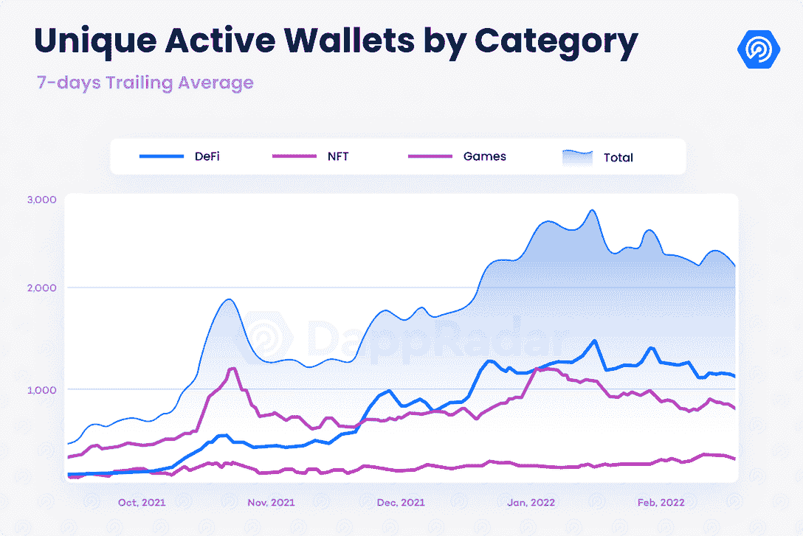
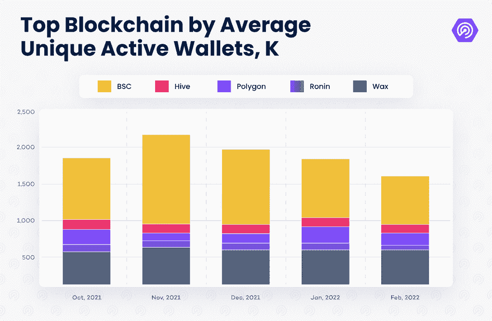
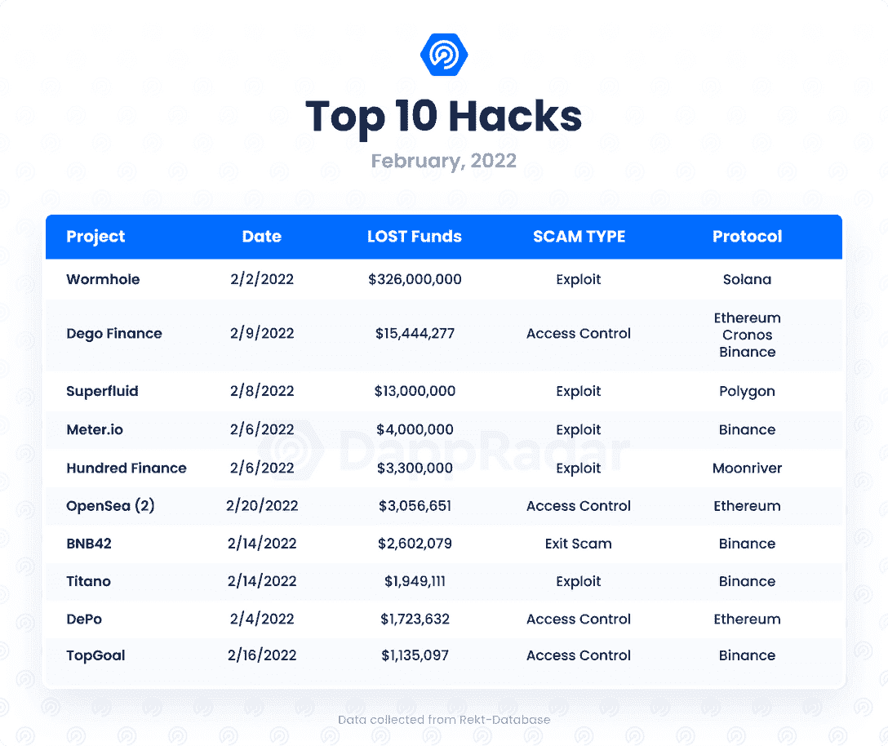
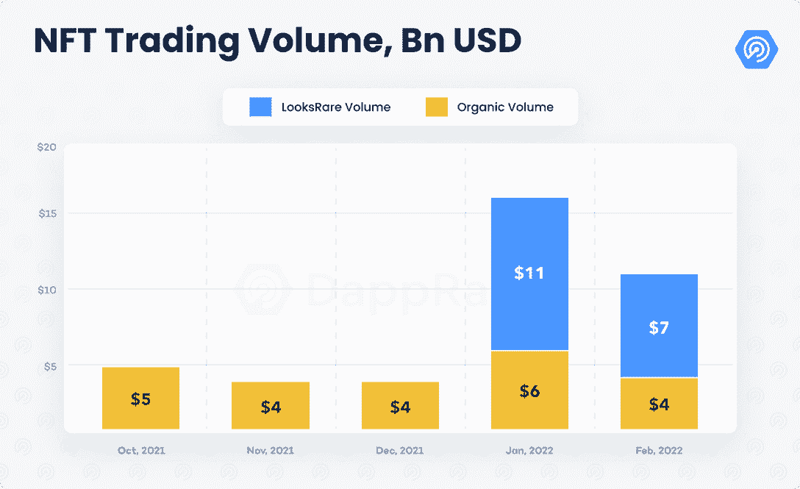
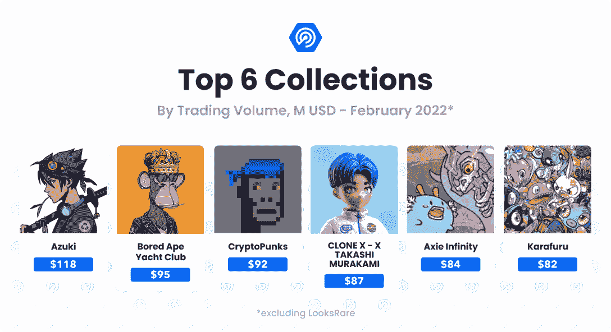
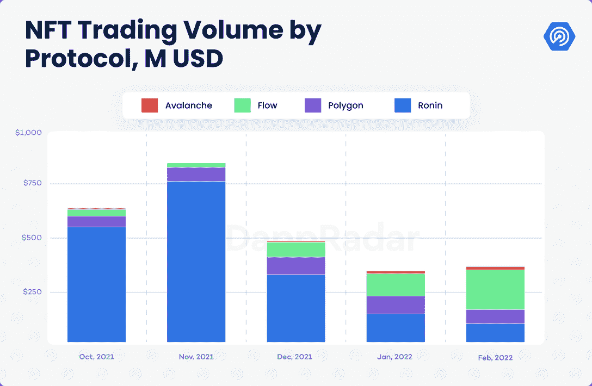
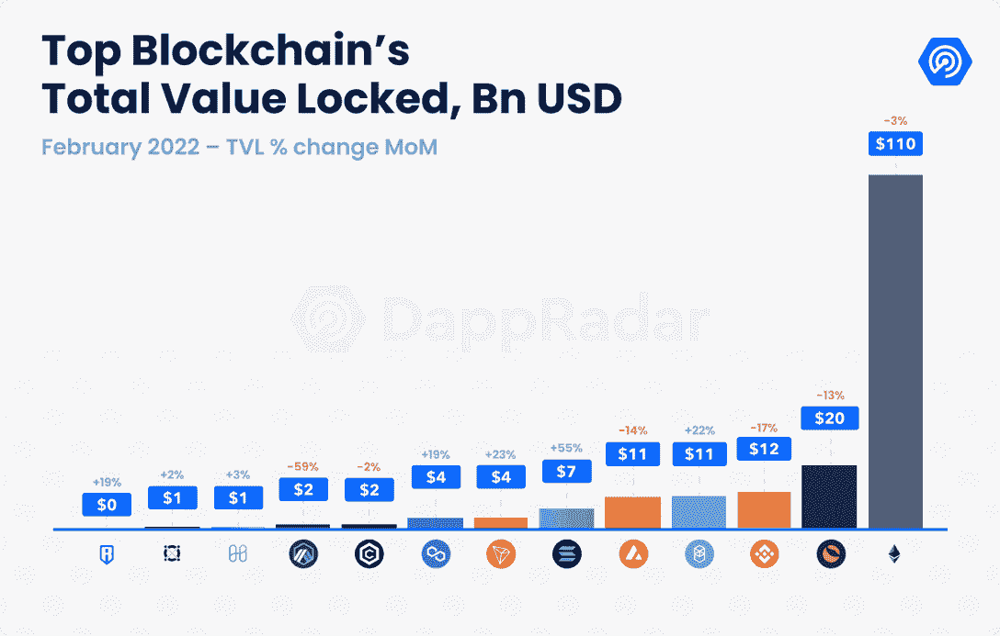
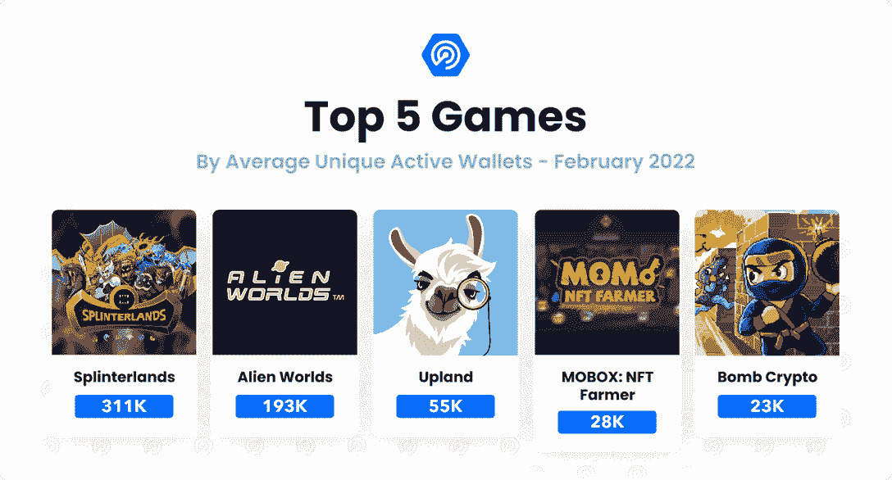
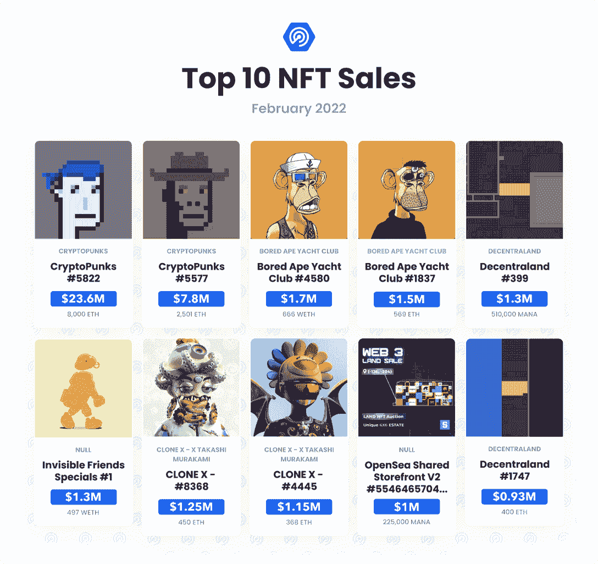

# Dapp 行业报告–2022 年 2 月

> 原文：<https://web.archive.org/web/https://dappradar.com/blog/dapp-industry-report-february-2022>

## 在全球危机中，NFT 降温，而 DeFi 闪现复苏迹象

最近宏观经济事件的转变为 dapp 行业创造了一个独特的环境。尽管加密市场仍处于熊市，但不同行业正在涌现实现 web3 的新方法。例如，在将区块链用例嵌入社会的潜力的推动下，政府和金融机构的兴趣正在上升。

与此同时，非正规金融服务市场经历了一个巩固阶段。尽管交易量较 1 月份有所下降，但与 NFT dapps 互动的独立活跃钱包(UAW)数量却比以往任何时候都多。此外，随着该领域发展成为一个更加巩固和成熟的生态系统，机构投资者越来越多地与 DeFi 联系在一起。与此同时，领先的游戏赚钱 dapps，包括几个虚拟世界，仍然从事有前途的发展。

## 关键要点

*   在全球危机中，dapp 行业的使用率从 1 月份开始下降了 5%，每天吸引了 235 万 UAW，而从 2021 年 2 月开始增长了 385%。
*   安全问题再次引起关注；超过 3.75 亿美元的损失是由于数字盗窃和攻击造成的。
*   随着他们在以太坊之外的区块链的业务增长，NFT 空间积累了超过 106 亿美元的交易。
*   DeFi 的连锁和宏观指标正在改善；机构投资者的兴趣持续上升，顶级 DeFi dapps 正慢慢重新获得控制权。
*   Terra 以超过 200 亿美元的 DeFi 协议锁定以太坊的亚军位置，而 Fantom 则挑战 BNB 链的第三位置。

## 目录

*   [235 万 UAW 在熊市、俄乌冲突中每日连接 dapps】](https://web.archive.org/web/20221214001202/https://dappradar.com/blog/dapp-industry-report-february-2022/#UAW)
*   [因数字盗窃和攻击造成的损失超过 3 . 75 亿美元](https://web.archive.org/web/20221214001202/https://dappradar.com/blog/dapp-industry-report-february-2022/#lost-due-to)
*   [NFT 采用率上升，而交易量下降——2 月份交易量为 106 亿美元](https://web.archive.org/web/20221214001202/https://dappradar.com/blog/dapp-industry-report-february-2022/#nft-adoption)
*   [以太坊外 NFT 活动增加](https://web.archive.org/web/20221214001202/https://dappradar.com/blog/dapp-industry-report-february-2022/#nft-activity)
*   【DeFi 的宏观经济影响
*   [DeFi TVL 排行榜的新排名](https://web.archive.org/web/20221214001202/https://dappradar.com/blog/dapp-industry-report-february-2022/#leaderboard)
*   [区块链游戏为未来而生](https://web.archive.org/web/20221214001202/https://dappradar.com/blog/dapp-industry-report-february-2022/#blockchain-games)

## 235 万 UAW 在熊市、俄乌冲突期间每天与 dapps 保持联系

在持续的加密熊市中，加密货币自 11 月以来下跌了 50%，在充满挑战的全球情景中，俄罗斯于 2 月 24 日入侵乌克兰达到高潮，该行业的使用量比上月减少了 5%。因此，2 月份平均每天有 235 万 UAW 人连接到 dapp。另一方面，这也可以作为一个提醒，表明该行业与 2021 年 2 月相比增长了 385%。

以太坊仍然拥有可观的市场份额，这是因为 NFT 的活跃程度和现有的 DeFi dapps 尽管如此，对等区块链吸引了更多的用户进入他们的网络。币安智能链现在是 BNB 链的一部分，在日常使用方面仍然是领先的网络，每天平均有 608，000 个 UAW 连接到网络，尽管比上个月减少了 17%。

在可以被认为是 dapp 活动下降的一个月，由于独家 NBA 顶级投篮包的下降和 NFL 全天市场的推出，区块链流量增长了 49%。与此同时，Tezos 的使用率较前一个月上升了 23%。

## 因数字盗窃和攻击造成超过 3 . 75 亿美元的损失

我们的 [2021 年年度报告](https://web.archive.org/web/20221214001202/https://dappradar.com/blog/2021-dapp-industry-report)强调了该领域恶意行为者的增加。去年，在 160 多起攻击中，大约 40 亿美元被盗。二月份，安全问题再次成为头条新闻。

第一个目标是 [Solana 虫洞](https://web.archive.org/web/20221214001202/https://dappradar.com/blog/321-million-taken-as-solana-wormhole-bridge-hacked/)，这是在 Solana 网络中接收和发送令牌的领先桥平台。黑客利用了索拉纳合同中的一个漏洞，在此过程中消耗了 120，000 ETH 或 3.2 亿美元。

另一个安全问题发生在 2 月 20 日的 OpenSea 上，当时一个[网络钓鱼攻击](https://web.archive.org/web/20221214001202/https://dappradar.com/blog/opensea-upgrade-throws-door-open-to-hackers/)导致 32 个钱包丢失了 254 个 NFT，净值为 170 万美元。这是针对 NFT 的最高调和最恶意的攻击之一。

大多数被盗资产来自最近推出的收藏，如志那都红豆和克隆 X，而不是密码朋克或孤独无聊的猿。这种情况的发生可能是因为受害者是经验不足的交易者，他们在 NFT 的时间很少。

值得一提的是，这次攻击不是任何 OpenSea 合同的漏洞造成的，而是传统的网络钓鱼造成的。这一事件提醒我们该领域存在的潜在风险，尤其是某些资产的价值让它们更令人垂涎。要了解更多关于提高该领域安全性的信息，请听我们的[最后一集市场推动者](https://web.archive.org/web/20221214001202/https://www.youtube.com/watch?v=vxiLsBAKnZk)。

## NFT 采用率上升，而交易量下降——2 月份交易量为 106 亿美元

尽管交易量可能表明并非如此，但非功能性交易的采用仍在上升。衡量需求的链上指标表明，所有协议的独立交易商数量和销售数量环比(MoM)分别增加了 8%和 2%。

另一方面，不包括 LooksRare 活动，NFTs 在 2 月份创造了超过 40 亿美元的销售额，比上个月下降了 28%。尽管如此，2 月份的交易量还是超过了 11 月和 12 月的交易量。

考虑到 LooksRare 的活动，整个空间的交易量本月总计 106 亿美元。然而，该市场的交易量下降了 40%，这可能是由第一个 LOOKS 令牌分发阶段的结束所驱动的。

该类别的另一个积极趋势是像 Clone-X 和志那都红豆这样的新项目在该领域的影响。志那都红豆是 2 月份交易量最大的系列(不包括 LooksRare 的活动)，超过了 Bored Ape Yacht Club、CryptoPunks 等老牌项目。对最近推出的项目的需求一直很强劲，Karafuru，Cool Pets，Invisible Friends 和其他几个在本月交易量最大的收藏中排名的作品就是证明。

尽管 OpenSea 攻击和传统行业的抵制引发了负面报道，但 NFT 仍在继续寻找增加其数字资产价值的方法。

## 以太坊外的 NFT 活动增加

另一个标志着 NFTs 积极状态的方面是，在以太坊以外的区块链，这一类别的出现越来越多。例如，Ronin 是整个领域最有价值的系列的所在地，Axie Infinity 成为第一个销售额超过 40 亿美元的系列。

与此同时，Crabada 的 NFT，一个在 Avalanche 上举办的游戏赚钱 dapp，是交易最多的。Avalanche 上的 NFT 交易量同比增长了 25%，比去年惊人地增长了 1，320%。NFT 贸易是 NFT 的一个市场，采用多链方法(以太坊、BNB、多边形和雪崩)，自 1 月底以来，其在雪崩网络上的交易量增加了 40%，从 1070 万美元增加到超过 1500 万美元。[粒子收集](https://web.archive.org/web/20221214001202/https://www.particlecollection.com/)市场是另一个展示 NFTs 在雪崩上的潜力的平台，它允许对公认的艺术作品进行细分，如班斯基的《爱在空中》。

在 Flow 区块链，NFL 全天市场的推出，以及独家和罕见的 NBA 顶级投篮包，已经产生了 1.88 亿美元。Flow 的 BloctoBay 在 2 月份的交易活动增加了一倍，而 Magic Eden оn Solana 或 Obkt 和 Hic et Nunc оn Tezos 等市场表明，NFT 可以在以太坊之外蓬勃发展。

## DeFi 的宏观经济影响

在最近的加密货币下行趋势中，DeFi dapps 是受影响最大的分散式应用。连接到 DeFi dapps 的 UAW 数量平均每天超过 786，000，占区块链行业活动的 35%,同比下降 4%。然而，今年 2 月，宏观经济形势似乎正在发生变化。

过去几周，机构对 DeFi 生态系统的兴趣有所上升。托管和投资银行以及其他类型的金融机构——包括[摩根大通](https://web.archive.org/web/20221214001202/https://www.jpmorgan.com/solutions/cib/investment-banking/corporate-finance-advisory/blockchain)、 [BNY 梅隆](https://web.archive.org/web/20221214001202/https://www.bnymellon.com/us/en/about-us/newsroom/press-release/bny-mellon-forms-new-digital-assets-unit-to-build-industrypercent27s-first-multi-asset-digital-platform-130169.html)、日本最大的银行[三菱 UFG](https://web.archive.org/web/20221214001202/https://www.outlookindia.com/business/mitsubishi-ufg-bank-issues-stablecoin-tied-to-the-yen-cryptocurrency-market-rises-news-121499) 等——几乎都证实了他们对加密货币及其相应的 DeFi 应用的兴趣。

与此同时，乌克兰冲突和加拿大冻结银行账户的最新意图，过度暴露了对去中心化生态系统的需求。虽然与游戏和 NFT 相比，DeFi 的潜在大规模采用似乎还很遥远，但这种类型的宏观经济影响，以及更成熟的 DeFi 生态系统，可以迅速改变这种叙事。

## DeFi TVL 排行榜的新排名

锁定的总价值(TVL)，也许是最重要的 DeFi 连锁指标，标志着一个更加复杂和成熟的空间。截至 2 月底，DeFi dapps 持有的锁定资产为 1，800 亿美元，环比增长 3%。

以太坊仍然是该类别中的主导网络，尽管其主导地位从 1 月底的 65%下降到 2 月份的 61%。以太坊在 TVL 持有超过 1100 亿美元，Curve 和 Maker 各超过 150 亿美元。

然而，TVL 的排名发生了重大变化。Terra 已经超过 BNB·钱恩成为以太坊的亚军，Fantom 紧随其后。以前的 DappRadar 报告提到了 Terra 如何在其 UST 稳定币和锚 AMM 的驱动下逐渐形成 DeFi 生态系统。

[Fantom 的案例也值得注意](https://web.archive.org/web/20221214001202/https://dappradar.com/blog/a-look-at-defi-dapps-on-fantom)，因为第 1 层解决方案将其 TVL 从 9 月底的 14 亿美元增加到 2 月份的 111 亿美元，几乎翻了十倍。其 TVL 较 1 月份增长了 23%。

## 区块链游戏为未来不断构建

自 6 月份以来，区块链游戏行业首次未能扩大受众。平均而言，2 月份每日有超过 110 万 UAW 连接到游戏 dapps，比 1 月份的数字下降了 13%。游戏在行业活动中的主导地位也从 52%下降到 49%。

尽管如此，积极的一面是看到最成熟的游戏 dapps 在很长一段时间内保留了他们的玩家基础，也承认目前的情况在某种程度上影响了所有类别。

此外，元宇宙 dapps 的现状是有希望的。Nifty Island 成功拉开了 alpha 赛季的序幕，而 Sandbox 和 Axie Infinity (Origins)正在为 3 月份各自的 alpha 赛季做准备。即使是虚拟土地 NFT 也享受了出色的连胜。例如，自 1 月份以来，NFT 世界的地板价格在过去的 12 个月里翻了两番。要继续了解区块链游戏行业，请关注即将发布的 DappRadar 的 x BGA 月度区块链游戏报告。

## 结论

毫无疑问，目前的情况为市场创造了一个具有挑战性的环境。最近几天，人们的兴趣稍微从 dapp 行业转移到了一个需要我们关注的问题上。尽管如此，区块链和分散化应用已经向世界展示了分散化技术的力量，包括向乌克兰捐赠的数百万美元。

此外，在经历了一段充满挑战的时期后，DeFi 最近出现了一些积极的迹象。机构投资者(主要是金融机构)兴趣的增加，为这一类别在未来几个月提供了一个诱人的场景，在这一领域，监管机构应该广泛参与。虽然使用仍然与行业趋势一致，但将 Terra 和 Fantom 作为既定挑战者的生态系统提供了一个更完整和成熟的生态系统。

在 NFT 方面，交易量可能会被视为该类别的收缩。然而，衡量需求的链上指标却不是这样，因为本月独特交易者的数量和销售计数都有所增加。随着新一波坚实的新项目的出现，以及元宇宙和现实生活中更切实的用例，非功能性测试的采用似乎可以自我维持。

 NewsletterUnsubscribe at any time. [T&Cs](https://web.archive.org/web/20221214001202/https://dappradar.com/terms) and [Privacy Policy](https://web.archive.org/web/20221214001202/https://dappradar.com/privacy-policy)