# Dapp 行业报告–2022 年 1 月

> 原文：<https://web.archive.org/web/https://dappradar.com/blog/dapp-industry-report-january-2022>

## 尽管加密崩溃，NFTs 的月记录

2022 年 1 月的 Dapp 行业报告显示，尽管加密市场崩溃，区块链活动仍然存在。游戏和 NFT 收藏再次在关键指标中占据重要地位，而 TVL 在 DeFi 中的排名明显下降。

尽管 dapp 行业朝着 2021 年的采用迈出了一大步，但由于一系列宏观经济事件，加密市场正在经历一个熊市。包括比特币和以太坊在内的基本加密货币比 11 月份的历史高点下跌了 50%，给市场带来了恐惧、不确定和怀疑的感觉。

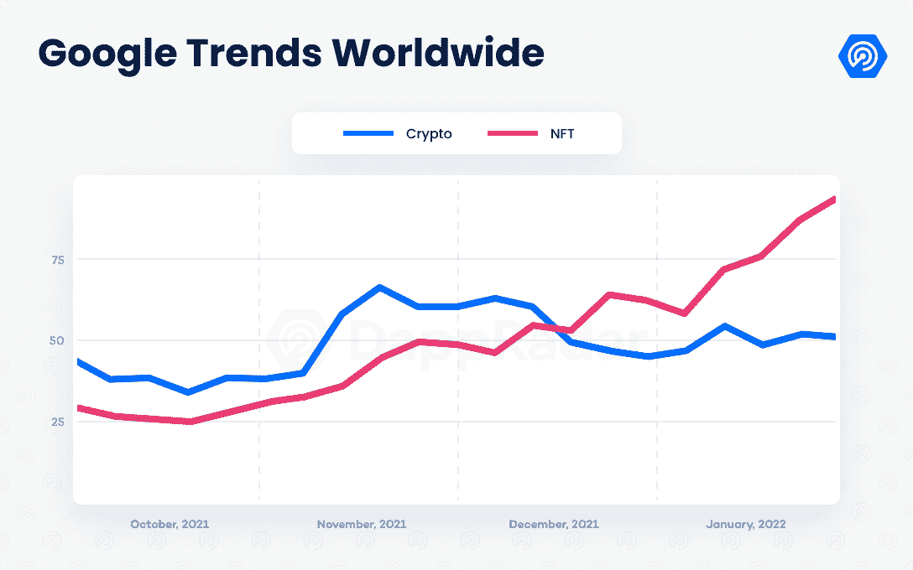

与市场情绪相反，NFT 和游戏等类别表现积极。

NFT 市场创下了 160 亿美元的月销售额纪录，尽管其中 60%来自人工交易。游戏类别保持增长势头，因为顶级游戏玩家继续扩大他们的玩家基础，几个项目吸引了数百万美元的投资。与此同时，DeFi 空间在高度动荡的时期表现出成熟，并经历了 TVL 排行榜耐人寻味的变化。

## 关键要点

*   尽管加密市场崩溃，但平均每天有 247 万 UAW 连接到区块链 dapp，仅比去年 12 月的数字下降了 2%。
*   剔除 looks 的销售额为 107 亿美元，NFT 空间的交易总额为 53 亿美元；几乎 90%是在公海交易的。
*   NFT 前 100 名藏品的最低市值估计为 148 亿美元，比 11 月份仅下降了 15%，尽管同期 ETH 的价格下降了 50%。
*   该行业的 TVL 估计为 1780 亿美元，比 12 月底缩水 23%；65%被锁在以太坊。
*   游戏类别继续推动使用，因为 52%的 dapp 用户来自游戏。

[https://web.archive.org/web/20221012082730if_/https://www.youtube.com/embed/Ut8RbzDmeCk?feature=oembed](https://web.archive.org/web/20221012082730if_/https://www.youtube.com/embed/Ut8RbzDmeCk?feature=oembed)

## 目录

*   [每天 247 万个独立活跃钱包](https://web.archive.org/web/20221012082730/https://dappradar.com/blog/dapp-industry-report-january-2022/#million)
*   [LooksRare 推动 NFTs 交易达到 160 亿美元](https://web.archive.org/web/20221012082730/https://dappradar.com/blog/dapp-industry-report-january-2022/#looksrare)
*   [尽管加密系统崩溃，NFT 市场仍出现牛市](https://web.archive.org/web/20221012082730/https://dappradar.com/blog/dapp-industry-report-january-2022/#bullrun)
*   [争夺 TVL 的新排名](https://web.archive.org/web/20221012082730/https://dappradar.com/blog/dapp-industry-report-january-2022/#tvl)
*   [游戏吸纳 52%的区块链用户](https://web.archive.org/web/20221012082730/https://dappradar.com/blog/dapp-industry-report-january-2022/#games)
*   [期待已久的罗恩令牌终于活了](https://web.archive.org/web/20221012082730/https://dappradar.com/blog/dapp-industry-report-january-2022/#ron)
*   [结论](https://web.archive.org/web/20221012082730/https://dappradar.com/blog/dapp-industry-report-january-2022/#road)

## 每天 247 万个独立活动钱包

尽管加密货币市场呈现负面趋势，但整个行业的使用情况基本保持一致。1 月份，平均每天有 247 万个独立活跃钱包(UAW)连接到区块链 dapp，比 2021 年第四季度的 253 万下降 2%；不过，现在还没到担心的时候。

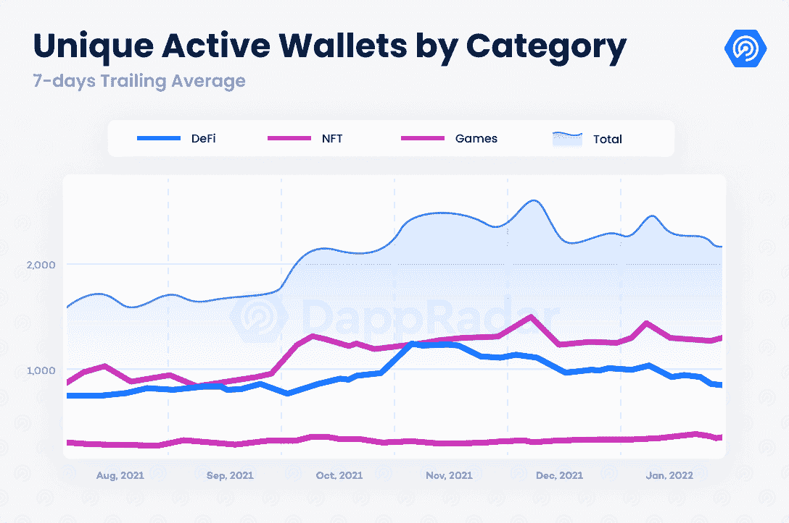

自 2021 年 6 月以来，该行业首次出现了与 dapps 连接的钱包数量下降的情况，这与加密市场的熊市趋势相吻合。然而，这一次，这种下跌就不那么让人难以忍受了。客观来看，2021 年 6 月，UAW 的数量在 5 月的加密崩溃后下降了 23%。这一次，这种用法似乎更有抵抗力，尽管价格下跌得更厉害。

这种支持很大一部分来自区块链游戏，因为该类别增加了其在整个行业的使用优势。今年 1 月，游戏 dapps 占 dapp 使用量的 52%，比 2021 年底的 49%有所改善。

连接到 NFTs 的 UAW 增长了 2%，1 月份平均每天超过 185，000 个 UAW。另一方面，DeFi dapps 似乎对加密市场更加敏感。这一类别的使用率下降了 3%，上个月每天有 825，000 个 UAW 连接到 DeFi dapps。DeFi 的用户优势从去年年底的 36%下降到本文撰写时的 33%。

从区块链的角度来看， [Polygon](https://web.archive.org/web/20221012082730/https://dappradar.com/rankings/protocol/polygon) 是最大的赢家。与去年 12 月相比，scaling protocol 的钱包基数增长了 78%，其中区块链游戏的增长功不可没。另一个缩放解决方案 Harmony 的用户群增长了 23%，这要归功于 DeFi dapps，包括 [ViperSwap](https://web.archive.org/web/20221012082730/https://dappradar.com/harmony/defi/viperswap) 和 [Sushi](https://web.archive.org/web/20221012082730/https://dappradar.com/multichain/defi/sushi) 。

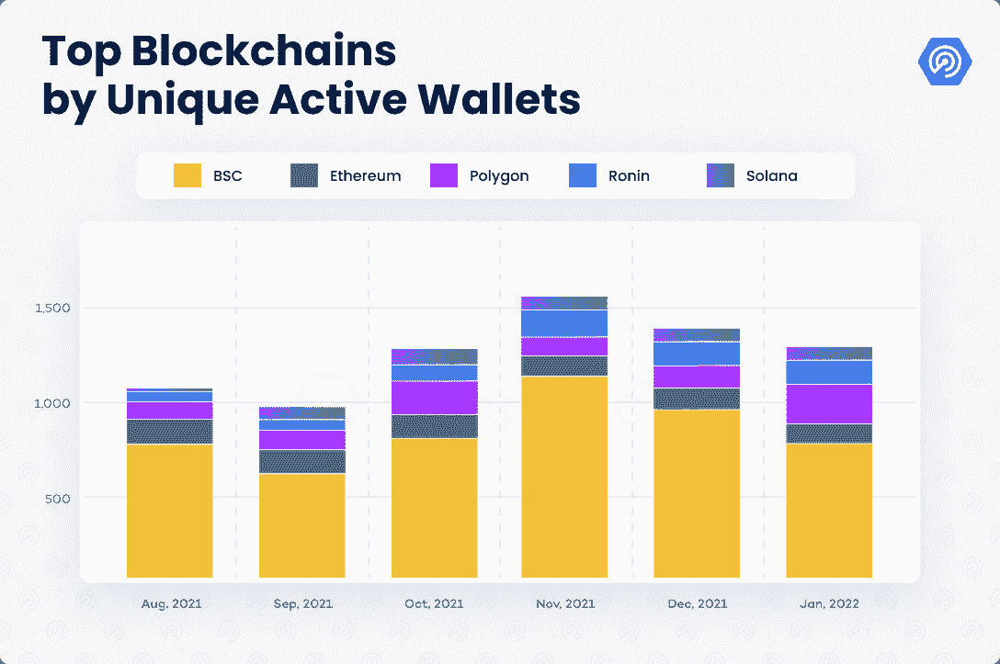

另一方面，平衡计分卡有大幅下降。与去年 12 月相比，币安品牌网络的独立活跃钱包数量下降了 20%。加密崩溃在这里有更明显的影响，因为区块链严重依赖 DeFi dapps。观察 BSC 本地 dapps 如何应对这一挫折将是一件有趣的事情。

## LooksRare 推动 NFTs 创纪录地达到每月 160 亿美元

去年，NFT 市场在途中爆炸式增长，产生了 255 亿美元的交易，比前四年的总和高出 18，400%。今年的前 31 天证实了 NFTs 正在获得更多的动力。

NFT 市场见证了最新[以太坊](https://web.archive.org/web/20221012082730/https://dappradar.com/rankings/protocol/ethereum)市场 LooksRare 的成功推出。LooksRare 依靠社区驱动的方法，根据用户在平台内的活动给予奖励，对 OpenSea 的市场主导地位提出了挑战。

自 1 月 10 日推出以来，已经积累了超过 107 亿美元的交易量。这是整个 NFT 市场总和的两倍多。然而，这些交易大部分是无机的。

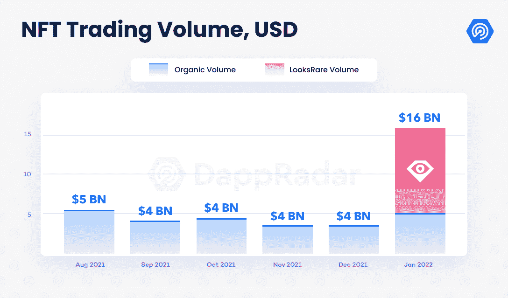

LooksRare 通过向用户奖励市场在合格集合中收取的 2%交易费的 100%来激励交易(以前，至少为历史交易量的 1，000 ETH)。然后，收取的费用被分配给那些使用 LOOKS(市场的治理令牌)的用户，向他们提供额外的收益，以获得 APY。这种令牌组学模型导致了市场中无机活动的激增，通常被称为清洗交易。

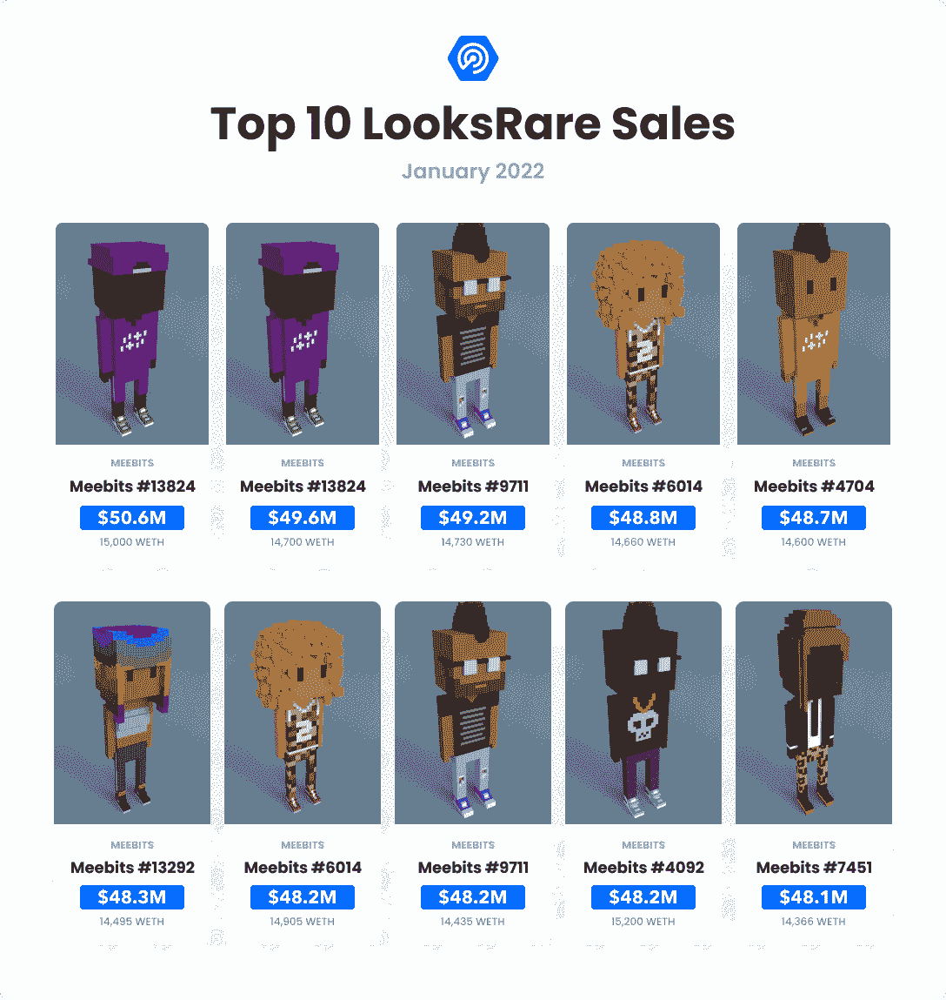

收取 0%版税的收藏，如 Meebits、Loot(针对冒险者)、Terraforms 和其他几个，已经成为这类活动的目标。通过分析 LooksRare 一月份的 36，000 多笔交易，我们发现有 4，600 多笔交易涉及 Meebits，平均价格为 366.14 ETH。与在 LooksRare 市场之外交易的 Meebits 相比，这是一个显著的差异，在 LooksRare 市场之外，平均销售价格为 4.65 ETH。

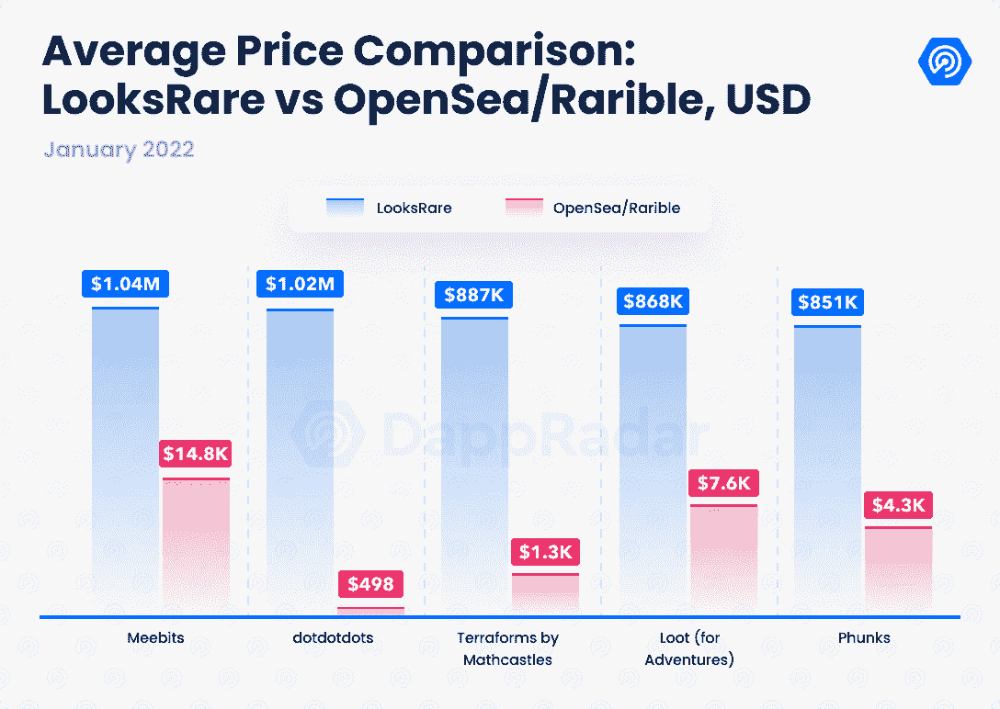

毫无疑问，只看交易量可能表明 LooksRare 的表现远远超过 OpenSea 和其他同行市场。然而，对其他链上指标的深入分析表明并非如此。

虽然 LooksRare 的交易量令人印象深刻，但这一指标被人为交易夸大了。今年 1 月，约有 535，000 名独立交易者在 OpenSea 的某个时间点进行交易，比 LooksRare 中确定的 35，000 名交易者多出近 1，800%。销售计数遵循相同的模式，在 OpenSea 中执行的交易超过 470 万笔，而在 LooksRare 中托管的交易为 33，750 笔。

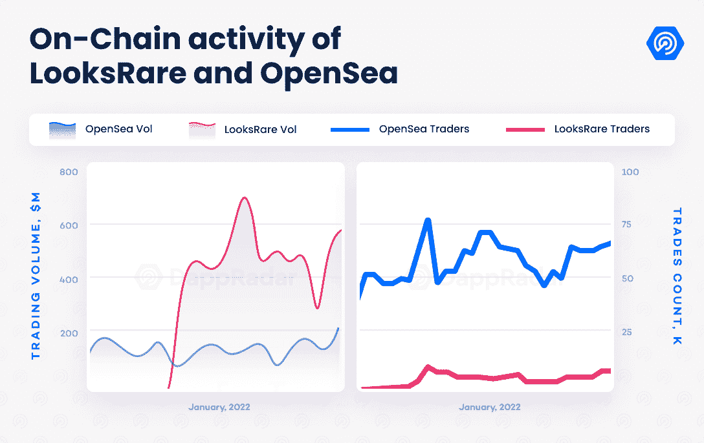

虽然以社区为中心的方法可能有利于整个市场，但有一个明显的需求是承认当前的情况，并理解市场中很高比例的交易量(估计约 90%)是无机的。随着 dapp 宣布所有的收藏现在都有资格奖励赌注者，这个数字可能会上升。另一方面，像 Loot 这样的 NFT 项目已经对人为交易做出了反应，在这种情况下，征收 2%的版税。

如果你想了解更多关于 LooksRare marketplace 及其对市场的影响，你可以看看这篇[报道](https://web.archive.org/web/20221012082730/https://dappradar.com/blog/whale-report-are-looksrare-rewards-attracting-whales)。

## 尽管加密崩溃，NFT 市场仍有牛市

不幸的是，LooksRare 人工交易略微掩盖了 NFTs 今年令人印象深刻的开局。即使没有 LooksRare 的影响，NFT 市场的交易量也自 2021 年 8 月以来首次超过 50 亿美元。值得注意的是，尽管 ETH 价格水平较低，但 1 月份的销售额仍达到近 53 亿美元(以美元计)。

与此同时, [OpenSea](https://web.archive.org/web/20221012082730/https://dappradar.com/multichain/marketplaces/opensea) 有了迄今为止最好的一个月。今年 1 月，除了 LooksRare 之外，OpenSea 几乎占到了 NFT 交易量的 90%。该市场成为使用最多的以太坊 dapp，[获得了 45 亿美元的销售额](https://web.archive.org/web/20221012082730/https://dappradar.com/blog/opensea-nft-trading-volume-hits-4-5b-in-january)，创下了该平台的记录。此外，它还见证了创纪录数量的独特交易者和销售。

与其他类别的使用趋势相反，人们对 NFTs 的兴趣越来越高(见第一张图表)。感觉 NFT 市场目前正在经历牛市。需要考虑的一个重要趋势是，非技术资产正在逐渐整合为一个独立的资产类别。

正如我们与 Defiant 合作的最新[研究](https://web.archive.org/web/20221012082730/https://dappradar.com/blog/why-are-nfts-sidestepping-the-crypto-crash)中所指出的，尽管加密货币呈熊市趋势，但某些 NFT 的价值仍在上升。像[贝可](https://web.archive.org/web/20221012082730/https://dappradar.com/ethereum/collectibles/bored-ape-yacht-club)、 [MAYC](https://web.archive.org/web/20221012082730/https://dappradar.com/ethereum/collectibles/mutant-ape-yacht-club) 、[涂鸦](https://web.archive.org/web/20221012082730/https://dappradar.com/ethereum/collectibles/doodles)、[女人的世界](https://web.archive.org/web/20221012082730/https://dappradar.com/ethereum/collectibles/world-of-women)以及更多的收藏品，不仅以瑞士法郎计价的价值在增加，而且以美元计价的实际价值也在增长，尽管瑞士法郎比去年 11 月贬值了 50%。

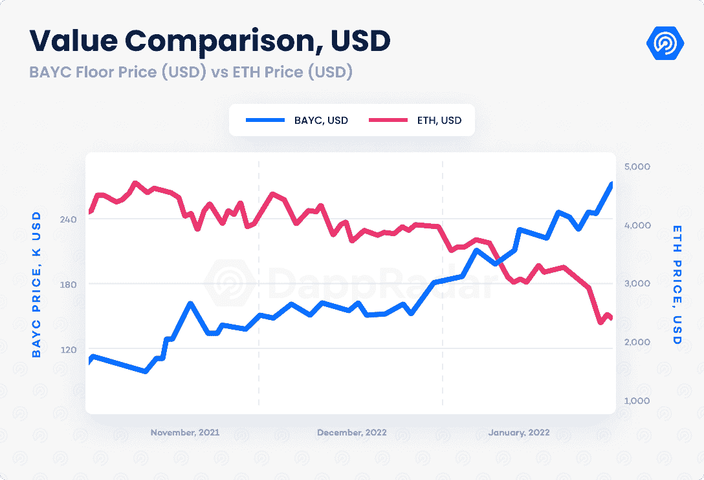

按照同样的思路，1 月份 NFT 前 100 名藏品的最低市值估计为 148 亿美元。这比 11 月份的 172 亿美元下降了 15%。尽管 ETH 遭受了 50%的打击，但交易量最大的 100 个藏品的价值仅受到 15%的影响，这表明该类别抵御了崩溃。

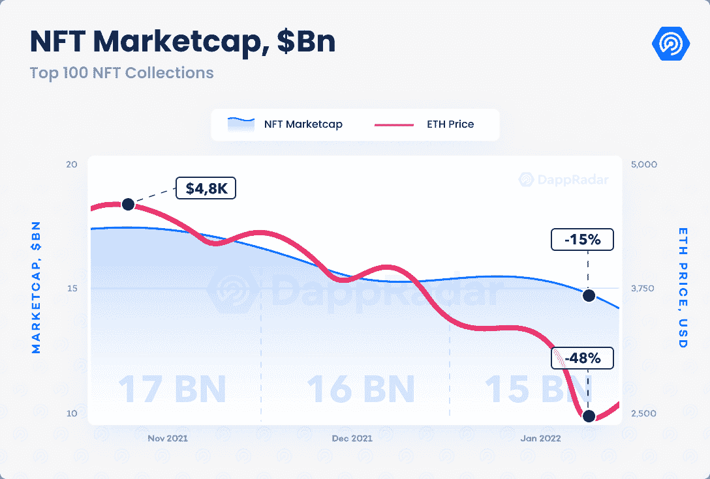

看来 NFTs 变得无处不在是不可避免的。名人和知名品牌正在涉足 NFT 空间。拥有广泛社会影响力的人正在接受使用 NFT，其中大部分是作为收藏品。本月，[小内马尔](https://web.archive.org/web/20221012082730/https://dappradar.com/blog/neymar-purchases-2-bayc-nfts-for-over-1-million/)、[贾斯汀比伯](https://web.archive.org/web/20221012082730/https://dappradar.com/blog/justin-bieber-splurged-on-a-bayc-nft-for-1-31-million/)、[凯文·哈特](https://web.archive.org/web/20221012082730/https://dappradar.com/blog/kevin-hart-joins-the-bored-ape-family/)和[伊娃·朗格利亚](https://web.archive.org/web/20221012082730/https://dappradar.com/blog/eva-longoria-and-gwyneth-paltrow-enter-the-nft-space/)等，在各自的社交媒体个人资料上分享了他们最近在 NFT 的收购。

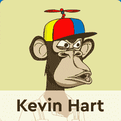

同样， [Twitter 通过允许验证头像 NFTs，启用了其第一个 web3 功能](https://web.archive.org/web/20221012082730/https://dappradar.com/blog/twitter-launches-nft-profile-picture-verification/)，为 Instagram 或 Tik-Tok 等其他平台铺平了道路。此外，像阿迪达斯和耐克这样的大品牌去年也加入了这个领域。本月，零售巨头沃尔玛申请了几个商标，打算在元宇宙用作非功能性商标。

## 争夺 TVL 的新排名

DeFi 发现自己在加密崩溃中处于一个充满挑战的境地，并迷失在对 NFTs 的大肆宣传中。在撰写本文时，该行业在 TVL 持有 1780 亿美元，比 12 月底观察到的价值下降了 23%。尽管如此，该行业 TVL 的下降低于基础加密货币价格 50%的降幅。

从积极的一面来看， [DeFi 空间再次显示出成熟](https://web.archive.org/web/20221012082730/https://dappradar.com/blog/stablecoin-race-heats-as-usdc-chases-usdt)和进步。多链模式仍在全面展示，并且仍然是某些 DeFi dapps 性能的一个重要方面。此外，最相关的稳定硬币的行为是可靠的。这些资产的程序化设计证明，稳定的资本可以抵御市场中观察到的高波动期。

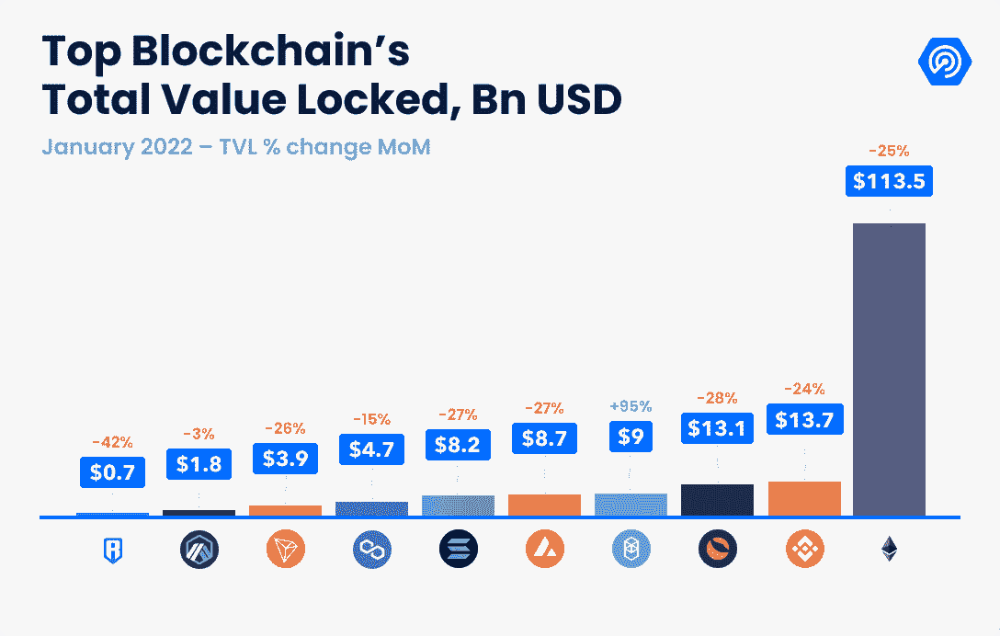

就 TVL 而言，以太坊仍然是主导链，拥有 65%的行业指标，尽管比去年年底观察到的 67%的主导地位下降了 2%。在撰写本文时，以太坊在 TVL 持有 1130 亿美元，比去年 12 月减少了 25%。

与此同时，BSC 和 Terra 仍在争夺第二个位置。两家网络都持有超过 130 亿美元，尽管本月它们的 TVL 分别下降了 24%和 28%。就 TVL 而言，最大的赢家是范顿 T2。高度可扩展的第 1 层解决方案的 TVL 在过去 30 天内几乎翻了一番，在 1 月份超过了 90 亿美元。Dapps 利用多链范式和正确的激励计划，将网络推到了 TVL 排名的第四位。

## 游戏吸纳了 52%的区块链用户

在围绕 NFT 和加密货币的新闻中，[游戏类别](https://web.archive.org/web/20221012082730/https://dappradar.com/rankings/category/games)闪现出积极的迹象。如前所述，游戏类别占 dapp 连接的唯一钱包的 52%。一个很好的原因是顶级游戏 dapps 实现的高留存率，这是游戏最重要的指标之一。根据一月份的环比指标，区块链顶级游戏成功保留了他们的玩家基础。

从最常玩的前 5 个游戏中，只有[外星世界](https://web.archive.org/web/20221012082730/https://dappradar.com/multichain/games/alien-worlds)未能从 2021 年底增加 UAW 的数量。[splitter lands](https://web.archive.org/web/20221012082730/https://dappradar.com/multichain/games/splinterlands)仍然是业内玩得最多的 dapp 游戏(基于链上活动)。今年 1 月，从玩到赚的交易卡游戏吸引了超过 305，000 名 UAW，使 2021 年连接的钱包数量增加了 4.5%。

Wax 上托管的 GameFi dapp 游戏《农民世界》成为业内第三大热门游戏，平均每天吸引超过 111，000 次 UAW。 [Axie Infinity](https://web.archive.org/web/20221012082730/https://dappradar.com/multichain/games/axie-infinity) 和 [Upland](https://web.archive.org/web/20221012082730/https://dappradar.com/eos/games/upland) 占据了最常玩的区块链游戏的前五名。

游戏产生的影响在[多边形网络](https://web.archive.org/web/20221012082730/https://dappradar.com/rankings/protocol/polygon)中相当明显。如前所述，sidechain 的使用量增加了 78%，区块链游戏是增长的幕后推手。走在前面的是[向日葵农民](https://web.archive.org/web/20221012082730/https://dappradar.com/polygon/games/sunflower-farmers)，这是一个以务农为生的 dapp，上个月成功吸引了近 48 万 UAW。向日葵农民成为网络上玩得最多的游戏，产生了超过 240 万美元的交易。

由 Animoca Brands 开发的塔防游戏 dapp《疯狂防御英雄》也在游戏排名中攀升。第二大热门多边形游戏的玩家数量比 2021 年翻了一番，1 月份注册了近 17 万 UAW。Arc8 是一款移动游戏，在多边形侧链中构建了一个完整的游戏生态系统。

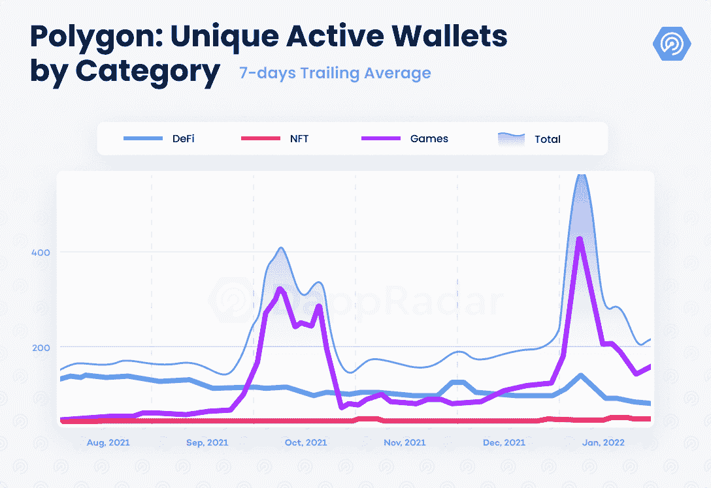

Polygon 目前的情况表明，策划区块链奥运会可能会给整个区块链带来提振。像 Splinterlands、Axie Infinity 或 Wax games 这样的老牌游戏公司几乎可以通过成功吸引观众来独自维持他们的网络。与此同时，新游戏 dapps 的入侵巩固了 Polygon、Harmony 和 Immutable 等可扩展解决方案的前景。

## 期待已久的罗恩令牌终于活了

无论市场状况如何，Sky Mavis 团队都在不断交付产品。这一次，通过公开释放罗恩，罗宁的治理令牌后，90 天的窗口农场罗恩结束。有了治理框架和武士刀的全套 DeFi 功能，侧链看起来和以前一样完整。

有必要将 [Ronin](https://web.archive.org/web/20221012082730/https://dappradar.com/rankings/protocol/ronin) 视为行业未来的相关网络之一。随着 Axie Infinity 中重要里程碑的出现，流行的 play-to-earn dapp 的 sidechain home 正准备随着今年的进展接收更多的用户。

## 结论

尽管密码市场崩溃，dapp 行业显示出成熟和发展的明显迹象。从非金融资产开始，非金融资产逐渐成为一种新的资产类别。一个是抵御市场崩溃，甚至增加其价值。

作为一个整合的市场， [LooksRare](https://web.archive.org/web/20221012082730/https://dappradar.com/ethereum/marketplaces/looksrare) 的存在是耐人寻味的，尽管高度人工化的交易对这个领域来说并不理想。尽管如此，OpenSea 在交易商、销售和交易量方面的记录几乎证实了 NFT 的看涨趋势。

即使在熊市的逆境中，DeFi 也闪现出积极的迹象。stablecoins 在不同协议中的表现为数百万 DeFi 用户提供了信任，因为尽管处于高度不稳定时期，最相关的用户仍能够保持 1:1 的美元汇率。此外，DeFi 空间的完整性和竞争力将促使 dapps 寻找更好的方式来吸引他们的用户。

最后，游戏类别成功地保留了它的玩家基础，这是一个关键的游戏指标。在像多边形“玩赚 dapps”这样的情况下，它吸引了新的观众。随着对该领域的投资达到创纪录水平，预计区块链的游戏将在今年保持活跃。

 NewsletterUnsubscribe at any time. [T&Cs](https://web.archive.org/web/20221012082730/https://dappradar.com/terms) and [Privacy Policy](https://web.archive.org/web/20221012082730/https://dappradar.com/privacy-policy)