# Dapp 行业报告:Q1 2022 年概述

> 原文：<https://web.archive.org/web/https://dappradar.com/blog/dapp-industry-report-q1-2022-overview>

## 240 万 dapps 每日活跃用户，尽管不利的全球事件和区块链安全问题

2022 年的前三个月提醒了 dapp 行业的每个人，这个新生的领域在我们眼前发展得有多快。来自不同类别的 Dapps 即游戏、DeFi 和 NFTs——在我们面前展示了他们的潜力，同时也强调了在完全成为主流之前必须解决的挑战。

从宏观经济角度来看，乌克兰战争成了一个负外部性。对俄罗斯实施的制裁对包括密码行业在内的市场产生了负面影响。尽管看起来正在逐步恢复。与此同时，当乌克兰和其他类型的组织筹集了数百万美元来缓解东欧国家的人道主义危机时，Web3 社区的积极社会影响再次得到充分展示。

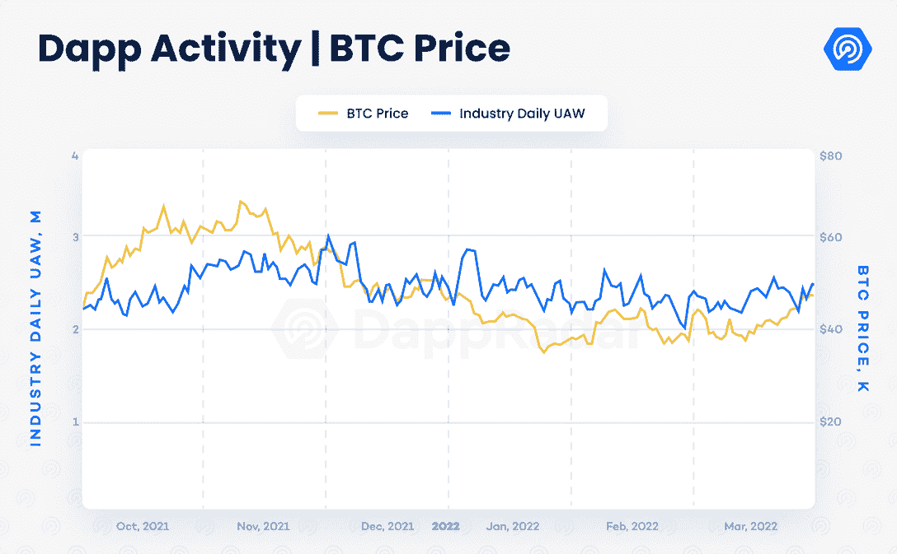

从 NFT 的角度来看，虽然交易量从一月份的火爆开始有所降温，但在 Avalanche、Flow、Polygon 和 Solana 等网络中，交易数量大幅增加。这标志着随着整个生态系统的广泛采用，NFT 市场不断扩大。

与此同时，DeFi 和游戏空间不断成熟。Terra 已经证明了自己是一个 DeFi 强国，而顶级区块链游戏项目继续发展和进一步巩固。

## 关键要点

*   尽管宏观经济形势对全球市场构成了挑战，但 dapp 行业的每日独立活跃钱包数量仍达到 238 万只(UAW)。

*   安全仍然是一个重要的话题，因为仅在 2022 年第一季度，就有 12 亿美元在黑客和桥梁攻击中被盗。桥梁已经成为攻击者的目标。

*   在 Q1，2022 年 NFTs 产生了 1 20 亿美元的交易，而销售和独特交易者的数量正在上升；以太坊外区块链的 NFT 活动正在升温。

*   DeFi 空间显示出成熟的迹象。尽管与 2021 年底相比下降了 8%,但 TVL 的 DeFi 行业总额为 2140 亿美元。

## 目录

*   [每天有 238 万 UAW 人连接到 Q1 的 dapp](https://web.archive.org/web/20221201205923/https://dappradar.com/blog/dapp-industry-report-q1-2022-overview/#2.38-million-daily-UAW-connected-to-blockchain-dapps-in-Q1)
*   Q1 安全漏洞导致 12 亿美元被盗
*   [web 3 品牌越来越多](https://web.archive.org/web/20221201205923/https://dappradar.com/blog/dapp-industry-report-q1-2022-overview/#The-increasing-presence-of-Web3-brands)
*   [尽管主流观点有所指责，但非功能性交易将长期存在](https://web.archive.org/web/20221201205923/https://dappradar.com/blog/dapp-industry-report-q1-2022-overview/#Despite-mainstream-allegations,-NFTs-are-here-for-the-long-run)
*   [Terra 将比特币融入其 200 亿美元的 TVL 生态系统](https://web.archive.org/web/20221201205923/https://dappradar.com/blog/dapp-industry-report-q1-2022-overview/#Terra-blends-bitcoin-into-its-$20-billion-TVL-ecosystem)
*   [DeFi 显示出成熟的迹象](https://web.archive.org/web/20221201205923/https://dappradar.com/blog/dapp-industry-report-q1-2022-overview/#DeFi-shows-signs-of-maturity)
*   [风险投资公司已经向 2022 年 Q1 区块链奥运会投入了超过 25 亿美元](https://web.archive.org/web/20221201205923/https://dappradar.com/blog/dapp-industry-report-q1-2022-overview/#VCs-poured-over-$2.5-billion-into-blockchain-games-in-Q1-2022)
*   [关闭](https://web.archive.org/web/20221201205923/https://dappradar.com/blog/dapp-industry-report-q1-2022-overview/#Closing)

## Q1 每天有 238 万 UAW 连接到区块链 dapps

乌克兰战争的影响和对俄罗斯的经济制裁扰乱了全球市场，加密货币也不例外。在 Q1 2022 期间，dapp 行业平均每天注册 238 万个连接到区块链 dapp 的独立活动钱包。这比 2021 年第四季度下降了 5.8%，当时该行业的日活跃钱包数量超过了 250 万个。

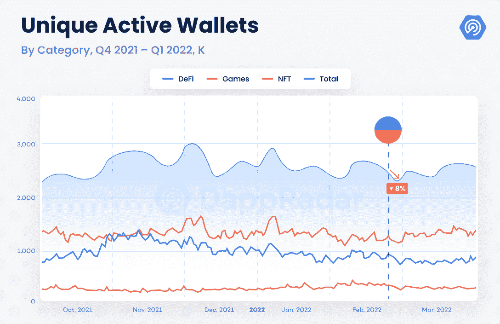

从用户的角度来看，从玩到赚的 dapps 继续主导着这个行业，因为区块链的游戏占了这个行业联网钱包的 50.5%。像 Harmony、Polygon 和 Avalanche 这样的网络能够对抗 play-to-earn 和 GameFi dapps 背后的下行螺旋，表明游戏仍然在使用方面决定着行业的步伐。

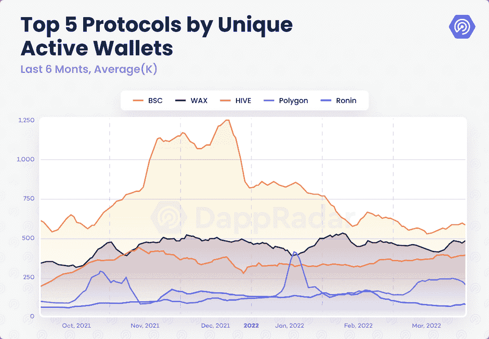

## Q1 事件期间，12 亿美元的安全漏洞被盗

在新生的区块链空间，安全是最大的挑战之一。根据 REKT 数据库的数据，在 2022 年的前三个月，11.9 亿美元被黑客窃取。这个数字带来了一些担忧，因为发生在 Q1 的黑客攻击代表了来自同一 [REKT 数据库](https://web.archive.org/web/20221201205923/https://defiyield.app/rekt-database)来源的有史以来被盗资金的 35.8%。

此外，值得注意的是，桥(用于将令牌从一个区块链转移到另一个的平台)已经成为恶意攻击的目标。上周，Sky Mavis 宣布，用于在以太坊和浪人之间转移资产的浪人桥被利用了。这导致了价值 6.155 亿美元的 ETH 和 USDC 的损失。这次攻击成为加密货币历史上最大的盗窃案。

今年 2 月，另一个受欢迎的桥梁索拉纳虫洞被开发了 3.26 亿美元。Vitalik Buterin [在今年年初强调了桥梁的技术局限性，思考是否需要一个多链生态系统，而不是像我们目前看到的这样的交叉链，值得冒这个风险。请做好准备，在接下来的几个月里，安全和法规将成为业界讨论的常规话题。](https://web.archive.org/web/20221201205923/https://old.reddit.com/r/ethereum/comments/rwojtk/ama_we_are_the_efs_research_team_pt_7_07_january/hrngyk8/)

## 网络 3 品牌的不断增加

2021 年下半年，市场见证了有影响力的品牌如何开始与原生 Web3 项目合作。阿迪达斯加入了沙盒，并与 Bored Ape 游艇俱乐部(BAYC)和朋克漫画团队一起推出了第一个 NFT。耐克收购了 RTFKT，这是 Clone-X 的幕后策划，旨在打造一个元宇宙时尚强国。

这一次，BAYC 的创造者宇迦实验室筹集了 4.5 亿美元的投资，由 a16z 牵头，其中也包括 Animoca 品牌。三月早些时候，BAYC 的创作者在收购 CryptoPunks 和 Meebits 的知识产权后成为头条新闻，这两个最受欢迎的 NFT 收藏以前由幼虫实验室所有。这一举动使宇迦实验室成为网络 3 中最相关的品牌之一。截至发稿时，宇迦实验室的 NFT 占据了以太坊 100 强 NFT 收藏品市场的 44%。就统治地位而言，NFT 世界中没有其他任何一个集团能与之相提并论。

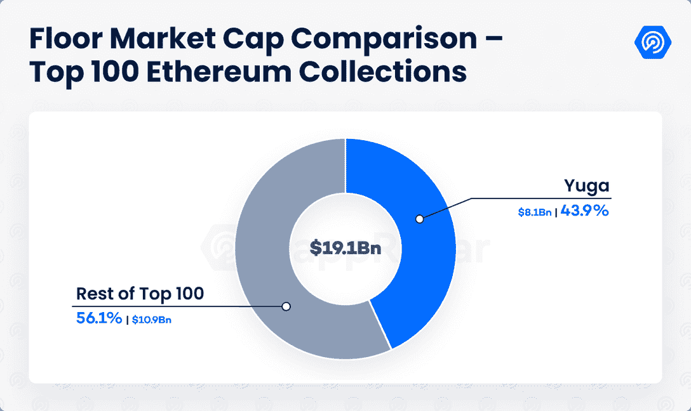

同样，Animoca Brands 是 Web3 领域的领先品牌之一。这家总部位于香港的公司已成为一种投资于严肃的区块链项目的风险投资机构，其显著的重点是“先玩后赚”的叙事。对宇迦实验室的投资将为该团队提供更多的资本来继续构建另一个世界——其雄心勃勃的[可互操作的元宇宙项目](https://web.archive.org/web/20221201205923/https://dappradar.com/blog/bored-ape-metaverse-is-here-see-you-on-the-otherside)。Otherside 预计将涉及游戏赚取，时尚计划和媒体平台。

元宇宙是区块链和 Web3 最吸引人的用例之一。对虚拟现实的兴趣迫在眉睫，然而，一些来自不同传统行业的领先组织不可否认地被分散的元宇宙所吸引。由 NFT 和加密货币推动的基础经济将改变我们社交、赚钱和交易的方式。

## 尽管主流观点认为，非功能性交易将长期存在

在经历了今年的历史性开局后，NFT 股市正处于盘整期。今年 3 月，NFT 空间积累了 314 亿美元的交易，其中 62%来自 LooksRare marketplace。为了进行更准确的比较，不包括 LooksRare 活动的 NFT 市场在 Q1 产生了 120 亿美元的收入，比 2021 年第四季度记录的交易量略微下降了 2%。

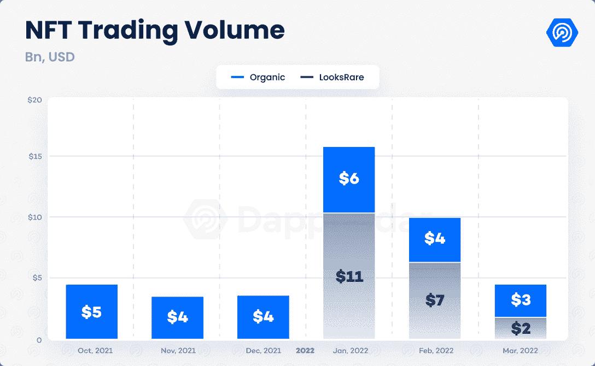

LooksRare 上的活动是需要监控的。随着团队不断升级用户体验，marketplace 不断发布产品，展示他们对社区的考虑。此外，在最初的采矿奖励减半后，无机或 wash 交易活动似乎迅速下降。这些代币奖励激励了无组织的交易行为，并在初始阶段促进了平台的发展。

NFT 空间的另一个积极迹象是，除以太坊之外，区块链的销售数量有所增加。Avalanche 上的交易数量比上一季度增长了 582%，而 Solana 和 Polygon 上的销售数量环比增长了 34%。

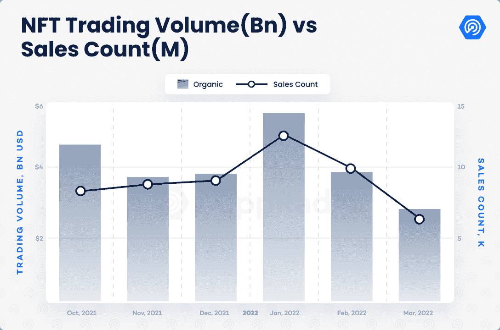

总之，NFT 空间显示出成熟的迹象。在经历了太多的失败后，如 Pixelmon 和 Tai Lopez NFT 的推出，NFT 市场开始认识到有价值或隐藏的宝石项目。

顶级的以太坊 NFT 项目有一个成熟的市场，对大多数人来说可能遥不可及。因此，看到其他网络上的非功能性网络传输也在加快步伐是一件好事，表明 NFT 的采用才刚刚开始。

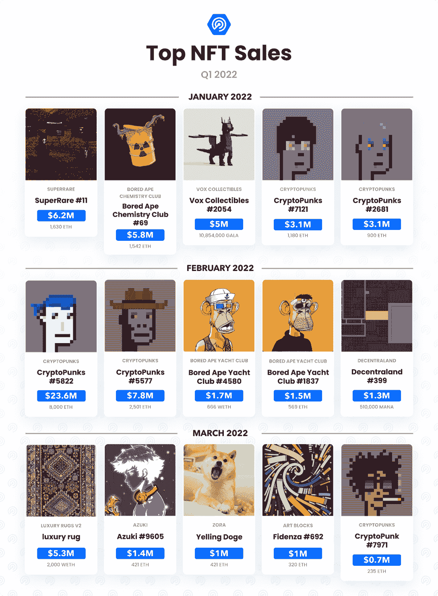

## Terra 将比特币融入其 200 亿美元的 TVL 生态系统

没有其他类别比 DeFi 更能感受到这种下降趋势。该行业的总价值锁定(TVL)和连接到 DeFi dapps 的 UAW 数量对加密货币价格下跌造成了打击。截至 3 月底，该行业的 TVL 估计为 2，140 亿美元，比去年 12 月低 8.4%。尽管 TVL 和使用率(分别为 8.4%和 20.5%)指标比上一季度有所下降，但该行业似乎正在整合和成熟。

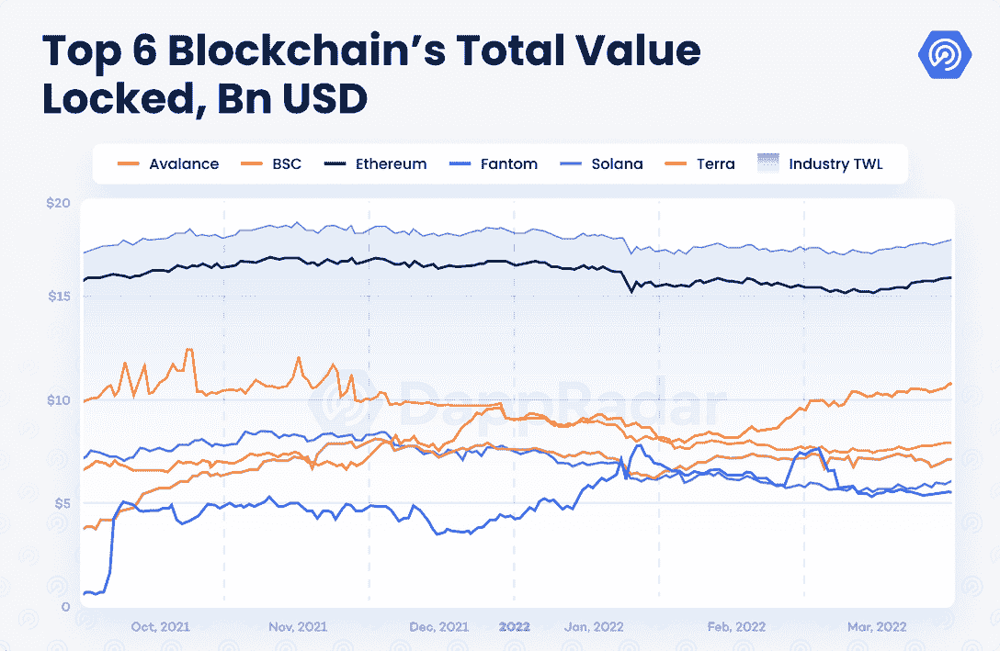

从区块链的角度来看，基于宇宙的区块链 Terra 经历了最重大的飞跃。就 TVL 而言，Terra 显然已成为仅次于以太坊的第二大网络，3 月底锁定了 230 亿美元，比 2021 年底增加了 68%。由于有效的稳定的生态系统和完整的 DeFi 协议(如 Anchor ), terra 已经成为主导的 DeFi 力量，提供有竞争力的产量。Terra 持有该行业约 10%的 TVL，是仅次于以太坊 60%的 TVL 优势的第二大网络。

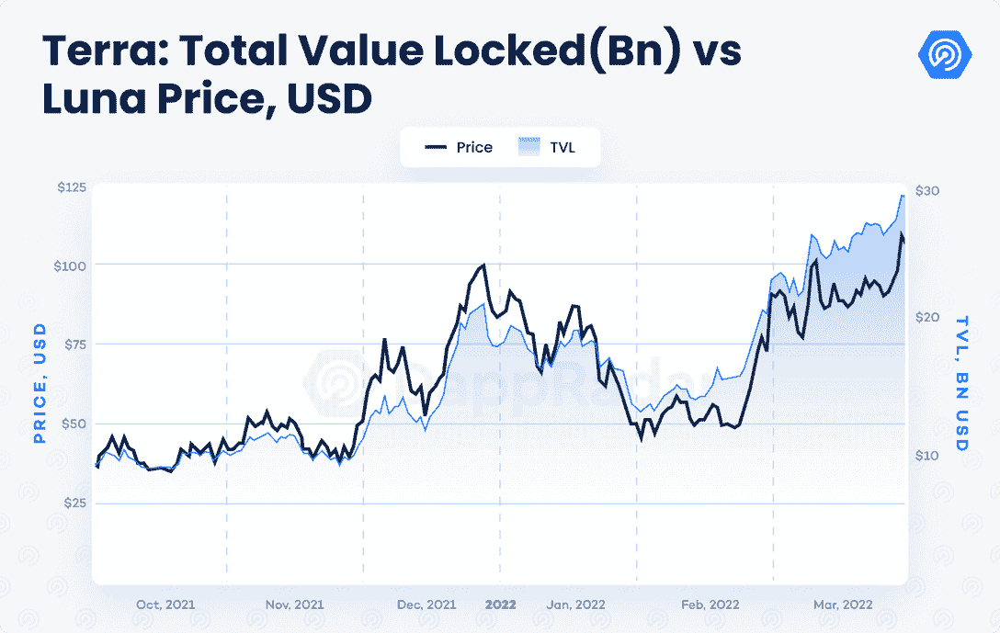

除了正在崛起的 TVL，Terra 最近一直处于聚光灯下，因为 Terra 的联合创始人 Do Kwon 宣布，区块链已经开始用比特币抵押其广受欢迎的稳定币 UST，以减轻 LUNA 在 UST 铸造机制中固有的套利压力，从而提高用户对整个生态系统的信心。

BTC 被认为是最安全的数字资产之一。Kwon 的举动可能会在短期内造成一些不稳定，但显然对该资产的长期价值充满信心。Terra 的国库钱包在 3 月份关闭，成为 BTC 的第三大持有者，仅次于 Satoshi 和 Michael Saylor。当然，这是未来几个月需要监控的事情。

## DeFi 显示出成熟的迹象

以太坊和 Terra 显然在 DeFi 的排名中处于领先地位。然而，下一个级别的竞争正在升温。BNB 链-以前称为 BSC 和雪崩都是建立 DeFi 网络，在 TVL 分别有 130 亿美元和 100 亿美元。自上一季度以来，这两个网络都失去了价值，因为 BNB 的 TVL 下降了 27%，而 Avalanche 的数量环比下降了 12%。

然而，缩小范围，BNB 与前一年相比损失了 13%，而 Avalanche 与前一年相比增长了 3，600%。尽管 BNB 将继续依赖业内最常用的区块链 dapp-PancakeSwap，但这两个网络正朝着不同的方向发展。

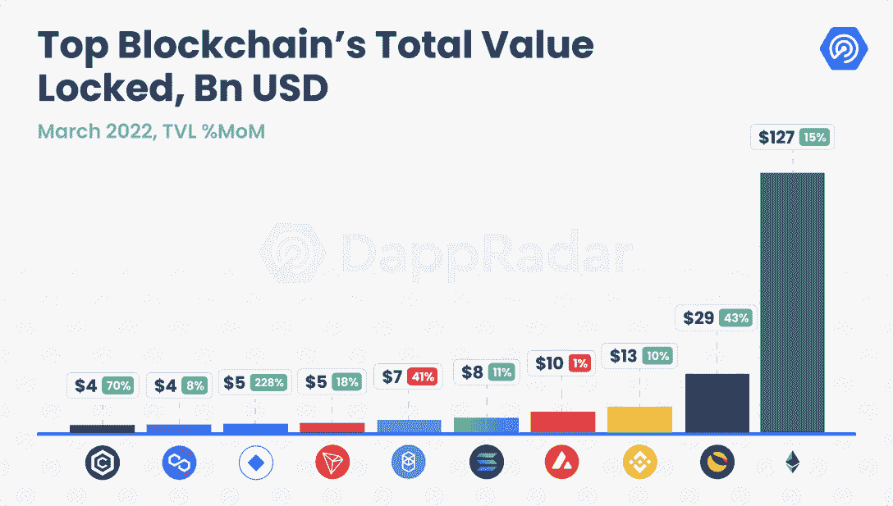

回顾 Fantom 的案例也很有意思，Fantom 是一种第 1 层网络，在 TVL 竞赛中取得了进展。Fantom 月份在 TVL 的销售额为 66 亿美元，比去年年底增长了 42%。然而，在 DeFi 和 Web3 世界中最有影响力的人物之一 Andre Cronje 在三月份辞去了 Fantom 的技术顾问一职。他的离开给 DeFi 留下了一个无限期的巨大空白。经过年初两个月的强劲增长，Fantom 在网络上的 TVL 比二月份下降了 41%。我们会继续监控 Fantom 上的 DeFi 状态。

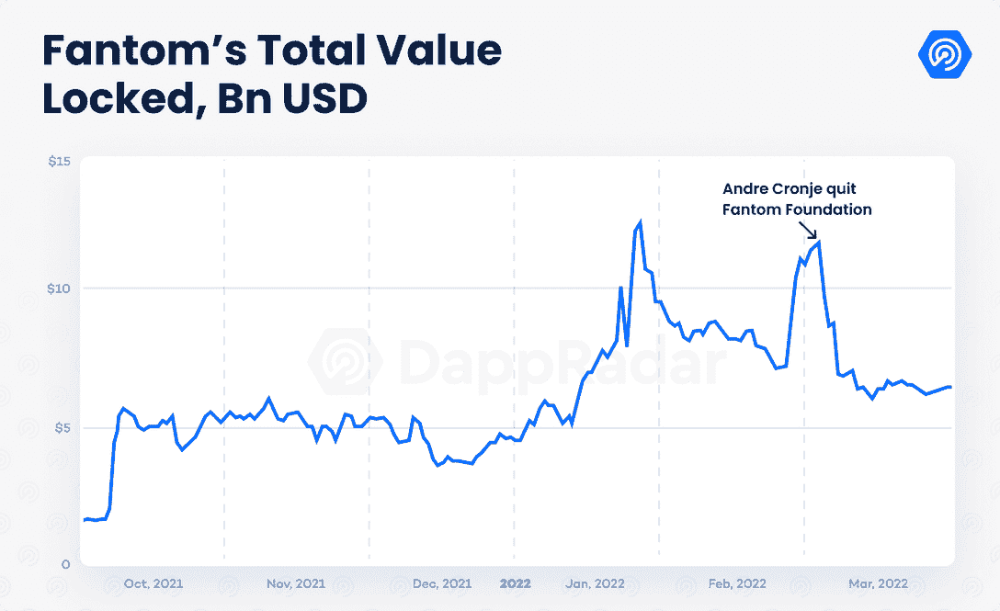

如前所述，尽管在 TVL 处于低谷，但区块链空间显示出逐渐成熟的迹象。随着加密市场挑战之前的熊市趋势，对 DeFi 的兴趣似乎又回来了。尽管如此，也许是时候承认 DeFi 可能是最新一个被采用的大区块链类别了。DeFi 应该从与游戏的融合(GameFi)中受益，以真正取得进展。

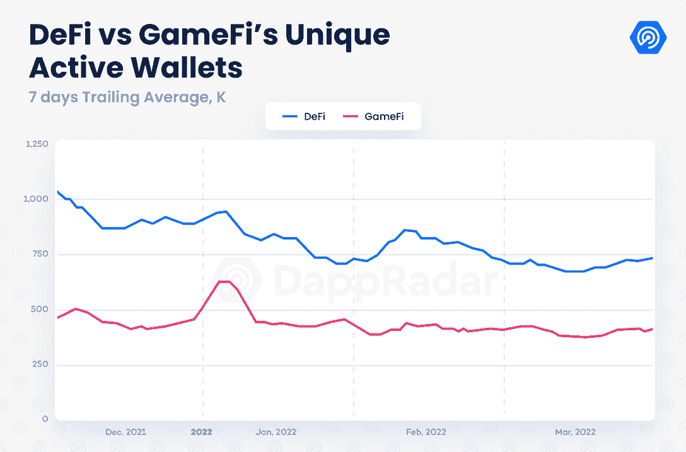

## 风险投资公司向 2022 年 Q1 区块链奥运会投入了超过 25 亿美元

在负面的宏观趋势下，基于区块链的游戏一直是该行业活动的驱动力。最重要的游戏让他们的观众参与进来，并将通过即将发布的版本和增强功能扩展到新玩家。

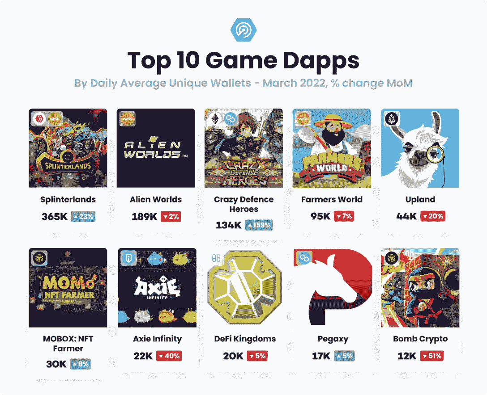

在 Sky Mavis 面临的最大危机中，Axie Infinity 团队正在推进 Axie Infinity: Origin 的[计划推出。沙盒 Alpha 第二季于上周结束，吸引了数千名新用户，35 次现场体验展示了该平台的娱乐潜力。](https://web.archive.org/web/20221201205923/https://dappradar.com/blog/sky-mavis-to-launch-axie-infinity-origin-amidst-hack-crisis/)

此外，人们对区块链奥运会的兴趣越来越明显。仅在 Q1，风投和投资者就向区块链游戏和基础设施投入了超过 25 亿美元。为了更深入地了解这些投资以及游戏 dapps、元宇宙平台及其基础加密货币的最重要趋势，请关注与区块链游戏联盟合作即将发布的 Q1 区块链游戏报告。

## 关闭

2022 年第一季度有起有落，但受到乌克兰战争的影响。自 2008 年全球金融危机以来最大的事件震动了世界市场，并对该行业产生了负面影响。尽管如此，区块链授权的分散化金融生态系统所带来的优势以及 Web3 社区所带来的积极影响得到了充分展示。

随着采用的增加，像在桥中发现的技术缺陷变得明显，并且是一个诱人的攻击目标。正如在 Q1 被盗的 12 亿美元所证明的那样，其中至少有 9 亿美元是从桥梁中流失的。安全和法规将成为全年需要重新审视的重要话题。

顶级 NFT 项目已被证明是一种价值储存手段。特别是宇迦实验室的无聊猿游艇俱乐部脱颖而出。这个团队已经展示了一个公用事业驱动的项目如何在不到一年的时间里成为领先的 Web3 品牌。随着数字品牌和虚拟房地产不断成为整个行业的头条新闻并进入主流，非功能性房地产市场逐渐进入主流意识。

像 NFT 一样，DeFi 空间看起来更加巩固。Terra 已经成为 DeFi 领域的一股力量，并将继续受到关注，因为该团队实施了一项有趣的抵押策略。同时，区块链像 BSC、Avalanche 和 Solana 将继续发展他们的 DeFi 生态系统，试图挑战以太坊和 Terra 的统治地位。

游戏类别继续推动整个行业采用区块链。看到游戏如何将更广泛的区块链产业聚集在一起将变得有趣。我们将看到 NFTs 和 DeFi 拥抱游戏，作为更广泛受众的催化剂。

在这个星球上，没有其他目标受众比游戏玩家对数字价值和资产有更多的体验，这使他们成为 DeFi 和 NFTs 的早期采用者。因此，区块链奥运会、NFTs 和 DeFi 之间的融合将会很有意思。在 2021 年被认为是 NFTs 年之后，看起来 2022 年将成为一个成熟期，游戏、NFTs 和 DeFi 将在与元宇宙的崛起密切相关的用例中走到一起。

 NewsletterUnsubscribe at any time. [T&Cs](https://web.archive.org/web/20221201205923/https://dappradar.com/terms) and [Privacy Policy](https://web.archive.org/web/20221201205923/https://dappradar.com/privacy-policy)