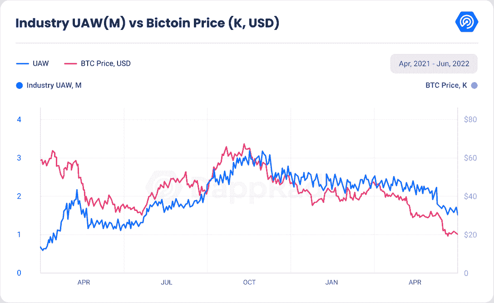
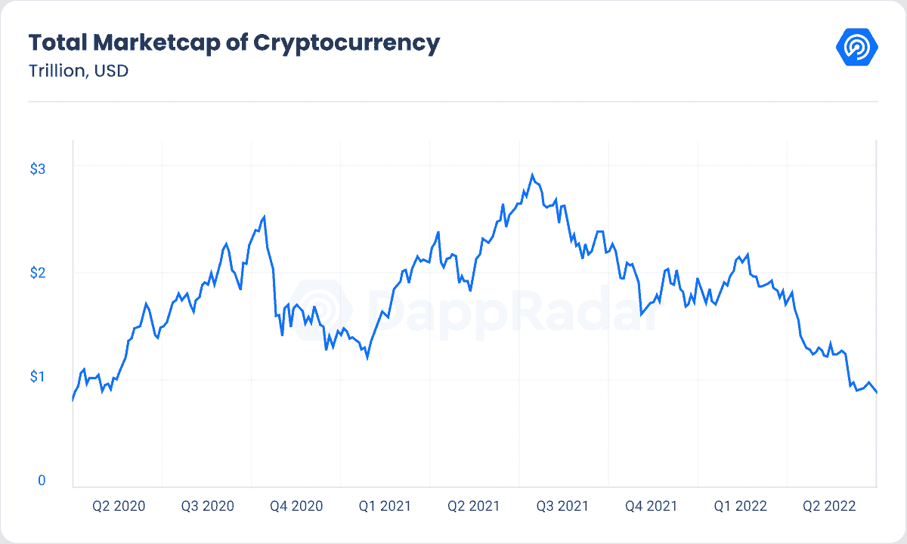
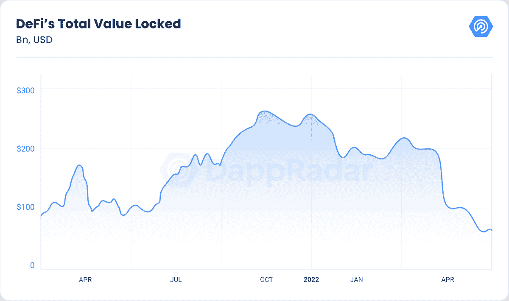
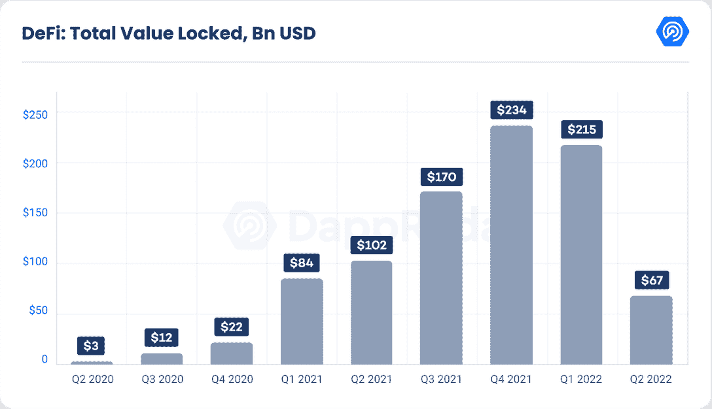
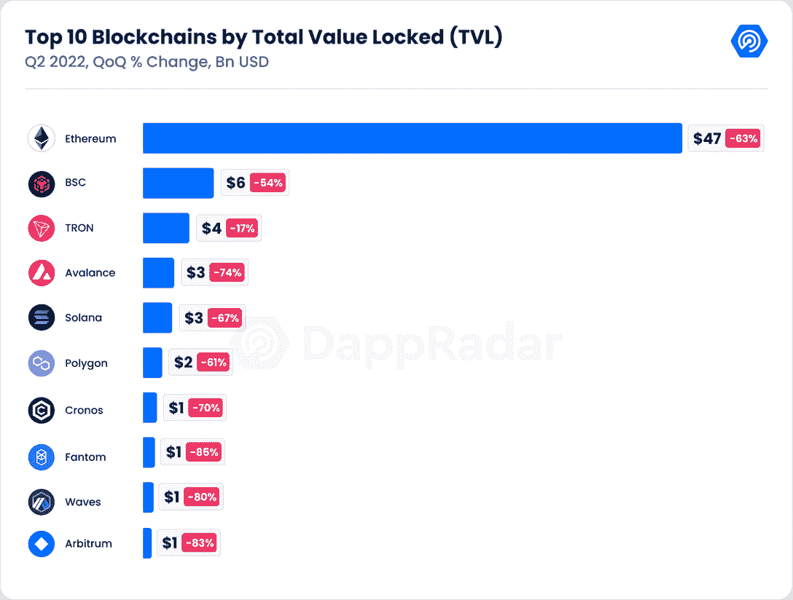
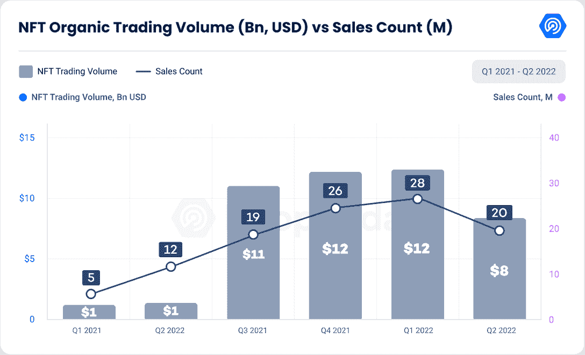
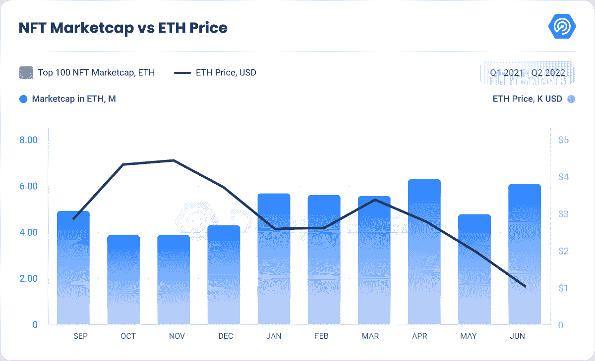
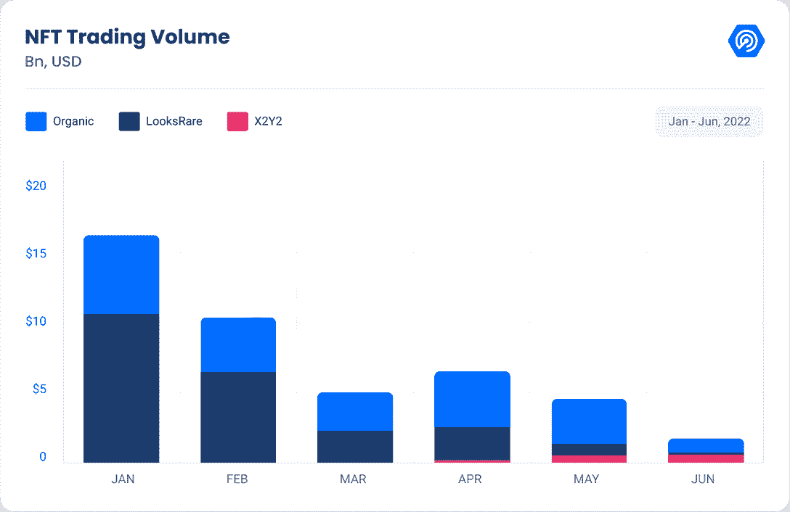
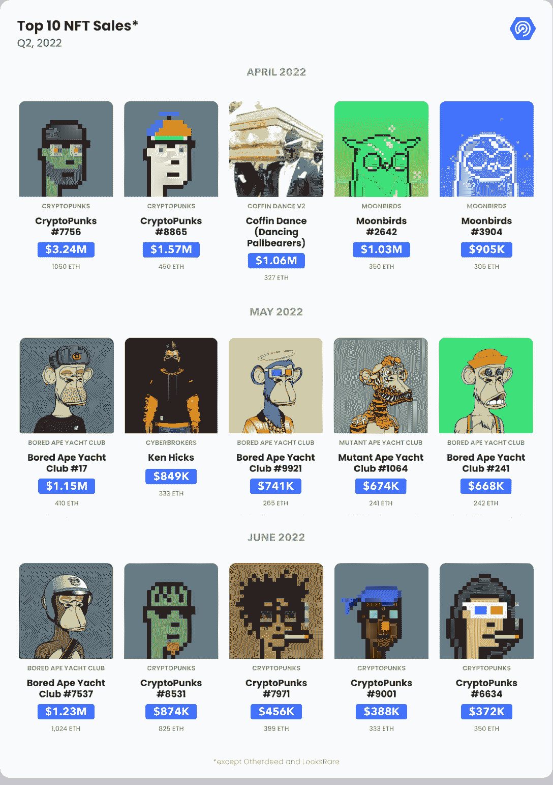
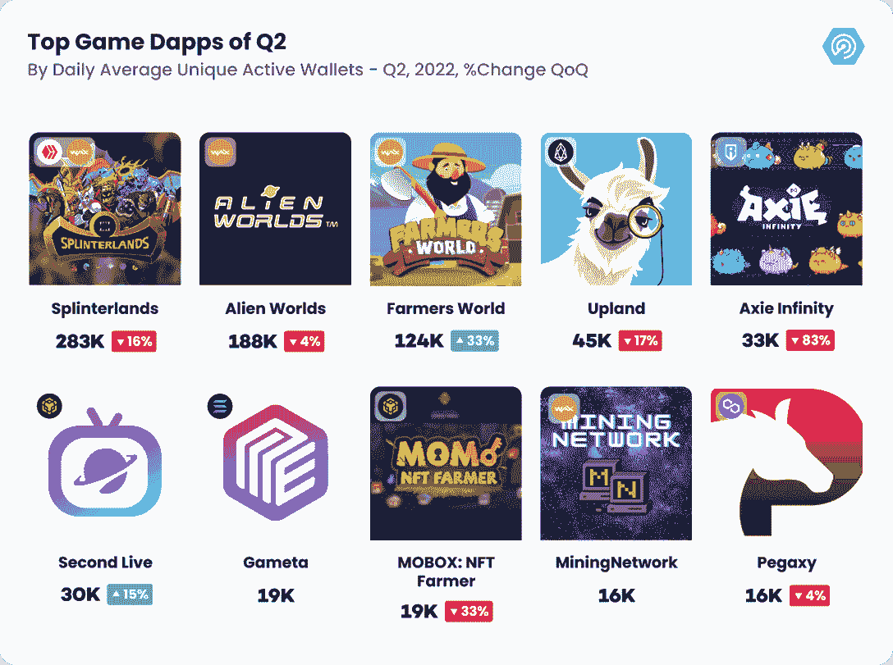

# Dapp 行业报告 Q2 2022 概述

> 原文：<https://web.archive.org/web/https://dappradar.com/blog/dapp-industry-report-q2-nfts-and-web3-games-keep-enduring-market-conditions-as-shockwaves-from-the-terra-collapse-reach-cefi-and-vcs>

## 随着 Terra 崩溃的冲击波波及 CeFi 和风投，NFTs 和 Web3 游戏保持了持续的市场状况。

在 Terra 崩溃和重要的 CeFi 和 VC 参与者妥协的情况下，区块链行业正在经历最具挑战性的时期之一。尽管如此，NFT 和游戏为 dapp 行业描绘了一个光明的未来。

dapp 行业目前正在经历一个严酷的秘密冬天，Terra 生态系统的崩溃和不利的形势加剧了这一冬天，这种不利的形势已经影响了该领域一些最著名的演员，即 BlockFi、Celsius 和 3AC。

同时，这种情况也显示了在 Web3 空间中自我监管的重要性。

6 月，与区块链 dapps 互动的每日唯一活跃钱包(UAW)数量平均达到 178 万，自 2021 年 9 月以来首次未能超过 200 万。

在 Q2 期间，平均有 211 万 UAW 连接到区块链 dapps，比上一季度减少 11%，但仍比 Q2 2021 高出 62%。

Source: [DappRadar](https://web.archive.org/web/20221201014023/https://dappradar.com/)

尽管该行业呈熊市趋势，但仍有一些一线希望，可以对 dapp 行业的未来方向保持乐观。

虽然以太坊上的交易量比上一季度下降了 40%，但同期的销售数量增加了 2%，这表明对数字资产的需求在过去三个月中有所增加。

同样，索拉纳·NFT 在 Q1 的交易数量翻了一番，而同期交易量增加了 23%。与此同时，蓝筹 NFT 藏品不断被视为比密码本身更安全的资产类别。

最后，尽管基于游戏的代币价格不断下跌，但区块链游戏通过吸引创纪录的风投投资和巩固的玩家基础，继续描绘着一个乐观的未来。

## 关键要点

*   自 Terra 崩溃以来，加密市值已下跌 34%，自 2021 年 1 月以来首次从 1 万亿美元大关下跌。
*   领先的 CeFi 平台的流动性紧缩表明了自我托管的重要性；3AC 申请破产，给市场注入了更多恐惧。
*   DeFi 的 TVL 估计为 700 亿美元，比 Q1 的收盘价低 69%，比一年前低 33%；以太坊的优势增长到 69%，其合同锁定了 480 亿美元。
*   以太坊前 100 名藏品的 ETH 市值超过 600 万 ETH，在 ETH 价格暴跌 72%的情况下增长 7%。
*   虽然以太坊的交易量比 Q1 下降了 40%，但交易数量却增加了 2%；索拉纳的交易量比上一季度增长了 40%，而交易数量翻了一番。
*   NFT 蓝筹股收藏在 6 月份升值，证明了它们作为能够储存价值的资产的地位。
*   价值 6 . 76 亿美元的加密资产在 Q2 被盗；区块链大桥仍然是首要目标，6 月地平线大桥被盗 100 美元。

## 内容

*   [地球的崩塌如何改变了区块链的地貌](https://web.archive.org/web/20221201014023/https://dappradar.com/blog/dapp-industry-report-q2-nfts-and-web3-games-keep-enduring-market-conditions-as-shockwaves-from-the-terra-collapse-reach-cefi-and-vcs/#How-the-collapse-of-Terra-altered-the-blockchain-landscape)
    *   【CeFi 主要参与者的流动性紧缩
    *   [3AC 可能会对加密市场造成巨大打击](https://web.archive.org/web/20221201014023/https://dappradar.com/blog/dapp-industry-report-q2-nfts-and-web3-games-keep-enduring-market-conditions-as-shockwaves-from-the-terra-collapse-reach-cefi-and-vcs/#3AC-could-deal-a-black-swan-effect-to-the-crypto-markets)
    *   [TVL 回到 2021 年的水平](https://web.archive.org/web/20221201014023/https://dappradar.com/blog/dapp-industry-report-q2-nfts-and-web3-games-keep-enduring-market-conditions-as-shockwaves-from-the-terra-collapse-reach-cefi-and-vcs/#TVL-back-to-2021-levels)
*   [安全仍应是关注的焦点——在 Q2 期间，价值 6.76 亿美元的加密资产被盗](https://web.archive.org/web/20221201014023/https://dappradar.com/blog/dapp-industry-report-q2-nfts-and-web3-games-keep-enduring-market-conditions-as-shockwaves-from-the-terra-collapse-reach-cefi-and-vcs/#Security-should-remain-a-focus---$676-million-was-stolen-in-crypto-assets-during-Q2)
*   [尽管交易量下降，但 NFT 销售需求上升](https://web.archive.org/web/20221201014023/https://dappradar.com/blog/dapp-industry-report-q2-nfts-and-web3-games-keep-enduring-market-conditions-as-shockwaves-from-the-terra-collapse-reach-cefi-and-vcs/#Demand-for-NFTs-up-despite-volume-slump)
*   [迫在眉睫的 NFT 市场大战](https://web.archive.org/web/20221201014023/https://dappradar.com/blog/dapp-industry-report-q2-nfts-and-web3-games-keep-enduring-market-conditions-as-shockwaves-from-the-terra-collapse-reach-cefi-and-vcs/#Looming-NFT-marketplace-wars-)
*   [区块链游戏不断描绘看涨的未来](https://web.archive.org/web/20221201014023/https://dappradar.com/blog/dapp-industry-report-q2-nfts-and-web3-games-keep-enduring-market-conditions-as-shockwaves-from-the-terra-collapse-reach-cefi-and-vcs/#Blockchain-games-keep-painting-a-bullish-future)
*   [关闭](https://web.archive.org/web/20221201014023/https://dappradar.com/blog/dapp-industry-report-q2-nfts-and-web3-games-keep-enduring-market-conditions-as-shockwaves-from-the-terra-collapse-reach-cefi-and-vcs/#Closing)

## Terra 的崩塌如何改变了区块链的地貌

5 月 7 日，区块链行业见证了当时第二大 DeFi 生态系统 Terra 是如何停止的，留下了 400 亿美元的死钱和数百个没有主机网络的 dapps。

崩溃前的第三大稳定币(UST)失去了与美元的挂钩，迫使卢纳基金会卫队(LFG)采取一些行动，帮助稳定币重新与 1 美元挂钩。然而，这将给整个行业带来沉重的代价。

首先，随着稳定的货币失去了与美元的挂钩，作为 Terra 保证 UST 稳定的统治象征的 LUNA 崩溃了。崩溃前排名前十的加密货币 LUNA 的价格暴跌 99%，随着代币供应量被铸造为无穷大，几个小时内抹去了 270 亿美元。

此外，值得记住的是，在 Q1 期间，Do Kwon——Terra 的联合创始人，在 BTC 发起了一项以 35 亿美元作为生态系统抵押的动议，以支持 UST 应对压力时期。

因此，当 LFG 卖出 80，000 BTC 时，它产生了足够的抛售压力，导致比特币在 Terra 崩盘后的几天内损失了 23%。

Terra 崩溃给整个加密市场带来了冲击波，引发了一个高波动期。加密货币市值损失 34%，从 1.75 万亿美元降至 1.15 万亿美元。在撰写本文时，这一数字自 2021 年 1 月以来首次跌破 1 万亿美元(合 8750 亿美元)。

Source: [DappRadar](https://web.archive.org/web/20221201014023/https://dappradar.com/)

此外，包括 USDN、和 FEI 在内的算法稳定货币失去了与美元的挂钩，只有后者恢复了其预期水平。在 6 月份的市场崩盘期间，Tron 的 USDD 和 Abracadabra 的 MIM 也失去了联系汇率，这给这一资产类别增加了更多的不确定性。

Terra 生态系统的崩溃给市场带来了恐惧，并加剧了源于复杂宏观经济情景的隐性冬天。这也损害了 DeFi 在主流投资者中的声誉，强化了加密风险太大的观点。

这种情况的影响清楚地表明，监管是必要的。“匿名者”最近发布了一段针对跆拳道的视频，而韩国当局仍在调查 TerraLabs 的联合创始人。

Terra 事件让成千上万的散户投资者陷入了可怕的财务困境，而加密行业中一些最知名的公司也受到了严重影响。

风险投资类型的组织 Hashed 在 Terra 资产中损失了约 35 亿美元。与此同时，其他知名公司，包括 Jump Crypto、比特币基地风险投资公司、Polychain、Tribe、币安和三箭资本(3AC)，也受到了未知数量的影响。后者可能对整个行业有更重大的影响。

### CeFi 主要参与者的流动性紧缩

自 Terra 崩溃以来，领先的集中式加密贷款平台(CeFi)面临着严峻的挑战。这些 CeFi 公司以极端的市场条件为由，暂停了客户提款和账户间转账。出现这种情况是因为这些平台流动性不足。随着市场恐惧的持续，客户被敦促取回资金，这造成了类似于银行挤兑的情况，贷款实体由于缺乏流动性来满足客户的要求而受到损害。

6 月 13 日，Celsius 成为第一个暂停客户提现的 CeFi 平台。如前所述，高波动性市场条件导致的银行挤兑效应导致用户试图从没有流动性来支付这些债务的交易所提取资金。更糟糕的是，Celsius 通过 Lido 管理着价值 4.75 亿美元的 40 多万支股票以太坊(stETH)。然而，在目前 0.94 的 stETH/ETH 比率下，贷款公司处于亏损的一端，试图弥补其在 ETH 中的债务。

值得注意的是，Celsius 在过去也遭受了重大损失，失去了在 Stakehound 中下注的 [35，000 ETH 的钥匙，当然还有去年 12 月在 Badger DAO exploit](https://web.archive.org/web/20221201014023/https://watcher.guru/news/celsius-network-loses-keys-to-35k-ethereum-tokens-in-stakehound)中损失的[5400 万美元。有趣的是，Celsius token CEL 自宣布以来已经升值 225%，这是 CEL 投资者向卖空者施加压力的一种努力，类似于 GameStop 的 GME。](https://web.archive.org/web/20221201014023/https://finance.yahoo.com/news/celsius-network-lost-54-million-092530269.html)

在 Celsius 停止客户运营几天后，另一个行业领先的 CeFi 平台 BlockFi 也经历了同样的过程。

然而，与仍在与潜在破产作斗争的 Celsius 相反，BlockFi 得到了总部位于巴哈马的加密货币交易所 FTX 的 4 亿美元信贷或 2.5 亿美元出售期权的救助，给其用户群带来了一线希望。

除了 Celsius 和 BlockFi，Babel Finance、Voyager、Coinflex 和 Hodlnot 是在熊市高度波动中面临流动性挑战的其他 CeFi 参与者。

这个场景应该提醒我们，自我监管在 Web3 领域从未如此重要，一旦 Terra 崩溃尘埃落定，DeFi 将在其中扮演重要角色。

### 3AC 可能会给加密市场带来黑天鹅效应

三箭资本一直是区块链行业最著名的投资者之一。其管理的资产(AUM)一度超过 100 亿美元，投资于第一层区块链，包括 Terra、DeFi protocols、集中式加密股票公司、NFTs 和 Web3 games。然而，一切都已沦为实质性的债务。

今年 2 月，3AC 购买了价值 5.6 亿美元的约 1100 万 LUNA，这一头寸在写作时价值不到 700 美元。火上浇油的是，3AC 在 stETH 放了一个显著的位置，几天后卖出了 3 万 stETH。

很明显，3AC 的杠杆率普遍过高，尤其是在 Terra 破产之后。这家风险投资集团未能回应其大多数保证金要求，包括 BlockFi 和 Genesis，陷入清算，并使任何潜在的加密反弹的希望归于破灭。

另一个主要问题是 3AC 在 Avalanche、Aave、dydx 等项目中投资的种子资金数量，以及更多可能会产生涓滴效应的项目。

一旦法律要求 3AC 承担义务，这些协议的原生密码可能会遭受严重的销售压力。

被认为是顶级加密投资基金之一的项目，结果却是一个风险管理不善的过度杠杆化项目。

最近，3AC 宣布申请第 15 章破产保护，防止债权人扣押公司资产。看起来这只是 3AC 小说的开始。

Source: [DappRadar](https://web.archive.org/web/20221201014023/https://dappradar.com/)

### TVL 回到 2021 年的水平

Terra 是一个新兴的 DeFi 生态系统，在其本地锚协议的带领下，在 TVL 拥有超过 290 亿美元的资产。不幸的是，韩国区块链的崩溃造成了 DeFi 景观的地震转移。

首先，TVL 跌至 2021 年初以来的最低水平。截至发稿时，Defi 的 TVL 估值为 700 亿美元，比 Q1 收盘时低 69%，比一年前低 33%。

底层密码价格的暴跌是下跌背后的最大驱动力，但公平地说，对 DeFi 的热情也在下降。

Source: [DappRadar](https://web.archive.org/web/20221201014023/https://dappradar.com/)

以太坊仍然是最具支配地位的连锁店，其支配地位已经提高到 69%，价值 480 亿美元，比 Q1 收盘时高出 11%。BNB 在 TVL 以 60 亿美元再次位居第二，但与 Q1 2021 相比，它仍然处于一个非常不同的位置，在 2021 中，它持有该行业 20%的 TVL，而目前为 8%。

Polygon、Solana 和 Avalanche 紧随币安品牌的区块链之后，在未来应该仍然是最热门的 DeFi 目的地之一。

Source: [DappRadar](https://web.archive.org/web/20221201014023/http://www.dappradar.com/)

更重要的是，Arbitrum 作为领先的 2 层(L2) DeFi 解决方案的崛起是一件好事。Arbitrum 是一个以太坊 L2，提供 Uniswap、Sushiswap、Curve 和 GMX 等功能。乐观派、Near 和 Gnosis 的表现也值得关注。

## 安全性仍应是关注的焦点——在 Q2 期间，6.76 亿美元的加密资产被盗

在浪人桥攻击失败后，我们在四月份发布了一份报告，解释了区块链桥是如何成为加密黑客的主要目标的。是的，它又发生了。

由于 multisig 程序缺乏安全性，连接其本地网络和以太坊的 Harmony 的地平线桥被利用。批准交易只需要两个签名，对于如此重要的桥梁来说，这是不可思议的低安全性做法。

一个类似的故事发生在 Ronin's bridge，当时臭名昭著的 Lazarus group 从该桥抽走了 6 亿美元。

2 月初，索拉纳虫洞被利用了 3.25 亿美元，而去年 8 月，保利网络损失了 6 亿美元，后来被攻击者归还。在当前的安全阈值下，桥梁将继续成为黑客的攻击目标。

密码史上最大的 13 起盗窃案都发生在 6 月。在过去的三个月中，总共有 6 . 76 亿美元的加密资产被盗。根据 Rekt 数据库的数据，埃尔隆德的 dapps Arda 和 Maiar 在 6 月份分别被利用了 1.27 亿美元和 1.13 亿美元。

对于 DeFi dapps 来说，加强其安全措施以保护用户和他们的声誉是完全相关的。

## 尽管产量下降，但对 NFT 的需求增加

本季度 NFT 股市经历了一次过山车行情。一方面，来自宏观经济趋势的巨大压力和 Terra 崩溃的余波阻碍了 NFTs 的表现。尽管如此，NFT 很好地经受住了这场风暴。

更重要的是，从更广阔的时间尺度来看，每年的表现是惊人的。整体交易量和销售数量比 2021 年的 Q2 分别增长了 533%和 59%。

尽管 OpenSea 是 NFT 首屈一指的交易平台，但随着 LooksRare、x2y2 和 Solana 的 Magic Eden 等市场的出现，其份额已经下降。

交易量的下降可以归因于加密货币市值的下降和 NFT 交易领域竞争的加剧。

然而，尽管以美元衡量的市场交易量自 5 月份以来下降了约 70%，但在同一时间跨度内，ETH 的交易量下降了 55%。

Source: [DappRadar](https://web.archive.org/web/20221201014023/http://www.dappradar.com/)

此外，OpenSea 的交易量下降不应被视为整个 NFT 市场下跌的指标。由于 ETH 的贬值，以太坊前 100 名 NFT 藏品的市值有所下降，自 Q1 开始以来已经下降了 63%。

尽管如此，NFT 市场对熊市趋势做出了独特的反应。上述以 ETH 表示的 NFT 市值数字一直在持续增长，以弥补这一下降。

从 10 月份的低点 300 万 ETH 到 4 月份的顶峰，达到 600 万 ETH。目前，市值超过 500 万以太网，自 4 月份以来下降了 8%，但自 5 月份以来增长了 20%。

Source:[DappRadar](https://web.archive.org/web/20221201014023/https://dappradar.com/)

以元宇宙为重点的 NFT 有一个不错的季度。基于 ETH 的集合的交易量增加了 101%，而 Polygon 集合不幸下降了 26%。总的来说，增长了 96%。

年复一年，统计数据看起来更令人印象深刻，因为基于以太坊的收藏增长了 2093%，而 Polygon 增长了 456%，总体增长了 1999%。

虽然区块链游戏对动荡的抵抗力很强，但基于游戏的 NFT 却没有同样的运气。交易量总体下降了 82%，大多数连锁店都遭遇了回调，其中最严重的是 Ronin 下降了 84%，Ethereum 下降了 88%。

综上所述，就性能而言，我们看到了一个整体的混合景观。Solana 和 Avalanche 成为明显的赢家，交易量增加了 21%和 15%(尽管加密回调)。

以太坊、BSC 和 Polygon 等现有区块链损失惨重，分别为 41%、22%和 59%。虽然是绝对的，但 Flow 和 Ronin 达到了低点，分别回落了 71%和 84%。

尽管许多代币贬值，许多区块链的交易活动仍在继续。Solana 再次成为明显的赢家，其销售额几乎翻了一番，达到 98%，而以太坊和 BSC 分别保持在 2%和-4%的水平。区块链其他地区的情况就不一样了，损失高达 75%。

## 展望 nft 市场战争

本季度 NFT 工业取得了重大进展。我们之前已经确定，尽管美元价值回落，但 ETH 的交易数量和交易量并未受到重大影响。对于许多投资者来说，这是一个看涨的指标，表明他们对这个新兴但利润丰厚的行业加倍下注。

以太坊领先的分散式交易所(DEX) Uniswap 已经收购了 NFT 聚合器平台 Genie。聚合器平台将所有连锁店的各种交易市场的 NFT 报价进行汇总，以便对 NFT 市场有一个全面的了解，并在一个地方以较低的汽油费满足您的所有交易需求。

Uniswap 长期以来将自己定位为以太坊事实上的做市商。此次收购将使 DeFi protocol 完善其产品供应，将以前没有的加密市场的重要部分包括在内。

作为提高平台流量的奖励，在今年 4 月 15 日之前与 Genie 互动的用户将有权获得一些 USDC，他们可以兑换长达 12 个月。

Source: [DappRadar](https://web.archive.org/web/20221201014023/https://dappradar.com/)

如前所述，虽然 OpenSea 仍然是 NFT 市场的领导者，但其市场份额已经减少。为了保持竞争力，随着 Seaport 的推出，OpenSea 不断改进其服务。这种先进的交易开源协议支持一次交易多个 NFT。

此外，他们已经开始提供基于 Solana 的 NFT，并于最近购买了 NFT 市场聚合器 Gem。虽然 Gem 将成为自己的平台，但 OpenSea 计划利用其专业知识来改善服务，并保持其领先地位。

这些收购很可能会让 OpenSea 和 UniSwap 很快陷入直接竞争。虽然许多人批评 OpenSea 由于其在 NFT 市场 75%的市场份额而变得“过于集中”，但它无疑将与日益激烈的竞争进行艰苦的斗争。

最后，一个晴天霹雳的举动是易贝收购 KnownOrigin。在线市场巨头易贝也扩大了其数码产品的供应。

尽管以太坊在历史上一直是 NFT 的主要区块链，但由于相对较低的天然气费用和较低的进入壁垒，Solana 已经成为新 NFT 项目的可行替代方案。

Magic Eden 是 Solana 的 NFT 的主要市场，由于许多成功的 Solana 系列(如 Okay Bears)的推出，交易者的流入量创下了纪录。Solana marketplace dapp 号称 0%的上市费和仅 2%的交易费。本季度魔术伊甸园占所有 NFTs 交易的 10%。

## 蓝筹股收复失地

许多蓝筹股的收藏价值大幅下跌。自 4 月 30 日以来，BAYC 下限下降了 38%，从 150 ETH 降至 90 ETH。MAYC 在同一时期损失了 57%,交易了 17 ETH。

Doodles 也出现了类似的情况，在推出 Dooplicator 后，其价格从 23 ETH 降至 12 ETH，下降了 48%。

这种回调是与资本市场衰退相关的宏观经济趋势和新项目(如《妖精小镇》和《月鸟》)的发布相结合的结果，这吸引了许多人卖掉他们的旧 NFT 来收购新的 NFT。

特定项目的失败，如志那都红豆创始人被揭露为连环诈骗，进一步削弱了人们对 NFTs 的信心。

然而，在 6 月 18 日至 19 日的周末，许多藏品在纽约 NFT 会展前突然升值。在这次复苏期间，Meebits 底价增长了 76%，Doodles 和 CryptoPunks 恢复了 44%和 43%，BAYC 增长了 24%。

## 虚拟世界受到的冲击最大

自去年 11 月以来一直处于高位的虚拟世界，自那以后一直在系统性地走下坡路。当无聊的猿发布了他们期待已久的土地销售，并附有土著猿令牌时，情况发生了巨大的变化。

其他房契在发行后几小时内就销售一空。这一系列产品的发布轻而易举地重振了虚拟世界，创造了超过 15 万 ETH 或 4.2 亿美元的收入，市场月度交易量从 1.16 亿美元增加到 6.16 亿美元，增长了 431%。

这次发射并非没有失误。造币厂堵塞了以太坊网络，将天然气价格推高至数千英镑。由于交易失败，损失了数百万美元。然而，宇迦实验室补偿了那些无法铸造他们土地的人的损失。这一发行也使 ape coin——其他契约的本土象征——的市值达到 3 . 8 亿美元。

不幸的是，虚拟世界市场无法承受这场风暴，因为许多虚拟世界的本土令牌，如法力、沙子和 ENJ，损失了高达 82%的价值。

尽管市场呈熊市趋势，但数字房地产市场已经公布了一些积极的指标。五月份 NFT 十大拍卖中有七件属于 Otherside 系列，Otherdeed #24 拍卖了 333 ETH 价值 100 万美元。

自本月初以来，TSB 和分散土地的楼面地价已经上涨了 30-40%。此外，风险投资者仍然看好该行业的前景，承诺超过 46 亿美元用于元宇宙项目和基础设施的发展。根据花旗集团的一些非常乐观的预测，到 2030 年，元宇宙产业将增长到 13 万亿美元。

## NFT 系列不断创新

尽管熊市以及随之而来的许多主要加密货币价格的下跌，但我们看到了突破性的收藏，这些收藏打破了历史记录，挑战了许多定义 NFT 项目的正统做法。

我们的第一次突破是在四月的月鸟项目中。在我们的 Dapp 报告中提到的时候，这些藏品的交易量达到了创纪录的 100，000 ETH 或 1 万亿美元。

该系列的成功很大程度上归功于社区建设的草根方法。该项目始于一个由凯文·罗斯主持的关于检验 NFT 的证明播客的社区。

随着播客的两极分化，罗斯利用他的专业知识和与有才华的开发人员的联系，制作了一个系列，专注于向长期持有人而不是投机者提供价值。该系列为持有者提供软赌注或“筑巢”他们的月鸟，以在未来获得更多回报。

此外，随着 Okay Bears 的推出，我们已经看到了基于 Solana 的 NFTs 的重大成功。该系列是当时索拉纳最卖座的系列之一，底价升值 11，500%，是 Dapp 所有报告中最高的。

也有一些藏品完全颠覆了我们对 NFT 藏品的传统理解。

以太坊名称服务是一项实用功能，允许用户在以太坊上购买域名和主机内容，如钱包地址或网站。

每个域名本质上都是独一无二的，它们的功能就像 NFT 一样。由于从 0 到 9999 的数字域是有限的，人们开始铸造，购买，并围绕它们建立一个社区，非正式地创建了被称为 10k 俱乐部的集合。

我们也有地精镇。这个系列颠覆了整个 NFT 项目的进程。在发布时，它没有路线图，没有冲突，没有开发者的数据，造币厂除了汽油费是免费的。

它确实有一个官方网站，上面有许多关于这个项目的隐藏线索，还有一个为钱包里有妖精的人准备的互动小游戏。这导致许多人猜测这是一个秘密的 Yugalabs 或加里 Vee 项目，以异常良好的项目启动和生产。

Source: [DappRadar](https://web.archive.org/web/20221201014023/https://dappradar.com/)

## 区块链游戏不断描绘看涨的未来

区块链游戏持续表现良好。这一区块链垂直市场在 UAW 下降了 5%,相比之下，业内其他地方下降了 26%。这对区块链游戏来说是一个乐观的指标，因为许多人猜测，如果游戏 dapps 对普通用户不再有利可图，他们将失去大部分玩家。事实证明并非如此。

Spliterlands 连续第八个月成为区块链最受欢迎的游戏，每日活跃钱包数为 350，000，与前一个月相比略微下降了 4%。

其他常见的候选游戏如《异形世界》和《高地》也在月度 UAW 中分别以 5%的跌幅和 4%的涨幅位列最受欢迎的五大游戏之列。

游戏化健身 dapps 开创了移动赚钱(M2E)趋势，并席卷了市场。STEPN 是一款慢跑应用，可以跟踪人们的运动，并在他们完成 NFT 运动鞋设定的目标时给予奖励。

该应用程序每月注册用户超过 200 万，许多人认为这是一个投资机会，超过 262，000 个钱包持有原生 GMT 令牌。

其他类似的项目包括 Genopets、Step App 和 DotMoovs，它们以各种方式扩展了这一理念，以象征性的奖励来吸引积极的生活方式。

要获得更多关于区块链游戏和趋势的见解，如虚拟世界、移动赚取和领先的游戏 dapps，请务必阅读我们即将发布的 BGA 游戏报告。

## 关闭

毫无疑问，区块链行业正在经历一个最具挑战性的时期。Terra 生态系统的崩溃和相互关联的行业感受到的多米诺骨牌效应可能意味着本已复杂的宏观经济情景面临更多障碍。

卢纳和 UST 的崩溃造成了足够的抛售压力，导致 BTC 价格下跌，拖累了整个加密市场。同样，3AC 和 Alameda 通过清算大量 stetH 头寸施加的抛售压力也有可能导致 Celsius 下跌。

尽管如此，dapp 行业的前景仍然乐观。区块链游戏的采用继续巩固，而 NFT 市场不断发展。

虚拟世界 NFTs 市场经历了最好的一个季度。尽管以美元衡量的交易量处于一年来的低点，但以太坊 NFT 的需求却在向相反的方向发展。

索拉纳作为一个网络的崛起是另一个乐观的情景，在这个网络中，非正规金融机构蓬勃发展。此外，看到蓝筹股 NFT 项目在负面低迷中保持甚至增值，是 NFT 长期存在的最新证明。

尽管整个市场情绪消极，但仍有乐观的理由。像 Cardano 和 Ethereum 这样的网络即将达到重要的里程碑，这将标志着对整个行业的重要推动。

与此同时，监管机构加快了他们的政策制定过程，因为安全性仍然是当今空间中最大的风险之一。