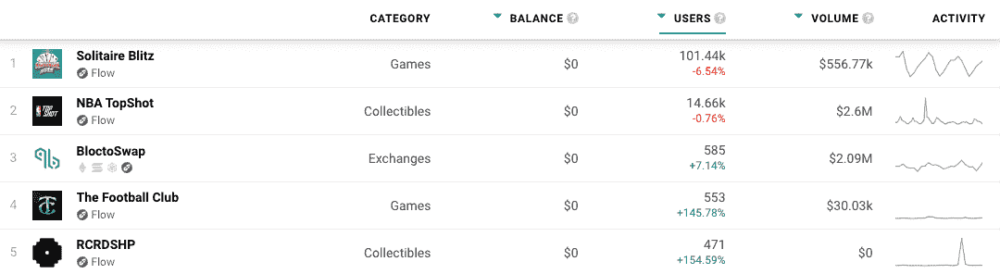

# Dapp 趋势:流量区块链为开发者开放

> 原文：<https://web.archive.org/web/https://dappradar.com/blog/dapp-trends-flow-blockchain-opens-up-for-developers>

## 每周洞察区块链和 Web3 应用

如果你正在区块链寻找下一个 Spotify、谷歌或亚马逊，DappRadar 可以帮你。随着各种类别和垂直领域发生如此多的事情，及时了解重要信息以发现区块链、戴普斯和 NFT 的哪些项目产生了价值，并为正确的原因建立了受众，这一点至关重要。

在 2021 年末[脸书更名为](/web/20230123202318/https://dappradar.com/blog/dappradar-metaverse-report-1-virtual-worlds-soulbound-tokens-and-more/)之后，预测[元宇宙相关代币](/web/20230123202318/https://dappradar.com/blog/metaverse-tokens-surge-as-meta-tanks/)的价格飙升不是很好吗？这不是最明显的，但发生的可能性很大。关键是，当你被连接到一个 24/7 的行业，这些事情变得更容易发现。

这些文章旨在与能够深入挖掘并做出自己决定的其他人分享这些知识和信息。

在 DappRadar，我们跟踪了跨越 40 多个区块链的 11，500 多个 dapp 项目，这些每周趋势文章深入探讨了最新和最令人兴奋的项目和生态系统。有时项目是短暂的，有时它们让每个人都感到惊讶，而其他时候它就在那里扇你的脸。当然，即使是我们的鹰眼团队也会遗漏一些东西，所以请将此视为正确方向上的一个点，而不是一个明确的指南。

根据项目的优点、未来潜力和链上指标来选择项目。这不是一个付费的宣传片或试图促进一个特定的项目或区块链。

## 流量区块链

[自 2017 年推出](https://web.archive.org/web/20230123202318/https://dappradar.com/rankings/protocol/flow) [CryptoKitties](/web/20230123202318/https://dappradar.com/blog/how-to-value-cryptokitties-nft-collectibles/) 以来，Dapper Labs 的流量区块链团队已经测试并评估了[解决关键可扩展性问题](/web/20230123202318/https://dappradar.com/blog/introducing-the-flow-blockchain-home-of-nba-top-shot/)的不同方法。不幸的是，他们意识到现有的解决方案都不适合他们想要构建的应用程序。

经过两年的研究和实验， [Flow 于 2020 年初](/web/20230123202318/https://dappradar.com/blog/introducing-the-flow-blockchain-home-of-nba-top-shot/)诞生。区块链因满足主流开发者和消费者的期望而受到称赞，同时没有分割网络或损害去中心化。自从 [NBA Top Shot](/web/20230123202318/https://dappradar.com/blog/how-to-value-nba-top-shot-nfts/) 的推出和到来，心流生态系统一直在稳步构建价值和用户，我们认为是时候照亮区块链了，原因有几个。

## 无权限智能合约依赖于流

首先，截至 2022 年 7 月 5 日，免许可智能合约部署在 Flow 上上线。这是一个重要的里程碑，因为任何人都可以将合同部署到 mainnet 而无需审查。

在人类语言中，我们应该很快就会看到更多 dapps 在 Flow 上发布。随着[纸牌闪电战](https://web.archive.org/web/20230123202318/https://dappradar.com/flow/games/solitaire-blitz)、[足球俱乐部](https://web.archive.org/web/20230123202318/https://dappradar.com/flow/games/the-football-club)和 [RCRDSHP](https://web.archive.org/web/20230123202318/https://dappradar.com/flow/collectibles/rcrdshp) 等项目的出现，我们已经看到了 2022 年心流的扩张。

可以说，区块链的成功取决于愿意在那里运营的项目，Flow 已经有了一些强大的品牌，如 NBA TopShot。此外，dapp 游戏和 Flow 上的其他项目往往会渗透优质的游戏性和 UX，而不是免费的代币，帮助他们建立和保留观众。

## 卡斯塔诺

最后，多亏了区块链技术，世界迅速接受了去中心化。因此，许多加密项目已经证明了他们对未来的承诺，DeFi 是主要的金融机制。通过一个名为 CAST 的分散自治组织(DAO)基础设施，Flow 区块链还承诺其未来将致力于 DeFi 和分散化。

有趣的是，CastDAO 的主要功能之一是充当社区治理工具，为更多项目进入 Flow 生态系统铺平道路。更多的 dapps 在 FLOW 上推出可以大幅提升 Flow 加密货币的需求和使用案例。

## Joyride Games 在 Flow 区块链上发布

2022 年 7 月中旬， [Joyride Games](https://web.archive.org/web/20230123202318/https://www.onjoyride.com/games) ，一家专注于开发、推出和运营区块链驱动游戏的 Web3 游戏发布平台，在 Flow 区块链上推出了休闲游戏平台。十多年来，Joyride 的平台一直为数亿游戏玩家和手机上票房最高的游戏提供动力。

前面提到的[纸牌闪电战](/web/20230123202318/https://dappradar.com/blog/over-140000-users-are-playing-joyrides-solitaire-blitz-to-earn-real-money-rewards/)是一款 Joyride 游戏，在 DappRadar 上已经迅速攀升到了[的排名。而且，优质游戏到达对 Flow 的影响几乎可以立竿见影。此外，八个超休闲游戏即将推出，如 8 球池和银河之星。](https://web.archive.org/web/20230123202318/https://dappradar.com/rankings)

[https://web.archive.org/web/20230123202318if_/https://www.youtube.com/embed/AbXzqHuKOus?feature=oembed](https://web.archive.org/web/20230123202318if_/https://www.youtube.com/embed/AbXzqHuKOus?feature=oembed)

## 随波逐流

这些原因，虽然不是结论性的，但指向了一个更令人兴奋的 dapp 生态系统。有趣的是，Flow 培养了一个独特的生态系统，在这里你不太可能找到 100 个不同的 Uniswap 分支来交换令牌。我们不要忘记，当 [NBA Top Shot](https://web.archive.org/web/20230123202318/https://dappradar.com/flow/collectibles/nba-topshot) 在 2020 年初推出时，它抓住了整个行业的想象力，可以说让数百万人牢牢记住了 NFT 收藏品。

更不用说它执行得有多好了，除了早期面临的一些问题。“流动区块链”刚刚开始它的旅程，所以看到事情如何在 2022 年剩下的时间里展开将是令人着迷的。

[*你可以在 DappRadar 上探索 Flow dapps 和 NFT 系列。*](https://web.archive.org/web/20230123202318/https://dappradar.com/rankings/protocol/flow)

[<picture></picture>](https://web.archive.org/web/20230123202318/https://dappradar.com/rankings/protocol/flow)

[Flow Dapps](https://web.archive.org/web/20230123202318/https://dappradar.com/rankings/protocol/flow)

***以上不构成投资建议。此处给出的信息仅供参考。请行使尽职调查，做你的研究。作者持有多种加密货币的头寸，包括 BTC、瑞士法郎和雷达。***

 NewsletterUnsubscribe at any time. [T&Cs](https://web.archive.org/web/20230123202318/https://dappradar.com/terms) and [Privacy Policy](https://web.archive.org/web/20230123202318/https://dappradar.com/privacy-policy)