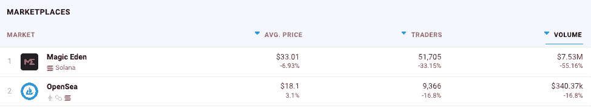
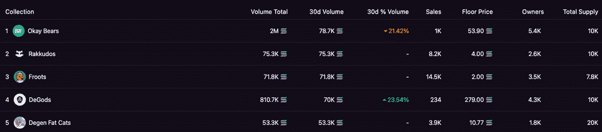
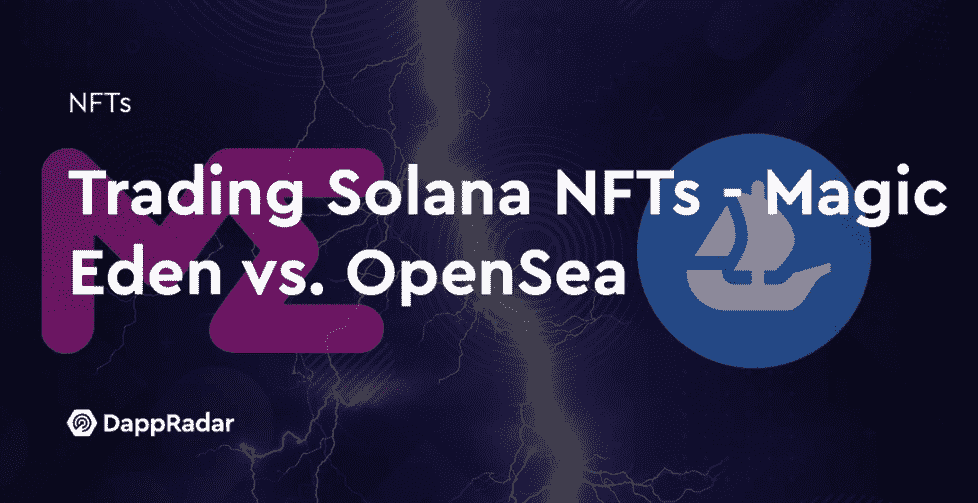

# Dapp 趋势:魔法伊甸园 NFT 市场想要第一名

> 原文：<https://web.archive.org/web/https://dappradar.com/blog/dapp-trends-magic-eden-nft-marketplace-wants-top-spot>

## 每周洞察区块链和 Web3 应用

Magic Eden 是一个分散的 NFT 买卖平台，允许用户买卖和交易独特的数字资产。它于 4 月在索拉纳区块链建造并发射，并于 2022 年 8 月集成了基于以太坊的 NFTs。

如果你正在寻找区块链上的下一个 Spotify、谷歌或亚马逊，DappRadar 可以帮助我们每周的 [Dapp 趋势文章](https://web.archive.org/web/20220929080011/https://dappradar.com/blog/dapp-trends-flow-blockchain-opens-up-for-developers)。随着各种类别和垂直领域发生如此多的事情，及时了解重要信息以发现区块链、戴普斯和 [NFT 的哪些项目](https://web.archive.org/web/20220929080011/https://dappradar.com/blog/ten-things-everybody-should-know-about-nfts/)产生价值并为正确的原因建立受众至关重要。

在 DappRadar，我们跟踪了跨越 40 多个区块链的 11，500 多个 dapp 项目，这些每周趋势文章深入探讨了最新和最令人兴奋的项目和生态系统。

本周，随着数码收藏品交易领域的竞争日益激烈，我们将关注神奇的伊甸园 NFT 市场。曾经强大的 OpenSea 已经看到它的市场份额减少，而[魔术伊甸园](https://web.archive.org/web/20220929080011/https://dappradar.com/solana/marketplaces/magic-eden)是受到最严重指控的一个。

[这些文章](https://web.archive.org/web/20220929080011/https://dappradar.com/blog/dapp-trends-flow-blockchain-opens-up-for-developers)旨在与其他人分享这些知识和信息，他们可以深入挖掘并做出自己的决定。

***根据项目的优点、未来潜力和链上指标来选择项目。这不是一个付费的宣传片或试图促进一个特定的项目或区块链。***

## 魔幻伊甸园

Magic Eden 是 Solana 上领先的 NFT 市场，其业务已经扩展到基于以太坊的数字收藏品。2021 年 9 月，在获得 2700 万美元的首轮融资后，一个由众多知名、经验丰富和富有创造力的头脑组成的团队推出了 Magic Eden。

[高交易量平台自诩交易成本低](https://web.archive.org/web/20220929080011/https://dappradar.com/solana/marketplaces/magic-eden)和[上市非金融资产不收费](https://web.archive.org/web/20220929080011/https://dappradar.com/solana/marketplaces/magic-eden)，并让用户买卖和交易非金融资产。Magic Eden 于 2022 年 8 月 2 日宣布，它将成为多链，并将其产品扩展到以太坊 NFT。然而，截至发稿时，其主要生态系统和[主要区块链是索拉纳](/web/20220929080011/https://dappradar.com/blog/magic-eden-leads-the-market-after-ethereum-bombshell/)。

要使用 Magic Eden，用户需要一个与 Solana 兼容的钱包，如 Trust Wallet 或 Exodus Wallet，其 SOL 足以支付一个 NFT，外加任何交易费用。它主要是索拉纳 NFTs(T1，T2)的一个接口，所以任何索拉纳 NFT 项目都托管在这个平台上。

NFT 市场也提供了一个 iOS 应用程序。但是它只支持写的时候浏览，所以用户还是需要使用他们的网站，连接你的 web3 钱包来交易 NFTs。

Magic Eden 还出售一种他们称之为 Magic Tickets 的东西，这种东西提供了对去中心化自治组织(DAO)的访问。在现实世界中，这是一个不和谐的聊天，让用户投票决定市场如何运作。

## 经验丰富、资金充足的团队

神奇伊甸园市场于 2021 年 9 月由首席技术官兼前 Uber Eats 开发者 Sidney Zhang、首席执行官兼前员工 Jack Lu、首席运营官兼前产品经理 Zhuoxun Yin 以及首席工程师兼前开发者 Zhuojie Zhou 创建。

2022 年 7 月，Magic Eden 在由 Electric Capital 和 Greylock 牵头的 B 轮融资中筹集了 1.3 亿美元，并得到了 Paradigm 和红杉资本的支持。在 3 月份 2700 万美元的首轮融资之后，这轮融资使市场估值达到 16 亿美元。

财大气粗的组合和之前与全球四大公司合作获得经验的高水平团队，使 Magic Eden 在与市场领导者正面交锋并争夺 NFT 市场的主导地位方面处于有利地位。

[https://web.archive.org/web/20220929080011if_/https://www.youtube.com/embed/clPRPFne4iQ?feature=oembed](https://web.archive.org/web/20220929080011if_/https://www.youtube.com/embed/clPRPFne4iQ?feature=oembed)

## NFT 发射台

Magic Eden 有一个 launchpad，方便项目在具有 ETH 和 SOL 兼容性的平台上创建 NFT。对创作者来说，主要的好处是他们会出现在 Magic Eden 的网站上——就像一个艺术家在一个大型拍卖行，比如佳士得，进行销售一样。

然而，Magic Eden 声称进入门槛很高，该平台有高质量的控制措施，并声称只有 3%的项目通过了申请流程。对于创作者来说，这可能意味着更多的努力，但对于收藏家来说，这意味着更高标准的魔法伊甸园 NFT 项目。

## ETH 支持

魔法伊甸园市场计划增加对以太币(ETH)交易的支持，以及支持大量 NFT 交易活动的区块链。Magic Eden 的第一个 ETH 支持的集合是祖莪，这是一个 NFT 项目，可以在 ETH 或 SOL 中创建。有趣的是，它是由 Lews Gale 和 Voltura 实验室团队创建的[迷幻剂匿名 NFT 项目](https://web.archive.org/web/20220929080011/https://nftnow.com/features/psychedelics-anonymous-lewis-gale-nfts/)的姐妹系列。

跨链宣布是一个重要的一步，为索拉纳为基础的市场，并标志着魔术伊甸园的最新努力，以扩大其影响和存在，并进入各种网络 3 社区。Magic Eden 表示，它的目标是让这两个社区在文化和连接效用应该跨链共享的理念下走得更近。

这一举措为创作者和收藏者提供了几个机会。前者将能够接触到新的受众，并获得额外的流动性，而后者将有机会发现新的项目和社区。

## 魔法伊甸园大战开放海

尽管 OpenSea [在 2022 年 4 月增加了对 Solana NFTs](https://web.archive.org/web/20220929080011/https://decrypt.co/105706/opensea-solana-nft-launchpad-lackluster-demand-zoonies) 的支持，但就交易者数量和销售额而言，Magic Eden 仍然大大优于 OpenSea 。在过去的七天里，Magic Eden 从超过 51，000 名交易者那里获得了超过 750 万美元的索拉纳 NFT 交易量，而 OpenSea 获得了略高于 35 万美元的交易量。

*[Last 7 Days – NFT Marketplaces trading Solana NFTs](https://web.archive.org/web/20220929080011/https://dappradar.com/nft/marketplaces)*

根据沙丘分析上的[仪表盘](https://web.archive.org/web/20220929080011/https://dune.com/sealaunch/MagicEden-Vs-OpenSea-Solana) [显示，Magic Eden 为 Solana NFTs 获取了约 97%至 99%的日交易量。尽管如此，OpenSea 仍然是全区块链最重要的日常销售平台。魔术伊甸园平均每天约 35，000 索尔，或写作约 9，000 美元。OpenSea](https://web.archive.org/web/20220929080011/https://dune.com/sealaunch/MagicEden-Vs-OpenSea-Solana) [记录了每 24 小时约 1500 万美元的乙醚销售额。](https://web.archive.org/web/20220929080011/https://dappradar.com/ethereum/marketplaces/opensea)

这两个市场的显著区别是 Magic Eden 运行在 Solana 上，这使得它比以太坊上的 OpenSea 更快，更便宜。此外，OpenSea 长期以来一直是 NFT 市场的领导者，这主要得益于其先发优势和品牌知名度。

然而，随着 NFTs 变得越来越受欢迎，越来越多的人想要参与其中，[对更多市场的需求](https://web.archive.org/web/20220929080011/https://dappradar.com/nft/marketplaces)出现了，导致了更多的竞争和对客户空间的积极演变。

## 好的熊

在撰写本文时，交易量和最低价最大的 NFT 收藏是 Okay Bears，这是一个熊的图片收藏。也许这个 NFT 系列最令人兴奋的事情是，它被复制和反转，然后[在以太坊上推出“不要紧的熊”](https://web.archive.org/web/20220929080011/https://dappradar.com/blog/okay-bears-nft-clone-comes-to-ethereum)，在那里它们的销量超过了最初的索拉纳·NFT 系列。

索拉纳也是无数以太坊克隆收藏的所在地，比如堕落猿社。然而，这一次，[以太坊 NFT 社区](https://web.archive.org/web/20220929080011/https://dappradar.com/nft/protocol/ethereum)展示了它的肌肉，让它吵闹的邻居回来了。

此外，虽然 Okay Bears 和其他几个 Solana 收藏的兴趣越来越大，但 Not Okay Bears 的推出似乎在不到 48 小时内就将 T2 的原始收藏价值推至新高。查看过去 30 天魔法伊甸园的数据，很明显奥凯熊成为了索拉纳的奥格 NFT 收藏。

更重要的是，我们看到其他系列的排名上升，底价大幅提高。用户在 ETH 中支付的额外能力可能只是市场的引爆点，因为新的观众被邀请开始在 Magic Eden 上交易。

## 伊甸园游戏和魔术**风险投资**

区块链游戏正在推动创纪录数量的区块链用户进入 dapps，这些融入 NFT 的 T2 游戏有可能在标准加密本地游戏之外获得更广泛的受众。Web3 游戏的未来是光明的，充满了机会，而 Magic Eden 已经准备好从中受益，并有可能占据中心舞台。

自成立以来，Eden Games 已经发布了超过 50 款游戏，成千上万的用户在 Magic Eden 上创造和交易游戏 NFT。二级市场已经有超过 2100 万的 SOL 交易，在 2022 年 6 月，Magic Games 占 Solana 上销售的所有游戏 NFT 的 90%以上。

Magic Ventures 的推出和[赵陈梁被任命为其游戏](https://web.archive.org/web/20220929080011/https://www.cryptotimes.io/magic-eden-inaugurates-web3-gaming-arm-named-magic-ventures/#:~:text=Tony%20Zhao%20was%20appointed%20as,projects%20they%20had%20invested%20into.)投资负责人，将允许 Magic Eden 投资游戏和区块链游戏基础设施，以帮助游戏尽可能成功。Tony 加入了 Yoonsup Choi、Harrison Chang、Matt Biamonte 和 Michael Silvio，他们都通过他们在游戏和电子竞技方面的背景对 [Web3 游戏](https://web.archive.org/web/20220929080011/https://dappradar.com/rankings/category/games)有着深入的了解。

[https://web.archive.org/web/20220929080011if_/https://www.youtube.com/embed/uXekRwTQrKo?feature=oembed](https://web.archive.org/web/20220929080011if_/https://www.youtube.com/embed/uXekRwTQrKo?feature=oembed)

## OpenSea 黑客和漏洞

公平地说，[关于](https://web.archive.org/web/20220929080011/https://dappradar.com/blog/search/?q=opensea)[负面新闻](https://web.archive.org/web/20220929080011/https://dappradar.com/blog/search/?q=opensea)和平台问题导致[用户损失资金和 NFTs](https://web.archive.org/web/20220929080011/https://dappradar.com/blog/opensea-upgrade-throws-door-open-to-hackers) ，OpenSea 没有过好的 2022 。该平台受到越来越多的批评，NFT 市场的一名前雇员甚至被指控参与了有史以来第一个数字资产内幕交易计划。

虽然大多数问题都得到了迅速解决，而且在某些情况下，并不是 OpenSea 的直接过错，但几乎不可能所有的负面消息都没有导致用户对平台的信心受到打击，这将无意中把 NFT 交易者推向新平台的怀抱——如 Magic Eden。

## 概括地说

虽然这么长时间以来，Opensea 一直占据主导地位，但它似乎开始感受到了压力。虽然没有定论，但这些原因预示着神奇的伊甸园 NFT 市场将会有一个更加激动人心、竞争更加激烈的未来。

大量新功能和服务将在 2022 年底前上线，尽管 NFT 交易有所降温，但还远未结束。凭借其强大的团队阵容和高质量游戏和 NFT 项目的孵化器， [Magic Eden 有潜力](https://web.archive.org/web/20220929080011/https://dappradar.com/solana/marketplaces/magic-eden)成为数字收藏品领域的重要玩家，并为未来做好准备。

魔法伊甸园刚刚开始它的旅程，所以看到事情如何在 2022 年剩下的时间里以及以后展开将是令人着迷的。探索 NFT 市场和达普拉达上的[魔法伊甸园。](https://web.archive.org/web/20220929080011/https://dappradar.com/solana/marketplaces/magic-eden)

[<picture></picture>](https://web.archive.org/web/20220929080011/https://dappradar.com/blog/trading-solana-nfts-magic-eden-vs-opensea)

***以上不构成投资建议。此处给出的信息仅供参考。请行使尽职调查，做你的研究。作者持有多种加密货币的头寸，包括 BTC、瑞士法郎和雷达。***

[<picture></picture>](https://web.archive.org/web/20220929080011/https://dappradar.com/blog/what-are-non-fungible-tokens-nfts)[<picture></picture>](https://web.archive.org/web/20220929080011/https://dappradar.com/nft/marketplaces)[<picture></picture>](https://web.archive.org/web/20220929080011/https://dappradar.com/nft/sales) NewsletterUnsubscribe at any time. [T&Cs](https://web.archive.org/web/20220929080011/https://dappradar.com/terms) and [Privacy Policy](https://web.archive.org/web/20220929080011/https://dappradar.com/privacy-policy)