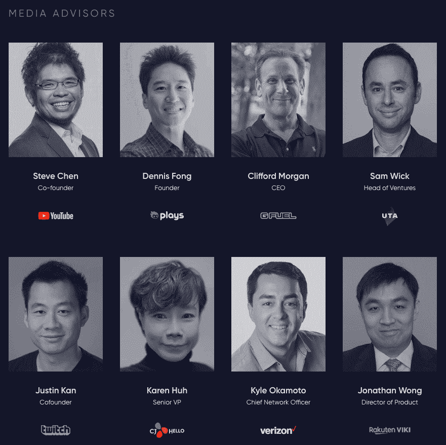
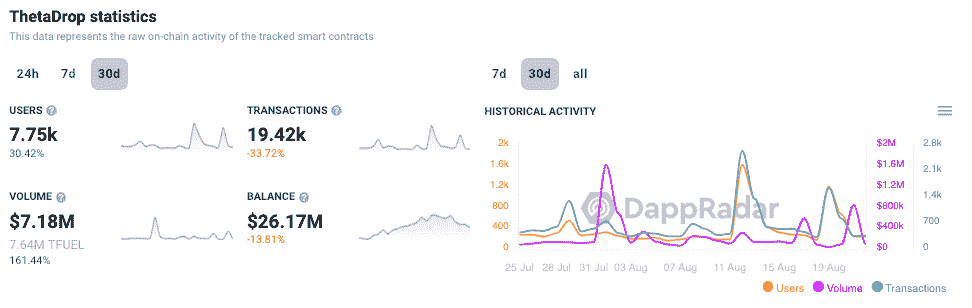
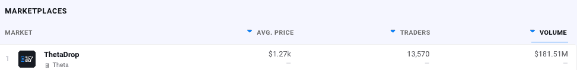
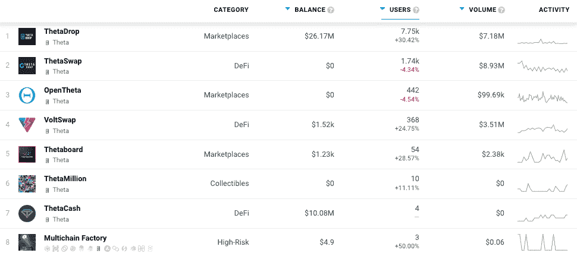

# Dapp 趋势:Theta 将彻底改变视频流行业并回报用户

> 原文：<https://web.archive.org/web/https://dappradar.com/blog/dapp-trends-theta-will-revolutionize-video-streaming-industry-reward-users>

## 每周洞察区块链和 Web3 应用

**[Theta 区块链网络](https://web.archive.org/web/20220926005853/https://dappradar.com/rankings/protocol/theta)基于点对点协议，参与者可以通过内容分发获得报酬。顾问委员会包括 Twitch 联合创始人贾斯汀·卡纳、YouTube 联合创始人陈士骏和几位威瑞森高管，他们在在线内容和直播方面拥有丰富的经验。**

本周我们[关注 Theta 网络](https://web.archive.org/web/20220926005853/https://dappradar.com/rankings/protocol/theta)，它的[dapp 生态系统](https://web.archive.org/web/20220926005853/https://dappradar.com/rankings/protocol/theta)和重要的里程碑。 [Theta Network 不是去中心化的 Youtube 或者去中心化的 Twitch](https://web.archive.org/web/20220926005853/https://dappradar.com/rankings/protocol/theta) 。相反，Theta 是底层的区块链和分散的存储和交付基础设施，可以支持下一代 Web3 视频流和媒体娱乐平台。

在线观众通过 YouTube、Spotify、网飞和其他几个平台消费越来越多的视频内容，包括直播和预先录制的内容。可以说，在线流媒体的下一个前沿是奖励社区的视频交付平台，由像 Theta 这样的区块链提供支持。

如果你在区块链寻找下一个 Spotify、谷歌或亚马逊， [DappRadar 可以帮助](https://web.archive.org/web/20220926005853/https://dappradar.com/blog/tag/dapp-trends)我们每周[的 Dapp 趋势文章](https://web.archive.org/web/20220926005853/https://dappradar.com/blog/tag/dapp-trends)。随着各种类别和垂直领域发生如此多的事情，及时了解重要信息以发现区块链、戴普斯和 [NFT 的哪些项目](https://web.archive.org/web/20220926005853/https://dappradar.com/blog/ten-things-everybody-should-know-about-nfts/)产生价值并为正确的原因建立受众至关重要。

在 DappRadar，我们跟踪了跨越 40 多个区块链的超过 11，500 个 dapp 项目，这些每周趋势文章深入到最新和最令人兴奋的项目和生态系统。[这些文章](https://web.archive.org/web/20220926005853/https://dappradar.com/blog/dapp-trends-flow-blockchain-opens-up-for-developers)旨在与能够深入挖掘并做出自己决定的其他人分享这些知识和信息。

***根据项目的优点、未来潜力和链上指标来选择项目。这不是一个付费的宣传片或试图促进一个特定的项目或区块链。***

## 视频行业背景

Youtube 上线已经 17 年了。视频无疑已经成为人们最重要的娱乐方式之一。在深入 Theta 之前，有必要了解网络所处的环境以及视频流行业的现状。

根据 Statista 的数据，2021 年全球视频流媒体市场的收入为 708.45 亿美元。到 2026 年，这个数字可能会达到 1160 亿左右。除了娱乐之外，由于疫情，更多的视频通信应用于商业和教育领域。各行业对直播视频流的大量使用进一步推动了这一增长。

关于商业模式，有三种类型:基于订阅、基于广告和基于交易/租赁。这些产品旨在提高用户和内容创作者之间的互动。像 Twitch 这样的直播平台开辟了一个新的市场，提供实时互动。此外，它还引入了观众小费制度，作为收入模式的一部分。

随着这一领域的创新不断涌现，用户群成倍增长。然而，在流式传输过程中遇到的带宽紧缩和延迟问题可能会限制市场增长。由此，视频技术公司的竞争日趋白热化，力求在上述问题上有所突破，以保证用户体验。这就是 Theta Network 发挥作用的地方，它将视频与区块链技术相结合，赋予元宇宙公民权利。

## Theta 网络

[θ网络是由θ区块链和θ边网络组成的对偶网络](/web/20220926005853/https://dappradar.com/blog/theta-network-dapps-now-on-dappradar/)。Theta 区块链提供支付、奖励和智能合约功能，而 edge 网络负责存储和交付图像和视频等媒体资产。

Theta 支持 Turing complete smart contracts，并且与 Ethereum 完全兼容，使得大量 dapps 在 Theta 上蓬勃发展。此外，智能合约开发人员可以通过移植现有的基于以太坊的合约，快速跳转到 Theta 之上。

此外，Theta 支持以太坊 RPC API，类似于 BNB 链和[多边形网络](https://web.archive.org/web/20220926005853/https://dappradar.com/rankings/protocol/polygon)。Theta 利用[利害关系证明](https://web.archive.org/web/20220926005853/https://forkast.news/what-is-proof-of-stake/)共识机制，这意味着参与者锁定大量 THETA 令牌以获得处理交易块的权利。

[Theta 网络](/web/20220926005853/https://dappradar.com/blog/theta-is-evolving-into-a-dynamic-sustainable-and-diverse-ecosystem/)上的费用接近于零，在提议增加后，对于智能合同和 dapps 来说，费用仍然足够低且具有成本效益。随着更多的智能合同部署在 Theta 上，包括视频平台奖励和小额支付、NFTs、DeFi 和其他 dapps，使用 Theta 区块链将消耗更多的 TFUEL。

[Theta Network 通过提供支持区块链的视频传输基础设施，彻底改变了媒体和娱乐行业](/web/20220926005853/https://dappradar.com/blog/theta-network-an-essential-infrastructure-for-metaverse-video-technology/)。具体来说，Theta 的基础设施使现有的视频和媒体平台能够产生增量收入并降低内容交付成本。此外，它还奖励用户在数字设备上共享他们的备用存储或带宽。

[https://web.archive.org/web/20220926005853if_/https://www.youtube.com/embed/OQR7GVoV-24?feature=oembed](https://web.archive.org/web/20220926005853if_/https://www.youtube.com/embed/OQR7GVoV-24?feature=oembed)

## 经验丰富的团队和顾问

[Theta Labs 团队](https://web.archive.org/web/20220926005853/https://www.thetatoken.org/about)由经验丰富的技术专家和媒体高管组成，他们曾在网飞、亚马逊、三星、Vimeo 和 Salesforce 任职。该团队由 Gameview Studios 和 Tapjoy 的联合创始人兼首席执行官 Mitch Liu 和 MadSkill Game Studios 的联合创始人兼首席技术官 Jieyi Long 领导，他们在区块链、视频、流媒体、VR 和 NFTs 领域共拥有十多项专利。

Theta Labs 独特的区块链、视频和娱乐体验的结合可以说是推动 Theta 成为媒体和娱乐领域领先的区块链的关键。

## 领先的验证者和媒体合作伙伴

Theta 的企业验证器和治理委员会由全球领导者领导，包括谷歌、三星、索尼、创意艺术家机构(CAA)、币安、区块链风险投资公司、DHVC 和谷米。

[Theta 利用其在 Theta 网络上数百万观众的用户基础](https://web.archive.org/web/20220926005853/https://docs.thetatoken.org/docs/what-is-theta-network),向狮门影业、米高梅电影公司、美国国家航空航天局和其他公司灌输其点对点视频网络和优质内容合作伙伴关系。与 Theta 基础设施集成的流行视频平台包括 CONtv Anime、Party Poker、World Poker Tour、Cinedigm、Samsung VR、GameTalkTalk、MovieBloc、Ultra、GFUEL 和其他 OTT 媒体、娱乐和直播服务。

[战略企业投资者包括](https://web.archive.org/web/20220926005853/https://docs.thetatoken.org/docs/what-is-theta-network)三星 NEXT、索尼创新基金、贝塔斯曼数字媒体投资(BDMI)、创意艺术家机构(CAA)、硅谷风投，包括 DCM 和 Sierra Ventures。

## θ元链

2022 年 4 月， [Theta 实验室公布了 Theta 元链概念](https://web.archive.org/web/20220926005853/https://dappradar.com/blog/theta-metachain-will-be-live-by-end-of-2022)。目标是在 2022 年 12 月 1 日推出，Theta Metachain 是区块链的一个互联网络，一个链条链。另外值得一提的是，Theta 元链与 Theta Mainnet 4.0 相同。

目标是允许θ区块链网络的无许可[扩展，以实现潜在的无限交易吞吐量和 1-2 秒甚至亚秒的块完成时间。](https://web.archive.org/web/20220926005853/https://dappradar.com/blog/theta-metachain-will-be-live-by-end-of-2022)

θ元链由一条主链和无限数量的子链组成。这里的主链指的是现有的 [Theta mainnet](https://web.archive.org/web/20220926005853/https://dappradar.com/blog/theta-metachain-will-be-live-by-end-of-2022) 。Theta 将提供一个易于使用的 SDK，开发人员可以快速使用它来启动子链并将其插入主链。

由于每个子链可以独立执行事务，这为无限扩展[元链](https://web.archive.org/web/20220926005853/https://dappradar.com/blog/theta-metachain-will-be-live-by-end-of-2022)的处理能力提供了可行的途径。子链 SDK 将实现一个内置的链间消息传递通道，连接子链和主链，从而允许 TNT20/721 令牌等加密资产在链间自由流动。

创建子链的过程是无权限的，这意味着任何人都可以注册和启动子链。不需要西塔实验室的批准。最初实现为多链解决方案， [Theta 元链](/web/20220926005853/https://dappradar.com/blog/theta-metachain-will-be-live-by-end-of-2022/)可以通过添加一些小工具扩展为 zk-rollup。这样的扩展可以实现更高级别的安全保证。

要了解更多关于 Theta 元链的信息，请查看 [Theta Mainnet 4.0 白皮书](https://web.archive.org/web/20220926005853/https://assets.thetatoken.org/theta-mainnet-4-whitepaper.pdf)。

## 双令牌设计

THETA 是 [Theta 协议](https://web.archive.org/web/20220926005853/https://dappradar.com/rankings/protocol/theta)的治理令牌。它被用作验证器或监护节点，有助于网络的块生产和协议治理。通过下注和运行一个节点，用户将按比例获得新产生的 TFUEL。θ的供应量固定在 10 亿，永远不会增加。

θ燃料(t 燃料)是协议的操作令牌。TFUEL 用于链上操作，如支付给边缘节点中继器以共享视频流或部署智能合约或与之交互。

转播者通过向网络上的其他用户转播每个视频流来赚取燃料费。你可以把 TFUEL 想象成协议的 gas token。在区块链的起源处有 50 亿吨燃料，并且供应以在协议级别设定的固定百分比每年增加。

Mainnet 3.0 升级带来了一个关键的协议扩展，引入了 TFUEL burning，其中精英边缘节点现在向网络燃烧每个 TFUEL 支付的至少 25%。此外，网络交易费用和智能合约费用也在燃烧，使这些 TFUEL 退出流通。

## Theta Drop NFT 市场

[Theta Drop NFT 市场](https://web.archive.org/web/20220926005853/https://dappradar.com/theta/marketplaces/thetadrop)于 2021 年在 Theta 网络上发布，并以世界扑克巡回赛数字收藏品系列开幕。Theta Drop NFT 市场的主要焦点是电子竞技、游戏和娱乐业。Theta Drop 接受信用卡存款，但不支持 PayPal。

Theta Drop 是一个实时的 NFT 市场，即 NFT Drop 和拍卖都是直播的。这一独特的功能旨在提高用户在平台上的参与度。它还与有线广播公司和直播媒体建立了合作关系，用于直播流媒体。在撰写本文时， [ThetaDrop NFT 市场](https://web.archive.org/web/20220926005853/https://dappradar.com/theta/marketplaces/thetadrop)是 Theta 上领先的 dapp，拥有大约 8，000 名链上用户和每月大约 20，000 笔交易。

与所有 NFT 市场一样，那里的收藏品和知识产权的优势可以让它在竞争中脱颖而出。正如在 VeVe on Immutable X 这样的市场上看到的那样，热门收藏品和流畅的 UX 的有力结合可以迅速赢得用户。ThetaDrop partners 的名单令人印象深刻，包括凯蒂·佩里、Fail Army、世界扑克巡回赛、Idol Philippines、狄昂·华薇克等知名媒体品牌。

与以太坊上的蓝筹 NFT 收藏品相比，aDrop 上的大多数收藏品平均价格较低。迄今为止，市场的表现显示了真正的希望。自推出以来，该市场吸引了超过 13，500 名交易者，产生了超过 1.81 亿美元的交易量。

## 三星是粉丝

与许多使用期望来推动兴趣的网络和协议不同，Theta 已经与三星等领先的媒体合作伙伴建立并巩固了合作关系。

与三星的关系根深蒂固，两家公司在几个活动中合作过。包括 2022 年 2 月的 NFT 数字收藏品项目，以庆祝 Galaxy S22 和 S8 平板电脑的发布。韩国上述型号的预购者可以通过在 Theta Network 的 NFT 市场——the tadrop 上注册来申请免费的 NFT。

该过程涉及使用通过三星会员应用程序验证收到的唯一代码。当时，刘说，这一合作“体现了西塔公司的区块链技术在全球的广泛应用。”他期待通过这个机会建立一个长期的社区。

2022 年 8 月，三星电子与包括 Theta Labs 在内的合作伙伴签署了一份谅解备忘录(MOU)，为其新系列的 Galaxy 手机运营一个 NFT 生态系统。三星打算将 NFTs 作为一种提供实际利益的方式，如客户折扣和认证工具。

## 元宇宙很重要

元宇宙的无缝数字体验在很大程度上依赖于视频技术的成熟。尽管在过去十年中发展迅速，但最新的视频技术仍然面临着诸如延迟等问题。该网络致力于以其尖端的视频技术实现元宇宙人民的梦想。

Theta Network 旨在利用区块链技术创建第一个分散式视频流和传输网络。它允许视频观众收集共享冗余计算和带宽资源的激励。除了点对点网络，该公司还提供全面的开发工具来推动元宇宙的繁荣。

*   **Theta Video API—**Theta Video API 是一种协议，它提供了一种易于使用的视频集成方法。首先，开发者/用户可以提交一个视频并获得该视频的可嵌入 URL。接下来，开发者/用户可以将 URL 放在任何网站或虚拟世界上，以使用去中心化的 Theta 网络来分发视频。

*   **分散式视频分发—**Theta 获得专利的对等发现技术利用先进的算法来增强对等边缘网络的健壮性和连接性。因此，它通过改善最后一英里交付问题，显著提高了视频交付效率。

*   基于视频的 NFT–这些 NFT 让用户能够在元宇宙捕捉有意义的瞬间。但更重要的是，NFTs 还能保证这些收藏品的真实性和所有权。

*   **Theta EdgeStore–**Theta EdgeStore 网络旨在成为永久 web 的仅附加、内容寻址、分散的键/值存储网络。它还充当任何文件类型的分散式内容交付网络(dCDN)。

*   **ThetaPass NFT 虚拟票务—**the tapass 允许网站、在线活动和 metaverses 使用 NFTs 支持的虚拟门票，这些门票可转让、可交易且不可信。

如果没有极其流畅的用户体验，元宇宙就不会如此吸引人。Theta 已准备好通过其 360 度技术堆栈为元宇宙市民提供解决方案，以应对视频流和分散内容存储的高并发性。

## θin-总结

随着应用和业务向 Web3 过渡，它们将需要可定制的高性能区块链，以支持新的业务模式和工具来创造价值。

Metachain 旨在满足视频平台、票务公司、元宇宙世界和其他企业的需求，因为它们正在向分散模式发展，将价值和数据所有权放回用户手中。通过实现潜在的无限事务吞吐量和亚秒级块终结，Theta 将能够满足具有数百万用户和每日事务的应用的需求。

[***Explore Theta dapps on DappRadar***](https://web.archive.org/web/20220926005853/https://dappradar.com/rankings/protocol/theta)

真正的亮点来自于 Theta 的无限数量子链的方法。这些为每个平台或 Web3 业务提供了一个高度可定制的子链，具有公共区块链的透明度、安全性和可信度。媒体和娱乐公司可以通过 Theta Video API、EdgeStore 和基于 NFT 的 DRM，使用视频、计算和存储所需的所有 Web3 工具来实现他们的专用子链。

始于 2022 年 12 月的 MetaChain 的愿景是使媒体、娱乐和元宇宙的新兴 Web3 业务能够扩展到目前平台的 10 倍。虽然这些说法很大胆，但 Theta 之前提到的在 Web3 中的跟踪记录意味着投资者和投机者都在等着看 Theta 是否能按时实现他们雄心勃勃的计划。

***以上不构成投资建议。此处给出的信息仅供参考。请行使尽职调查，做你的研究。作者持有多种加密货币的头寸，包括 BTC、瑞士法郎和雷达。***

 NewsletterUnsubscribe at any time. [T&Cs](https://web.archive.org/web/20220926005853/https://dappradar.com/terms) and [Privacy Policy](https://web.archive.org/web/20220926005853/https://dappradar.com/privacy-policy)