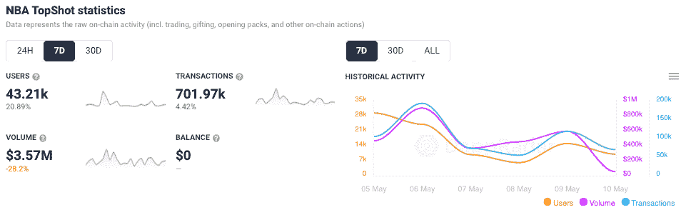
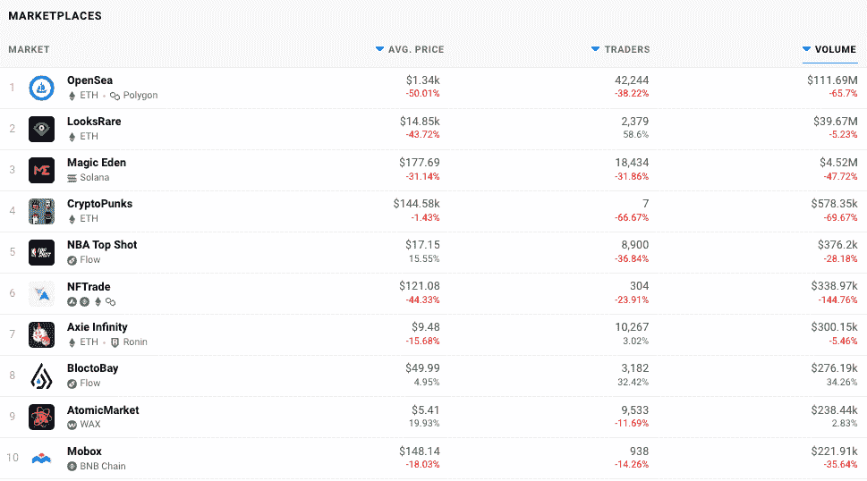
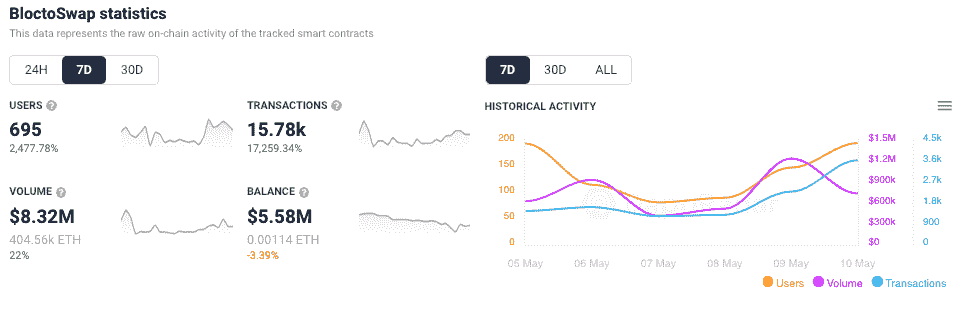
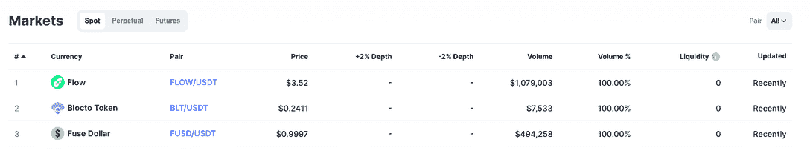
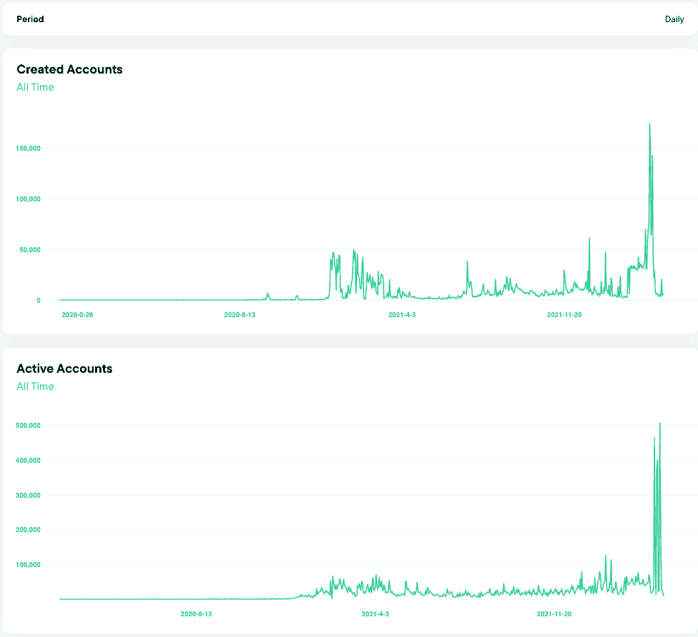

# Dapper Labs 宣布成立 7.25 亿美元的流量区块链开发基金

> 原文：<https://web.archive.org/web/https://dappradar.com/blog/dapper-labs-announce-725m-flow-blockchain-dev-fund>

## 资本的部署有助于 flow dapp 生态系统的扩展

Dapper Labs 将使用 7 . 25 亿美元来吸引开发人员、团队和 dapps 加入流量区块链。Flow 区块链、NBA Top Shot collectibles 和臭名昭著的 Cryptokitties 背后的团队希望通过引入更多样化的产品来扩展 Flow 生态系统。该基金成为同类生态系统中最大的支持者，并将致力于提升游戏、基础设施、DeFi、内容以及创作者在 Flow 生态系统中的作用。

投资者通过大量持有网络的本地令牌 FLOW 和 Dapper Labs 本身的股份来支持该基金。它们包括安德森霍洛维茨基金(Andreessen Horowitz)、Coatue、联合广场风险投资公司(Union Square Ventures)、Greenfield One、自由城风险投资公司(Liberty City Ventures)和 CoinFund。此外，这笔资金使 Dapper Labs 能够覆盖亚洲、美洲和欧洲的主要市场并获得支持。

迄今为止， [Flow 区块链](https://web.archive.org/web/20221007154509/https://dappradar.com/rankings/protocol/flow)上领先的 dapps 已经由 Dapper Labs 团队孵化并推出。NBA Top Shot、The Football Club、Dark Country 和 BloctoSwap 等游戏在交易和用户方面领先于网络。与此同时，开创性的 NFT 项目 CryptoKitties 也位于 Dapper Labs 品牌名册中。但是随着 [Flow 瞄准扩张](https://web.archive.org/web/20221007154509/https://dappradar.com/rankings/protocol/flow)，他们希望吸引开发者来构建更多的应用，提供更全面的服务。

## 谁在流量上胜出？

尽管自 2021 年 11 月的高点以来，加密价格大幅下跌，BTC 和 ETH 各自的价值都损失了 50%以上，但前 10 大流量 dapps 表现良好。随着新的包掉落，收集者和脚蹼下降以收集新的包和卡，NBA Top Shot 每周都会收到用户的支持。与 [NBA Top Shot](https://web.archive.org/web/20221007154509/https://dappradar.com/flow/collectibles/nba-topshot) 关联的独特活动钱包数量在过去七天里增长了 20%以上，超过 40，000 个。与此同时，NBA 顶级投篮的高价值和罕见的 NFT 时刻[在写作时要价高达 1 万美元](https://web.archive.org/web/20221007154509/https://dappradar.com/flow/collectibles/nba-topshot)。

[BloctoBay](https://web.archive.org/web/20221007154509/https://dappradar.com/flow/marketplaces/bloctobay) 提供了一个激动人心的流量新星的例子。在 4 月份稳定的销售和交易后，NFT 本地市场最近与 [OpenSea、LooksRare 和 Solana marketplace Magic Eden】密切合作。在过去的七天里，BloctoBay 吸引了 3182 名交易者，花费了 276190 美元，BloctoBay](/web/20221007154509/https://dappradar.com/blog/nft-marketplace-bloctobay-doubled-trading-activity-in-february/) 上的 [NFT 平均售价约为 50 美元。](https://web.archive.org/web/20221007154509/https://dappradar.com/flow/marketplaces/bloctobay)

此外， [BloctoSwap 代表了 Flow 的核心 DeFi 报价](https://web.archive.org/web/20221007154509/https://dappradar.com/flow/exchanges/bloctoswap),是生态系统 tUSDT 中与美元挂钩的本地稳定货币的所在地。使用[bloctosopp](https://web.archive.org/web/20221007154509/https://dappradar.com/flow/exchanges/bloctoswap)，用户可以交换代币，将资产从以太坊转入转出流量生态系统，并参与池中赚取收益。

虽然每周的百分比增长很强劲，但用户数量很低，并且在 DappRadar 排名的前 100 名交易所之外。通过[bloctswap](https://web.archive.org/web/20221007154509/https://dappradar.com/flow/exchanges/bloctoswap)的 24 小时交易量约为 150 万美元。相比之下，截至发稿时，Uniswap 的 24 小时交易量(T2)超过 27 亿美元。

查看该平台的市场分析，我们可以看到交易所的交易量不足。最大的市场是流量/USDT 交易，占 24 小时交易量的 100 多万美元。在当前的熊市背景下，交易者将资金转移到 USDT 并不令人意外，自上周以来，这一数字下降了 20%。而有些人则持相反观点，认为从长期来看，资金流动有潜在的好处。

总的来说，本地 BLT 令牌缺乏实用性，也没有太多优惠来激励流量令牌持有者锁定他们在[bloctswap](https://web.archive.org/web/20221007154509/https://dappradar.com/flow/exchanges/bloctoswap)上的资产。据推测，Dapper Labs 将使用 7.25 亿美元的资金来吸引 [DeFi 玩家](https://web.archive.org/web/20221007154509/https://dappradar.com/defi)，这些玩家希望扩展到其他网络以追求用户。

## 首先是用户，然后是规模

自从 Dapper Labs 在 2020 年 10 月推出了[定制流量区块链](/web/20221007154509/https://dappradar.com/blog/introducing-the-flow-blockchain-home-of-nba-top-shot/)并筹集了 2150 万美元以来，它似乎一直专注于吸引高价值的 IP，并与西甲、NFL、NBA 和 UFC 等品牌建立合作伙伴关系，这些品牌于 2022 年 1 月加入 Flow 家族，以吸引人群和用户到它的 dapps。Dapper Labs 获得了更多投资，现在的估值为 67 亿美元。

使用 Flowscan，我们可以看到网络吸引了更多的人来创建帐户。4 月 21 日，一天之内就有超过 173，000 个账户被创建，这可能与产品发布或新的 dapp 有关，如 UFC 和足球俱乐部在 Flow 上引起轰动。与此同时，活跃钱包的数据也是积极的，因为创建账户是很好的，但最终 Flow 希望他们是活跃的。

在[年建立了一个忠实的用户群](https://web.archive.org/web/20221007154509/https://dappradar.com/rankings/protocol/flow)之后，例如，在收集 [NBA 卡](/web/20221007154509/https://dappradar.com/blog/nba-topshot-doubles-weekly-sales-volume-to-10-2m/)之前，这些用户可能对区块链、密码或 NFTs 知之甚少。可以说，这些用户已经为下一阶段的 Flow 和大量新的 dapps 和服务做好了充分的准备，可以为生态系统中的原生令牌提供进一步的效用。

用户现在了解了区块链钱包、KYC、代币转账、NFT 估值，以及某种程度上的 DeFi 机制。这是向建筑商投入大量资金的最佳时机，尤其是在熊市情景通常意味着大多数项目要么沉要么游的情况下，但所有项目都在寻求吸引更多眼球。

 NewsletterUnsubscribe at any time. [T&Cs](https://web.archive.org/web/20221007154509/https://dappradar.com/terms) and [Privacy Policy](https://web.archive.org/web/20221007154509/https://dappradar.com/privacy-policy)

***以上不构成投资建议。此处给出的信息仅供参考。请行使尽职调查，做你的研究。作者持有多种加密货币的头寸，包括 BTC、瑞士法郎和雷达。***