# DappRadar 2022:一年回顾

> 原文：<https://web.archive.org/web/https://dappradar.com/blog/dappradar-2022-a-year-in-review>

## 今年，开发者向 DappRadar 提交了 8，255 个 dapps。

DappRadar 继续收集和整理全球的区块链数据。作为全球 Dapp 商店，我们的目标是为我们的社区带来可靠的、数据驱动的见解，帮助他们发现市场上最好的产品。随着我们搭载更多 dapps，并继续完善我们的发现工具，我们帮助 Web3 行业成长和成熟。

在这篇报道中，我们来看看 DappRadar 在 2022 年的表现。我们正在考虑我们的 dapp 集成，我们如何与我们的社区互动，以及哪些 dapp 是用户的最爱。一如既往，我们使用数据来支持我们的结论，我们将利用这些信息在 2023 年使我们的产品变得更好。

**内容:**

*   *[概述](https://web.archive.org/web/20230103010917/https://dappradar.com/blog/dappradar-2022-a-year-in-review/#overview)*
*   *[我们的用户是谁？](https://web.archive.org/web/20230103010917/https://dappradar.com/blog/dappradar-2022-a-year-in-review/#who)*
*   *[我们的社区如何使用 DappRadar？](https://web.archive.org/web/20230103010917/https://dappradar.com/blog/dappradar-2022-a-year-in-review/#how)*
*   *[他们爱 DappRadar 什么？](https://web.archive.org/web/20230103010917/https://dappradar.com/blog/dappradar-2022-a-year-in-review/#what)*
*   *[年度大腕](https://web.archive.org/web/20230103010917/https://dappradar.com/blog/dappradar-2022-a-year-in-review/#dapps)*

*[Explore Dapps](https://web.archive.org/web/20230103010917/https://dappradar.com/rankings)

## 概观

今年，开发者向 DappRadar 提交了 8，255 个 dapps。我们的团队人工批准了其中的 5604 个，我们的机器学习工具接受了 1523 个。其中，72 个 dapps 仍在审批过程中，等待批准出现在排名中。我们还拒绝了 1，056 个 dapp，因为我们有责任通过展示经过验证的 dapp 来保护我们的社区。

如果 dapp 提交不正确或空的代币合同，如果他们的电子邮件地址不可验证，如果他们没有网站或社交媒体，如果他们没有正确遵循我们的简单提交流程，或者如果有太多 dapp 可疑的危险信号，我们将拒绝他们。

8，255 个提交的 dapps 是我们平台的新纪录，高于去年的 7，187 个。有如此多的开发活动和如此多的创作者向 DappRadar 提交他们的产品，很明显 Web3 将在 2023 年获得更高的采用率。

正如您在下图中看到的，提交给 DappRadar 的大多数 dapps 都属于 DeFi 和游戏类别。30.5%批准的 dapp 与分散融资有关，18.9%的 dapp 属于游戏类别。

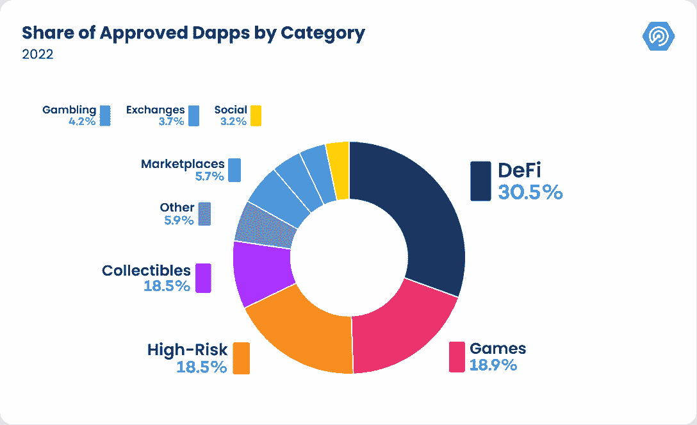

这突出了这两个部门目前在 2022 年期间的 Web3 投资和资源导向。尤其是游戏领域，在过去的一年中，我们已经看到了巨大的增长，我们预计在 2023 年将看到类似的发展，如果不是更多的话。

我们最新的 BGA 报告显示，Web3 游戏继续是 dapp 行业的驱动力。在 10 月和 11 月期间，区块链博彩和元宇宙项目筹集了 5.34 亿美元的投资。Web3 发行商菲尼克斯游戏公司宣布投资 1.5 亿美元用于“收购、投资和发行区块链游戏”

[Read BGA Report](https://web.archive.org/web/20230103010917/https://dappradar.com/blog/bga-game-report-october-november-2022)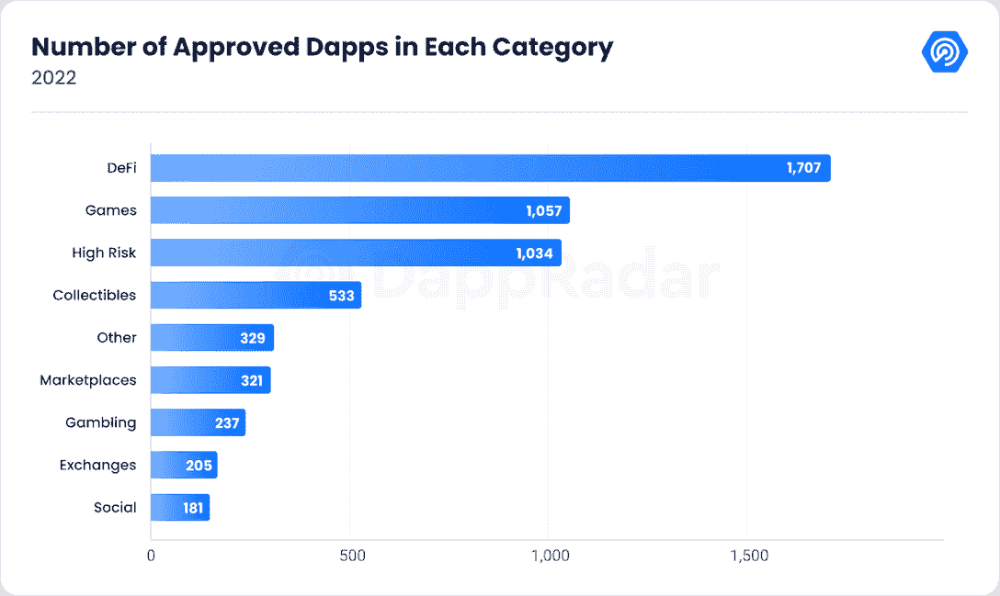

2022 年不仅仅是小型独立 dapp 开发者创造实验产品来测试 Web3 技术能力的一年。这也是主流品牌和公司采用区块链技术创造新产品并将 Web3 带给更广泛受众的一年。

像耐克(通过 RTFKT)和曼联(通过与 Tezos 的合作)这样的公司已经进入这个领域，并在非 Web3 母语人员的入职方面取得了很大进展。我们也可以在沙盒中看到这种情况，像戈登·拉姆齐、帕丽斯·希尔顿、托尼·霍克、福布斯和花花公子都与虚拟世界平台建立了商业合作关系。

期待在 2023 年看到更多知名人士试图利用区块链技术，因为他们希望扩大自己的帝国，以吸引更多粉丝。那些成功的人会把真正的想法放在他们正在做的事情上，并试图创造一个粉丝想要的产品。如果说 2022 教会了我们什么，那就是 Web3 社区可以看穿试图模仿社区来快速赚钱的影响者。

## 谁是我们的用户？

### 地理

在 2022 年的高峰月份，DappRadar 有超过 100 万用户查看该网站的内容。这些用户来自世界各地。通过仔细观察这些用户来自哪些国家，我们可以更好地了解 dapp 行业的现状以及人们对它的认识。

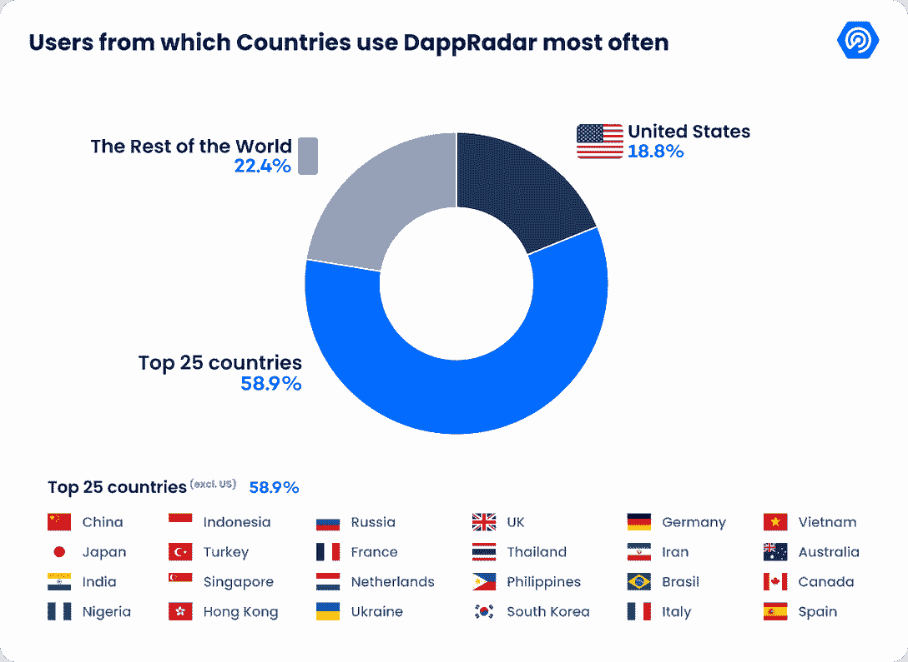

从上面的图表中，我们可以看到来自美国的 IP 地址贡献了大约 18%的 DappRadar 年度流量。超过 50%的剩余流量分布在 24 个国家和地区。其中，中国、印度、印度尼西亚、新加坡和俄罗斯的份额相对高于榜单上的其他国家和地区。

不容忽视的是，熊市、宏观经济衰退、全球监管收紧、行业负面事件等都严重冲击了用户对加密货币行业的信心。这也反映在用户使用 DappRadar 的行为变化上。

今年下半年，美国、英国、中国和韩国的 DappRadar 用户对 dapps 的兴趣明显下降。但另一方面，dapps 在印度、印度尼西亚、尼日利亚、乌克兰和越南等国家的受欢迎程度却显著上升。

这可能是因为当人们对他们国家的金融系统和政府缺乏信任时，他们倾向于在密码行业寻找替代品。他们的动机包括寻求额外的收入、更方便的微支付解决方案以及更可靠的资产存储方式。由于区块链行业的创新，如 GameFi、DeFi 和 stablecoins，这些需求正逐步得到满足。

### 年龄、性别和设备

DappRadar 的用户群包括所有年龄段，但主要是 Z 世代和千禧一代。我们用户的年龄分布与全球互联网用户的年龄分布高度一致。然而，以下比较表明，dapp 行业在 Z 世代和千禧一代中的渗透率高于其他年龄段。

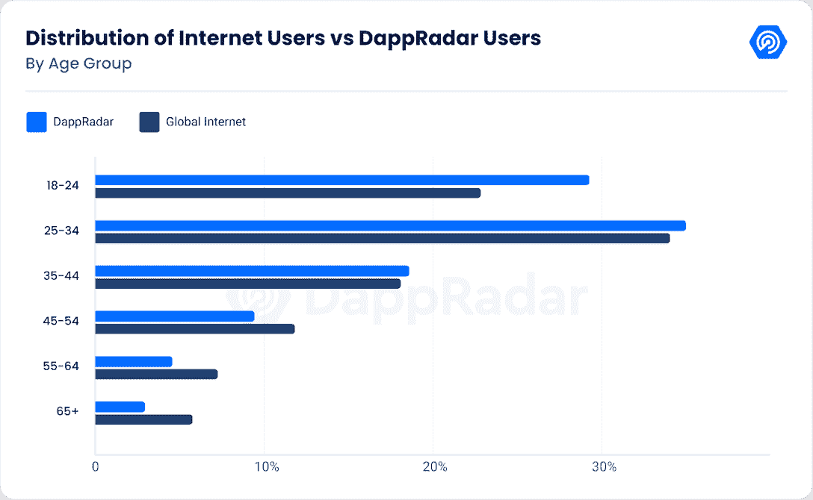

设备方面，超过 52.8%的用户习惯在桌面上访问 DappRadar，而其余用户更喜欢使用移动设备。关于性别分布，男性用户居多，占我们用户的 76%。

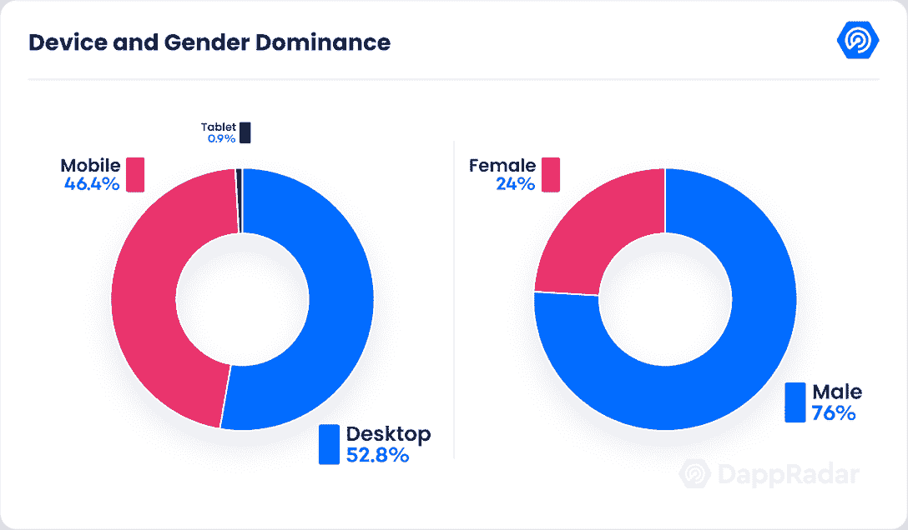

### 兴趣和爱好

Dapp 行业已经进入了我们用户生活的许多方面，也受到了各种类型用户的喜爱。我们已经根据 DappRadar 用户的兴趣勾勒出了他们的轮廓。最突出的属于以下十类人。

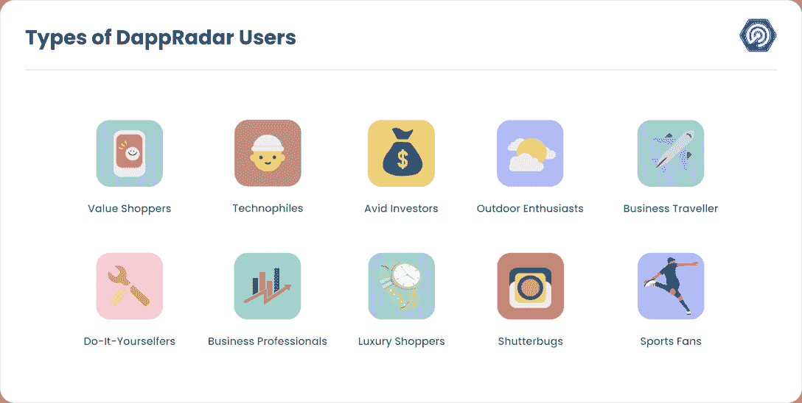

## 我们的社区如何使用 DappRadar？

我们的社区是我们所做一切的核心。这就是我们创建 DAO 的原因，这样他们就可以对提案进行投票。这也是我们制作雷达令牌的原因，这样我们的用户就可以因为他们对 DappRadar 的贡献而获得奖励。这也是为什么我们需要知道哪些页面是我们的用户访问最多的，这样我们就可以看到他们对什么感兴趣，以及我们如何为他们改进我们的工具。

看下面的数据，我们可以看到我们的排名页面是最受用户欢迎的目的地。作为世界 Dapp 商店的驱动者，它是人们根据直接来自区块链的可验证的连锁指标来寻找最好的 Dapp 的地方。访问我们平台的所有人中有 26.8%访问了我们的排名，这表明该产品对我们在 DappRadar 的工作有多么重要。

我们第二受欢迎的页面与游戏相关。2022 年，49%的 dapp 活动与游戏相关，该领域是增长最快的网络 3。因此，很多用户访问我们的页面来发现最好的新游戏是有道理的。

DappRadar 上访问量最大的前三个页面是与 NFTs 相关的页面。数码收藏品、艺术品、可穿戴设备和虚拟土地市场今年开局良好，但在下半年支出大幅萎缩。2022 年 1 月，交易员在非金融交易上花费了 57 亿美元。到 11 月，这一数字下降到 5 亿美元。

如下图所示，DappRadar 的业务范围确实是全球性的。我们的国际社会是我们追踪区块链数据并为其开发工具的对象。尽管我们都是 Web3 用户，但基于地理位置的不同，我们的品味也会有所不同。

正如你所看到的，Pegaxy 和 Farmers World 是许多国家最受欢迎的游戏，六个国家最经常使用前者，五个国家将后者作为访问量最大的游戏 dapp。有趣的是，尽管由于一些原因，2022 年很困难，Axie Infinity 仍然是三个国家最受欢迎的 Web3 游戏:美国，俄罗斯和菲律宾。

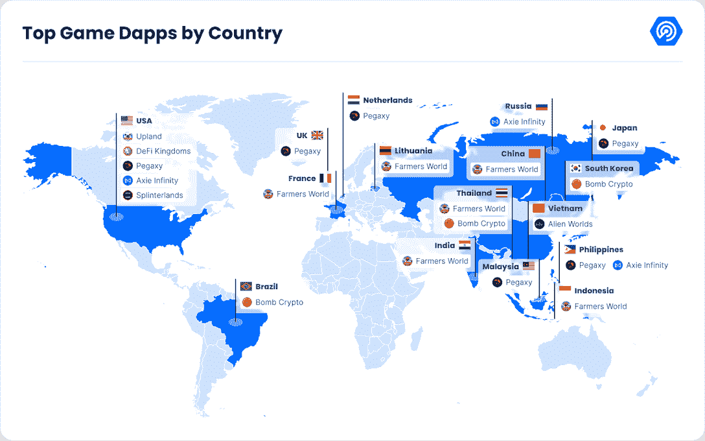

很难知道哪一个区块链会在 2022 年胜出。有些人会声称第二层网络的兴起证明了它们是 Web3 的未来。其他人会争辩说，Ethereuem 在 NFTs 中的主导地位和作为许多其他协议的基础层使其成为头号区块链。但是看下图，似乎 BNB 链上的 dapps 吸引了最多的用户兴趣。

我们的用户访问 BNB 连锁店 dapps 的相关页面达 267 万次。这是访问以太坊 dapp 页面人数的两倍多，有 127 万用户访问这些页面。Polygon 排在第三位，人们对建立在网络上的 dapps 页面进行了 97.4 万次访问。

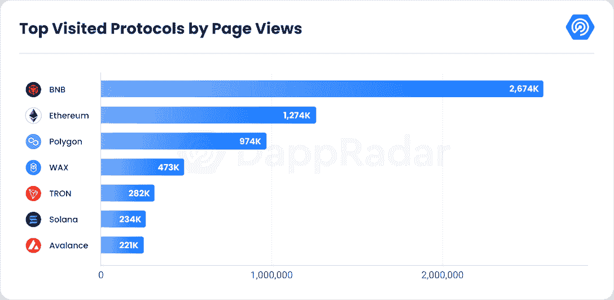

虽然未来可能会有多个区块链并存的空间，但市场不太可能像现在这样维持这么多。哪些网络赢得十年后仍然存在的竞赛将取决于有多少高质量的 dapps 建立在它们的基础设施上。因为没有用户，一个生态系统就会枯萎死亡。

根据以上信息，就有多少人使用他们的区块链参加 Web3 活动而言，BNB 连锁店目前似乎处于领先地位。一年后，顺序会改变吗？我们会在顶部看到蜡，或者多边形吗？请在 2023 年底回来看看。

## 用户喜欢 DappRadar 的什么？

在这一节中，我们将看到用户最喜欢 DappRadar 的哪些工具。我们计算了用户最喜欢与哪些 DappRadar 产品进行交互，这些数据的结果显示在下面的饼状图中。这些百分比告诉我们哪些 DappRadar 页面用户更有可能执行点击。

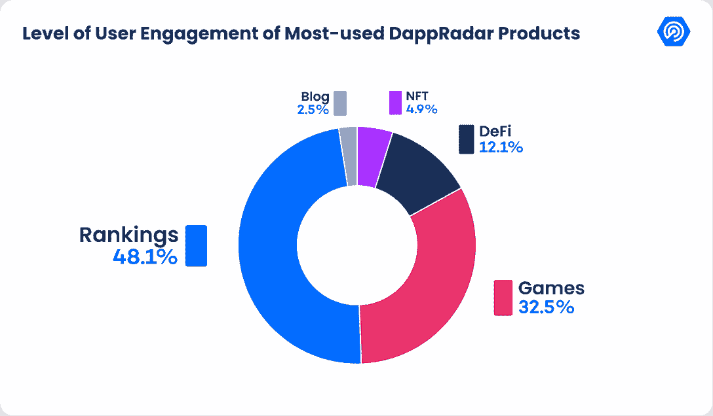

显然，我们包罗万象的排名工具已经得到了许多用户的信任。DappRadar 上 48%的点击量是由排名产生的。这个结果再次提醒开发者和产品负责人，他们应该将他们的产品上传到我们的排名中，因为这可以带来显著的曝光率。更重要的是。这样可以更有效地将用户兴趣转化为行动。

接下来，让我们再放大一点，集中在最受欢迎的类别及其下的应用程序。

根据 DappRadar 最近一年发布的行业报告，游戏部分占区块链使用量的近 50%。从前面提到的同一份 BGA 报告中，我们了解到 11 月份游戏占全行业区块链使用量的 42.67%，每日唯一活跃钱包达到 800，875 个。这一数字比前一个月有所下降，但仍然普遍存在。

除了区块链的使用，用户的 DappRadar 偏好也证实了区块链游戏的高需求。游戏从 DappRadar 用户那里获得了最多的浏览量，只有一个例外，那就是 OpenSea，这是业内成交量最大的 NFT 市场。

下表显示了每个类别中最受 DappRadar 用户欢迎的 dapps。您还可以使用我们的单个 Dapp 页面功能来查看每个项目的指标。

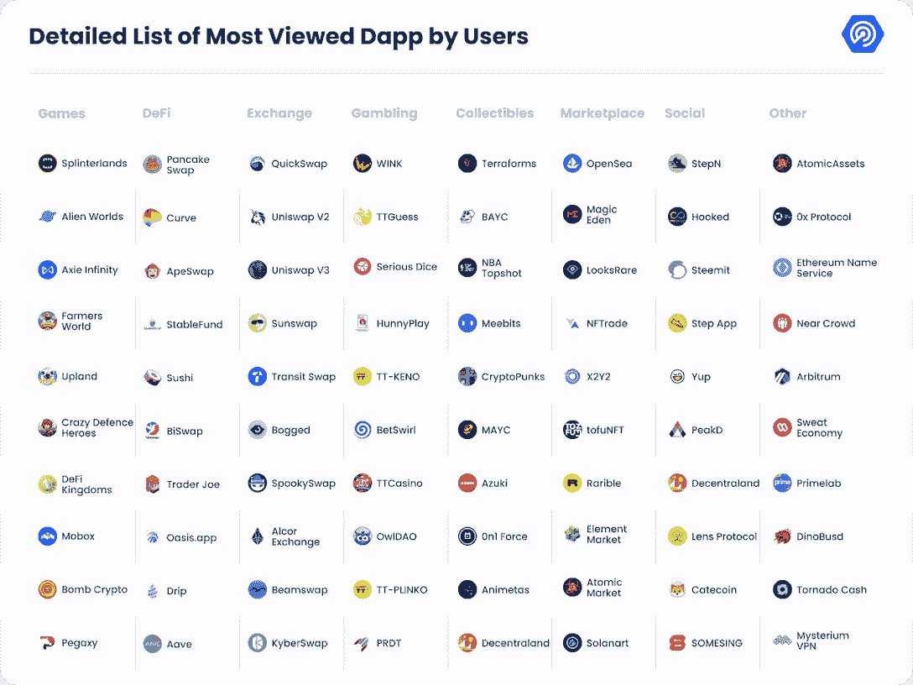

点击 dappRadar 排名上的任何 Dapp，进入他们的单个 Dapp 页面。

[DappRadar Ranking](https://web.archive.org/web/20230103010917/https://dappradar.com/rankings)

## 年度流行服饰

DappRadar 在过去的一年里致力于为 dapp 行业带来更多的透明度。在我们的博客上，我们展示了那些超越竞争对手或在短时间内引起轰动的 dapps。

此外，我们尽最大努力通过我们的数据工具、报告和 ama 向用户提供深入而全面的 dapps 图片。

在这里，我们想分享今年纳入 DappRadar 排名的每个类别的 dapps，并设法获得 DappRadar 用户的大量关注。

### 游戏——小小世界

Tiny World 在今年 2 月加入了 DappRadar 排名，它的单个 Dapp 页面是访问量最大的页面之一。关于游戏玩法，《微小王国》是一款闲置的交易游戏，玩家利用空闲时间进行战斗和交易以获取利润。

《微小世界》在 2022 年下半年发布了一系列更加精彩的玩法，比如 Boss Raid、Quest 嘉年华、微小领主等等。这些新元素让这款游戏的受欢迎程度大幅提升。因此，Tiny World 的链上指标从 8 月份开始飙升，此后一直保持稳定。与此同时，8 月份这个 dapp 的产品页面的流量也以类似的速度攀升。

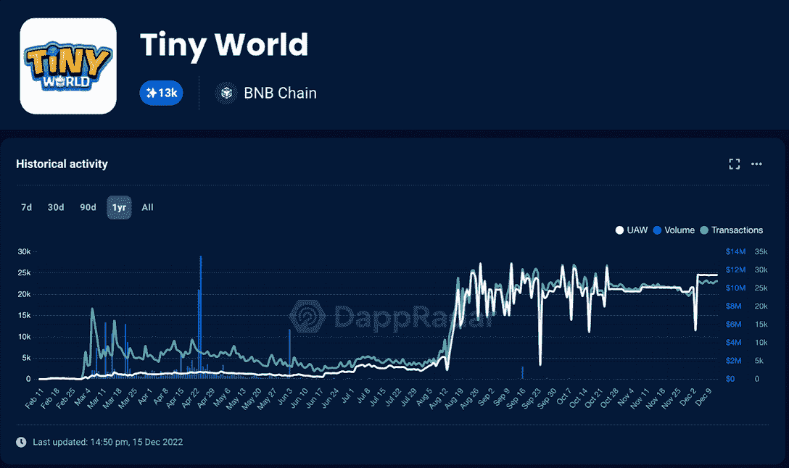[Learn more about Tiny World](https://web.archive.org/web/20230103010917/https://dappradar.com/binance-smart-chain/games/tiny-world)

### 社交——Galxe

社交是今年第四季度最活跃的领域之一，推出了许多创新项目来释放 Web3 社交网络、Soulbound token 和公用事业 NFTs 的潜力。

在各种社交 dapps 中，Galxe 无疑是最引人注目的一个。在过去的 30 天里，dapp 见证了近 700，000 个独特的活动钱包与其智能合约进行交互，在所有 dapp 中排名第五。

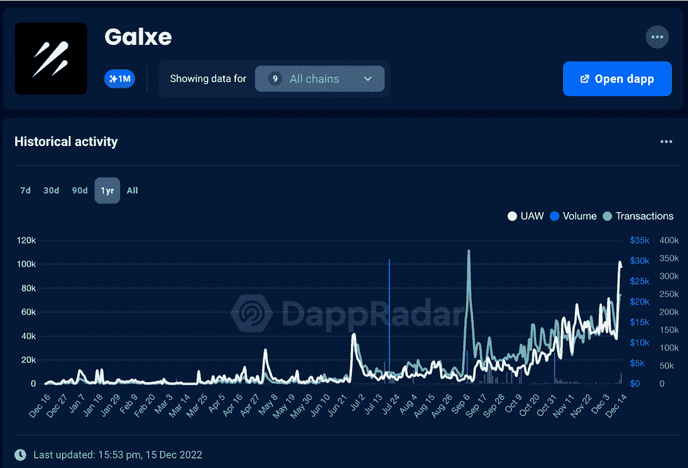[Learn more about Galxe](https://web.archive.org/web/20230103010917/https://dappradar.com/multichain/social/galxe)

Galxe 是一个开放的协作式证书数据网络，所有 Web3 开发人员均可访问。使用 Galxe，用户可以管理数字证书并为数据网络做出贡献。因此，品牌和项目可以利用 Galxe 的无许可 NFT 基础设施来游戏化他们的忠诚度系统，开展营销活动，获取用户等。

### DeFi–good dollar

与 DeFi 行业的顶级项目相比，GoodDollar 没有最高的 TVL 或活动。这是因为它有一个特定的利基。但是，这个项目仍然是 DappRadar 上最受关注的 DeFi dapps 之一

GoodDollar 是由加密货币投资平台 eToro 发起的非盈利性通用基本收益平台。该项目旨在通过 DeFi 和区块链技术缩小全球贫富差距。

该平台邀请支持者通过 Aave 和 Compound 等 DeFi 协议投入资金，这使他们能够获得产生的利息作为奖励。同时，协议在这个过程中铸造了 G$令牌，允许声明者在需要时从平台收集它们。

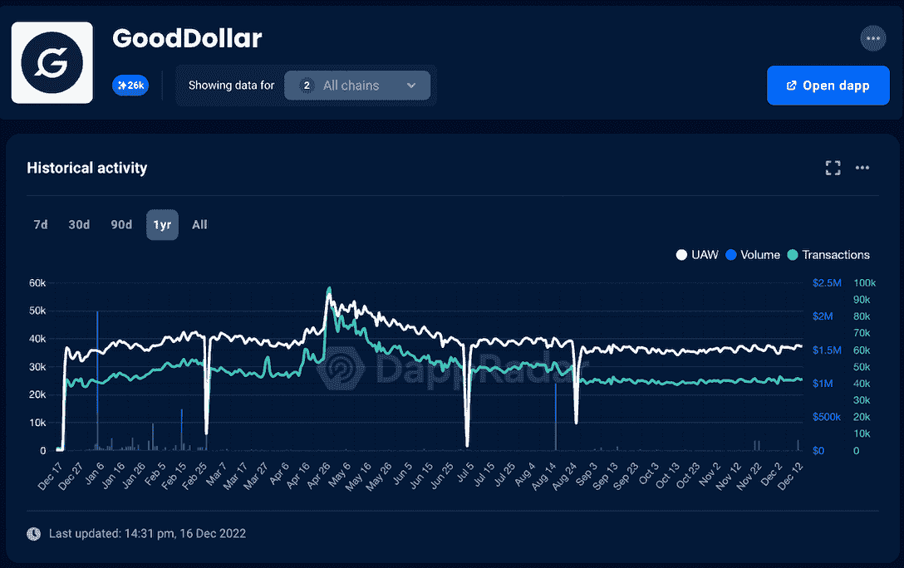

要使用 GoodDollar，用户必须通过身份验证，包括人脸识别。因此，协议被僵尸程序利用的几率非常低。根据 DappRadar 的 SDP 数据，该计划在 2022 年的整体表现非常稳定，每天吸引超过 30，000 UAW。

[Learn more about Gooddollar](https://web.archive.org/web/20230103010917/https://dappradar.com/multichain/defi/gooddollar-1/)

### 市场–X2Y2

去中心化的 NFT 市场 X2Y2 在今年 2 月随着 OpenSea 上的一次吸血鬼攻击进入公众视野。凭借与 X2Y2 令牌持有者分享平台利润等策略，X2Y2 现已成为业内最大的 NFT 市场之一。

DappRadar 在项目上线后立即发布了对 X2Y2 的跟踪，为用户、媒体和开发人员提供了可靠的信息，以便对 dapp 进行进一步的研究。

尽管 NFT 市场活动逐月下降，但 Y2X2 在连锁指标方面取得了令人印象深刻的成绩。

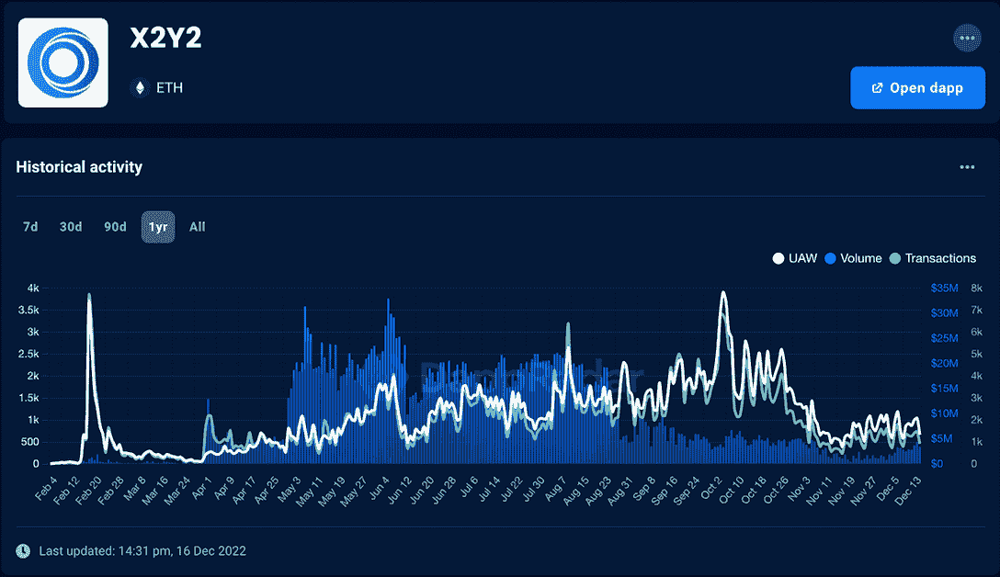[Learn more about X2Y2](https://web.archive.org/web/20230103010917/https://dappradar.com/ethereum/marketplaces/x2y2)

### 收藏品-为他人做的其他事情

当业内最引人注目的 NFT 项目 Bored Ape Yacht Club 推出其元宇宙之地时，门票肯定会立即售罄。

2022 年 4 月 30 日，尽管以太坊的天然气费用飙升，但另一边元宇宙虚拟土地 Otherdeed 在几分钟内就销售一空，为宇迦实验室(BAYC 背后的团队)带来了约 3.2 亿美元的收入。

用户对 DappRadar 上 Otherdeed 的兴趣在 5 月份达到顶峰，此后逐渐减弱，其模式与该项目的交易量高度一致。但有趣的是，这并没有阻止 Otherdeed 进入有史以来累计交易量最高的 NFT 收藏前十名。

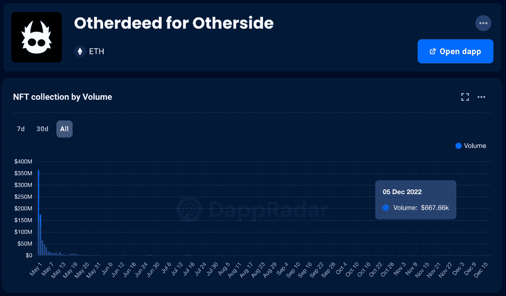[Learn more about Otherdeed](https://web.archive.org/web/20230103010917/https://dappradar.com/ethereum/collectibles/otherdeed-for-otherside/nfts)

## 关于达普拉达的最后一句话

今年最有价值的教训之一是，透明是 Web3 行业的黄金。这一新兴产业很容易受到突发事件的影响。通过提供 DeFi、NFTs、游戏等领域的数据驱动信息，DappRadar 帮助用户全面、公正地了解 dapps、协议和区块链生态系统。

2022 年让我们处于熊市，但 Web3 开发者和从业者并没有被打败。由于 DappRadar 今年集成了更多的 dapps，它有助于为用户带来更接近现实的区块链生态系统蓝图。

随着开发人员继续开发，我们还将提供更有效的工具来帮助用户、投资者和其他利益相关者更深入地了解这个不断变化的行业。

无论我们是在谈论 DappRadar 新推出的 API 服务，旨在帮助各种用户衡量成功，建立业务目标，并关注行业趋势，还是在谈论 2023 年即将到来的所有创新。

[Learn more about DappRadar API](https://web.archive.org/web/20230103010917/https://dappradar.com/blog/dappradar-api-nft-defi-dapp-data) NewsletterUnsubscribe at any time. [T&Cs](https://web.archive.org/web/20230103010917/https://dappradar.com/terms) and [Privacy Policy](https://web.archive.org/web/20230103010917/https://dappradar.com/privacy-policy)*