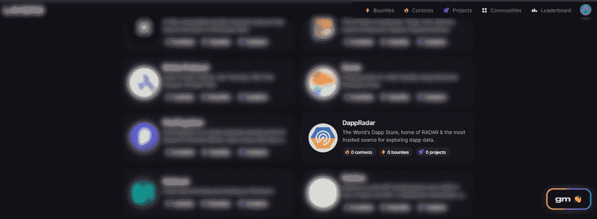

# DappRadar 和 Layer3 发起第一次奖金竞赛

> 原文：<https://web.archive.org/web/https://dappradar.com/blog/dappradar-and-layer3-launch-first-bounty-contest>

## 迈向社区管理的世界 dapp 商店的第一步

DappRadar 与 Layer3 合作发起了第一次社区奖金竞赛。通过这些奖金，社区成员将首次看到 Contribute2Earn 将成为什么，一个由数百万人建立、数十亿人使用的 dapp 商店生态系统。

DappRadar 和 Layer3 将引入的第一个好处是将 NFT 市场整合到 DappRadar GitHub 存储库中。有兴趣加入 bounty 的开发者和 Web3 爱好者可以通过遵循 Github 库中提到的指南[做出贡献。](https://web.archive.org/web/20220714130624/https://github.com/dappradar/nft-sales-adapters#guidelines)

DappRadar 允许社区成员和 Web3 爱好者在以太坊、BNB 链、多边形和雪崩上添加 [NFT 市场](https://web.archive.org/web/20220714130624/https://dappradar.com/nft/marketplaces)。对于第一笔奖金，我们请求社区添加 BNB 链上的无线电卡市场和炸弹加密市场。此外，我们还获得了添加 NFTKey 和 Kalao 的奖金，这是 Avalanche 上的两个 NFT 市场。

在贡献者完成添加后，DappRadar 的团队将手动确认并批准正确的贡献。那些贡献得到批准的人将获得雷达奖励，雷达是达普拉达生态系统的本土象征。

NFT 市场的整合是我们将与 Layer3 合作设立的众多奖励中的第一个。这第一个是相当技术性的，但在不久的将来，我们也将有其他人专注于不同的技能，如图形设计或文案。

将您的 Web3 钱包连接到 [Layer3.xyz](https://web.archive.org/web/20220714130624/https://beta.layer3.xyz/) ，成为[DappRadar 社区](https://web.archive.org/web/20220714130624/https://beta.layer3.xyz/communities/dappradar)的一员，关注现有和即将到来的奖励！

## DappRadar 和社区一起工作

作为世界上的 Dapp 商店，DappRadar 正在建立一个由 Contribute2Earn 驱动的生态系统，这种模式奖励每个创建内容、策划 Dapp、评论甚至开发功能的人。

随着新市场、DeFi 协议、NFT 收藏和游戏的数量在 50 多个不同的区块链平台上涌现，追踪所有这些是一项艰巨的任务。这就是为什么 Contribute2Earn 将在世界 dapp 商店的未来发挥巨大作用。

在社区和热情的个人的帮助下，我们正在建立一个平台，让世界发现分散的应用程序。每个增加价值的人都会得到回报。这就是 Contribute2Earn 的力量。

了解更多关于[雷达令牌](https://web.archive.org/web/20220714130624/https://docs.dappradar.com/v/radar-token/)，开始通过 3 层贡献[。](https://web.archive.org/web/20220714130624/https://beta.layer3.xyz/communities/dappradar)